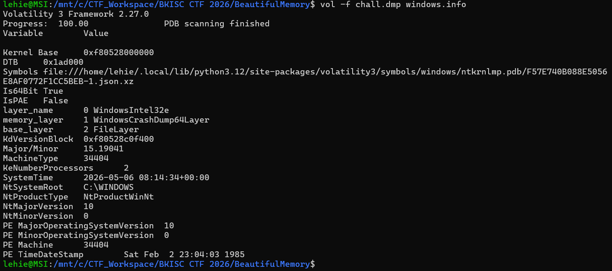
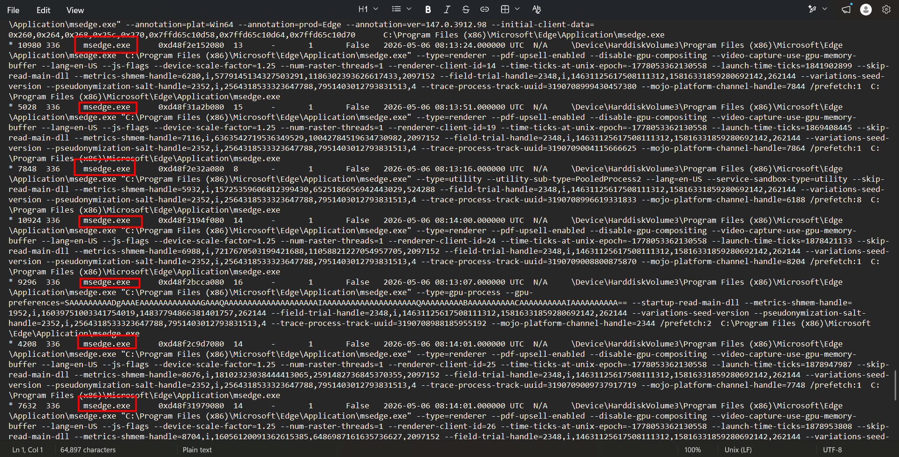
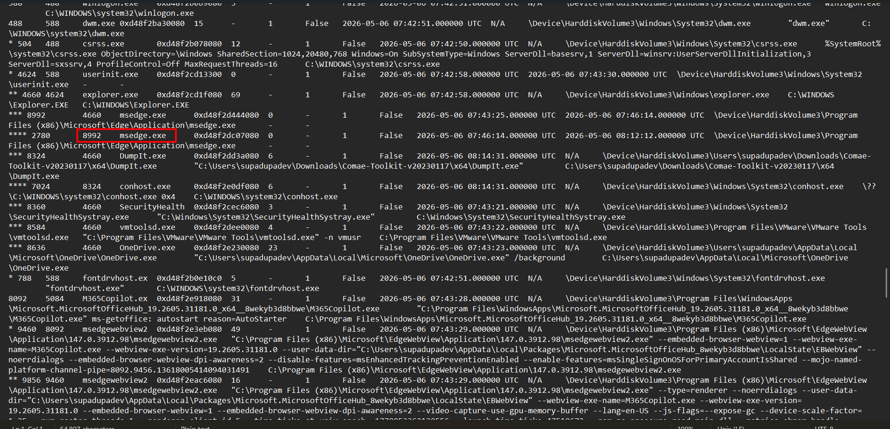
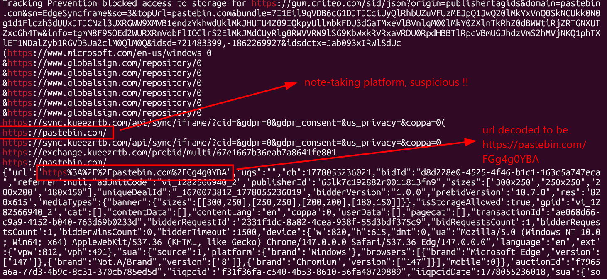
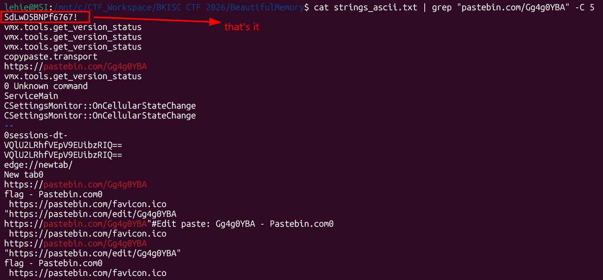
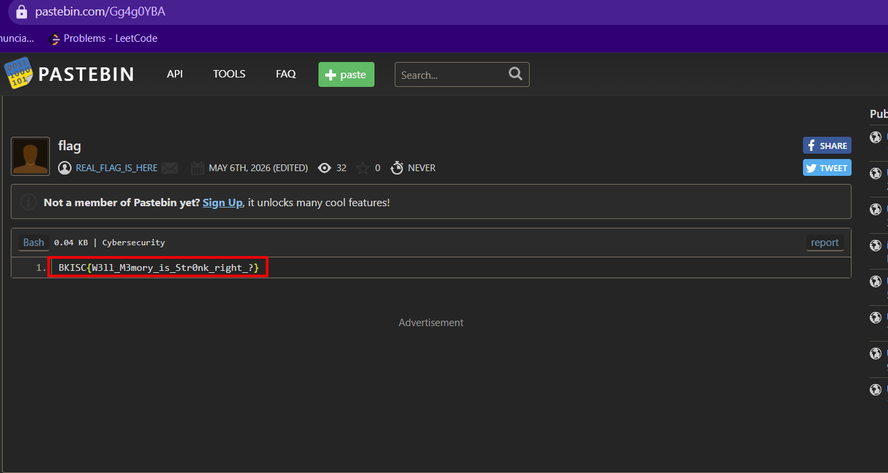

# Beautiful Memory

## Scenario

> I left my most precious memory here, can you find it?

## Given artifact

A MS Windows crash dump `.dmp` file.

## Solving process

Run Volatility's `windows.info` plugin to inspect the host:



I run this by instinct on every Windows memory challenge, so it's worth spelling out what it actually tells me:

- `memory_layer 1 WindowsCrashDump64Layer` - confirms the file is a proper Windows kernel crash dump and Volatility parsed it correctly. If this said something weird, nothing downstream would work.
- `Is64Bit True`, `PE Machine 34404` (AMD64) - architecture, which decides which symbols to load.
- `Major/Minor 15.19041`, `NtMajorVersion 10` - this is **Windows 10 build 19041** (20H1). Important because some plugin output formats and offsets depend on the build.
- `SystemTime 2026-05-06 08:14:34+00:00` - the moment the snapshot was taken. Every process `CreateTime`/`ExitTime` later in the dump is anchored to this clock, useful for building a timeline.
- `Symbols file ... ntkrnlmp.pdb/F57E740B...` - the kernel PDB Volatility resolved. If symbol download fails on a fresh box, this is the first place you'd troubleshoot.

Basically `windows.info` is a sanity check: dump is valid, OS is identified, symbols are loaded, clock is known. Then I move on.

My next step when inspecting a dump is to skim through the process tree. I pipe it to a text file to make it more readable:



Apart from core system processes, there is only one other application running: Edge. Its presence is striking, spanning around half of the pstree. So the process of interest should be this browser. Connecting that with the scenario, *"I left my precious memory here..."*, I immediately think of the fact that whenever we type into a browser - login forms, URLs, page content rendered on screen - those strings sit in the process heap as plain UTF-8 or UTF-16. The browser doesn't bother encrypting them in RAM; it has no reason to.

But there are a lot of Edge processes - which one to choose? For a 4GB dump, dumping each process one-by-one to check would take my whole day. However, when scrolling up the pstree, I see this Edge instance standing out from the rest:



When I say it "stands out", I don't mean I clearly see an IoC here - just that the structure is very different. The other Edge processes are very verbose, with renderers (`--type=renderer`), GPU process (`--type=gpu-process`), network service, storage service, crashpad-handler, search indexer, xpay wallet, etc. PID 8992 has exactly one child (PID 2780) and nothing else, and its child has no children of its own. A real Edge browser session cannot exist without at least a GPU process and a crashpad handler, so this is not a real browser session - it's something that *looks* like msedge.exe.

That doesn't guarantee we'll find what we want inside this PID, but it's worth prioritizing. Run Volatility to dump the process memory:

```bash
vol -f chal.dmp windows.memmap --pid 8992 --dump
```

This command takes a very long time to complete, which is expected for a 4GB dump. The output file is `pid.8992.dmp`. Now I'll pull all printable strings out of it - both ASCII and UTF-16, since Chromium-family browsers store a lot of user-visible text as wide strings:

```bash
strings -a -n 8 pid.8992.dmp > strings_ascii.txt
strings -a -el -n 8 pid.8992.dmp > strings_utf16.txt
```

The first thing to try after dumping the strings is this "dirty trick":

```text
lehie@MSI:/mnt/c/CTF_Workspace/BKISC CTF 2026/BeautifulMemory$ cat strings_ascii.txt | grep "BKISC{"
BKISC{Woah_woah_u_know_sst1?}
BKISC{Dunno_whut_to_say_T^T_Whut_r_u_doing_here?}
```

No need to submit either of those - they're clearly red herrings (the second flag is literally the author asking *"what are you doing here?"*). But now how do we determine what to search for? There are millions of possibilities, and we can't blindly grep through two huge string files. Eventually I had no choice but to guess, starting from `password`, `token`, `secret`, `api`... None of them yielded any promising result.

After a while, I remembered that we're working with a *browser's* memory - how could I forget URLs? My bad. Let's grep for `https`:



The result is still quite long and noisy, but `pastebin.com` jumps out - it's a note-taking platform, and a particular paste is being accessed. The full paste ID was also visible in URL-encoded form (`https%3A%2F%2Fpastebin.com%2FGg4g0YBA`) embedded inside some ad-bidder JSON. I try opening the page, but it's password-protected. Given a password-protected note, there must be something hidden behind it.

In principle, when a page is accessed and prompted for a password, the password should sit near the URL in the browser's heap memory. Let's extend our grep with the `-C` option to include context around the matched string:



Got it! Given the surrounding `copypaste.transport` and `vmx.tools.get_version_status` markers (VMware Tools clipboard channel), I can also deduce that someone copy-pasted the credentials and the URL into the VM via the host clipboard — useful piece of context, but for now let's just open the note:



Got the flag!

`Flag: BKISC{W3ll_M3mory_is_Str0nk_right_?}`

## Summary

The intended path through this challenge is:

1. `windows.info` → confirm the dump is valid and identify the OS.
2. `windows.pstree` → notice Edge dominates the tree, and one Edge instance (PID 8992) has a structurally abnormal child tree compared to the others.
3. `windows.memmap --pid 8992 --dump` → dump the suspicious process.
4. `strings` (ASCII + UTF-16) → extract all printable text.
5. `grep "BKISC{"` returns two decoy flags — ignore both.
6. Pivot to URLs since this is browser memory → `grep https` surfaces `pastebin.com/Gg4g0YBA`.
7. The paste is password-protected → `grep -C` around the URL to recover `SdLwD5BNPf6767!` from the VMware clipboard channel.
8. Open the paste with the password → the real flag is the paste body.

The lesson for me: when grepping browser memory, don't stop at the flag format. Sweep URLs early — they're cheap to enumerate and almost always point at the next step.
