# Deleted Secret

## Scenario

During a cybercrime investigation, law enforcement seized a suspect's machine while the system was still live. To prevent data loss from an imminent power failure, investigators performed a rapid acquisition of the disk. Analyze the resulting image to identify and document any relevant digital evidence.

Flag is separated into 2 parts.

## Given artifact

A 10-GB disk `.ad1` file.

## Solving process

Upon opening the disk file, I was confused about where to start. There's a plethora of files, most of them legitimate tools a DFIR person would have, plus a few scripts to generate traffic — and notably this one, which destroys almost everything on disk, from files to databases:

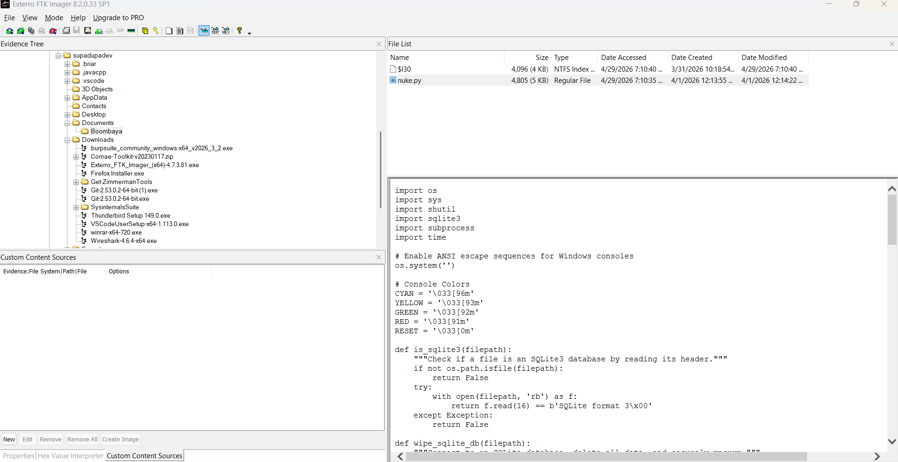

So the precious things we need for the flag have all been wiped, and what remains is just anime images and some decoy flags in a simple Flask web app. How do we find the trace of deleted files? Note that the script above doesn't just "delete" the way we normally do — which only removes the pointer to the data region and lets the bytes linger somewhere — it also overwrites the region with zeros.

I remembered a system file called `$LogFile`, the NTFS journal that records metadata changes (creates, deletes, renames) for crash recovery. But `$LogFile` only tracks metadata, not the actual file contents — so it'll tell me a file *existed* and was deleted, but not what was *in* it.

There's also a chance that the content of small files (resident files, typically under ~700 bytes) is stored directly inside `$MFT` records, so even if the file is deleted, its bytes may survive in the MFT until the record is reused. The `$MFT` itself is visible in FTK Imager — but parsing a `$MFT` extracted from a 10 GB image is a nightmare. MFTExplorer surrenders, and MFTECmd also gets lost in that huge file.

Then I got a hint about an `.edb` file — that was new to me, let's ask an LLM for clarification:

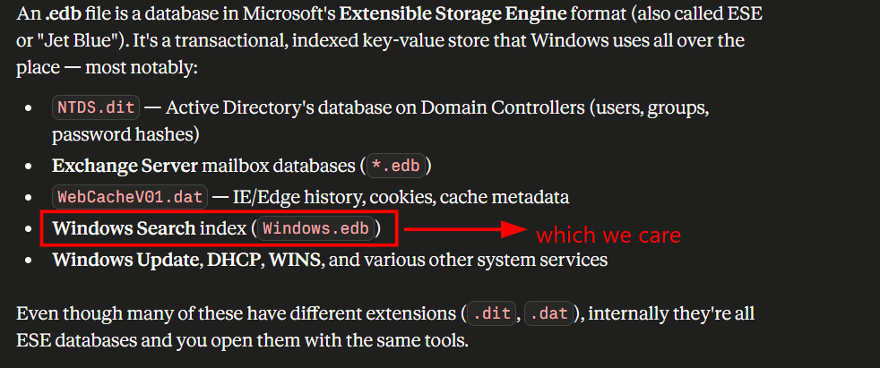

Windows Search doesn't just index filenames — for text-like files (`.txt`, `.docx`, `.pdf`, etc.) it caches a chunk of the actual file content in its property store. So even after a file is deleted from disk, its contents often survive inside `Windows.edb` under properties like `System.Search.AutoSummary`, `System.Search.Contents`, or `System.ItemPathDisplay`.

Let's hunt for that file. Its standard location is either:

```
C:\ProgramData\Microsoft\Search\Data\Applications\Windows\Windows.edb
C:\Users\<user>\AppData\Local\Microsoft\Search\Data\Applications\Windows\Windows.edb
```

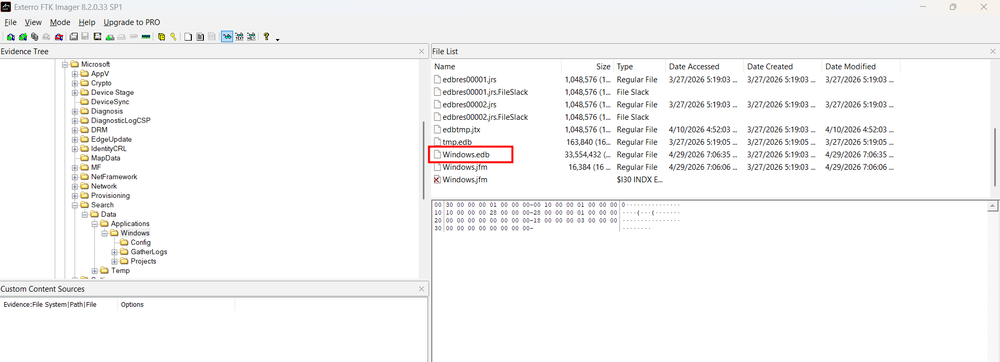

Found it in the former. Let's export it. Now how do we parse it? My mentor `pacho` points me to [sidr](https://github.com/strozfriedberg/sidr), a tool purpose-built for this artifact. In PowerShell:

```powershell
.\sidr.exe -f json <folder containing edb files>
```

I picked `json` so I can poke at it easily with terminal tools like `cat` / `jq` / `grep`. CSV would also work — your call. Also remember to point `sidr` at the folder, not the file itself; it'll detect the `.edb` on its own.

When inspecting the `File-Report` JSON, two files stand out:

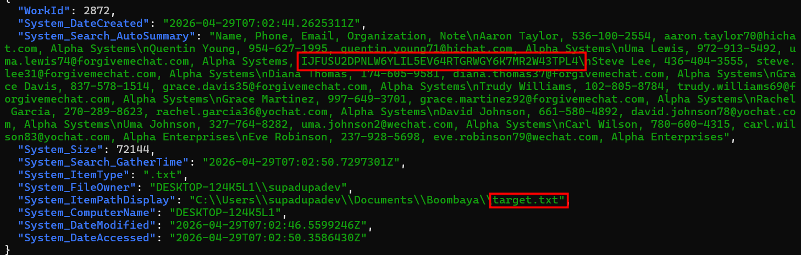

That's the first half of the flag, base32-encoded (I used [Magic](https://github.com/bee-san/Ciphey) first to identify it):

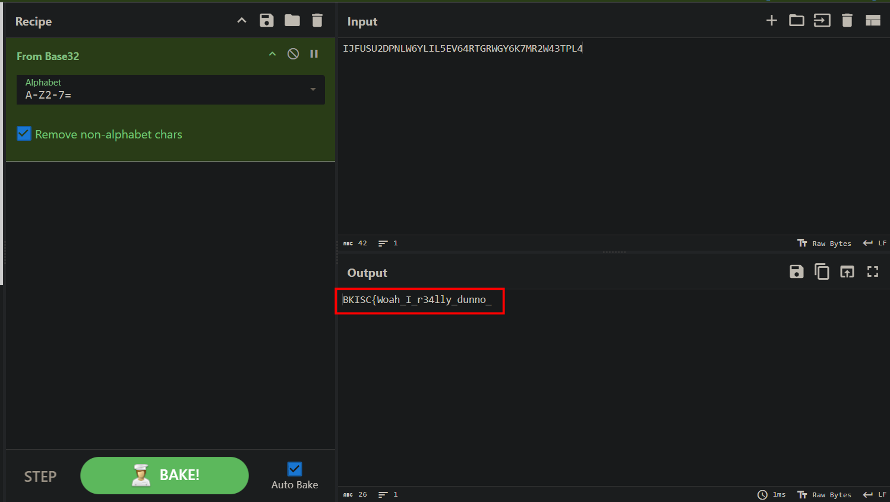

I also notice this PDF — it contains a password for something. Let's save it, we'll probably need it later:

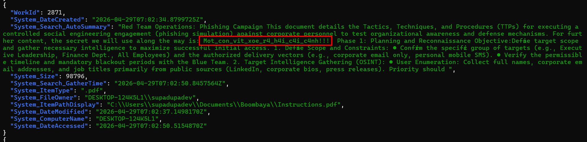

Back in FTK Imager, I spot a strange hidden folder named `.briar`. After a quick search online, I learned it belongs to [Briar](https://briarproject.org/), a peer-to-peer encrypted messaging app whose desktop client is written in Java/Kotlin. Messages? Worth a look. I tried accessing the account by installing Briar Desktop on my machine, creating a throwaway account, then replacing the `.briar` folder in my user profile with the one exported from FTK Imager. However, it's password-protected — and as I said in another writeup, if something is protected, there's usually something behind it worth seeing.

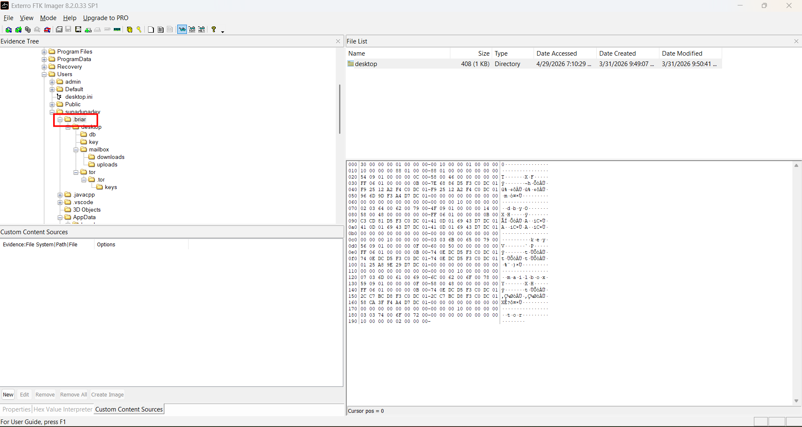

Now my goal is to find the password. But where? Again I had to ask my mentor for a hint, and it turned out to be pinned in the **Clipboard**. If it were a password for a website, we'd aim at the browser — but for a niche app like this, the clipboard is a reasonable place to stash credentials.

The first step to tackle any DPAPI-protected asset is always to obtain the user's hash. Given a full disk image, I can easily extract `SAM`, `SECURITY`, and `SYSTEM` from `Windows\System32\config`, and `impacket-secretsdump` yields:

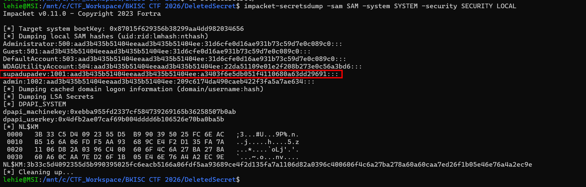

Crack it for a plaintext password if possible:

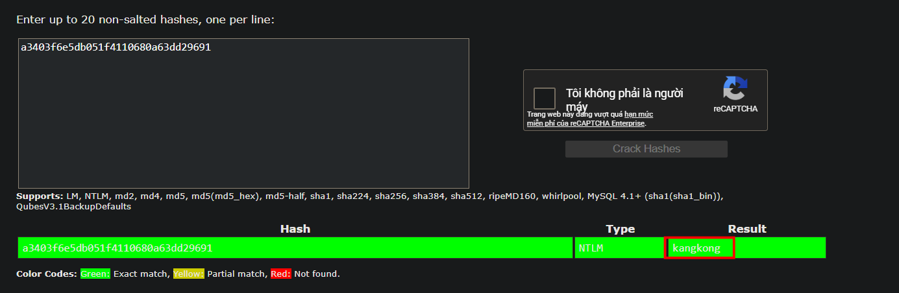

Then decrypt the masterkey, using the SID-named folder from `AppData\Roaming\Microsoft\Protect`. There's only one masterkey GUID in there, so no need to guess which one to use:

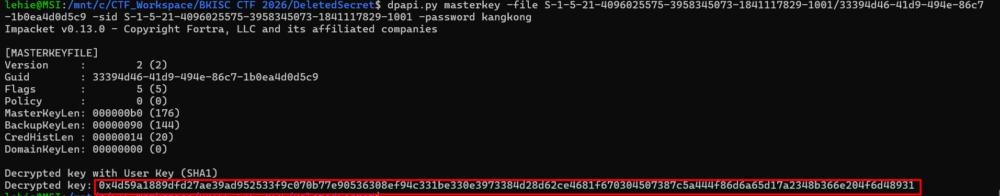

Now the real headache. The clipboard isn't protected by classic DPAPI — it's something called **DPAPI-NG** (the "Next Generation" version), and I couldn't find any open-source tool crafted for it. The structure is more involved than classic DPAPI: instead of one encrypted blob, it's a CMS / PKCS#7 envelope (RFC 5652) wrapping **three nested layers** of encryption. The masterkey only unlocks the first layer — you still have to walk the rest of the chain manually.

I'm not great at cryptography, so I let Claude help me put together a minimal decryptor:

```python
#!/usr/bin/env python3
"""
Minimum offline decryptor for a Windows Clipboard "Pinned" item.

Inputs:  the encrypted blob (e.g. VGV4dA==), and the user's decrypted
         DPAPI masterkey in hex.
Output:  the plaintext, printed and saved alongside the blob.

Dependencies: asn1crypto, dpapick3, cryptography
              (all installable via `pip install ...`)
"""

import sys, binascii
from asn1crypto import cms
from asn1crypto.core import Sequence, OctetString, Integer
from dpapick3 import blob as dpapi
from cryptography.hazmat.primitives.keywrap import aes_key_unwrap
from cryptography.hazmat.primitives.ciphers.aead import AESGCM


# AES-GCM stores its nonce inside a small ASN.1 SEQUENCE. We tell
# asn1crypto exactly which fields to expect so it can hand us bytes.
class GCMParameters(Sequence):
    _fields = [('nonce', OctetString), ('icv_len', Integer, {'optional': True})]


def main(blob_path, mk_hex):
    raw = open(blob_path, 'rb').read()
    mk  = binascii.unhexlify(mk_hex.removeprefix('0x'))

    # --- Parse the envelope. ContentInfo wraps EnvelopedData wraps everything. ---
    envelope = cms.ContentInfo.load(raw)['content']
    kekri    = envelope['recipient_infos'][0].chosen   # the KEKRecipientInfo

    # --- LAYER 1: decrypt the small DPAPI blob -> KEK ---
    # Microsoft puts a classic DPAPI blob in the "keyIdentifier" field.
    # Decrypting it with the user's masterkey yields the KEK.
    dpapi_blob = kekri['kekid']['key_identifier'].native
    b = dpapi.DPAPIBlob(dpapi_blob)
    b.decrypt(mk)
    kek = b.cleartext                                  # 32 bytes

    # --- LAYER 2: AES-KEY-UNWRAP the wrapped CEK with the KEK ---
    # RFC 3394 key wrap: 40 bytes in, 32 bytes out (one block of overhead).
    wrapped_cek = kekri['encrypted_key'].native        # 40 bytes
    cek = aes_key_unwrap(kek, wrapped_cek)             # 32 bytes

    # --- LAYER 3: AES-256-GCM decrypt the actual ciphertext with the CEK ---
    eci    = envelope['encrypted_content_info']
    nonce  = GCMParameters.load(eci['content_encryption_algorithm']['parameters'].dump())['nonce'].native
    # The ciphertext is "detached": it sits AFTER the envelope, not inside.
    # The last 16 bytes are the GCM authentication tag; AESGCM expects ct||tag.
    ct = eci['encrypted_content'].native or raw[len(cms.ContentInfo.load(raw).dump()):]
    pt = AESGCM(cek).decrypt(nonce, ct, None)

    # --- Done. Clipboard "Text" items are UTF-16LE. ---
    open(blob_path + '.decrypted', 'wb').write(pt)
    print('plaintext:', pt.decode('utf-16-le'))


if __name__ == '__main__':
    main(sys.argv[1], sys.argv[2])
```

Run it to get Briar's password:

```text
lehie@MSI:/mnt/c/CTF_Workspace/BKISC CTF 2026/DeletedSecret/pinned$ python3 ~/decrypt_pinned.py VGV4dA== 4d59a1889dfd27ae39ad952533f9c070b77e90536308ef94c331be330e3973384d28d62ce4681f670304507387c5a444f86d6a65d17a2348b366e204f6d48931
plaintext: Gho67qqxmv36!26@@@
```

Use that password to log into Briar, and I see a URL in the chat:

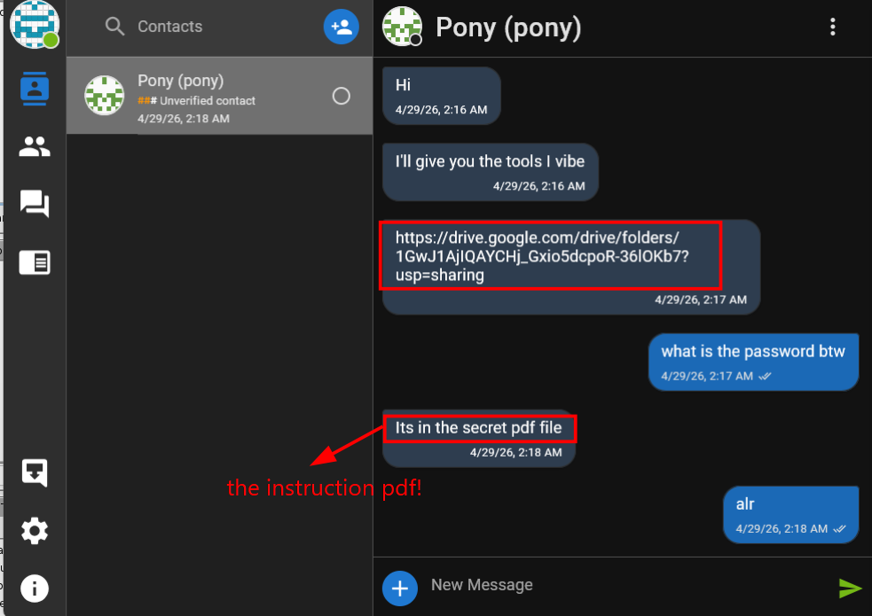

Grab `tools.zip` from the Drive link. It's password-protected — the password lies in the `Instructions.pdf` we saved earlier. Unzipping, we get a PE32+ executable. Decompiled with Ghidra; there are a lot of functions, but after a while I see this one:

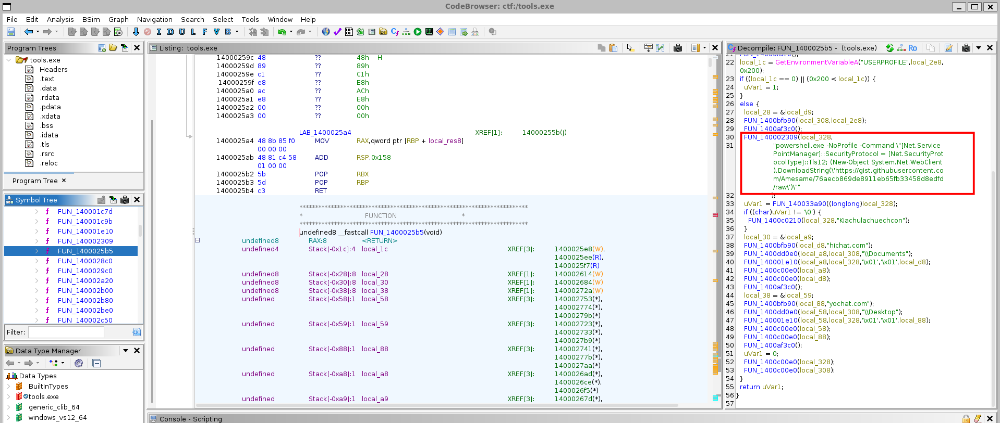

Note that it was lucky the function landed near the top of the listing where I could spot it. If it had been buried among hundreds of other functions, I would have given up — in that case, VirusTotal and `app.any.run` would save us by running the binary in a sandbox and showing the network indicators directly:

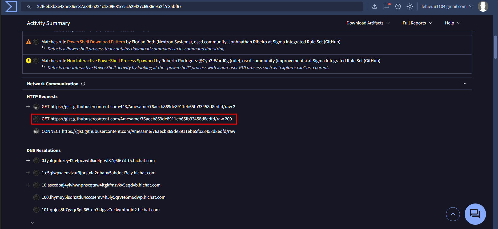

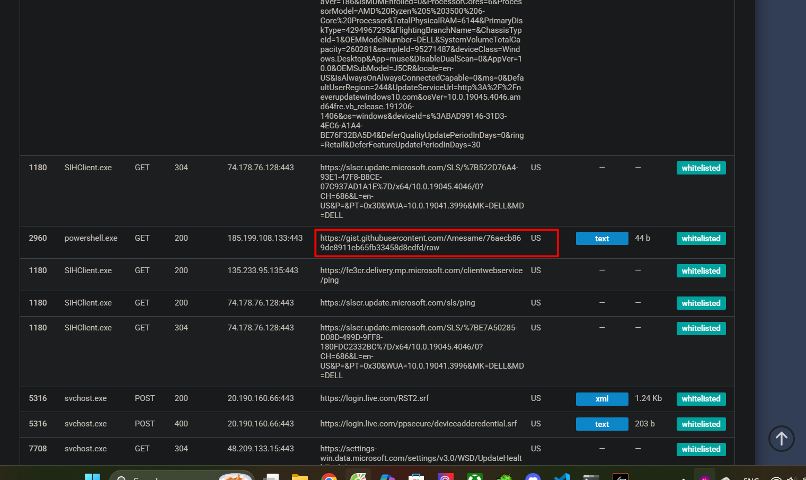

Following the link, I see a chunk of meaningless characters:

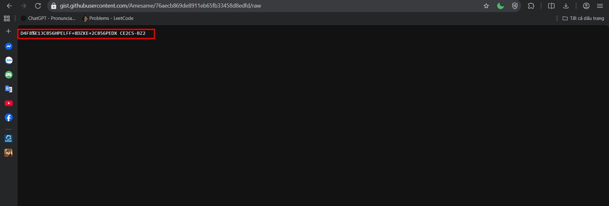

But it turns out to be the second half of the flag, base45-encoded (use Magic to identify):

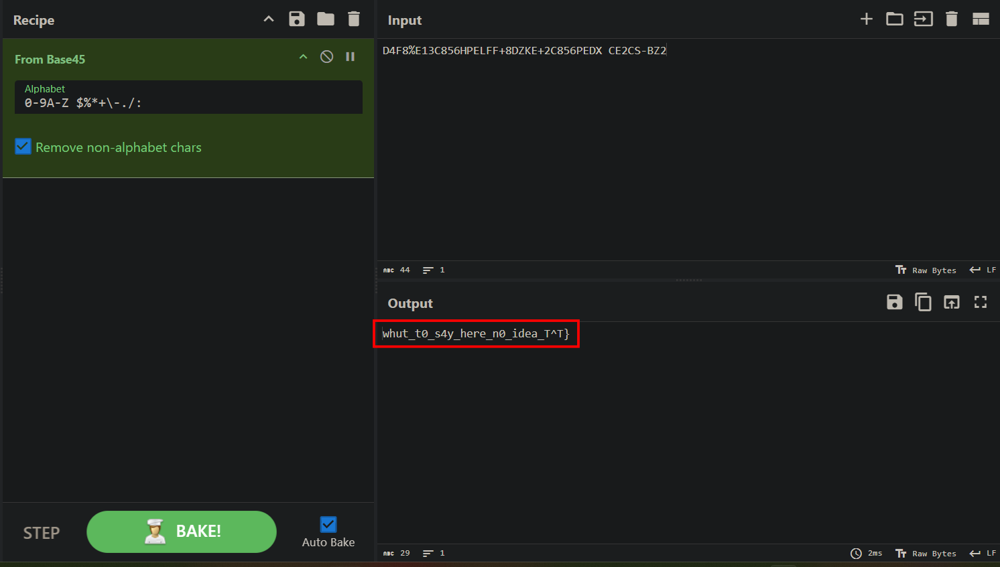

Got the flag!

`Flag: BKISC{Woah_I_r34lly_dunno_whut_t0_s4y_here_n0_idea_T^T}`

## Summary

The challenge chains together five forensic techniques, each one feeding into the next:

1. **Windows Search index recovery.** When a file is deleted (and even overwritten with zeros), its **indexed content** can still live on inside `Windows.edb` — specifically in the `System.Search.AutoSummary` property. Parse with `sidr`. This gives us part 1 of the flag (base32 in a target's "Note" field) and the password to `Instructions.pdf` (which we'll use later).
2. **Offline credential extraction.** With access to a full disk, dumping `SAM` + `SYSTEM` + `SECURITY` via `impacket-secretsdump` gives us the user's NT hash. Cracking it with hashcat / rockyou yields the plaintext password (`kangkong`).
3. **DPAPI masterkey decryption.** That password unlocks the user's DPAPI masterkey in `AppData\Roaming\Microsoft\Protect\<SID>\`. With `dpapi.py masterkey`, we get the cleartext masterkey bytes.
4. **DPAPI-NG offline decryption (the hard part).** Clipboard Pinned items use `NCryptProtectSecret` with `LOCAL=user`, which produces a CMS envelope wrapping three crypto layers: a classic DPAPI blob → KEK → AES-KEY-WRAP → CEK → AES-256-GCM → plaintext. No public offline tool exists for this format, so we write a small custom decryptor (~25 lines) that walks the chain. The plaintext is the Briar password.
5. **Briar account graft + RE.** Replacing our throwaway `.briar` profile with the victim's lets us log into their account using the recovered password. A URL there leads to `tools.zip`, password-locked with the secret from `Instructions.pdf`. Inside is a PE that downloads a base45-encoded gist via PowerShell — that string is part 2 of the flag.

### Lessons learned

- **`Windows.edb` is a side channel for deleted file content.** Even a "secure delete" that zeros the file can't reach data the indexer already cached in its property store.
- **DPAPI-NG is *not* classic DPAPI.** NirSoft's DataProtectionDecryptor, SharpDPAPI's `blob` command, and `dpapilab-ng`'s `blobdec*` scripts all fail silently or noisily on it. There's a real tooling gap here. The format itself is RFC 5652 CMS — if you see `30 82 ..` at the start of what's supposed to be a DPAPI blob, reach for `asn1crypto` immediately, not classic-DPAPI tools.
- **`strings | grep` before Ghidra.** For a stripped downloader binary, a one-liner like `strings -a tools.exe | grep -iE 'http|gist|powershell'` usually beats decompiling, and sandbox services (any.run, VirusTotal) catch what static analysis misses.
