# The Interview

## Scenario

> You are an undercover police officer, sent on a dangerous mission to bring down a fraudulent organization from the inside. Your only way in is to pose as a job applicant, and now, the company has contacted you for an interview. You unexpectedly gain access to the HR representative's phone data. It is your chance to expose their secrets and take the entire operation down.

!!! WARNING: OSINT skills required to complete the challenge.

## Given artifact

A copy of a mobile phone's `/data` partition.

## Foundational knowledge

My first time with mobile forensics, so let's see what we're actually given. This is the entire `/data` partition of an Android device — not just the app-data section. On a real Android device, `/data` is one of several top-level partitions (alongside `/system`, `/vendor`, `/boot`, etc.) and it's where everything user-mutable lives.

Inside `/data`, the subfolders worth knowing about:

- `/data/data/` — private per-app storage (databases, prefs). This is where almost everything we use lives: SMS, calendar, Chrome, Instagram, Discord, TikTok. We'll focus on this one.
- `/data/media/` — the user-facing "internal storage" (what you'd see when you plug the phone into a PC). Downloads, Pictures, DCIM, etc. We'll grab a downloaded game here.
- `/data/user/` — per-user data for multi-user setups. On a single-user phone, `user/0/` is usually a symlink/duplicate of `data/`.
- `/data/user_de/` — "Device Encrypted" storage, data accessible *before* the user unlocks the device (alarms, some system services).
- `/data/adb/` — ADB keys, i.e. pairing tokens for any computer that's been authorized for adb debugging.
- `/data/cache/` — system cache (OTA update staging, etc.), distinct from per-app caches.
- `/data/gsi/` — Generic System Image data, only used if a custom system image was sideloaded.
- `/data/incremental/` — Incremental APK install staging.
- `/data/per_boot/` — tiny tmpfs cleared on every boot.
- ...

Note that we also find `.DS_Store`, a trace of macOS — not relevant to the challenge, but it tells us the author packaged the dump on a Mac.

Most of the rest are system scaffolding and are either empty or irrelevant. The two that matter are `data/` and `media/`.

The general pattern for mobile forensics, which I'll be applying throughout this challenge:

1. Each installed app gets its own folder under `/data/data/`, named by package (e.g. `com.instagram.android`).
2. Inside each app folder, the two interesting places are `databases/` (SQLite files) and `shared_prefs/` (XML key/value files).
3. SQLite files open cleanly in DB Browser for SQLite; XML files open in any text editor.

That's basically it. Almost every "how did they find that account" moment in this challenge is just opening one of those two locations.

## Solving process

### Part 1 — SMS, calendar, and an XOR-encrypted plot

The scenario says the HR rep has already contacted our undercover policeman, so let's inspect the messages first. SMS lives in `data/data/com.android.providers.telephony/databases/mmssms.db`. Open it with DB Browser and look at the `sms` table:

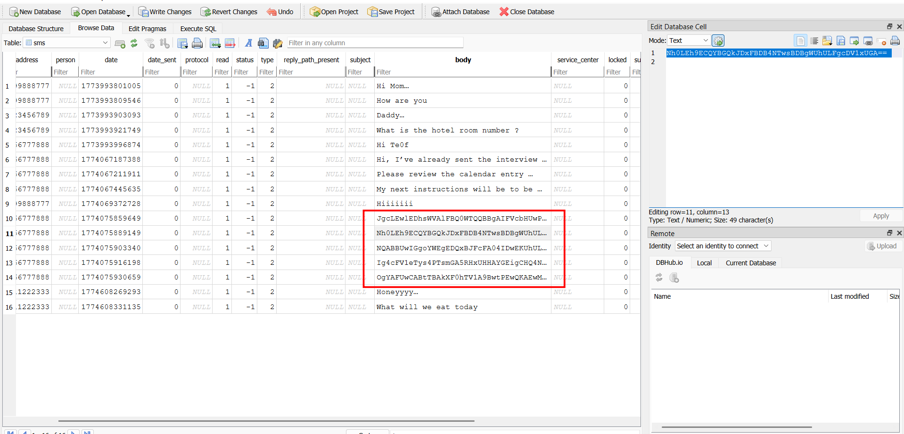

`type = 2` means all these messages are **sent** by the HR (the phone owner), so we're reading her outgoing texts. The recipients are her mom, dad, boyfriend, and our undercover policeman. From here on I'll play the role of the policeman, and it's worth noticing that some of the messages sent to us are weird — they look like base64, but base64-decoding them just yields garbage.

That's because base64 isn't the encryption, it's just the wrapper. SMS only transports normal printable text, so the attacker:

1. Took the plaintext message
2. Encrypted it (producing raw binary bytes — non-printable junk)
3. Base64-encoded the encrypted bytes so they'd survive being sent as a text

So to reverse it, we **base64-decode first → then decrypt**. The encryption itself is a very common CTF trick: repeating-key XOR. We need the key.

To find the key, note this hint message from the HR:

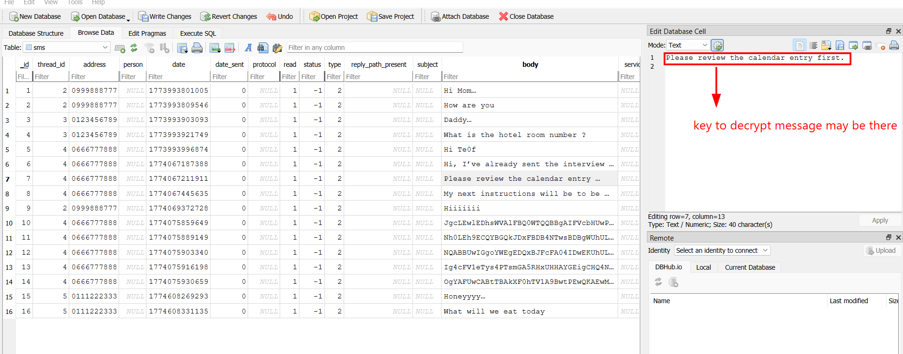

Let's pivot to `data/data/com.android.providers.calendar/databases/calendar.db`. The key lies in the `Events` table — buried among dozens of holiday entries, there's one event that obviously doesn't belong: an "Interview with Te0f" with a suspiciously bloated description:

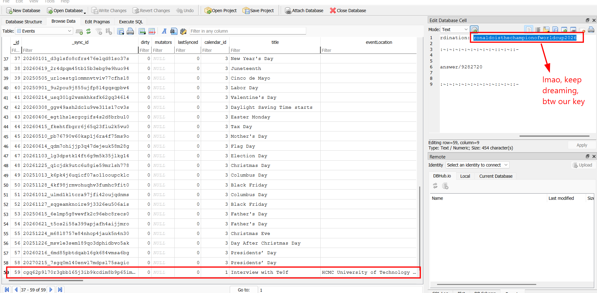

Lmao Messi is the true GOAT, Penaldo will never touch the WC. By the way, we got our key. Let's plug everything into CyberChef — `From Base64` → `XOR` with the key `ronaldoisthechampionofworldcup2026`:

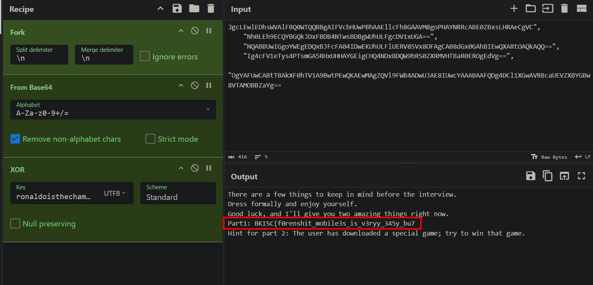

Got the first piece, and also the hint for the next fragment:

`Part 1: BKISC{f0renshit_mobile3s_is_v3ryy_345y_bu7`

### Part 2 — Reversing the space runner game

Right in the `/data` subfolder we can already notice this weird game's package:

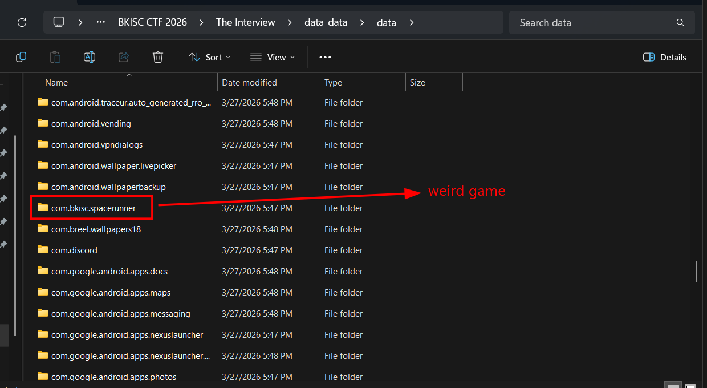

But the `.apk` file itself doesn't live there — `/data/data/com.bkisc.spacerunner` is just the app's *runtime data*. The installer file was downloaded by Chrome and dropped in the user's Download folder, so we navigate to `/media/0/Download`:

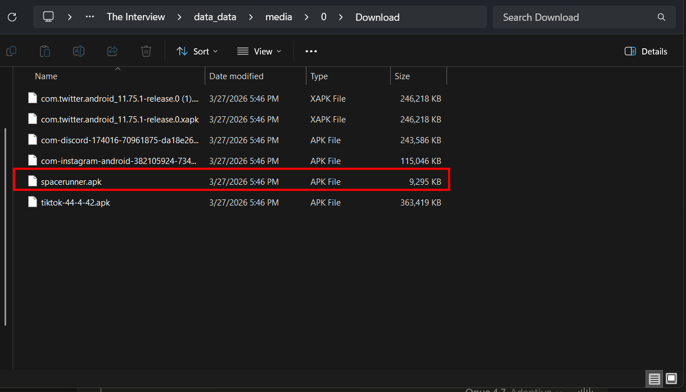

To inspect a compiled `.apk` file, we need to decompile it. Here I use [jadx](https://github.com/skylot/jadx), a famous tool that transforms an APK into clean, readable Java code (`jadx-gui spacerunner.apk` and you can browse the classes in a tree view). When inspecting the code, I particularly pay attention to these pieces:

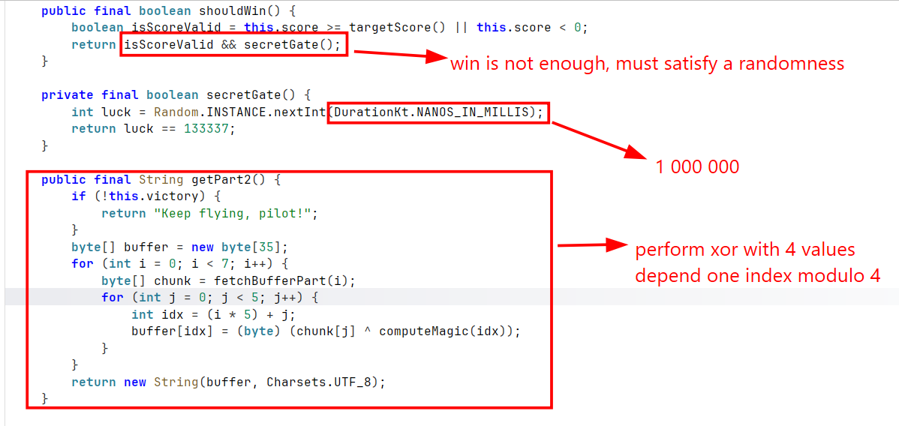

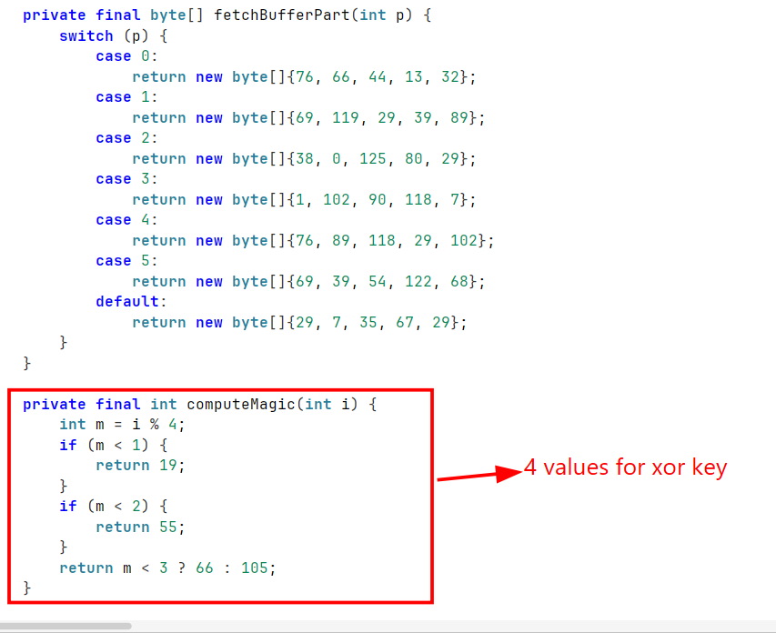

`shouldWin()` is the win logic and `getPart2()` is what spits out our flag fragment once we win. The catch is that even reaching the target score isn't enough — `secretGate()` rolls `Random.nextInt(1_000_000)` and only returns true if it lands on exactly `133337`. So playing legitimately is a 1-in-a-million coin flip, hard pass.

But look closer at `getPart2()` — once we're past the `victory` check, the computation is **100% deterministic**: hardcoded bytes from `fetchBufferPart()` XORed with a fixed 4-value cycling key from `computeMagic()`. No RNG, no game state, nothing dynamic. We don't need to patch the APK or play the game; we can just reimplement those two methods in Python and run the math ourselves:

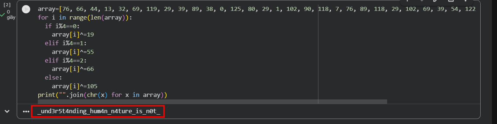

Done — `Part 2: _und3r5t4nding_hum4n_n4ture_is_n0t_`.

Concatenating what we have:

`BKISC{f0renshit_mobile3s_is_v3ryy_345y_bu7_und3r5t4nding_hum4n_n4ture_is_n0t_`

No closing `}` yet, so a Part 3 exists.

### Part 3 — OSINT, my arch nemesis

Now the nightmare begins. It's my weakness, honestly.

First lead: in the calendar event we already saw the HR's Gmail in the `Attendees` table:

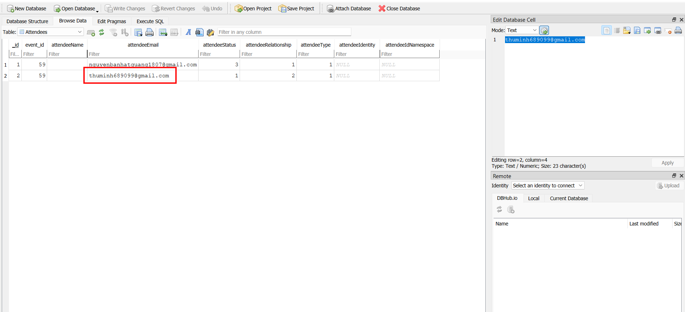

`thuminh689099@gmail.com` — this is going to be the pivot for finding her social accounts. The trick of mobile forensics is that most apps store the logged-in user's identity in plain text inside `shared_prefs/*.xml` (because they don't want to make you sign in every time the app launches). So grepping across `/data/data` for the email, or for `thuminh`, lights up every app where she's signed in.

Her Instagram is in `com.instagram.android/shared_prefs`:

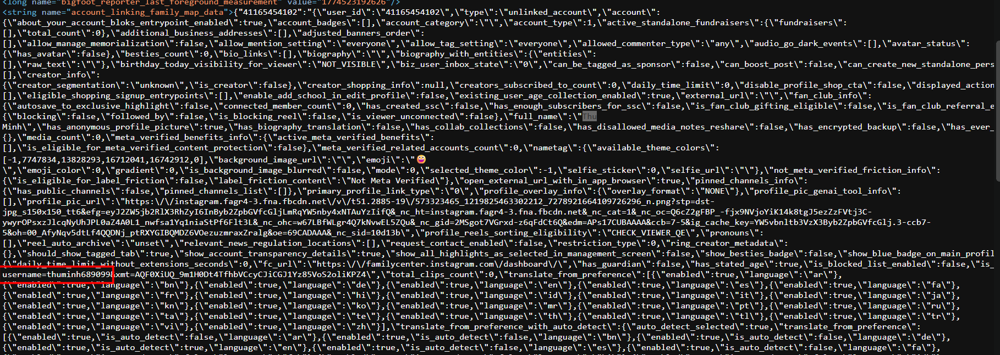

But the profile is locked behind a follow, and the bio says "Find different places" — clearly hinting that the photo we want is elsewhere:

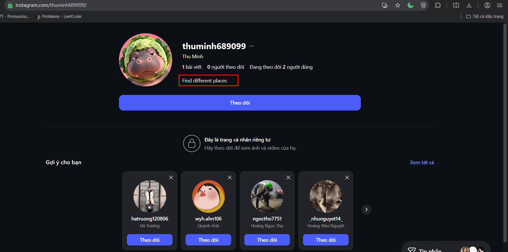

Her Discord is in `com.discord/shared_prefs/CacheStore.xml`, in the `MultiAccountStore` blob:

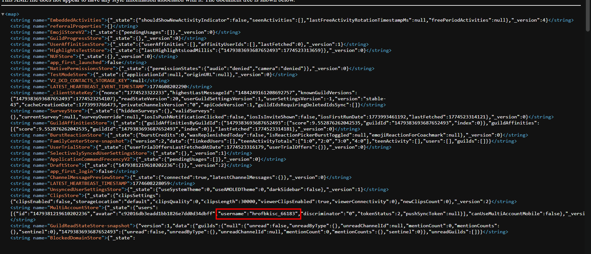

But I don't remember how to search for a Discord user by ID lol — and Discord doesn't really expose profile pages publicly anyway, so this is a dead end for now.

Her TikTok `sec_uid` is in `com.zhiliaoapp.musically/shared_prefs/ttnet_store_region.xml`:

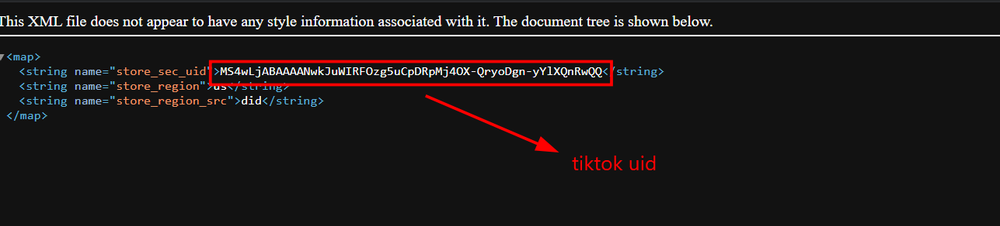

However, TikTok's UI doesn't let us search a user by `sec_uid` — it's an internal identifier, useless for the website's search bar. So that's another dead end on paper.

I cannot see any other social app on her phone. So I just **guess** that her username is `thuminh689099` everywhere (people overwhelmingly reuse handles across platforms), and try appending it to common social URLs. Results:

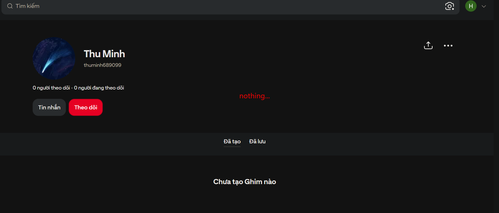

An empty Pinterest. But:

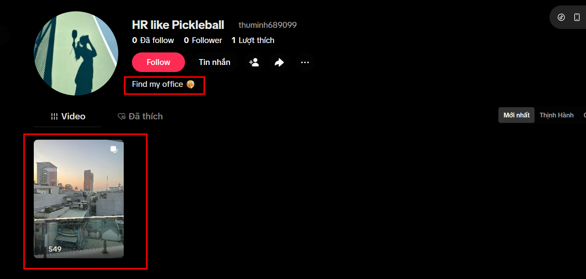

Her TikTok turns out to use that name! And the bio says **"Find my office"** — that's our task, identify the building in her video. The carousel shows a rooftop sunset view and a street-level shot of cars and a white building.

While I'm at it I also try her X / Twitter, and that turns out to be the breakthrough:

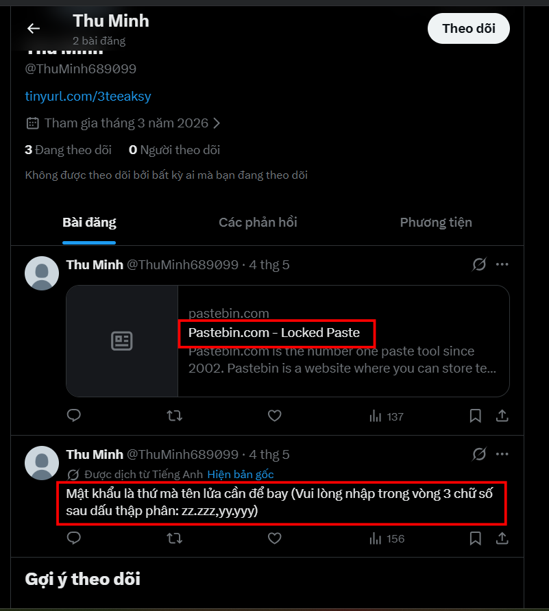

Two posts:
- A Pastebin link via `tinyurl.com/3teeaksy` ("Locked Paste").
- "The password is the thing a rocket needs to fly (Please enter the 3 digits after the decimal point: zz.zzz,yy.yyy)".

So the password is a **coordinate pair** (latitude, longitude with 3 decimals), and the coordinates are the location of her office from the TikTok video. The "rocket needs to fly" line is the hint that ties the office location to the password format — what a rocket needs is a *launch* site, which is also a pun on the **"Lunch Time"** caption sitting on the TikTok street photo. Cute.

To be honest, map OSINT totally defeats me. I had to get a hint from a friend to find this place, but the answer turns out to be in Phú Nhuận District, Ho Chi Minh City — coordinates `10.798, 106.708`:

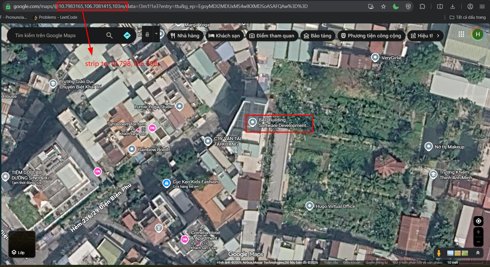

Unlock the paste with `10.798,106.708`:

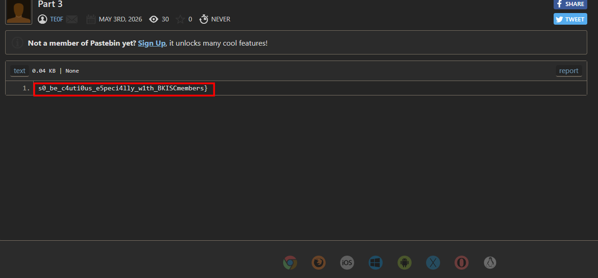

Got the full flag!

`Flag: BKISC{f0renshit_mobile3s_is_v3ryy_345y_bu7_und3r5t4nding_hum4n_n4ture_is_n0t_s0_be_c4uti0us_e5peci4lly_w1th_BKISCmembers}`

## Summary

The intended path through this challenge:

1. **Open the SMS database** at `com.android.providers.telephony/databases/mmssms.db`. Spot the obvious base64-looking ciphertexts sent to the "Te0f" thread, and the plaintext hint pointing at the calendar.
2. **Open the calendar database** at `com.android.providers.calendar/databases/calendar.db`. Find the "Interview with Te0f" event and lift the XOR key `ronaldoisthechampionofworldcup2026` from the description.
3. **Decrypt with CyberChef**: `From Base64` → `XOR` (key, UTF-8). Reveals Part 1 of the flag and a hint pointing at a downloaded game.
4. **Pull `spacerunner.apk`** from `/media/0/Download` and decompile it with jadx. Recognize that the win check is gated by a 1-in-a-million RNG, but `getPart2()` is fully deterministic once past the `victory` flag — so reimplement `fetchBufferPart` + `computeMagic` in Python to recover Part 2 without ever launching the game.
5. **OSINT phase**: pivot off the Gmail from the calendar's `Attendees` table and grep `/data/data` for the `thuminh689099` handle to enumerate her social accounts. Guess that the same handle is reused everywhere → land on her TikTok, where the bio "Find my office" points at the carousel photos. Her X reveals a Pastebin URL and a coordinate-formatted password hint.
6. **Map OSINT**: identify the building from the TikTok street photo as being in Phú Nhuận, Ho Chi Minh City. Coordinates `10.798, 106.708` unlock the paste, which contains Part 3 and the closing `}`.

The lesson for me: when the dump includes every app's `shared_prefs`, OSINT-by-username basically falls out for free — the only manual step left is the one CTF authors *want* you to suffer through, which is the geo-identification at the end. Maybe one day I'll be less bad at that.
