# homework

## Scenario

My friend and I were sleeping in our online class, when the session ended in group chat our teacher said the deadline is tomorrow, but we don't know what it is. Can you help us ?

## Given artifact

A `.ad1` disk file.

## Overview

This is a multi-stage forensic chain, with each stage unlocking the next:

```
.ad1 image
   └─► identify user + Zoom install
          └─► dump credentials (SAM/SYSTEM/SECURITY → NT hash)
                 └─► decrypt DPAPI master key
                        └─► unwrap Zoom's SQLCipher passphrase
                               └─► read meeting chat → homework link
                                      └─► NTFS ADS → AES key/IV
                                             └─► invert AES on JPG → PNG with flag
```

Most of the "stuck points" are about understanding *what each artifact actually is*, not about heavy computation. So I'll include short background notes inline as we go.

## Solving process

### 1. Identify the user and the target app

Open the disk file with FTK Imager and navigate to the active user's `Downloads` folder. I see a Zoom installer dropped there — combined with the scenario ("group chat our teacher said the deadline"), the target is clear: **Zoom's chat history**.

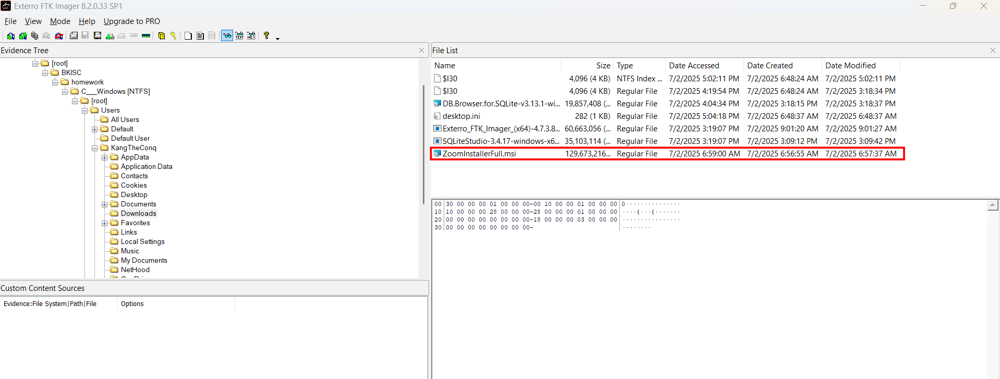

Active user: `KangTheConq`. Skip `Administrator`, `Guest`, `Default*`, `Public`, `WDAGUtilityAccount` — those are built-in system accounts, not the human user.

### 2. Grab credentials for the DPAPI chain

Like browsers, sensitive data in Zoom is stored under Windows' **DPAPI** mechanism. To decrypt anything DPAPI-protected, we need to walk a chain of keys rooted in the user's credentials.

> **What is DPAPI?**
>
> The Data Protection API is Windows' built-in service for storing local secrets. Any app can call `CryptProtectData(secret)` and get back an opaque blob that's encrypted with a key derived from the **user's login credential + the user's SID**. Later, `CryptUnprotectData(blob)` returns the original secret — but only when running as that user, on that machine. Chrome, Edge, Outlook, WiFi profiles, Credential Manager, Zoom, Slack, Teams, Discord — they all use this.
>
> The actual key hierarchy is:
> ```
> User password (or NT hash)
>     │ + SID, PBKDF2
>     ▼
> Pre-key
>     │ unwraps
>     ▼
> Master key (one file per key, stored in Protect\<SID>\<GUID>)
>     │ + per-blob salt
>     ▼
> Plaintext secret
> ```
>
> So to decrypt any DPAPI blob offline, we need: the NT hash (or password), the SID, and the master key file. With those, `impacket`'s `dpapi.py` walks the same derivation Windows does.

Export `SAM` and `SECURITY` from `Windows\System32\config\` (`SYSTEM` is needed too — it's in the same folder, just scroll down):

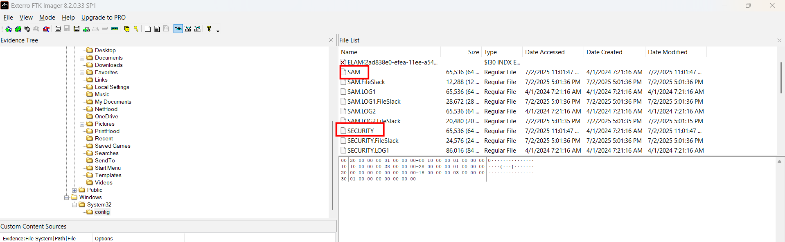

Then export the whole SID folder from `AppData\Roaming\Microsoft\Protect\` — this is the user's collection of DPAPI master keys. The folder name **is** the SID, which we'll need later:

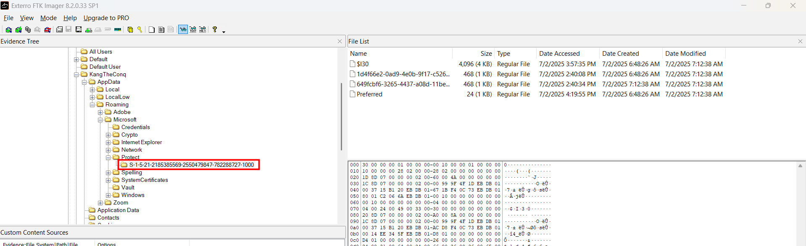

Each GUID-named file inside is a master key (Windows rotates them every ~90 days). The file called `Preferred` points to whichever one is currently active.

### 3. Extract the NT hash with secretsdump

`SAM` holds the local user hashes, encrypted under a bootkey stored in `SYSTEM`. `impacket-secretsdump` parses both offline and prints the hashes:

```bash
impacket-secretsdump -sam SAM -system SYSTEM -security SECURITY LOCAL
```

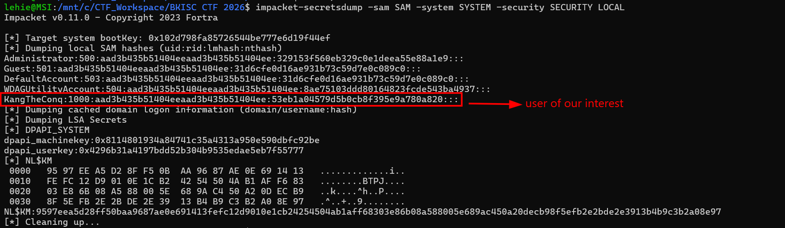

We only need the NT hash for `KangTheConq` (RID 1000). But cracking it to plaintext makes follow-up commands cleaner — and CrackStation finds it instantly:

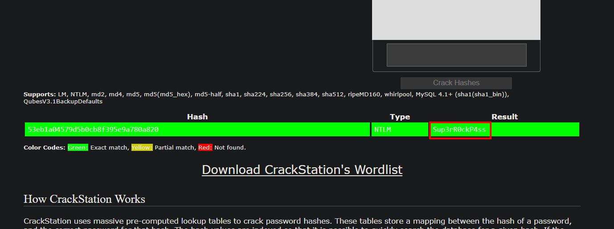

Password: `Sup3rR0ckP4ss`.

### 4. Decrypt the DPAPI master key

There are two master key files in the `Protect\<SID>\` folder. Each DPAPI blob carries the **GUID of the master key it was encrypted with** in its header, so only one of them is "ours". You can either parse the Zoom blob first to know which GUID to target, or just try both — only the matching one decrypts. (I tried both; `1d4f66e2-...` was the right one for Zoom's blob.)

```bash
dpapi.py masterkey \
  -file masterkey/S-1-5-21-2185385569-2550479847-782288727-1000/1d4f66e2-0ad9-4e0b-9f17-c526c4920624 \
  -sid S-1-5-21-2185385569-2550479847-782288727-1000 \
  -password 'Sup3rR0ckP4ss'
```

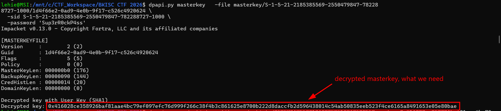

Save the `Decrypted key:` hex output — this is the actual master key Windows would use to unwrap blobs.

### 5. Locate Zoom's encrypted artifacts

Navigate to `AppData\Roaming\Zoom\data\`. There's a lot here — private chat, calendar, meeting data, configuration — but two files matter:

- **`Zoom.us.ini`** — contains a `[ZoomChat]` section with a `win_osencrypt_key=ZWOSKEY<base64>` value. This is the DPAPI-wrapped SQLCipher key.
- **`zoommeeting.enc.db`** — the in-meeting chat database (SQLCipher-encrypted).

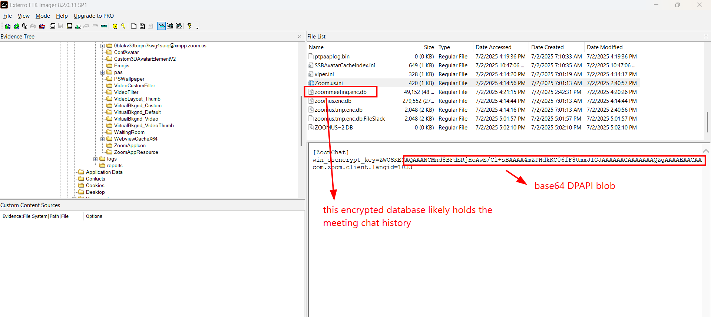

> **What is SQLCipher?**
>
> A transparent extension to SQLite that encrypts the entire database file (including the header) using AES-CBC. You can't open a SQLCipher-encrypted DB with regular SQLite tools — the bytes look like random data because there's no plaintext SQLite header. To open it you need the passphrase plus the right key-derivation parameters (page size, KDF iteration count, HMAC algorithm). Zoom uses non-default parameters, which is why DB Browser for SQLite won't open these files even if you give it the right passphrase — we'll handle that below.

Export both files.

### 6. Unwrap Zoom's SQLCipher passphrase

The `win_osencrypt_key` value is a base64-encoded DPAPI blob with a literal `ZWOSKEY` prefix. Strip the prefix, base64-decode the rest, and we have a raw DPAPI blob:

```bash
python3 -c "
import base64, configparser
c = configparser.ConfigParser(); c.read('Zoom.us.ini')
open('zoom_blob.bin','wb').write(base64.b64decode(c['ZoomChat']['win_osencrypt_key'][7:]))
"
```

(Or paste the base64 string into CyberChef → `From Base64` → save as `zoom_blob.bin`.)

You can verify it's a real DPAPI blob by checking the first 8 bytes after the version field — they should be `D0 8C 9D DF 01 15 D1 11`, the universal DPAPI provider GUID magic.

Unwrap it with the master key from step 4:

```bash
dpapi.py unprotect -file zoom_blob.bin \
  -key 0x416028ce358926baf81aae4bc79ef097efc76d999f266c38f4b3c861625e8700b222d8daccfb2d596438014c54ab50835eeb523f4ce6165a8491653e05e80bae
```

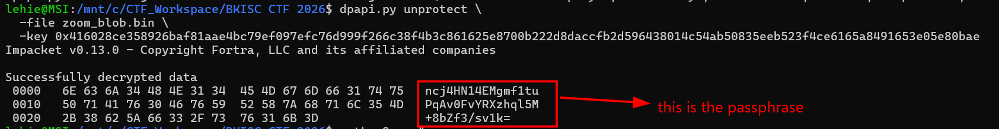

The decrypted payload is an ASCII string: `ncj4HN14EMgmf1tuPqAv0FvYRXzhql5M+8bZf3/sv1k=` — a 44-char base64 string. **This is the SQLCipher passphrase**, and importantly, Zoom uses the base64 string *as-is* (don't decode it again — SQLCipher will run PBKDF2 over the literal string).

### 7. Decrypt the meeting database

Run `sqlcipher zoommeeting.enc.db` to enter the SQL console. The PRAGMA sequence is critical here — Zoom uses SQLCipher v3 defaults with a 1024-byte page size and only 4000 KDF iterations (much weaker than the v4 default of 256000). And **`cipher_compatibility` must be set *before* `key`** — otherwise SQLCipher computes the derived key with v4 defaults and the DB will look "not a database":

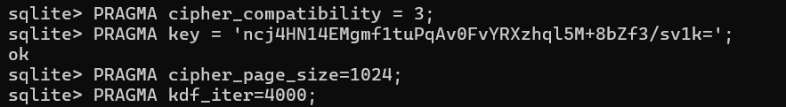

The syntax of sqlite is quite different from mysql — there is no `SHOW TABLES;`, instead we use `.tables`:

```text
sqlite> .tables
zoom_conf_cc_gen2               zoom_conf_meeting_invitee_list
zoom_conf_chat_gen2_enc         zoom_conf_new_chat
```

And no `DESCRIBE...`, we use `.schema <table_name>`:

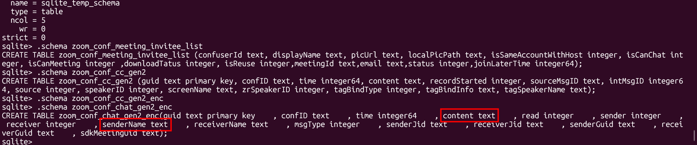

`zoom_conf_chat_gen2_enc` is the in-meeting chat table. Query it:

```text
sqlite> select time, senderName, content from zoom_conf_chat_gen2_enc order by time;
      time = 1751472901
senderName = K4ngTh3C0nq Nguyen
   content = hi chat

      time = 1751472913
senderName = Khang Nguyen
   content = Hi K4ngTh3C0nq

      time = 1751472917
senderName = Khang Nguyen
   content = classmate

      time = 1751472934
senderName = obiwan
   content = Hi everyone, today we're learning steganography, isn't it exiting!

      time = 1751472946
senderName = Khang Nguyen
   content = Woah what steganography

      time = 1751472958
senderName = K4ngTh3C0nq Nguyen
   content = That's sound very hard

      time = 1751472982
senderName = obiwan
   content = Today lesson is a technique that turn a PNG to a JPG!

      time = 1751472998
senderName = Khang Nguyen
   content = What kind of that black magic !!!!!!!!!!!

      time = 1751473002
senderName = obiwan
   content = Just another typical forensic challenge, it's not that hard!

      time = 1751473010
senderName = obiwan
   content = Anyway here is the homework

      time = 1751473013
senderName = K4ngTh3C0nq Nguyen
   content = What ?

      time = 1751473035
senderName = obiwan
   content = https[:]//drive.google.com/drive/folders/1TZ3XLHvZiSUa38y9zwVKgFFPBzrPJYop

      time = 1751473059
senderName = obiwan
   content = Be sure to download it, I won't send it again!

      time = 1751473063
senderName = K4ngTh3C0nq Nguyen
   content = What if I can't do the homework

      time = 1751473091
senderName = obiwan
   content = Good question

      time = 1751473123
senderName = obiwan
   content = Everything you need is in the link's archive, I won't answer any questions until you're done

      time = 1751473131
senderName = obiwan
   content = GLHF

      time = 1751473144
senderName = Khang Nguyen
   content = Sure , BKISC will help me with this :)))))))

      time = 1751473150
senderName = obiwan
   content = I'm sure they will

      time = 1751473166
senderName = K4ngTh3C0nq Nguyen
   content = Lmao, sleepy :(( I haven't sleep for 2 days

      time = 1751473169
senderName = K4ngTh3C0nq Nguyen
   content = Bad trip

      time = 1751473184
senderName = obiwan
   content = sorry to hear that, anyway..
```

The teacher dropped the homework link mid-meeting. Now the forensic half is done; the rest is a stego puzzle.

### 8. Stage 2 — the homework archive

Download the folder from that Google Drive link. Inside is the classic rickroll image, plus a `key.txt` file with guidance:


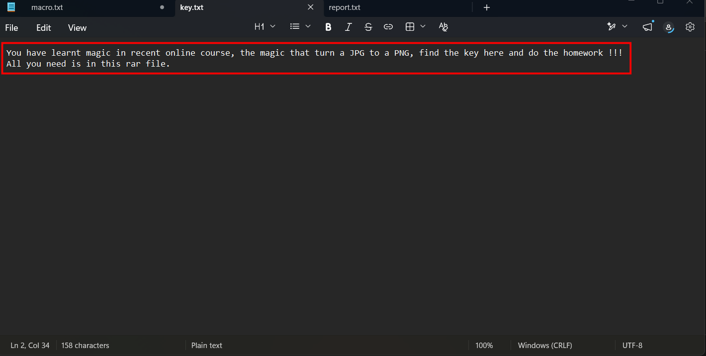

> *"You have learnt magic in recent online course, the magic that turn a JPG to a PNG, find the key here and do the homework !!!"*

"Find the key here..." — which key? The text file has nothing else visible. After a moment I remembered: this is Windows NTFS, so there might be an **Alternate Data Stream** (ADS) hiding on the file.

> **NTFS Alternate Data Streams (ADS)**
>
> NTFS lets a file carry hidden side-streams via a `filename:streamname` syntax. They're invisible to `dir`, Explorer, and most tools, but trivial to read once you know they're there. `dir /R` lists every stream on every file. ADS only survives on NTFS volumes — extracting an archive on WSL/ext4 strips them, which is why I extracted the archive into `C:\CTF_Workspace\` directly.

```cmd
dir /R
```

Shows `key.txt:secret:$DATA` — that's the hidden stream. Read it with:

```cmd
more < key.txt:secret
```

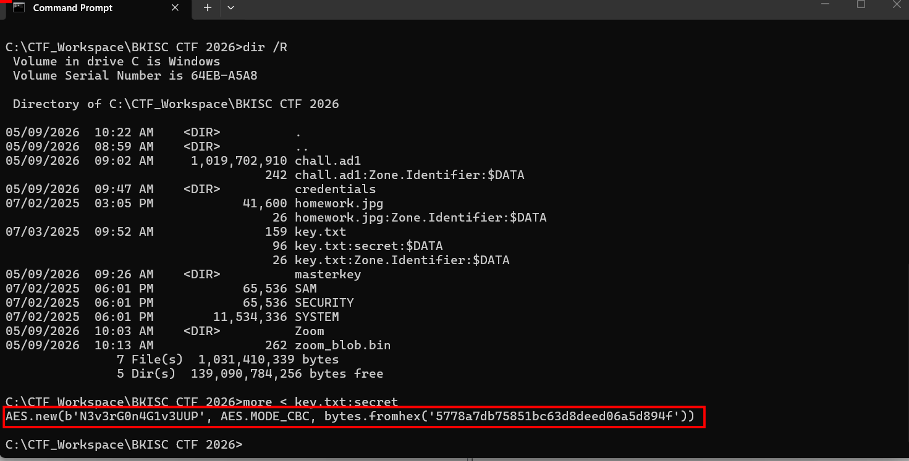

The stream contains: `AES.new(b'N3v3rG0n4G1v3UUP', AES.MODE_CBC, bytes.fromhex('5778a7db75851bc63d8deed06a5d894f'))` — an AES-128-CBC setup line in Python syntax, giving us the key and IV.

### 9. The "JPG to PNG" trick

So there is AES somewhere, given the key and IV. Is Rick Astley's photo a decoy? I tried every JPG-stego technique I know first (steghide, outguess, binwalk, trailing bytes after `FF D9`, EXIF) — none of those matched the AES setup we were given.

Then I re-read the hint: *"the magic that turns a JPG to a PNG"*. The whole JPG file **is** the input to the AES operation. But here's the trick — naively doing AES-CBC **decrypt** on the JPG yields random bytes. The key insight is that the original PNG was AES-CBC **decrypted** (used as ciphertext!) to produce the JPG, so to invert we have to **encrypt** the JPG with the same key/IV.

This works because AES is symmetric: in CBC, `encrypt(decrypt(P)) = P` block-by-block as long as the IV is the same.

```python
from Crypto.Cipher import AES

data = open('homework.jpg','rb').read()
key  = b'N3v3rG0n4G1v3UUP'
iv   = bytes.fromhex('5778a7db75851bc63d8deed06a5d894f')
recovered = AES.new(key, AES.MODE_CBC, iv).encrypt(data)
open('recovered.bin','wb').write(recovered)
```

### 10. Repair the recovered PNG

The output starts with PNG magic but doesn't open in any viewer. Inspecting in xxd:

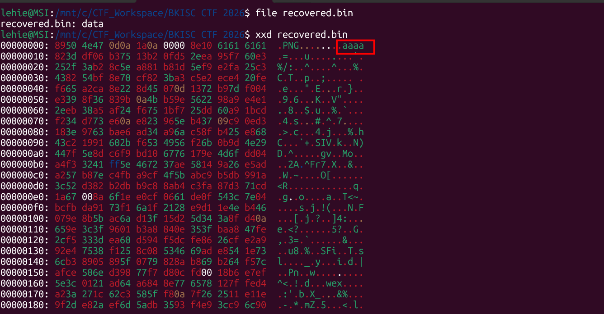

After the 8-byte PNG signature comes a chunk with type `aaaa` — that's not a standard PNG chunk, and the PNG spec requires the **first** chunk after the signature to be `IHDR`. Viewers reject the file because of this violation.

> **PNG file anatomy**
>
> A PNG is just a fixed 8-byte signature (`89 50 4E 47 0D 0A 1A 0A`) followed by a series of chunks. Each chunk has:
> - 4 bytes: data length (big-endian)
> - 4 bytes: chunk type (4 ASCII letters; uppercase first letter = critical, lowercase = ancillary)
> - N bytes: data
> - 4 bytes: CRC32
>
> The first chunk must be `IHDR` (image header, 13 bytes), and the last must be `IEND`. The `aaaa` chunk here is technically a valid ancillary chunk byte-wise, but its placement (before IHDR) breaks the spec.

The bogus `aaaa` chunk declares 36368 bytes of payload, so the real IHDR sits very far in. Manually editing in a hex editor is doable but tedious — let a script find IHDR/IEND and rebuild the file:

```python
PNG_MAGIC = bytes.fromhex('89504E470D0A1A0A')
buf = open('recovered.bin','rb').read()
ihdr_len_off = buf.find(b'IHDR') - 4         # 4-byte length precedes 'IHDR'
iend_end     = buf.find(b'IEND') + 8         # 'IEND' + 4-byte CRC
open('flag.png','wb').write(PNG_MAGIC + buf[ihdr_len_off:iend_end])
```

Boom, got the flag!

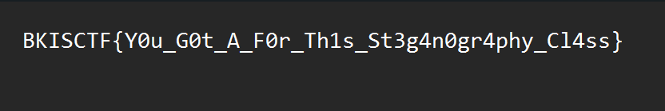

`Flag: BKISCTF{Y0u_G0t_A_F0r_Th1s_St3g4n0gr4phy_Cl4ss}`

## Takeaway

The whole challenge is a guided tour through Windows credential forensics:

| Stage | Technique | Where else it applies |
|---|---|---|
| Dump SAM/SYSTEM | Offline registry parsing | Any Windows IR case |
| DPAPI master key | NT hash → derive → unwrap | Chrome/Edge passwords, RDP creds, WiFi keys |
| SQLCipher | App-specific PRAGMAs | Signal, WhatsApp Desktop, many secure-messaging apps |
| NTFS ADS | `dir /R` | Malware persistence, data exfil |
| AES inversion | `enc(dec(P)) = P` | CTF obfuscation, custom packers |


