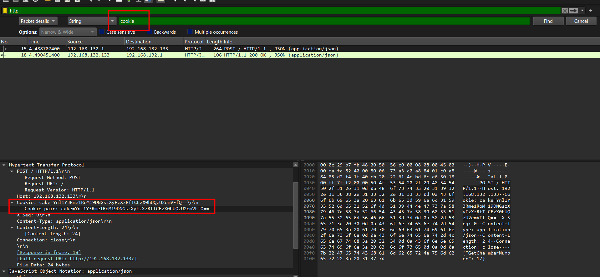
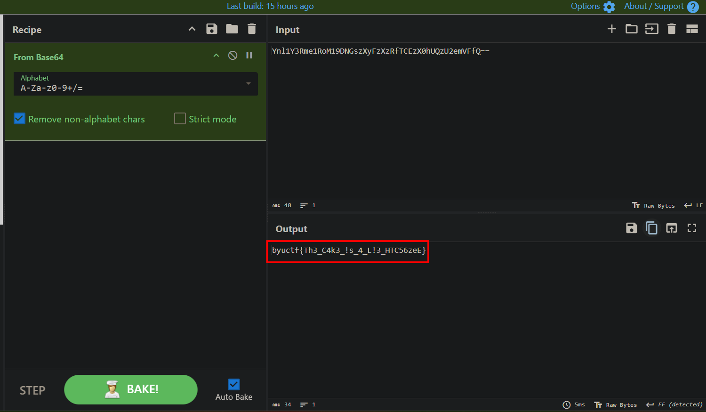
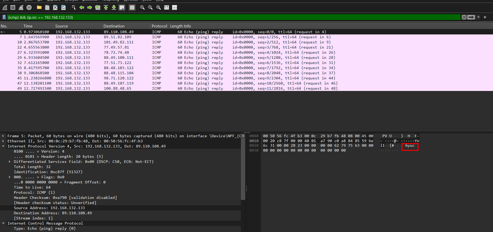
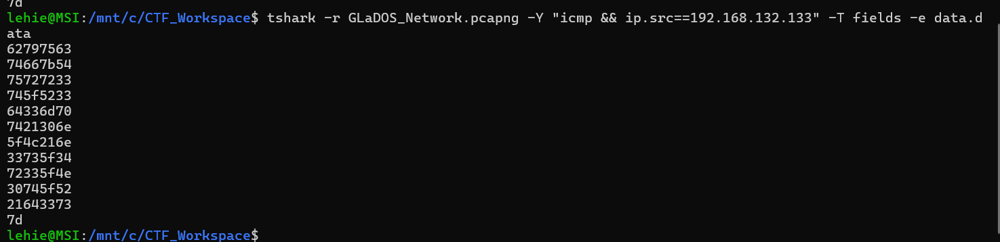
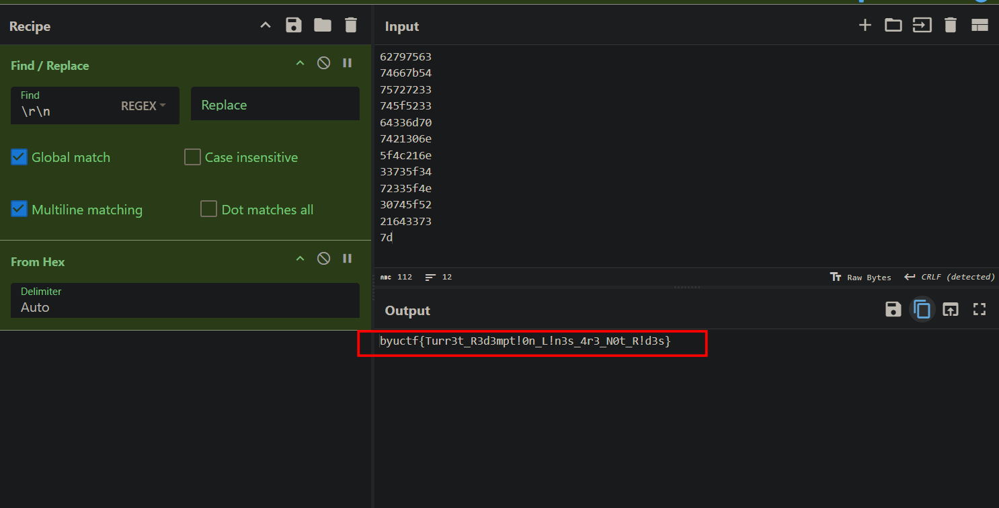
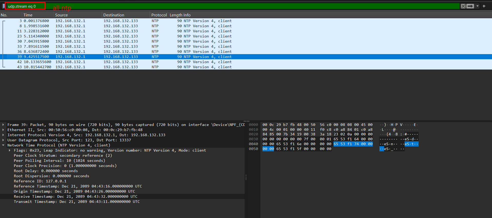
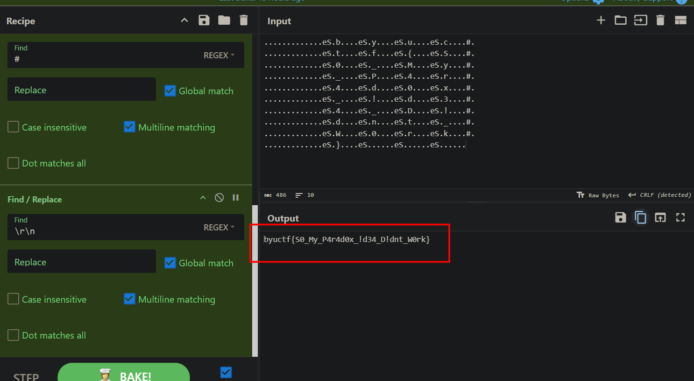
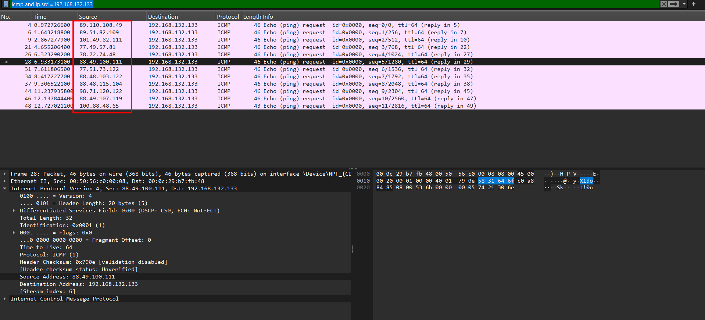
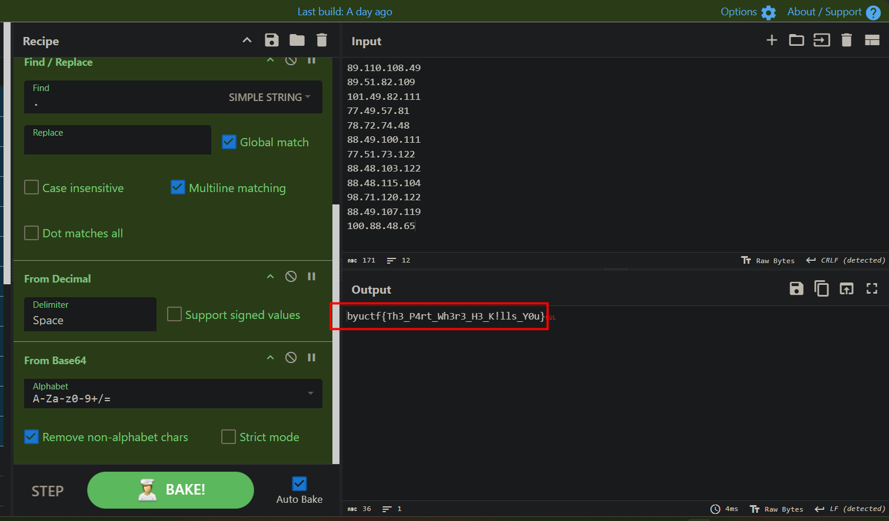

# There Will Be Cake

## Scenario

The Enrichment Center is required to remind you that all test subject activity will be logged, analyzed, and stored for scientific purposes.

"Cake and grief counseling will be available at the conclusion of the test."

Hint: what is a baked treat similar to a cake that you can find on almost any website?

## Solve 

As the hint said, let's look for cookie in HTTP:

Seems to be base64-encoded, let's visit cyberchef:

# Are You Still There ?

## Scenario

Forms FORM-55551-6: Personnel File Addendum Addendum:

One last thing:

Go ahead and leave me. I think I prefer to stay inside. Maybe you'll find someone else to help you. Maybe Black Mesa... THAT WAS A JOKE. HA HA. FAT CHANCE. Anyway, this cake is great. It's so delicious and moist. Look at me still talking when there's Science to do. When I look out there, it makes me GLaD I'm not you. I've experiments to run. There is research to be done. On the people who are still alive.

PS: And believe me I am still alive. PPS: I'm doing Science and I'm still alive. PPPS: I feel FANTASTIC and I'm still alive.

FINAL THOUGHT: While you're dying I'll be still alive.

FINAL THOUGHT PS: And when you're dead I will be still alive.

STILL ALIVE

Still alive.

Hint: how would you remotely check if a server is online?

## Solve

The hint points at `ping` traffic, ICMP protocol. Normally the data in ping traffic is random, but not in this case:

Use `tshark` to grab all:

Then visit cyberchef:

# Alright. Time Paradox

## Scenario

To maintain a constant testing cycle, I simulate daylight at all hours and add adrenal vapor to your oxygen supply. So you may be confused about the passage of time. The point is, yesterday was your birthday. I thought you'd want to know.

Hint: What protocol is associated with time?

## Solve

Time ? Network Time Protocol (NTP) for sure!

> The Network Time Protocol (NTP) is a networking protocol used to synchronize the internal clocks of computers, servers, routers, and other devices across a data network to a single, accurate time standard.
> 
> It ensures that all connected systems share the exact same time—usually within a few milliseconds of Coordinated Universal Time (UTC) over the internet.

Extract all of them and use some cyberchef kung-fu to get the flag:

# Corrupted Cores

## Scenario

"The scientists were always hanging cores on me to regulate my behavior. I've heard voices all my life. But now I hear the voice of a conscience, and it's terrifying, because for the first time it's my voice."

Hint: the voices may not belong to a single identity 

Hint2: the arp packets are not part of this challenge.

## Solve

Voice ? I was a bit lost at first, nothing more to inspect in this pcap, however, later I realize the ICMP request does not contain just 1 flag, the other IPs beyond the host hold more meaning than I thought at first:

Concatenate them, each octet is an Ascii character, they form a base64 string, then we can get our flag, cyberchef's skill turn:

