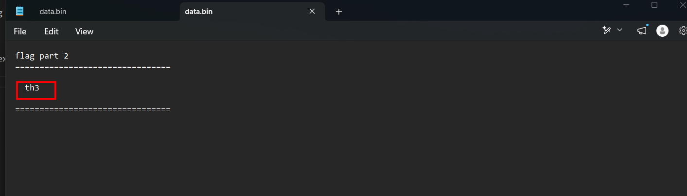
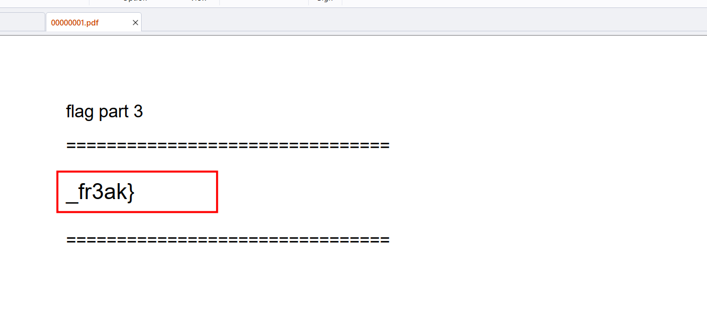

# Inception

## Scenario

I found this weird file on my computer. I tried opening it, but there were some problems.

## Solve

The given file is merged from 3 distinct files, `binwalk` may not work as expected, use `foremost` instead

First is a png image holding the first chunk:

Second is a text file inside a zip file:

Finally, the PDF:

`Flag: byuctf{wh4t_th3_fr3ak}`