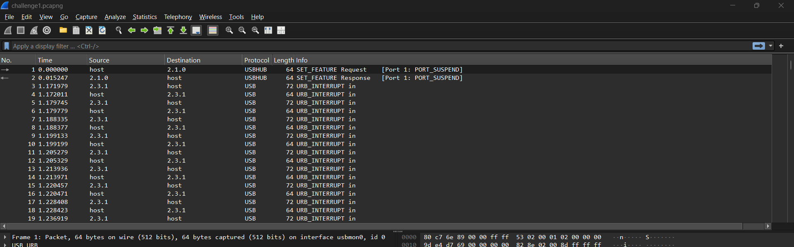
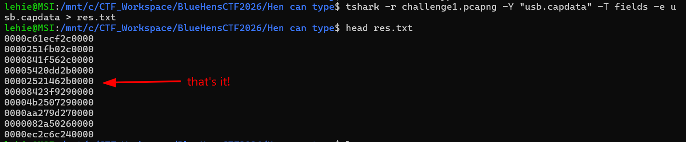
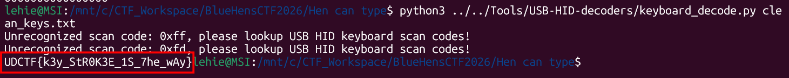

# Hen can type ?

## Scenario 

UD SOC team recovered a USB traffic capture from a suspicious machine on campus.

Investigators believe a user typed something important… Can you reconstruct what was typed?

Take a closer look you might find what was left behind.

## Given artifact

A packet capture file with all USB protocol

## Solving process

Initial inspection shows that the pcap file is not captured from the beginning, so the DEVICE CONFIGURATION packets are missing, leaving us unaware of what kind devices is transmitting data:



Anyway, let's extract the data:



The problem description highly suggests that those are keyboard code, so I use `keyboard_decoder.py` on it directly, however, the output is pure garbage. Then I realize that possibly there are also mouse control packages!

A standard USB packet is 8 bytes long. We need to distinguish the keyboard packets from the mouse packets.

- `Mouse Packets`: Usually start with a 00 Report ID and contain constantly changing X/Y coordinate and pressure data. They rarely have empty padding at the end (e.g., 0000c61ecf2c0000).

- `Keyboard Packets`: Contain the Modifier Byte (Shift/Ctrl), a reserved byte, and up to 6 keystrokes. Because humans rarely press 6 keys at exactly the same time, the end of a keyboard packet is almost always padded with multiple empty zero bytes (e.g., 0200040000000000).

**The Shift-Key Trap**: You cannot simply filter out packets starting with 00 to remove the mouse, because a keyboard packet for a lowercase letter uses 00 as its modifier byte (no Shift key pressed). Filtering by ^00 deletes all lowercase letters from the flag!

Instead, filter for lines that end in a long string of padding zeros:

```bash
grep "000000$" res.txt > clean_keys.txt
```

Now run the decoder again:



Got the flag!

`Flag: UDCTF{k3y_StR0K3E_1S_7he_wAy}`