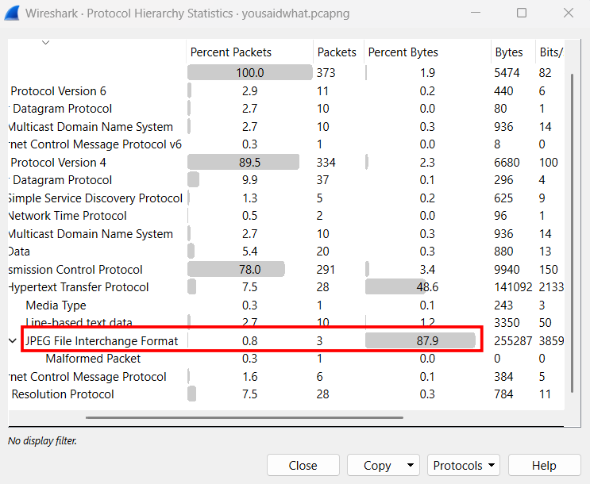
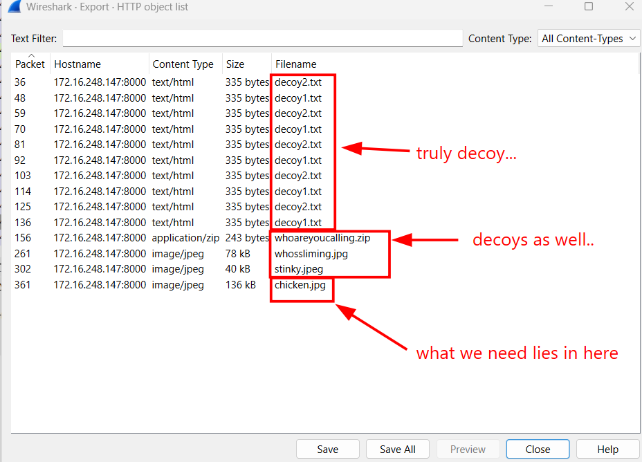
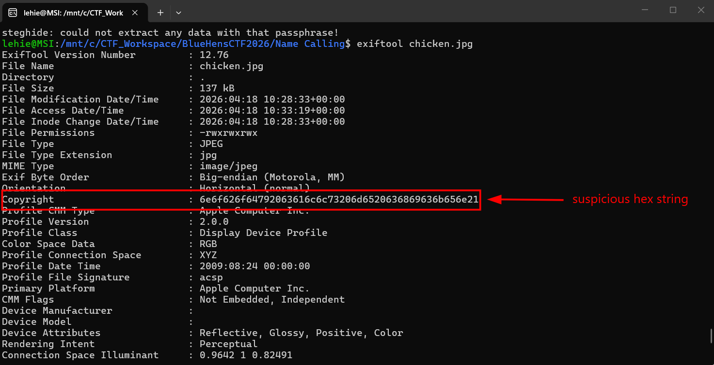
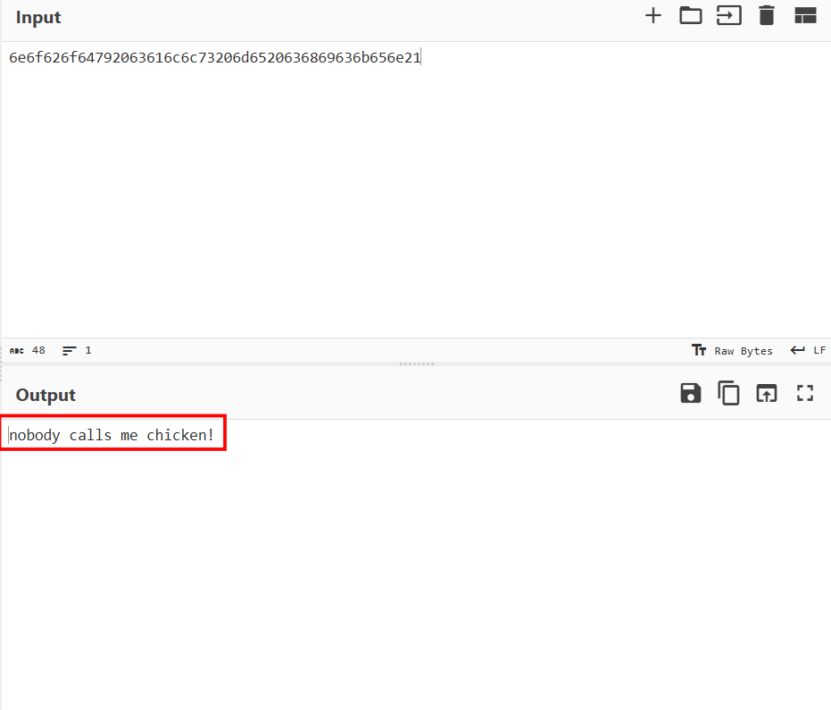
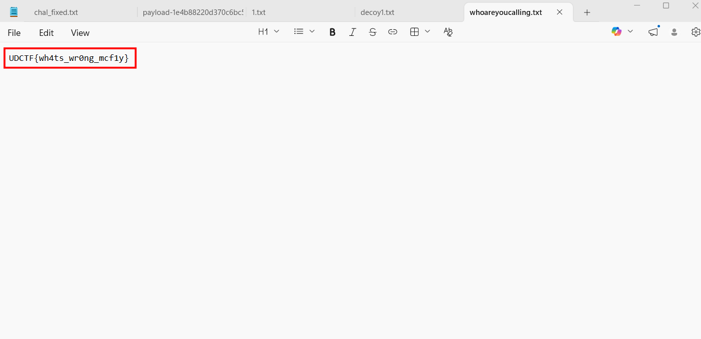

# Name Calling

## Description

I think someone called you chicken. You should do something about it

## Given artifacts

A packet capture file

## Solving process

Skimming through the hierarchy, the amount of data transferred as images stands out:

Let's export HTTP objects to see what are being sent, we get a zip file that need password to unzip, and an image named chicken, based on the problem name, this image worth inspecting:

Run `exiftool` on it yields a suspicious hex string:

Decode it with cyberchef, this seems to be the unzipping password:

Decompress the file, got the flag:

`Flag: UDCTF{wh4ts_wr0ng_mcf1y}`