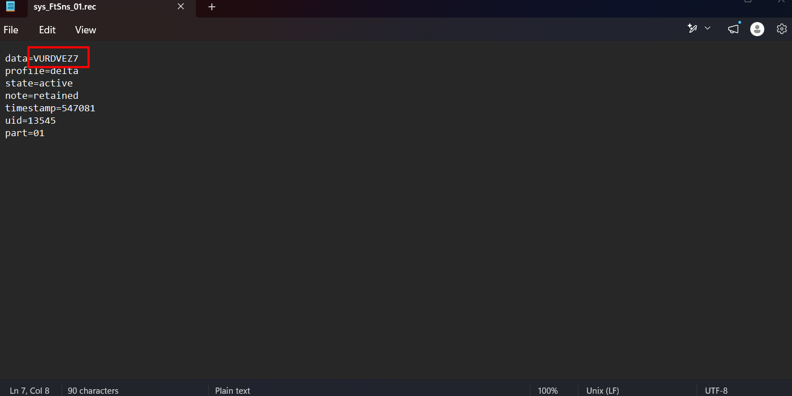
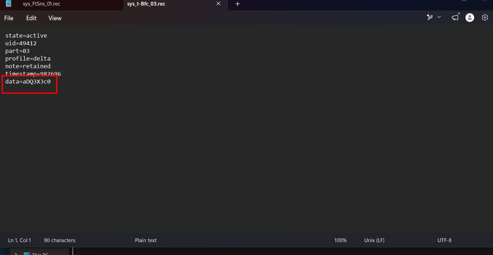
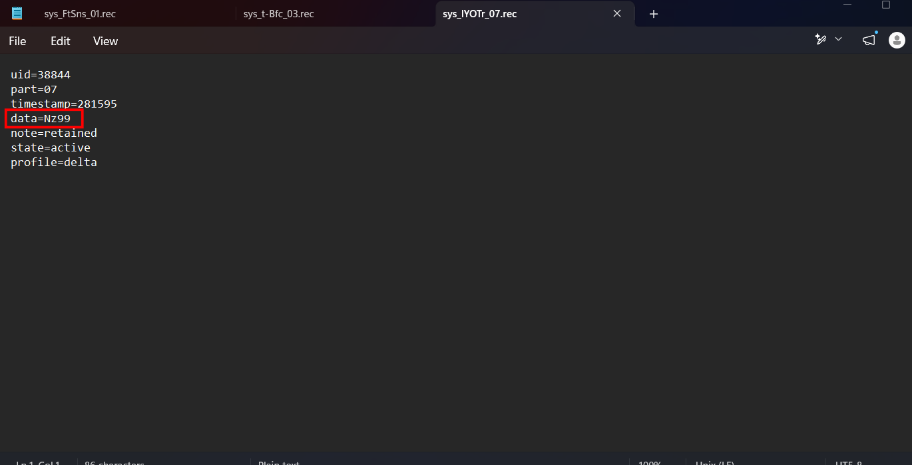
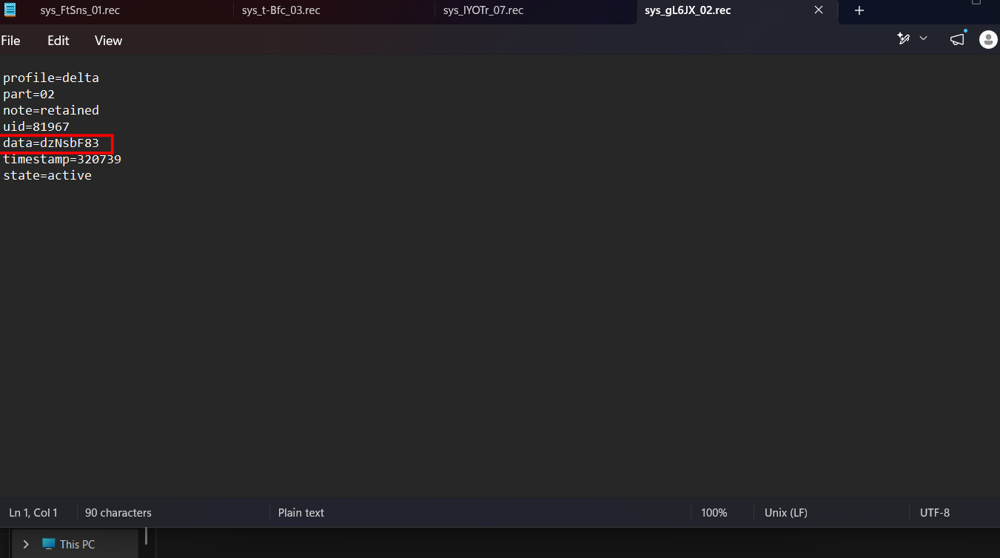
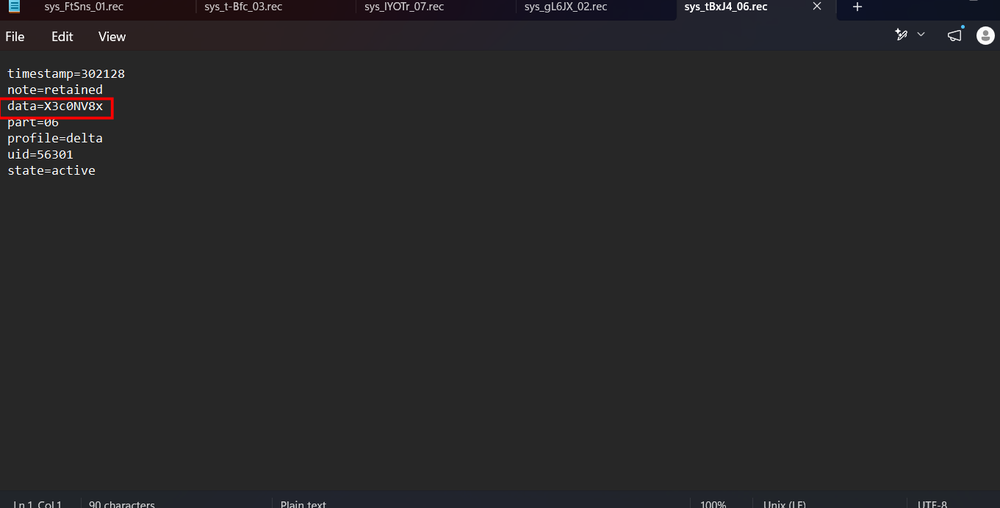
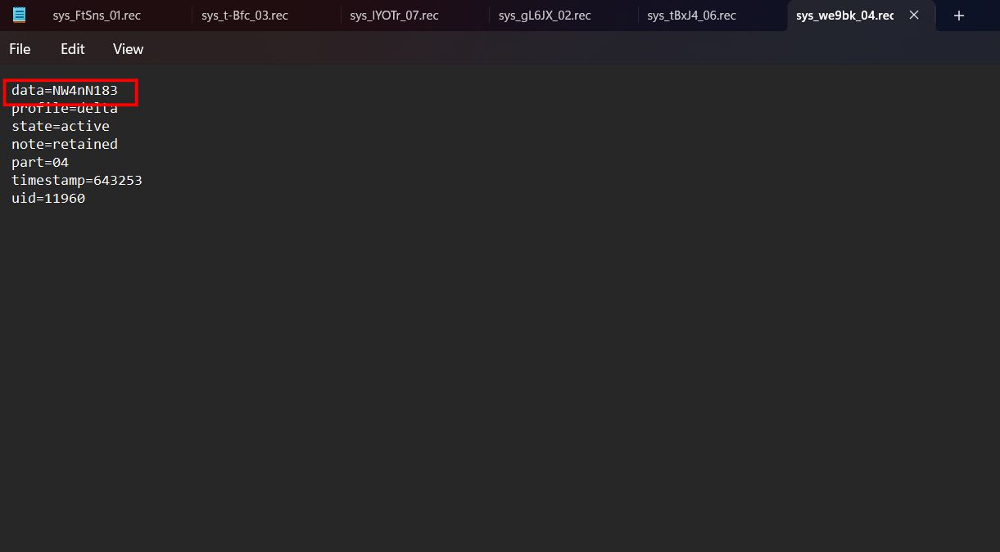
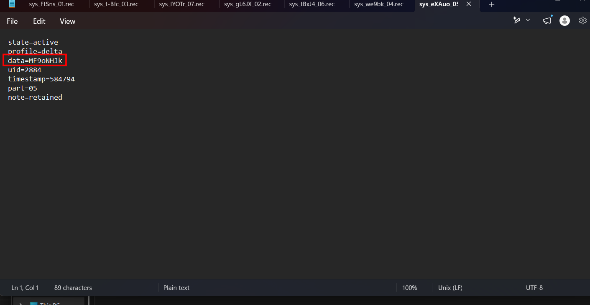
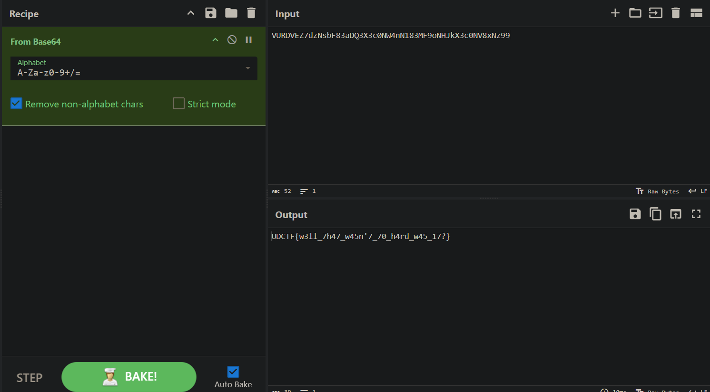

# awk...warddd

## Scenario

We recovered a directory from a misconfigured archive job. Most of the contents appear to be redundant or stale, but a few records still reflect the system’s original processing format. Focus on what remains consistent.

## Given artifact

A directory named 'sorry in advance'

## Solving processs

We are put in around 10000 files with gibberish name, anyway do not expect for some lessons from these competition, no attack chain, no real forensics, just shitty challenges...

Note some file contain a fake flag, but we only pay attention to real files: files with pattern `sys.XXXX.NN.rec`, where NN is its part. Find for them in all sub-folder.

In users:

In tmp:

In logs:

In archives:

Putting all together:

`Flag: UDCTF{w3ll_7h47_w45n'7_70_h4rd_w45_17?}`