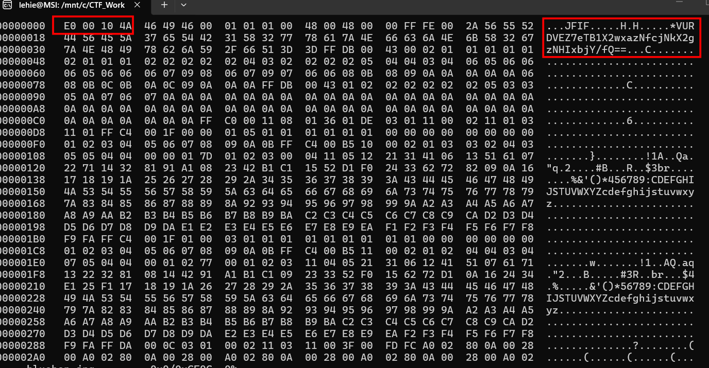
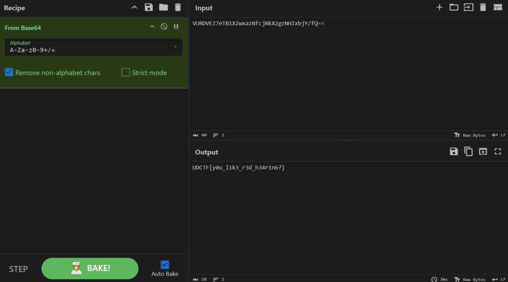

# red-hear-ing

## Scenario 

Use all the skills you know about stegonagraphy...

## Given artifact

A corrupted JPG image

## Solving process



1. Inspected the file. file bluehen.jpg reported data instead of JPEG — the magic bytes were stripped. The header started at E0 00 10 4A 46 49 46… instead of the required FF D8 FF E0 00 10 4A 46 49 46….
2. Repaired it by prepending the missing 3 bytes FF D8 FF. The file then decoded as a valid JPEG of the UDel Blue Hen mascot (478×310).
3. Spotted a JPEG comment segment (FF FE, marker COM) immediately after the JFIF header, length 0x2A = 42 bytes, containing:

```text
VURDVEZ7eTB1X2wxazNfcjNkX2gzNHIxbjY/fQ==
```

Base64-decode it:



Verified nothing else was hidden. Walked the whole JPEG segment-by-segment (only one COM segment, no APP1/EXIF, no extra markers), confirmed zero trailing bytes after the FF D9 EOI, and ran steghide/outguess with empty + common passwords (bluehen, udel, udctf, delaware, redherring, etc.) — no extractions.

`Flag: UDCTF{y0u_l1k3_r3d_h34r1n6?}`