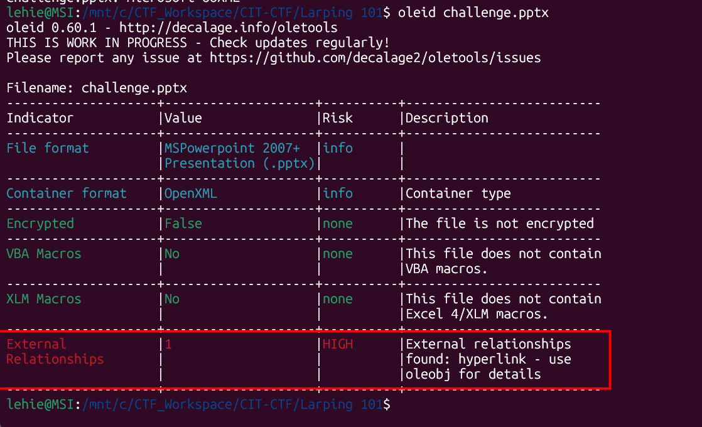
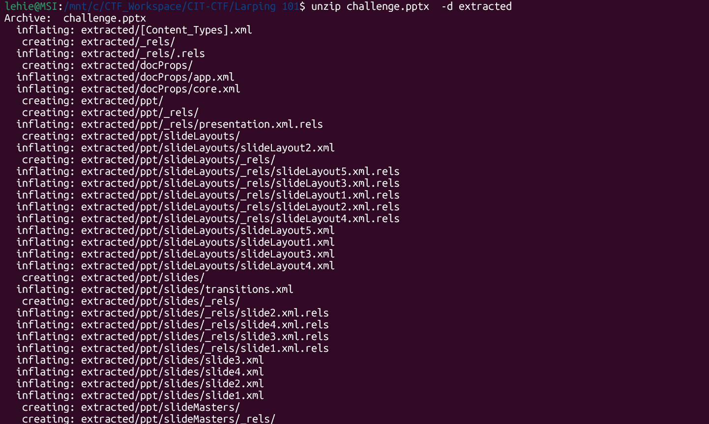
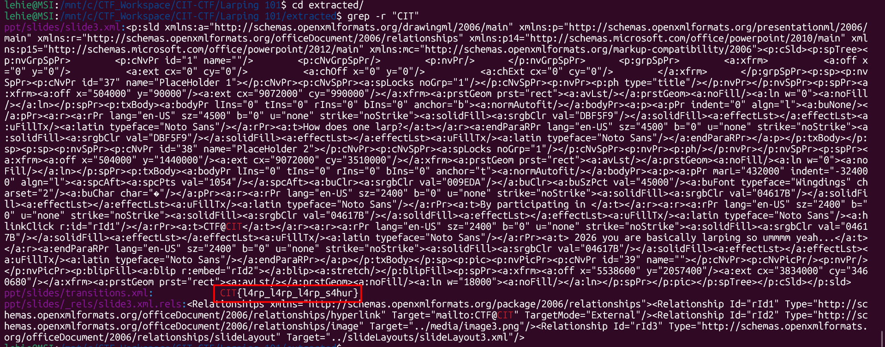

# Larping 101

## Scenario

To larp, one must become the larper..

What do you think of my presentation? It feels like it might be missing something so maybe you can tell me what it is?

## Given artifacts

A Powerpoint Presentation file

## Solving process

Whenever I encounter a MS office artifact, I use oletools, as this is not the familiar Word document, I run `oleid` first to get an overview:

But when open the slide, it's false positive, just a link to a fake email. But note that modern Office file is indeed a zip file containing many components, so let's unzip it:

Knowing the flag format, I use grep trick:

Got the flag, nothing to learn.

`Flag: CIT{l4rp_l4rp_l4rp_s4hur}`