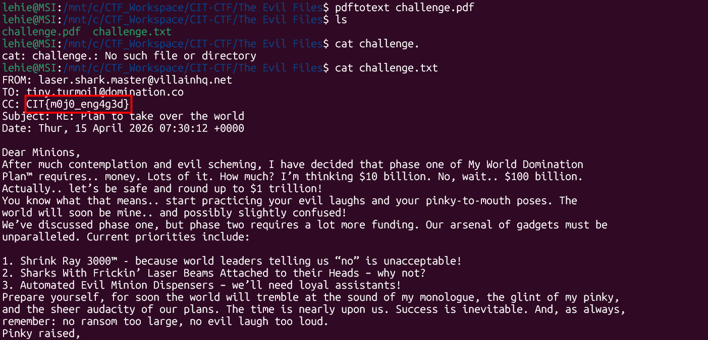

# The Evil Files

## Scenario

Dr. Evil be dreamin and schemin

## Given artifact

A pdf document file with redacted text

## Solve

It may be redacted, but the text is still behind the black bar, just use `pdftotext` to convert it to a text file:

Got the flag, nothing to learn

`Flag: CIT{m0j0_eng4g3d}`