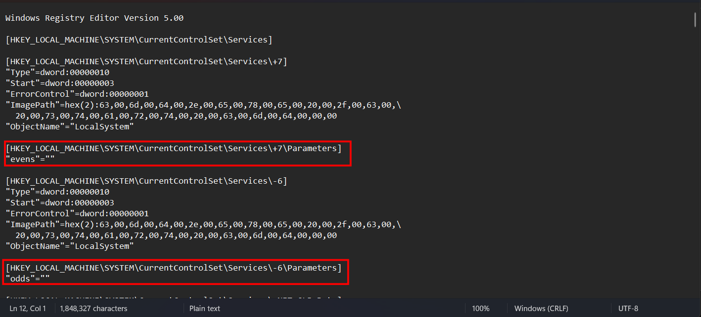
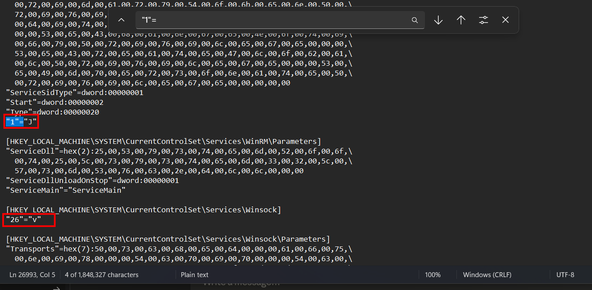
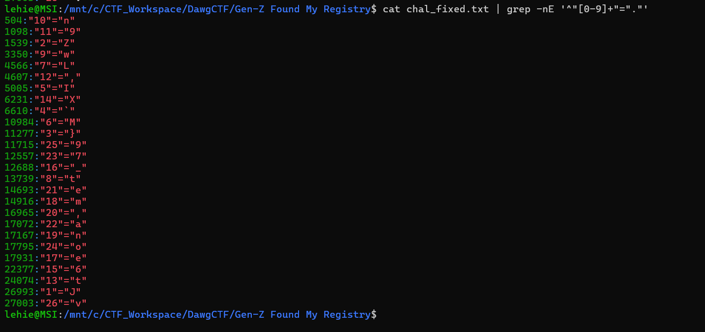
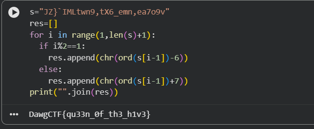

# Gen Z found my registry

## Scenario

I recently got pwned while playing Fortnite, a kid in a Tung Tung Tung Sahur skin epically pwned me with a fake epic link! He joined my party and said he was gonna turn my registry into String Cheese! I thought he meant swiss cheese, but I suppose its some of that new Gen-Z slang... Can you help me find all the changes he made to my registry?

## Given artifact

A registration entries file, essentially a text file and can be opened with standard text editor

## Solving process

First we should notice that it is UTF-16LE encoded, so run this to make it more convenient in further analysis:

```bash
iconv -f UTF-16LE -t UTF-8 chal.reg > chal_fixed.txt
```

Then now we can inspect it with notepad at ease, registry is a good place for persistence, but for these challenges, we should not be that serious. It will try to trick us somewhere only

After a while, I notice these two weird entries:



Some hints are given here, odd minus 6, even add 7, hmm...

Then I see these patterns:



It spans from 1 to 26, that is exactly what the hint tells us to do : shift right 7 characters at even indices, shift left 6 characters at odd indices. Let's grab all of them:



Use more CLI kung-fu to retrieve the scattered character in order:

```bash
cat chal_fixed.txt | grep -nE '^"[0-9]+"="."' | cut -d ":" -f 2 | sort -t '"' -k2,2n | cut -d '"' -f 4 | tr -d '\n'
```

The returned strings is **JZ}`IMLtwn9,tX6_emn,ea7o9v**

Then I use a simple python script to apply the shift:



Got the flag!

`Flag: DawgCTF{qu33n_0f_th3_h1v3}`