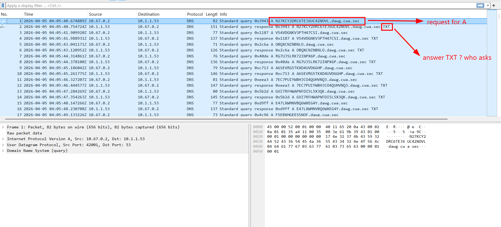
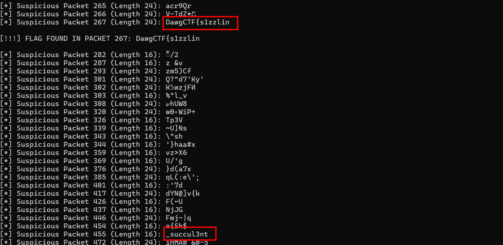
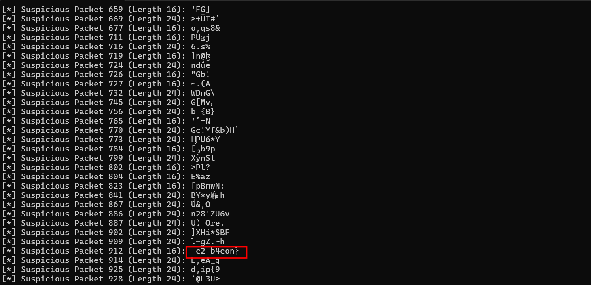

# I Love Bacon!

## Scenario:

Our company network was recently compromised, and in the process of remediating it, we noticed some suspicious DNS request activity. We created a capture and isolated the DNS requests to the C2, but we aren't sure what exactly they did. Can you help us find any suspicious packets?

## Given artifacts:

A packet capture file.

## Solving process:



The moment I open the packet capture file, obvious red flag catches my eyes. This is inherently DNS tunneling, let's use tshark to extract all the payload before we try to figure out what kind of encoding is applied, run `tshark -r dns_c2.pcap -Y "dns.flags.response == 0" -T fields -e dns.qry.name > queries.txt` and `tshark -r dns_c2.pcap -Y "dns.flags.response == 1" -T fields -e dns.txt > responses.txt` to extract the requests and TXT records to two text file.

Honestly, with the guide of LLM and the challenge's name, I thought this is related to Bacon cipher, so I came up with some 'creative' idea of replace letters by A, digits by B and vice versa and apply Bacon cipher decode, but well, the output is gibberish.

Return to the challenge's description, I realize that they ask us to find "suspicious packets", that means only some packets hold the flag ?. The pattern is clearly base32, so I use a python script (with the help of LLM) to decode the payload line by line:

```python
import base64

def decode_line_by_line(filename, is_queries=True):
    with open(filename, 'r') as f:
        for i, line in enumerate(f):
            if is_queries:
                chunk = line.split('.')[0].strip()
            else:
                chunk = line.strip()
                
            if not chunk:
                continue
                
            padding_needed = len(chunk) % 8
            if padding_needed != 0:
                chunk += "=" * (8 - padding_needed)
                
            try:
                decoded_bytes = base64.b32decode(chunk)
                text = decoded_bytes.decode('utf-8', errors='ignore')
                
                if len(text) > 3 and text.isprintable():
                    print(f"[*] Suspicious Packet {i+1} (Length {len(chunk)}): {text}")
                    
                if "Dawg" in text or "CTF" in text:
                    print(f"\n[!!!] FLAG FOUND IN PACKET {i+1}: {text}\n")
                    
            except Exception:
                pass

decode_line_by_line('queries.txt', is_queries=True)
decode_line_by_line('responses.txt', is_queries=False)
```





Successfully retrieve the flag, this challenge is not so interesting, no new knowledge, and impractical...


`Flag: DawgCTF{s1zzlin_succul3nt_c2_b4con}`