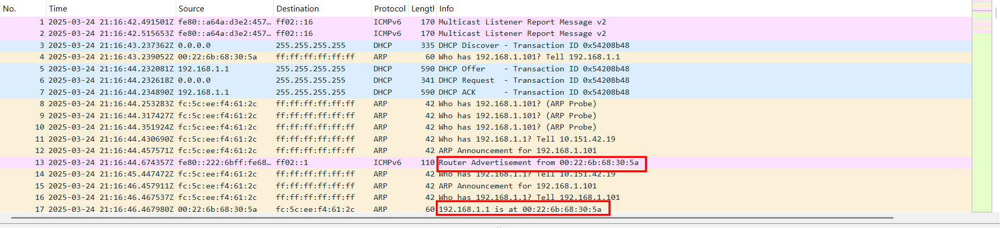
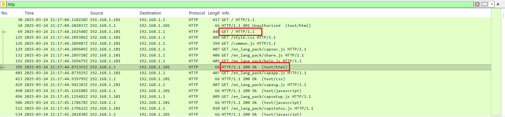
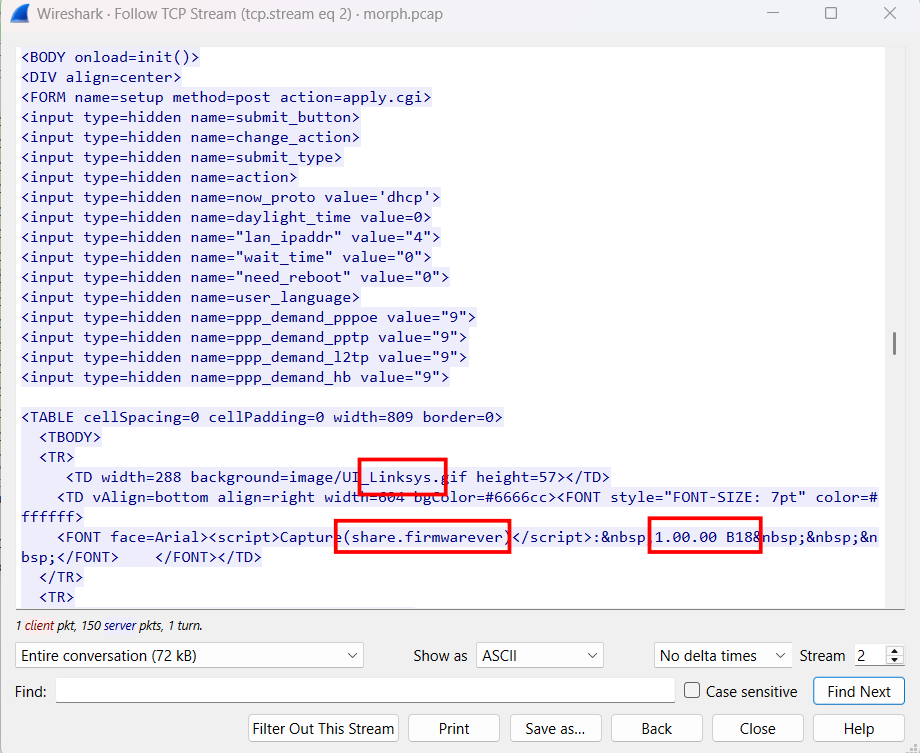
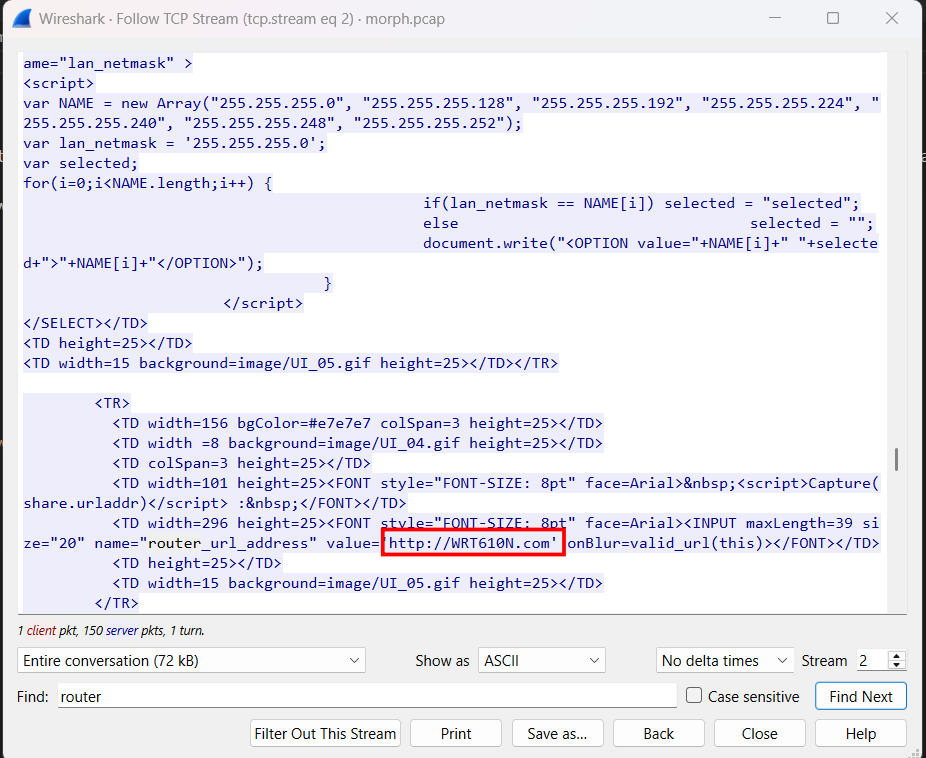
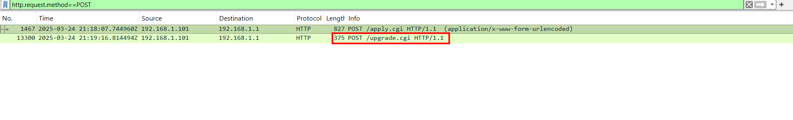
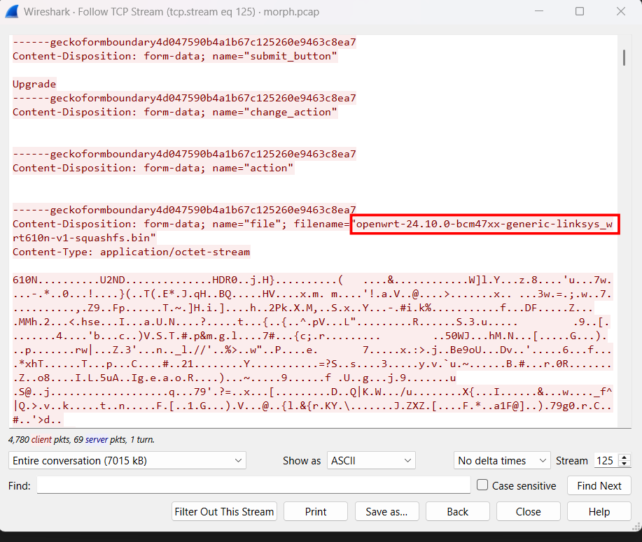

# Modem Metamorphosis

## Scenario

Such a sad little router, assumed obsolete, cast-off and condemned to the dusty scrap heap... but who says this must be the end? Come with us, and we'll transform you into something beautiful~
Flag format: DawgCTF{Manufacturer_Model_OldFirmwareVersion_NewFirmwareName_NewFirmwareVersion}

## Given artifacts

A packet capture file

## Solving process

From the scenario, specifically "obsolete router", "transform into something beautiful", we can deduce that this challenge involves upgrading ROM (Flash Firmware). Some 'beautiful' name for that upgrade could be open-source operating system like OpenWRT, DD-WRT, Tomato, pfSense... Let's have a look at the pcap file:

From these packets, we can be quite sure that `192.168.1.1` is the IP address of the router, and the one possible approaching it for upgrade is the new device that just joins the network, we can see the DORA process of it asking for an IP from the DHCP server, which is also the router.

For this specific challenge, we will need to find some information from this upgrading process. First I will list some ways a router can be "transformed":

1. Through Web GUI: user (or hacker ?!) downloads a `.bin` file (the whole OS is compressed inside this) from the internet, then signs in and uploads this file onto the administrator web of the router. For obsolete router like in this challenge, file is transmitted through plaintext with HTTP port 80, but for recent one, HTTPS is supported, and no Man-in-The-Middle attack could easily be conducted by intercepting the packet and modify the `.bin` file.

2. Over-The-Air/Cloud Update: for modern Mesh Router or Smart Router that can be managed from smartphone, user hardly has to manually upload the file, router will call back to the cloud server itself, and get patches through safe HTTPS channel, then restarting.

3. Through TFPT: in case the router's OS is down (brick), we cannot access the admin panel through HTTP, user will need to plug the LAN wire directly into the router, use TFPT server in his computer to force the router to receive and overwrite the ROM file.

For this sad little router, all the mentioned process is done through the plain HTTP network, we will inspect it to get what we need for the flag.

Filter for HTTP only, the response for the root page of that router's admin panel would contain almost every information about the 'old' firmware, we will need to pay close attention, as the response is very, very long:

Great! We kill two birds with one stone here, the manufacturer is `Linksys`, in fact, cyber TAN from Taiwan is responsible for producing, assembling the hardware and writing core firmware for this router, but Linksys buys hardware from CyberTAN and add this HTTP web interface, packages them and sell, so the manufacturer is allegedly Linksys. What's more, the `share.firmwarever` variable holds the `OldFirmwareVersion` value: `1.00.00 B18`. It's truly obsolete!

Now we need to find `Model`, usually, it should stand near Router word in a web page, so I try to look for it, not as I expected, but I still find it in a different way:

In the past, brands like TP-Link, Linksys,... often configure in advance a `Local Domain Name` with the same name as `Model`, so user does not need to type the IP to access the admin page.

Continue to inspect the HTTP packes, now we need to gain information about the new firmware being installed, let's narrow down to POST request:

Exactly here, the `bin` file that is uploaded to install on the router, let's follow that stream and find for the file name:

Done, the new firmware is OpenWRT as expected, and is follwed by the its version

`Flag: DawgCTF{Linksys_WRT610N_1.00.00_B18_openwrt_24.10.0}`