# APTV3R4_STRIKES_AGAIN

## Scenario

Help! One of our club’s computers was breached. Somehow the APT got hold of the keyfile needed to decrypt our secret flag, but they still couldn’t find the encrypted file. Funny thing is, our flag vault keeps it open in the background. Can you help the APT finish the job?

## Given artifact

A packet capture file

## Solving process

Initial inspection of the protocol hierarchy shows the dominance of UDP, and the presence of TLS also suggests we may need some decryption:

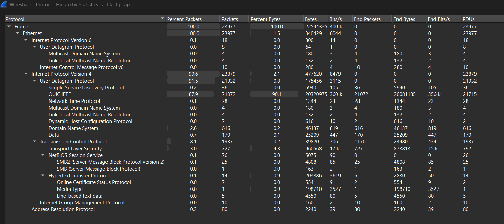

Note that there are few HTTP packets, they are easier to investigate, so let's give them a look:

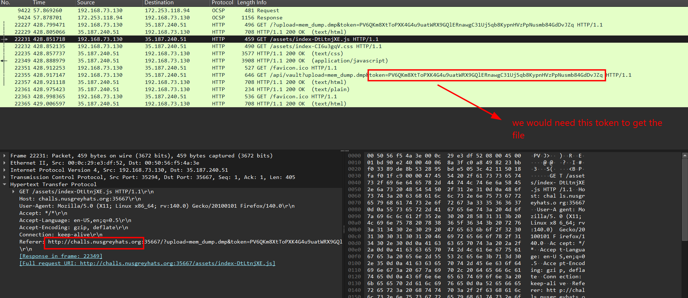

The site also resolves to our given instance - `35.187.240.51:35667`, note the token, as according to the home page of that site, we need it to download artifact:

```json
Qn = {
  title: "Vera's Super Secret File Vaults",
  intro: "Hi, this is where I store my illegally pirated movies, games, and other cool stuff. I modeled this site after secure Swiss banks, so only someone with the correct token can access my stuff.",
  upload: {
    body: "The upload feature is UNDER MAINTENANCE and DOES NOT work.",
    format: "<site>/?upload=<filename>&token=<token>"
  },
  download: {
    body: "To download a file, provide the filename in the download parameter and include the same 67-character token in the token parameter. A dummy file named test.txt is available for testing.",
    format: "<site>/?download=<filename>&token=<token>",
    fallbackFormat: "<site>/api/vault?download=<filename>&token=<token>"
  }
}
```

Well, I use my browser to get that file, but it appears to be a Linux dump, damn, were it Windows dump, volatility would have handled it seamlessly. I'm sick of building linux profile, the `banners.Banners` command also returns a very recent Kali linux version, which makes the process of building symbol table troublesome, let alone the profile. In fact, I already tried, but up to now I cannot use volatility on that dump. Let's leave it behind for a while.

When struggling with the dump, I look at the protocol hierarchy again and realize that I omitted a candidate: the SMB protocol. After filtering for 'SMB or SMB2' in wireshark, I also see the NTLMSSP authentication happened. Let's first unpack the NTLMv2 Authentication Mechanism:

> ### NTLMv2 Authentication Mechanism
> 
> NTLMv2 is a challenge-response authentication protocol. The client proves knowledge of the user's password to the server without transmitting the plaintext password or the raw hash over the network:
> 
> 1. **Negotiation**: The client initiates the session via an `NTLMSSP_NEGOTIATE` request.
> 2. **Server Challenge**: The server replies with an `NTLMSSP_CHALLENGE` containing a random 8-byte **Server Challenge** (e.g. `de4223bdc2c58d00`). This ensures that each login session is cryptographically unique and protects against replay attacks.
> 3. **Client Challenge & Proof Generation**: The client receives the server challenge and calculates the proof as follows:
>    - **Derive raw NT Hash**: The client hashes the password:
>      $$\text{NT Hash} = \text{MD4}(\text{UTF-16LE}(\text{password}))$$
>    - **Derive NTLMv2 Hash**: The client generates a salted key by hashing the username (in uppercase) and domain name (in uppercase) using HMAC-MD5 keyed with the NT Hash:
>      $$\text{NTLMv2 Hash} = \text{HMAC-MD5}_{\text{NT Hash}}(\text{Username} + \text{Domain})$$
>    - **Construct Client Challenge (Blob)**: The client generates its own random bytes (often referred to as the `temp` or `blob` structure). This Client Challenge contains a timestamp (to prevent replay), a random client challenge nonce, and target information blocks.
>    - **Compute NTProofStr**: The client concatenates the Server Challenge and Client Challenge, and hashes them using HMAC-MD5 keyed with the NTLMv2 Hash:
>      $$\text{NTProofStr} = \text{HMAC-MD5}_{\text{NTLMv2 Hash}}(\text{Server Challenge} + \text{Client Challenge})$$
> 4. **Authentication**: The client sends the `NTProofStr` (16 bytes) concatenated with the `Client Challenge` (the rest of the blob) inside the `NTLMSSP_AUTHENTICATE` packet. The server performs the same calculation; if its calculated `NTProofStr` matches the client's, authentication succeeds.
> 
> **Why CrackStation cannot crack NetNTLMv2 hashes:**
> CrackStation only supports static hashes (like MD5 or raw NT/NTLM hashes) where a password always hashes to the same value. Because the NetNTLMv2 response depends on dynamic random variables generated during authentication (the Server Challenge and Client Challenge), a lookup table cannot precompute all combinations. Therefore, you must use dynamic offline tools like Hashcat (mode `5600`) or John the Ripper (format `netntlmv2`) to test candidate passwords against the session-specific challenges on-the-fly.

Back to our artifact, look at this image, packet 8036 is where the client tells the server that it wants to authenticate using NTLMSSP, then in frame 8038, server sends back the Server's Challenge:

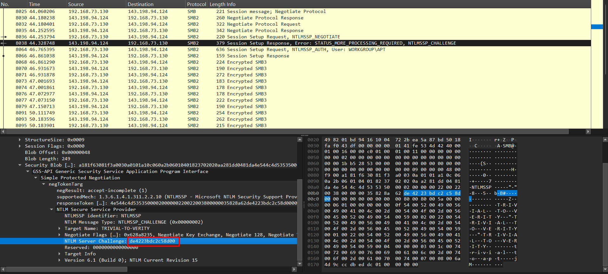

Then the server perform the math itself, sending back the NTLMv2 response in frame 8064:

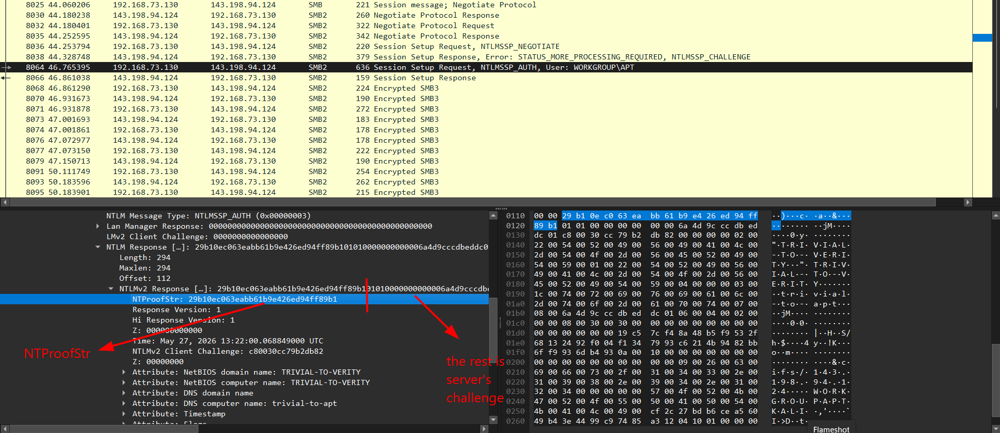

My bad on the description, the sequence after the NTProofString should be client's challenge. Now let John the ripper do the heavy math for us, just make sure to provide him with enough information to reverse the mechanism:

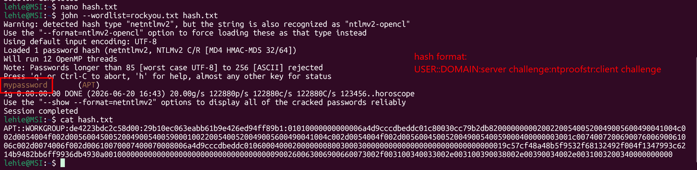

Great! Having password, let's decrypt the encrypted SMB traffic, Wireshark will handle the hard part for us, we just need to provide the plaintext password:

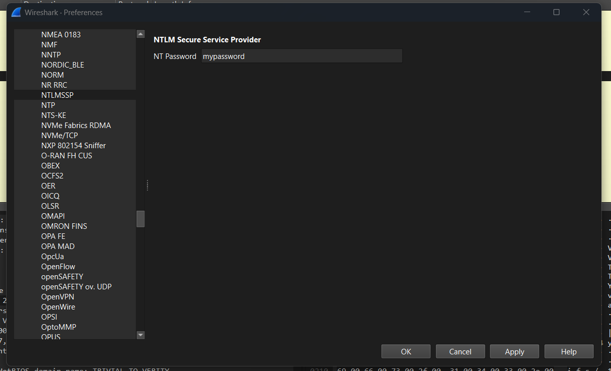

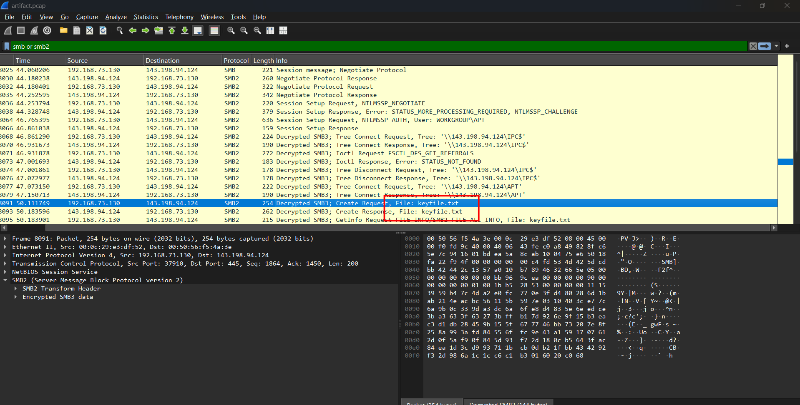

So there is a `keyfile.txt` here, I will export it:

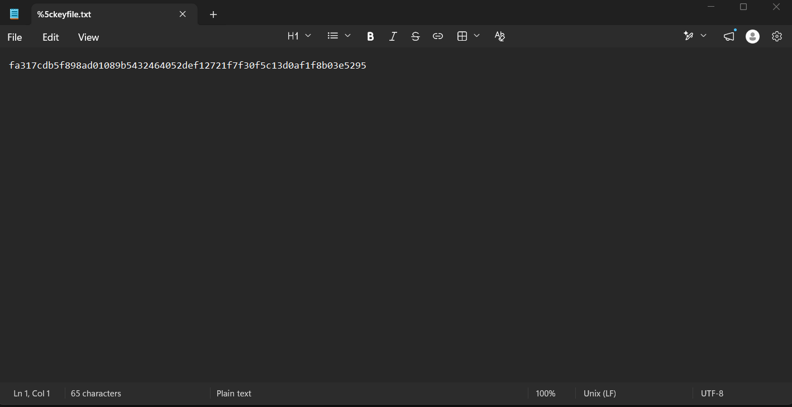

Alright, seems to be a decryption key for something that we will need later, but now we need to tackle the dump file, volatility says the banners is `linux-6.19.14+kali-amd64`, this is very new (at the time I make this write-up), no public repo has it symbol table already, so I have to construct myself, what's more, even after attaining the symbol table, some mismatches still make vol throw its hands up, you may read about that process below

> ### Volatility 3 Custom Symbol Table & Debugging Stacking Crash
> 
> Because this memory dump was captured from a recent Kali Linux system (`kernel-6.19.14+kali-amd64`), there were no pre-built symbol tables available. I constructed the symbol table using `dwarf2json` against the kernel debug symbols:
> 
> 1. **Generating Symbols**: Compiled the symbols to JSON and compressed them to `linux-6.19.14+kali-amd64.json.xz`, placing the file in Volatility's Linux symbols path.
> 2. **The Stacking Crash**: When attempting to run Volatility, the primary physical-to-virtual memory translation layers failed to stack (`primary` and `IntelLayer` were unsatisfied). Debugging Volatility revealed a silent error during automagic stacking:
>    `ValueError: Symbol type not in debug_table SymbolTable: module_sect_attr`
>    Volatility 3's Linux framework expects the type override `module_sect_attr` to be present, but due to Kali kernel package compilation options, this structure was optimized out and missing from the JSON symbol table.
> 3. **The Patch**: I manually injected the structure definition for `module_sect_attr` (size 64, with fields `address` at offset 56 and `battr` at offset 0) into the `user_types` dictionary of the JSON symbol table.
> 4. **Clearing Cache**: Cleared the Volatility cache folder at `~/.cache/volatility3` to force it to re-parse the patched symbols.
> 
> With the missing structure injected, Volatility 3 loaded the symbol table and stacked the translation layers successfully.

Now that vol works, I use `linux.pslist.PsList` to see what is happening, almost every process is system processes, and `modprobe`, used to dump this very file. AT the end of the list, I see `python3` here, this is a red flag, a normal user won't have this:

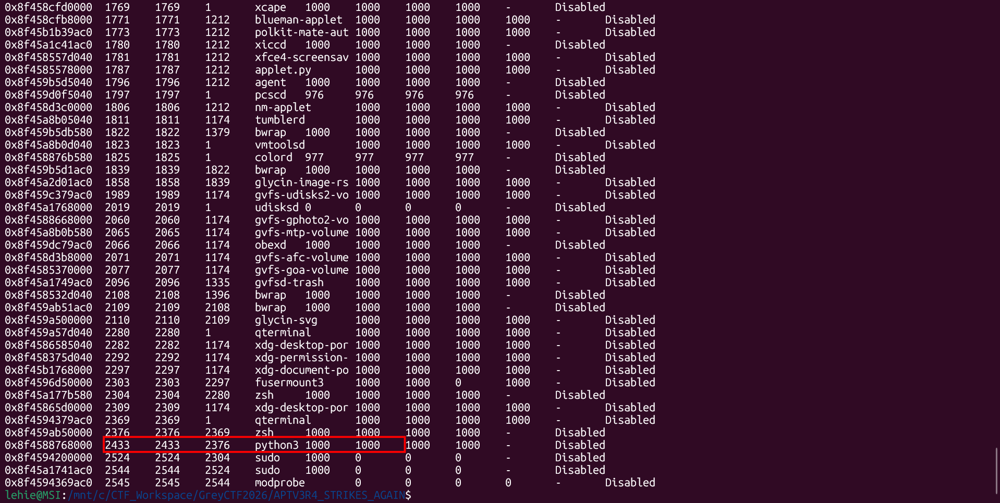

Then I use `linux.psaux.PsAux` to see which command fires this process:

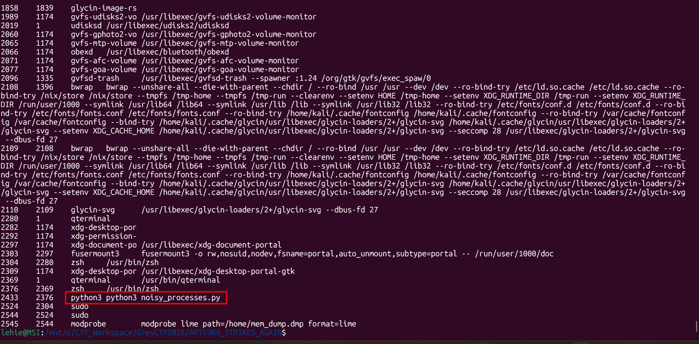

Alright, let's use `linux.pagecache.Files` and grep for that file name:

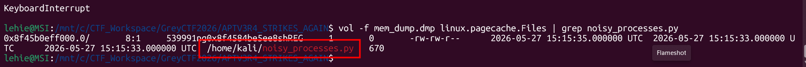

But somehow I cannot carve that file normally like in windows plugins; they all come up empty. Looking closely at the output from `linux.pagecache.Files`, the `CachedPages` count for `/home/kali/noisy_processes.py` was `0` (even though `InodePages` was `1` based on its size of 670 bytes). Since the process had already read and compiled the script into bytecode, the OS kernel evicted/unmapped the source file's pages from the active page cache under memory pressure. Because the page cache was empty, Volatility had no active memory pages to dump, resulting in a 0-byte file.

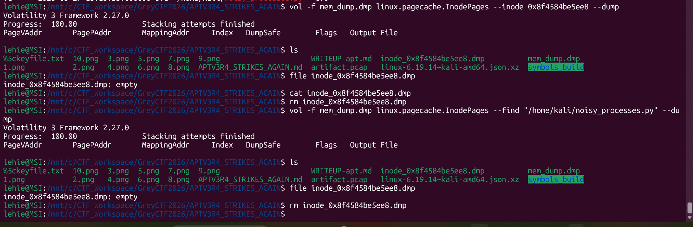

Well, we now have no way but to return to strings-grep, I first assume that the file's content will follow its name somewhere in the dump, so I run this, use `-t d` to print the location in decimal so that later we can pass it into `dd` without having to convert base, and I also use -A and -B in grep command to print extra context:

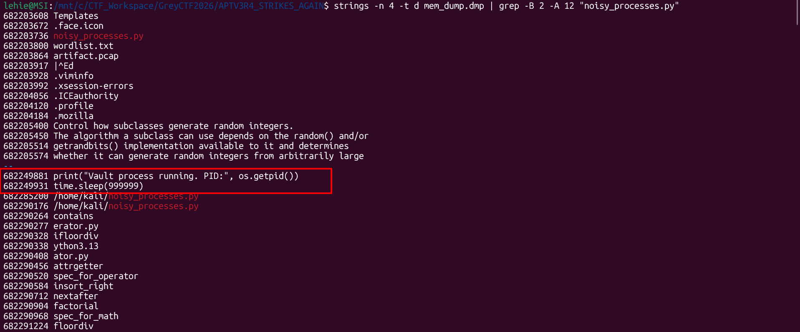

Great, it works, this seems to be the end of that script, the vol's `linux.pagecaches.Files` output already tells us that the file's length is 670 bytes, but I goes back 1000 bytes to be sure:

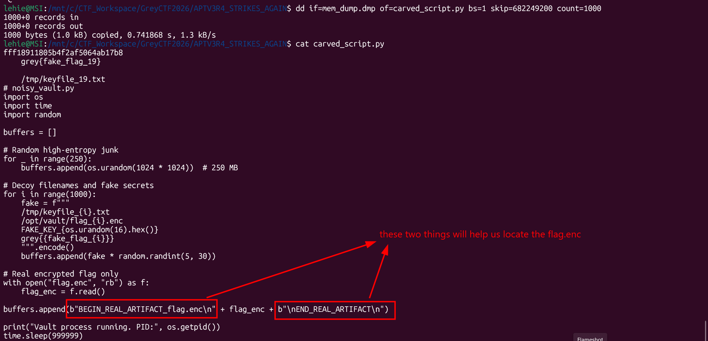

This script appends a lot of garbage strings and fake flag into the buffer, and the real encrypted flag is sandwiched by two marker, I will use those markers to grep for the offset, then we use `dd` again:

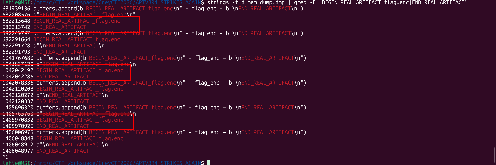

I think any of them would be ok, so I try the first result: `dd if=mem_dump.dmp of=flag_enc bs=1 skip=682213677 count=64`:

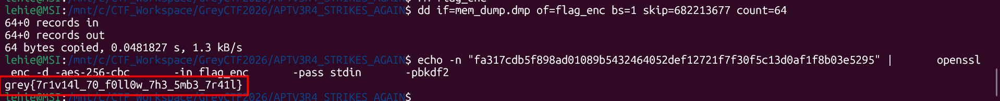

Checking the first few bytes of the carved `flag_enc` file, I see the ASCII magic bytes `Salted__`  (hex: 53 61 6c 74 65 64 5f 5f ). This header indicates the file was encrypted using standard OpenSSL symmetric encryption (specifically AES-256-CBC with PBKDF2 key derivation).The passphrase is the literal 64-character hex string from the SMB keyfile we recovered earlier: `fa317cdb5f898ad01089b5432464052def12721f7f30f5c13d0af1f8b03e5295`, so I decrypt them to get the flag.

`Flag: grey{7r1v14l_70_f0ll0w_7h3_5mb3_7r41l}`