# Crime Watch

## Scenario

silent mode...

## Given artifacts

Two QCOW images, one of them seems to be encrypted, and a checker `flag.py`

## Solving process

Looking at `flag.py`, we need to answer these questions to reconstruct the flag:

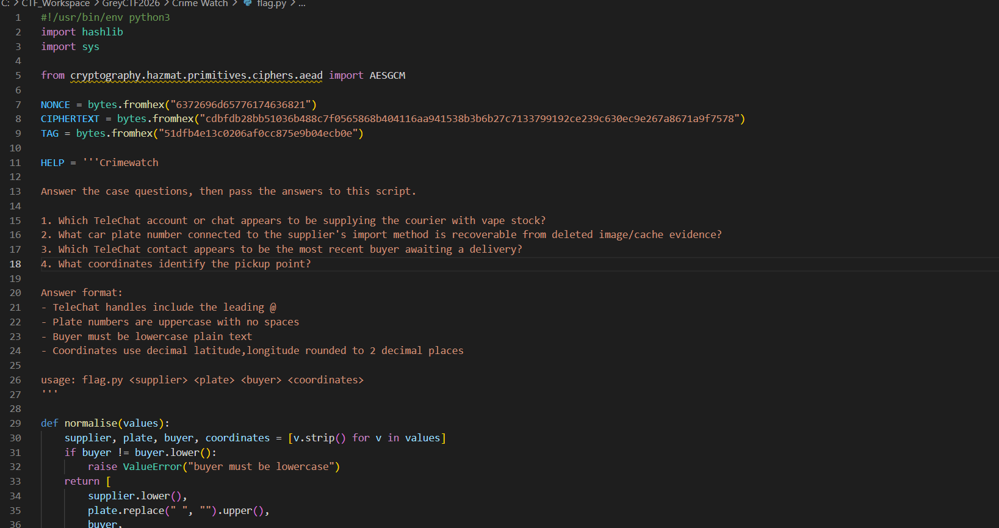

The fact that it's encrypted using AES-GCM is a luxury to us, as GCM uses authentication with a check tag at the end of the ciphertext. If decryption goes wrong, it raises an error rather than outputting garbage.

---

> [!NOTE]
> ### Foundational Knowledge: Virtual Hard Drives (QCOW2)
> * **The Concept:** `a` and `b` are QCOW2 (QEMU Copy-On-Write) files.
> * **The Intuition:** Think of a QCOW2 file as a physical hard drive packed into a single file on your host machine. To look inside it, we have to "plug it in" to our operating system as a virtual block device (using `qemu-nbd`, which stands for Network Block Device).

> [!NOTE]
> ### Foundational Knowledge: Android's Two Layers of Encryption
> Modern Android devices secure user data by using two separate layers of encryption:
> #### Layer 1: Metadata Encryption (`dm-crypt`)
> * **The Concept:** This encrypts the filesystem structure (directory layouts, file sizes, permissions).
> * **The Intuition:** Standard encrypted drives (like BitLocker on Windows or LUKS on Linux) leave a signature header at the very beginning of the drive so the OS knows it is encrypted. Android's metadata encryption does not have headers. Every single block from byte `0` looks like pure random noise. The keys to unlock this layer are stored on a separate metadata partition (`b`).
> #### Layer 2: File-Based Encryption (FBE)
> * **The Concept:** Individual file names and file contents are encrypted using separate keys.
> * **The Intuition:** When your phone boots up, it needs to run some apps (like the alarm clock or incoming call screen) before you type in your PIN. FBE divides storage into:
>   * **DE (Device Encrypted):** Accessible as soon as the device boots.
>   * **CE (Credential Encrypted):** Only accessible after the user enters their lock screen credentials (PIN/pattern/password).

> [!NOTE]
> ### Foundational Knowledge: Key Wrapping & Software Keymaster
> * **The Concept:** You cannot store the keys that decrypt your drive in plain text on the drive itself. They must be encrypted ("wrapped") by another key.
> * **The Intuition:** On a physical phone, the wrapping key is burned into a hardware security chip (the TEE or Secure Enclave). On an Android emulator, there is no hardware chip, so it simulates this using Software Keymaster, storing the master wrapping key in cleartext inside a key blob.
> * **Additionally,** because this emulator did not have a lock screen password, it used `"nopassword"` stretching, meaning we don't have to brute-force a PIN.

> [!NOTE]
> ### Foundational Knowledge: Cryptographic Primitives (Math Intuition)
> You will encounter three cryptographic algorithms:
> * **AES-GCM (Authenticated Encryption):** Used to wrap/unwrap the encryption keys.
>   * *Intuition:* Unlike basic encryption, GCM is authenticated. It produces a Tag (checksum). If you decrypt with the wrong key, the decryption script throws an error rather than outputting garbage. This is a perfect "oracle"—if the code runs without error, your key is 100% correct.
> * **AES-XTS (Disk Encryption):** Used for encrypting raw sectors of the drive.
>   * *Intuition:* If you write the word "Hello" at block 0 and block 100, you don't want them to look identical on disk. XTS uses a tweak (usually based on the sector number) to ensure the same plaintext looks different depending on where it is written on the drive.
> * **HKDF (HMAC-based Key Derivation):**
>   * *Intuition:* A factory that takes one master key and "stretches" it to make many unique sub-keys (e.g., one unique key per file). If a hacker gets the key for one file, they cannot use it to figure out the master key or other files' keys.

---

`b` is the one holding the keys. I first convert it to a raw disk to open in FTK Imager, as mounting in WSL is more troublesome:

```powershell
qemu-img convert -O raw b b.raw
```

Once inside `b.raw`, locate `/vold/metadata_encryption/key/` then export both the encrypted key and the keymaster blob:

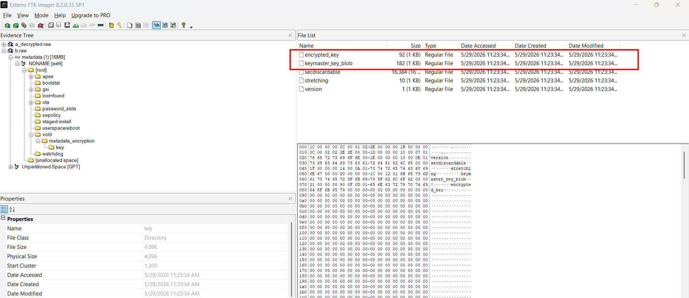

Before we write the script, here is the structure of these files and how we are going to decrypt them:

* **`keymaster_key_blob` (182 bytes):**
  In a real Android phone, the keymaster key is securely stashed inside the hardware secure enclave. But because this is an emulator, the software keymaster simply serializes the key inside this blob.
  * The first byte `00` is a version header.
  * The next four bytes `20 00 00 00` represent the key length in little-endian (`0x20` in hex = 32 bytes).
  * The next 32 bytes (`keymaster_key_blob[5:37]`) are the raw, unencrypted AES-256 wrapping key.

* **`encrypted_key` (92 bytes):**
  This is the master key for the `/data` partition, encrypted with the wrapping key using AES-GCM. An AES-GCM payload has three parts:
  1. **IV (Initialization Vector):** The first 12 bytes.
  2. **Ciphertext:** The middle 64 bytes.
  3. **Authentication Tag:** The last 16 bytes.

Now we will decrypt the metadata key:

```python
from cryptography.hazmat.primitives.ciphers.aead import AESGCM

with open("keymaster_key_blob", "rb") as f:
    blob=f.read()

with open("encrypted_key", "rb") as f:
    enc_key=f.read()

wrapping_key = blob[5:37] # first byte is version header, next 4 bytes are key length in little-endian

iv=enc_key[:12]
cipher_with_tag=enc_key[12:] # aesgcm in cryptography library expects the tag to be appended to the ciphertext

aesgcm = AESGCM(wrapping_key)
decrypted_datakey = aesgcm.decrypt(iv, cipher_with_tag, None)

with open("datakey.bin", "wb") as f:
    f.write(decrypted_datakey)
```

Now that we have the decrypted `datakey.bin`, let's start decrypting `a`. But first, as with `b`, I convert it to `a.raw`, a raw disk image.

---

> [!NOTE]
> ### Foundational Knowledge: Decrypting AES-XTS with `iv_large_sectors`
> #### Why AES-XTS?
> AES-XTS is the standard algorithm for disk encryption. It takes a 64-byte key (which it splits into two 32-byte keys internally) and decrypts the disk block-by-block.
> #### What is the Tweak (IV)?
> To prevent two identical blocks on disk from decrypting to the same plaintext, AES-XTS uses a tweak (equivalent to an Initialization Vector).
> * In standard Linux disk encryption, the tweak is calculated based on 512-byte sectors.
> * In this Android emulator setup, it uses `iv_large_sectors` with a sector size of 4096 bytes (4KB). This means the tweak for the i-th block is simply the block index *i* itself!
> * To format the tweak for Python's cryptography library, we convert the block index *i* into an 8-byte little-endian integer and pad it with 8 bytes of zeros to make a 16-byte tweak.
> #### Optimization: Sparse Decryption
> The virtual size of the partition is 6 GiB, but the actual data inside it is only about 1.3 GB. The unallocated space reads as all-zeros.
> * If we try to decrypt all-zeros, they will turn into random noise.
> * **The Trick:** If a 4KB block is completely filled with zeros (`b'\x00' * 4096`), we know it is unallocated space. We can skip the decryption and write it directly as zeros. This speeds up the process significantly and only decrypts the actual data.

---

Now use this script to decrypt blocks:

```python
import os
import sys
from cryptography.hazmat.primitives.ciphers import Cipher, algorithms, modes

BLOCK_SIZE = 4096
TOTAL_SIZE = 6 * 1024 * 1024 * 1024 # 6 GiB
TOTAL_BLOCKS = TOTAL_SIZE // BLOCK_SIZE

def main():
    with open("datakey.bin", "rb") as f:
        key=f.read()

    aes_algo=algorithms.AES(key) # automatically splits into 2 halves for XTS-AES

    with open("a.raw", "rb") as f_in, open("a_decrypted.raw", "wb") as f_out:
        block_idx=0
        skipped_count=0
        decrypted_count=0

        while True:
            block=f_in.read(BLOCK_SIZE)
            if not block:
                break

            if block==b"\x00" * BLOCK_SIZE:
                f_out.write(block)
                skipped_count+=1
            else:
                tweak=block_idx.to_bytes(8, "little") + b"\x00" * 8
                cipher=Cipher(aes_algo, modes.XTS(tweak))
                decryptor=cipher.decryptor()
                decrypted=decryptor.update(block) + decryptor.finalize()
                f_out.write(decrypted)
                decrypted_count+=1
            block_idx+=1
    print(f"Done, decrypted {decrypted_count} blocks, skipped {skipped_count} zero blocks.")

if __name__=="__main__":
    main()
```

Now that the block-level metadata encryption is gone, we can look at the filesystem. However, Android has a second layer of encryption: File-Based Encryption (FBE).

Even though we can now see the directory structure (e.g. we can see folders like `misc` and `unencrypted`), the file names inside folders like `media` will be encrypted (appearing as `AAAAAAAA...`), and all file contents will be encrypted.

To decrypt them, we need to extract three FBE master keys:

1. **DE Key (Device Encrypted):** Used for data that needs to be accessible before the lockscreen is unlocked.
   * Path in `a_decrypted.raw`: `/misc/vold/user_keys/de/0/`
2. **CE Key (Credential Encrypted):** Used for sensitive user data (like WhatsApp, Chrome, or photos) that is only decrypted after entering a passcode.
   * Path in `a_decrypted.raw`: `/misc/vold/user_keys/ce/0/current/`
3. **Unencrypted Key (System / Per-Boot):** Used for general system data.
   * Path in `a_decrypted.raw`: `/unencrypted/key/`

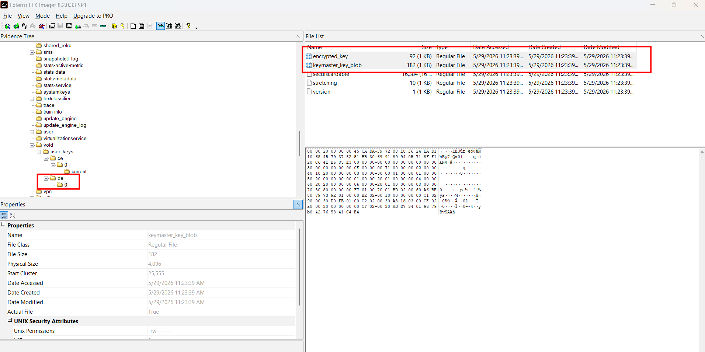

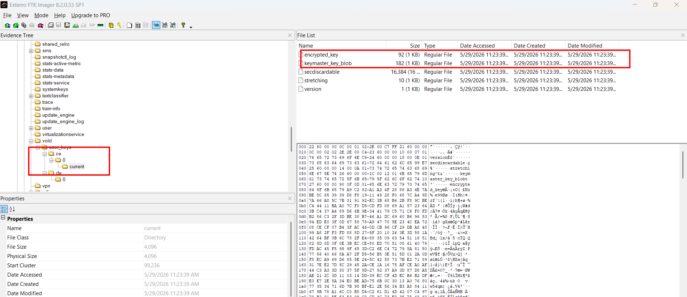

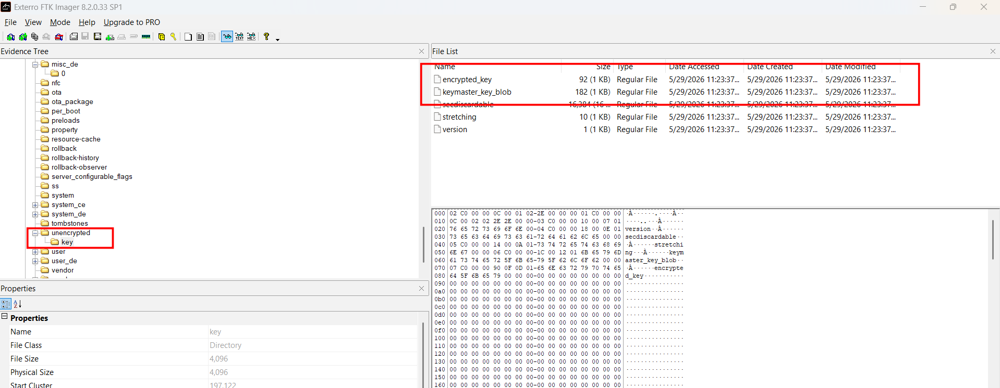

I export them, add prefix `de`, `ce`, `unenc` to prevent overwriting. Then decrypt them using this script:

```python
from cryptography.hazmat.primitives.ciphers.aead import AESGCM

def decrypt_key(blob_path, enc_key_path, name):
    with open(blob_path, 'rb') as f:
        blob=f.read()
    with open(enc_key_path, 'rb') as f:
        enc_key=f.read()

    wrapping_key=blob[5:37]

    iv=enc_key[0:12]
    cipher_with_tag=enc_key[12:] # cryptography library expects the tag to be at the end of the ciphertext

    aesgcm=AESGCM(wrapping_key)
    decrypted_key=aesgcm.decrypt(iv, cipher_with_tag, None)

    with open(f"{name}_key.bin", 'wb') as f:
        f.write(decrypted_key)

decrypt_key("de_keymaster_key_blob", "de_encrypted_key", "de")
decrypt_key("ce_keymaster_key_blob", "ce_encrypted_key", "ce")
decrypt_key("unenc_keymaster_key_blob", "unenc_encrypted_key", "unenc")
```

---

## Moving to Kali VM: Loading FBE Keys and Directory Decryption

> [!NOTE]
> **Why Transfer to Kali?**
> The default host Linux environment (e.g. WSL) often lacks loop device keyring propagation or lacks the `CONFIG_FS_ENCRYPTION` kernel configuration flags required to load fscrypt keys into loop-mounted ext4 volumes. Moving the files to a native **Kali VM** ensures the kernel supports these filesystem-level decryption tasks out-of-the-box, saving significant setup pain.

To loop-mount the metadata-decrypted partition `/data` inside Kali:
```bash
sudo mkdir -p /mnt/data
sudo mount -o ro,loop,noload a_decrypted.raw /mnt/data
```

### Key Ring Intuition
I load the decrypted CE and DE keys directly into the Linux kernel keyring at the filesystem mountpoint. The kernel's built-in `fscrypt` driver automatically uses these keys to resolve the directory structure and show decrypted plaintext filenames without needing to manually decrypt raw blocks for path traversal:

```python
#!/usr/bin/env python3
import fcntl
import os
import sys
import struct

# Linux kernel ioctl code for adding fscrypt encryption keys
# _IOWR('f', 23, struct fscrypt_add_key_arg) -> 0xC0506617
FS_IOC_ADD_ENCRYPTION_KEY = 0xC0506617

def add_key(mount_path, key_path, name):
    if not os.path.exists(key_path):
        print(f"[-] Key file {key_path} not found.")
        return

    with open(key_path, "rb") as f:
        key_bytes = f.read()

    # struct fscrypt_add_key_arg (80 bytes prefix + raw key bytes)
    key_spec = struct.pack("<II32s", 2, 0, b"\x00" * 32)
    arg_prefix = struct.pack("<II32s", len(key_bytes), 0, b"\x00" * 32)
    arg = key_spec + arg_prefix + key_bytes

    fd = os.open(mount_path, os.O_RDONLY)
    try:
        buf = bytearray(arg)
        fcntl.ioctl(fd, FS_IOC_ADD_ENCRYPTION_KEY, buf, 1)
        
        # Parse output
        returned_spec = buf[:40]
        _, _, union_val = struct.unpack("<II32s", returned_spec)
        identifier = union_val[:8].hex()
        key_id = struct.unpack("<I", buf[44:48])[0]
        
        print(f"[+] Loaded {name:<5} Key -> Kernel Key ID: {key_id:<5} | Identifier: {identifier}")
    except PermissionError:
        print(f"[-] Permission denied. Please run as root (sudo).")
    except Exception as e:
        print(f"[-] Failed to load {name} key: {e}")
    finally:
        os.close(fd)

def main():
    if len(sys.argv) < 2:
        print("Usage: sudo python3 add_keys_kernel.py <mount_point>")
        sys.exit(1)

    mount_path = sys.argv[1]
    add_key(mount_path, "ce_key.bin", "CE")
    add_key(mount_path, "de_key.bin", "DE")

if __name__ == "__main__":
    main()
```

Run the script on the mountpoint inside Kali:
```bash
sudo python3 add_keys_kernel.py /mnt/data
```

Once loaded, we can browse `/mnt/data` with plaintext filenames.

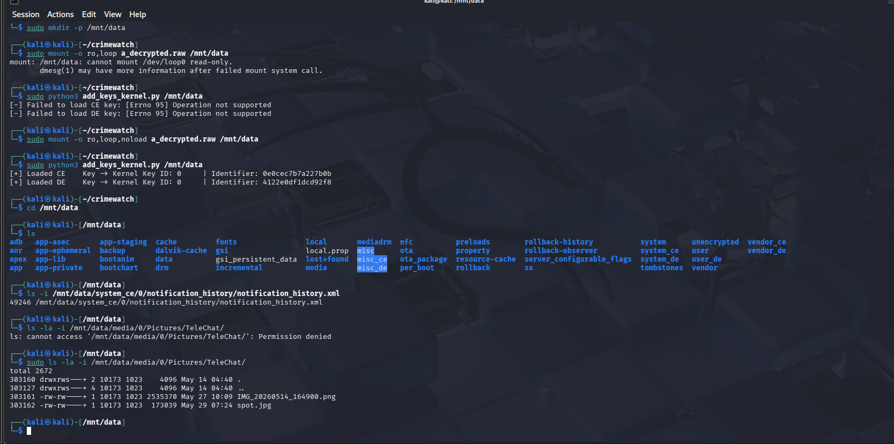

Now we trace the directory structure and identify the target inodes:
* `/mnt/data/system_ce/0/notification_history/notification_history.xml` $\rightarrow$ Inode **`49246`**
* `/mnt/data/media/0/Pictures/TeleChat/IMG_20260514_164900.png` $\rightarrow$ Inode **`303161`**
* `/mnt/data/media/0/Pictures/TeleChat/spot.jpg` $\rightarrow$ Inode **`303162`**

---

## The Wall: File Contents are Garbage

Even though filenames are clear, reading file contents from `/mnt/data` yields garbage. This is because **file data extents bypass the metadata encryption layer** and are written directly as raw FBE ciphertext to the disk (`a.raw`). Reading through the mount decrypts them a second time (double-decrypted noise).

> [!IMPORTANT]
> The correct path to extract file contents is to read the physical block extents raw from `a.raw` and FBE-decrypt them in user-space.

---

## File-Based Encryption Decryption Schema

1. **Get File Nonce:** Retrieve the file's 16-byte nonce from bytes 24–39 (`data[24:40]`) of the inode's 40-byte `c` extended attribute (the `fscrypt v2` context structure).
2. **Derive Key (HKDF):** Derive the block-decryption key using `ce_key.bin` and the file nonce via `HKDF-SHA512-Expand`:
   $$\text{PRK} = \text{HMAC-SHA512}(\text{salt}=\emptyset, \text{key}=\text{ce\_key})$$
   $$\text{File Key} = \text{HKDF-Expand}(\text{PRK}, \text{info}=\text{b"fscrypt\x00\x02"} + \text{nonce}, \text{length}=64)$$
3. **Parse Extents:** Use `debugfs stat` on `a_decrypted.raw` to fetch the file's logical-to-physical block mapping.
4. **Decrypt Block-by-Block:** For each mapped block:
   * Seek to the physical block offset in the raw encrypted disk image `a.raw`.
   * Decrypt the 4096-byte block using AES-256-XTS. The tweak (IV) is the 16-byte padded **logical** block index: `logical_blk.to_bytes(8, 'little') + b'\x00' * 8`.
5. **Reassemble & Truncate:** Concatenate blocks and truncate to the exact file size.


```python
#!/usr/bin/env python3
import sys
import os
import re
import hmac
import hashlib
import subprocess
from cryptography.hazmat.primitives.ciphers import Cipher, algorithms, modes

def hkdf_expand(prk, info, length):
    t = b""
    okm = b""
    i = 1
    while len(okm) < length:
        t = hmac.new(prk, t + info + bytes([i]), hashlib.sha512).digest()
        okm += t
        i += 1
    return okm[:length]

def derive_file_key(master_key, nonce):
    prk = hmac.new(b"", master_key, hashlib.sha512).digest()
    info = b"fscrypt\x00\x02" + nonce
    return hkdf_expand(prk, info, 64)

def run_debugfs(cmd):
    res = subprocess.run(
        ["debugfs", "-R", cmd, "a_decrypted.raw"],
        stdout=subprocess.PIPE, stderr=subprocess.PIPE
    )
    return res.stdout

def get_inode_nonce(inode):
    out = run_debugfs(f"ea_get <{inode}> c")
    if b"c (" not in out:
        return None
    try:
        hex_part = out.split(b"=")[1].strip().replace(b" ", b"")
        data = bytes.fromhex(hex_part.decode())
        return data[24:40]  # Nonce is 16 bytes starting at offset 24 for fscrypt v2
    except Exception:
        return None

def parse_stat(inode):
    out = run_debugfs(f"stat <{inode}>")
    size_match = re.search(r"Size:\s+(\d+)", out.decode('utf-8', errors='ignore'))
    if not size_match:
        raise ValueError("Could not parse file size.")
    file_size = int(size_match.group(1))

    extents_idx = out.find(b"EXTENTS:")
    if extents_idx == -1:
        raise ValueError("No block extents found.")
    extents_section = out[extents_idx:]
    
    blocks = []
    lines = extents_section.split(b"\n")
    for line in lines[1:]:
        line = line.strip()
        if not line or b":" not in line:
            continue
        parts = line.split(b":")
        log_part = parts[0].decode().strip("()")
        log_start, log_end = map(int, log_part.split("-")) if "-" in log_part else (int(log_part), int(log_part))
        phys_part = parts[1].split(b" ")[0].decode()
        phys_start, phys_end = map(int, phys_part.split("-")) if "-" in phys_part else (int(phys_part), int(phys_part))
        num_blocks = log_end - log_start + 1
        for i in range(num_blocks):
            blocks.append((log_start + i, phys_start + i))
            
    blocks.sort(key=lambda x: x[0])
    return file_size, blocks

def decrypt_file(inode, output_path):
    print(f"[*] Fetching metadata for inode {inode}...")
    with open("ce_key.bin", "rb") as f:
        ce_key = f.read()

    nonce = get_inode_nonce(inode)
    if not nonce:
        print(f"[-] Failed to get nonce for inode {inode}")
        return

    file_size, extents = parse_stat(inode)
    file_key = derive_file_key(ce_key, nonce)
    aes_algo = algorithms.AES(file_key)
    decrypted_data = bytearray()

    with open("a.raw", "rb") as f_raw:
        for logical_blk, physical_blk in extents:
            f_raw.seek(physical_blk * 4096)
            ciphertext = f_raw.read(4096)
            tweak = logical_blk.to_bytes(8, 'little') + b'\x00' * 8
            cipher = Cipher(aes_algo, modes.XTS(tweak))
            decrypted_data.extend(cipher.decryptor().update(ciphertext) + cipher.decryptor().finalize())

    with open(output_path, "wb") as f_out:
        f_out.write(decrypted_data[:file_size])
    print(f"[+] Success! Extracted and decrypted file to: {output_path}\n")

def main():
    if len(sys.argv) < 3:
        print("Usage: python3 extract_file.py <inode> <output_path>")
        sys.exit(1)
    decrypt_file(int(sys.argv[1]), sys.argv[2])

if __name__ == "__main__":
    main()
```

Run the decryption commands in Kali to extract the original evidence files:

```bash
python3 extract_file.py 49246 notification_history.xml
python3 extract_file.py 303161 van.png
python3 extract_file.py 303162 spot.jpg
```

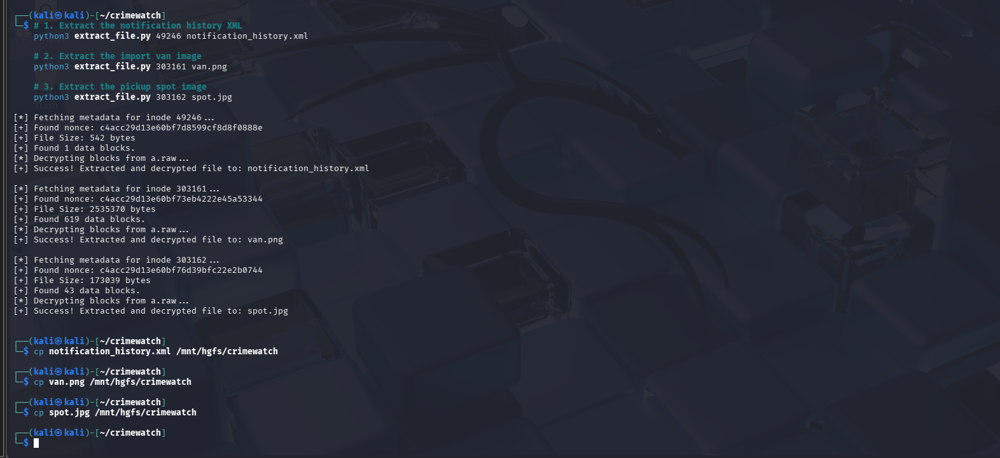

About why I mention that file specifically, they are related to the questions, you may take time to explore more files, but only these 3 files are enough. Let's start:

**1. Which TeleChat account or chat appears to be supplying the courier with vape stock?**

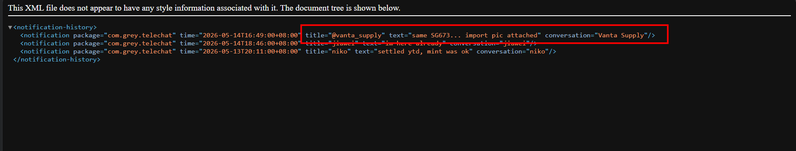

**2. What car plate number connected to the supplier's import method is recoverable from deleted image/cache evidence?**

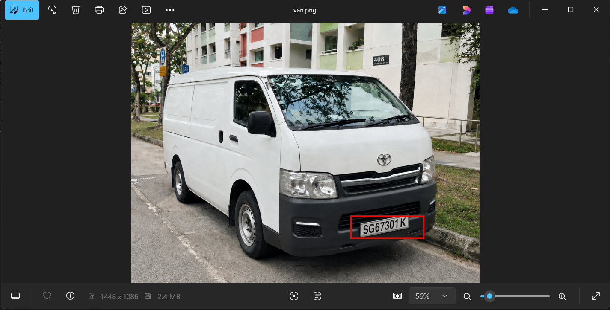

**3. Which TeleChat contact appears to be the most recent buyer awaiting a delivery?**

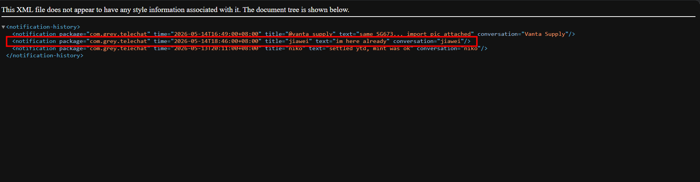

**4. What coordinates identify the pickup point?**


Some [OSINT skills (coordinates in URL)](https://www.flickr.com/photos/dannyfoster/9511153795) help (my mentor did it, I don't know how to OSINT lol) 

```text
lehie@MSI:/mnt/c/CTF_Workspace/GreyCTF2026/Crime Watch$ python3 flag.py "@vanta_supply" "SG67301K" "jiawei" "1.40,103.79"
[+] grey{tobacco_and_vaporisers_control_actdf269}
```

Well, only after I went that very very troublesome way did I find out this [awesome tool](https://github.com/SlugFiller/fbe-decrypt). It's a javascript tool so we need `node` to run, first we must rename the two files to match its expected filenames, then run, wait for ~5 mins and receive a decrypted disk image that is openable from FTK Imager:

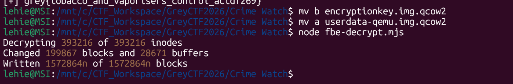

Should have save me a struggling night if I had known it earlier :mattimkhocloc 

`Flag: grey{tobacco_and_vaporisers_control_actdf269}`