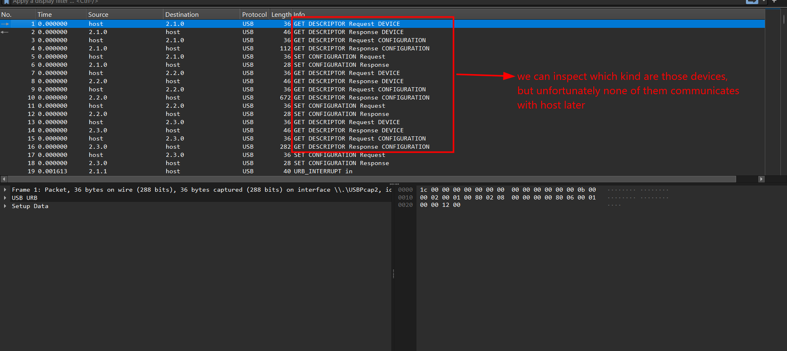
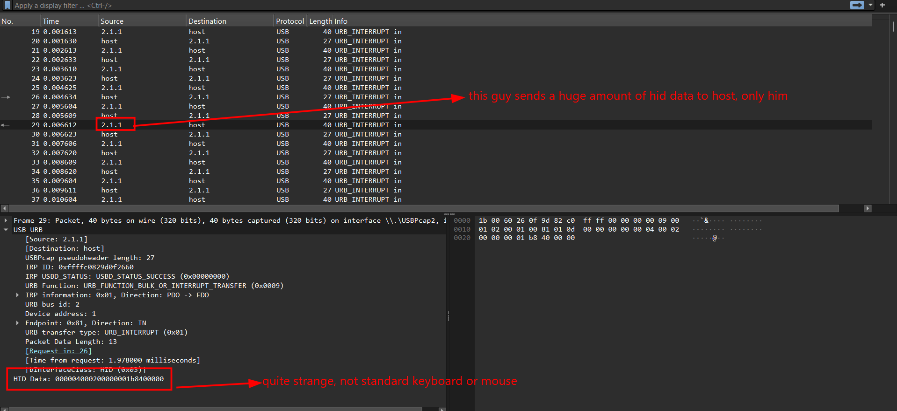
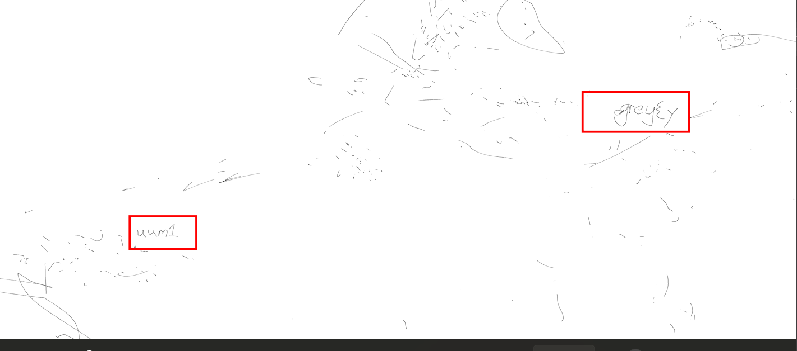
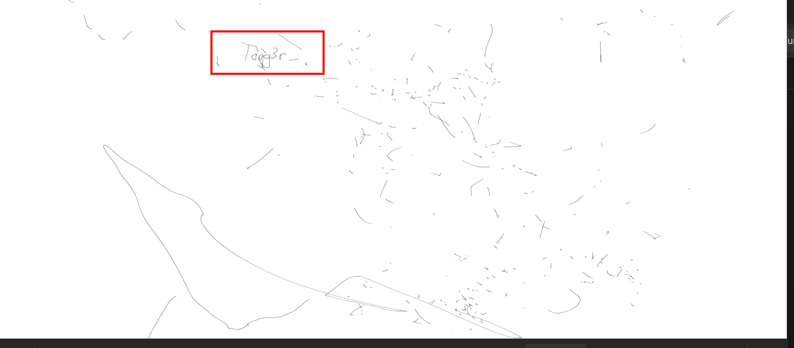
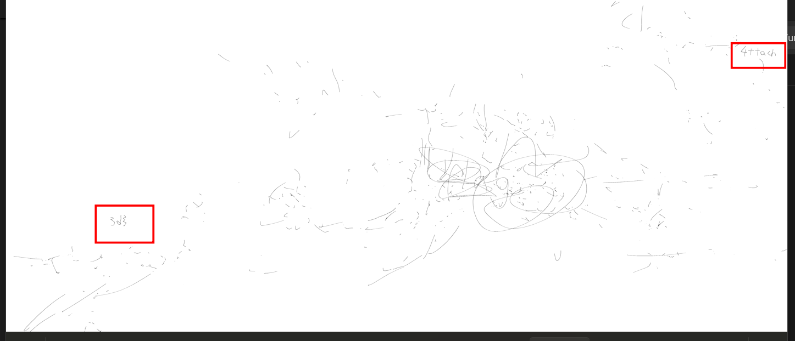

# Grey Yuumi

## Scenario

why u wanna capture my league gameplay? p.s. alt-tabbed out to draw some cats.

## Given artifact

A huge USB pcap file with more than 1 million packets, and an unknown `.rofl` file

## Solving process

At the beginning of the pcap file, I see some descriptor packets, however, non of them contributes to the huge payload later:



In subsequent packets, only this guy stands out with his talkativity, his HID data sent to host seems strange compared to standard devices:



Anyway let's extract all HID data first, we will inspect its structure later. Now use the familiar `tshark` command:

```bash
tshark -r grey_yuumi.pcapng \
  -Y 'usb.src == "2.1.1" && usbhid.data' \
  -T fields -e usbhid.data > hid.hex
```

> Looking at the extracted hid, those 13-byte stuff seems to be exclusive to Logitech's mouse:
>
> ```text
> byte 0      = button bitmask
> byte 1      = probably padding / constant
> bytes 2-3   = X movement, int16 little endian
> bytes 4-5   = Y movement, int16 little endian
> bytes 6-7   = wheel / extra movement, mostly zero here
> bytes 8-12  = constant Logitech / receiver-ish tail, ignore for drawing
>```
>
> For example we have `00 00 04 00 01 00 00 00 01 b8 40 00 00`
>
> That means:
>
> ```text
> dx = 0x0004 = +4
> dy = 0x0001 = +1
> buttons = 0
> ```
>

So the useful CTF path is probably:

- Extract only interrupt reports from 2.1.1.
- Decode dx = int16le(report[2:4]), dy = int16le(report[4:6]).
- Integrate them into cursor coordinates.
- Draw lines only while a mouse button is held.
- The “alt-tabbed out to draw some cats” hint means the flag/visual clue is likely hidden in reconstructed mouse drawing, not in the `.rofl` itself.

Use this script, named `draw.py` to reconstruct what was drawn at that time:

```python
#!/usr/bin/env python3
import struct
from PIL import Image, ImageDraw

INPUT = "hid.hex"

reports = []

with open(INPUT, "r") as f:
    for line in f:
        line = line.strip()
        if not line:
            continue

        # Accept both "aa:bb:cc" and "aabbcc"
        line = line.replace(":", "").replace(" ", "")
        try:
            b = bytes.fromhex(line)
        except ValueError:
            continue

        # We expect 13-byte reports, but keep only long enough ones
        if len(b) >= 6:
            reports.append(b)

print(f"[+] Loaded {len(reports)} HID reports")

# Decode movement
x = 0
y = 0
positions = []
segments_by_button = {
    1: [],
    2: [],
    4: [],
}

for r in reports:
    btn = r[0]

    # Based on observed report format:
    # byte 0      = buttons
    # byte 2-3    = dx int16 little endian
    # byte 4-5    = dy int16 little endian
    dx = struct.unpack("<h", r[2:4])[0]
    dy = struct.unpack("<h", r[4:6])[0]

    old_x, old_y = x, y
    x += dx
    y += dy

    positions.append((x, y))

    for mask in segments_by_button:
        if btn & mask:
            segments_by_button[mask].append((old_x, old_y, x, y))

print(f"[+] Final cursor position: {x}, {y}")

# Determine canvas bounds
all_points = positions[:]
for segs in segments_by_button.values():
    for x1, y1, x2, y2 in segs:
        all_points.append((x1, y1))
        all_points.append((x2, y2))

min_x = min(p[0] for p in all_points)
max_x = max(p[0] for p in all_points)
min_y = min(p[1] for p in all_points)
max_y = max(p[1] for p in all_points)

margin = 50
w = max_x - min_x + margin * 2
h = max_y - min_y + margin * 2

print(f"[+] Bounds: x={min_x}..{max_x}, y={min_y}..{max_y}")
print(f"[+] Canvas: {w}x{h}")

def transform(px, py):
    # Flip Y if needed by changing the second line to:
    # return px - min_x + margin, max_y - py + margin
    return px - min_x + margin, py - min_y + margin

def render(mask, filename):
    img = Image.new("RGB", (w, h), "white")
    draw = ImageDraw.Draw(img)

    segs = segments_by_button[mask]
    print(f"[+] Button mask {mask}: {len(segs)} drawn segments")

    for x1, y1, x2, y2 in segs:
        draw.line([transform(x1, y1), transform(x2, y2)], fill="black", width=2)

    img.save(filename)
    print(f"[+] Saved {filename}")

render(1, "button1.png")
render(2, "button2.png")
render(4, "button4.png")
```

Running this script, we get 3 canvas back, and the `button2.png` is where most of the segment lines are drawn







Found flag fragments here, and according to the author's notification, the T should be l instead, so:

`Flag: grey{yuum1logg3r_4ttach3d}`