# Automation

## Scenario

Vinyr&amp;#039;s threat intelligence is monitoring closely all APT groups from every possible galaxy, especially the most dangerous one, longhir. As stated by an anonymous threat intelligence officer, the malicious actors tend to automate their initial post-exploitation enumeration so they can have less on-keyboard time. You can find such an example in the provided network capture generated by a recent incident. Analyse it and find out what they are up to.

## Given artefacts

A packet capture file

## Solving process

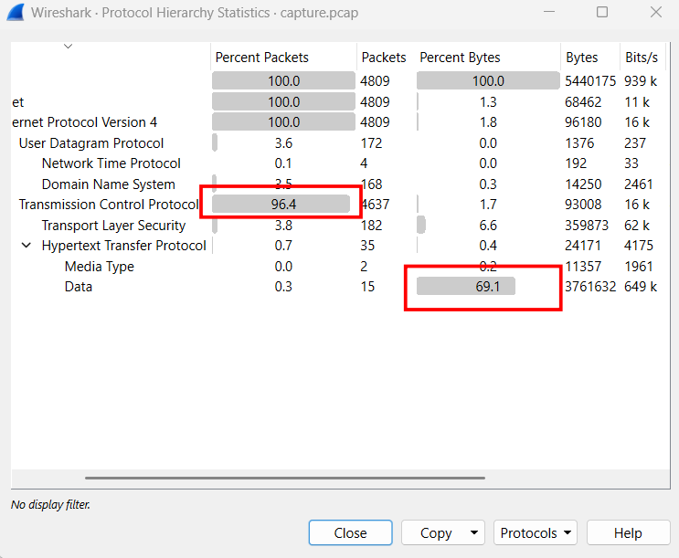

Upon assessing the hierarchy, I notice the high amount data transferred through HTTP protocol, data exfiltration, or payload delivery ?..

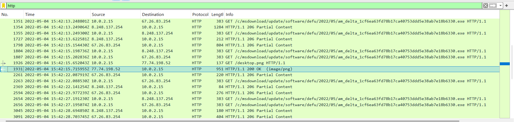

Filtering for http packet, I'm quite suspicious, these IPs are not related to Microsoft, and the executable seems very strange, so I decide to export it, as well as this png image. To my surprise, it is **NOT** an image, I just think that it is a fake image pretending to be microsoft, but it turns out to be ascii text file, containing a massive base64 block, I take it to cyberchef and get a script:

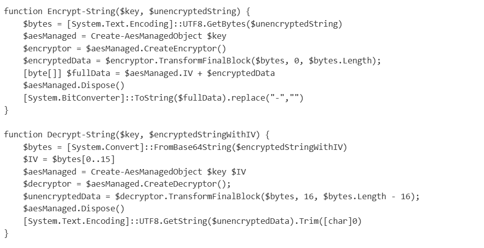

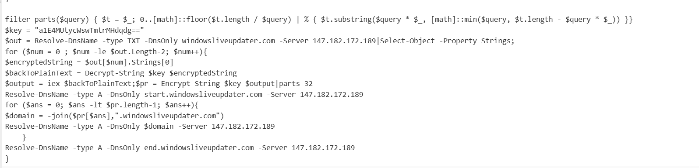

Above this is some helper functions that handle AES, and we only need to analyze from this point :

- The function Encrypt-String is used to encrypt the result before sending back to the attacker's server, note the last line, the final output of this function is in hexadecimal.
- Function Decrypt-String is used to decrypt the incoming command from the attacker's server.
- The `filter parts($query)..` part: DNS domain names have strict length limits. A single subdomain (like the www in www.google.com) cannot be longer than 63 characters. This parts function takes a long string of text and chops it into bite-sized chunks so it can be disguised as a subdomain.
- Then the script sets the hard-coded AES key. Then, it sends a DNS query to the attacker's server (147.182.172.189). It specifically asks for TXT records for windowsliveupdater.com. The attacker has hidden their encrypted malicious command inside that TXT record.
- After that, it takes the text from the TXT record and passes it to Decrypt-String. Once decrypted, it uses iex to execute that command in the memory, the result is stored in $output variable.
- Now it needs to send the $output back. It passes it to Encrypt-String, then pipes that long Hex string into the parts filter, chopping it into chunks of 32 characters each.

### The main stage, DNS tunnelling

- It sends a ping to start.windowsliveupdater.com to tell the attacker, "Get ready, data is coming."

- It loops through all those 32-character Hex chunks. For each chunk, it builds a fake web address and looks it up. The attacker's server logs the request, capturing the chunk.

- It sends a ping to end.windowsliveupdater.com to signal that the transmission is complete.

**Now that we know its mechanism, let's apply a filter:**

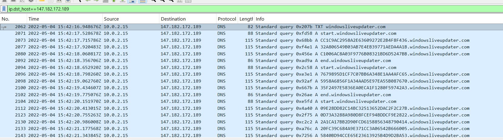

The pattern is exactly what we expect! I will grab the response first, a bit unnatural, but for this filter, it should be done first, let's gear up tshark:

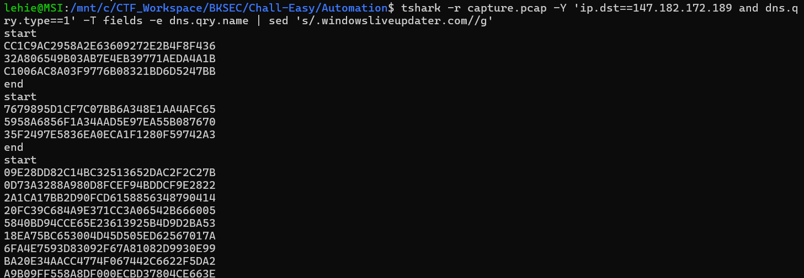

Note that I use `sed` to remove the domain, efficiently isolate the payload, now we only need to copy those blocks to cyberchef, using the hard-coded key, and cut 32 hex character as the initialization vector:

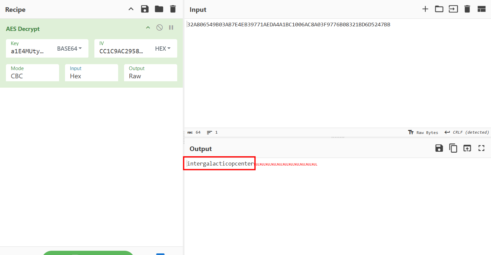

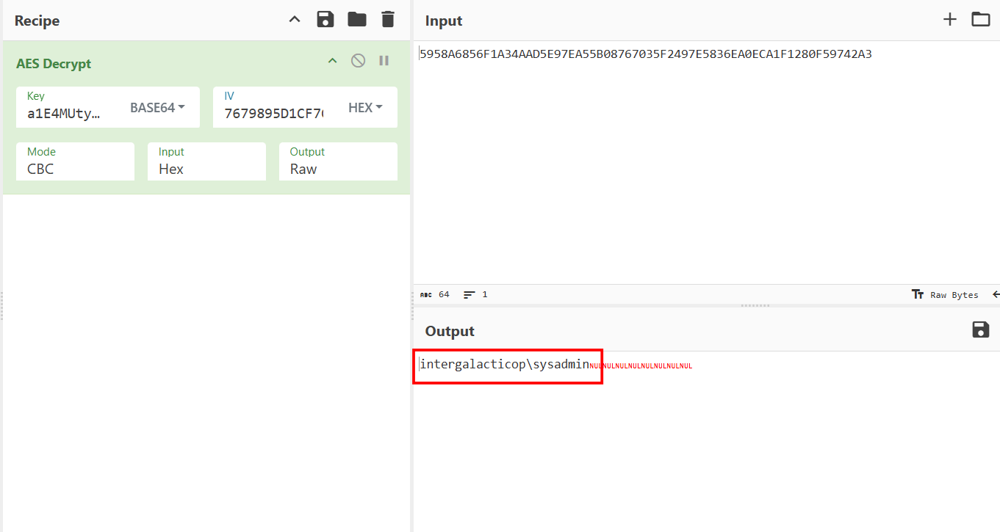

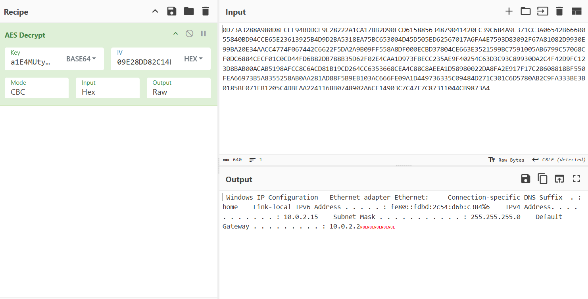

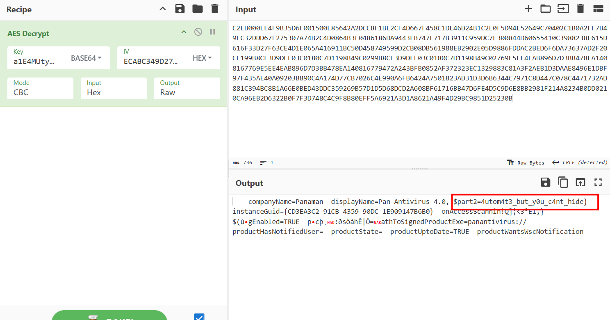

The second part of the flag spills out here! So the first piece must be in the command. Navigate to the response of the TXT query, copy those TXT value, firing cybercheft, I use two tabs, tab 1's recipe is from base64, then to hex, then find space replace with nothing, tab 2's recipe is AES decrypt, still strip the first 32 hex characters to use as IV, the following command is decrypted:

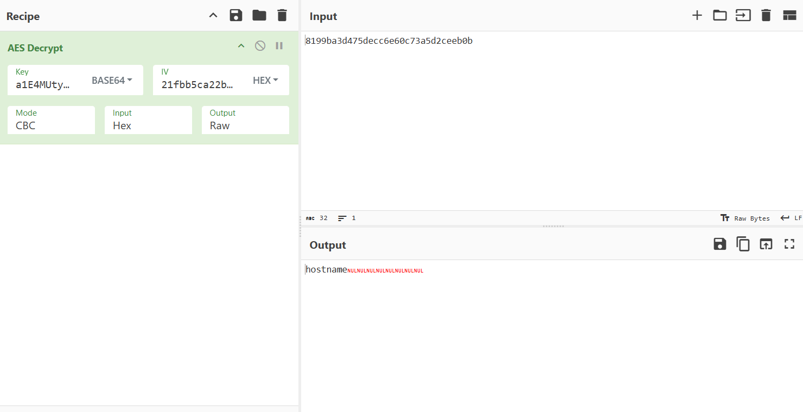

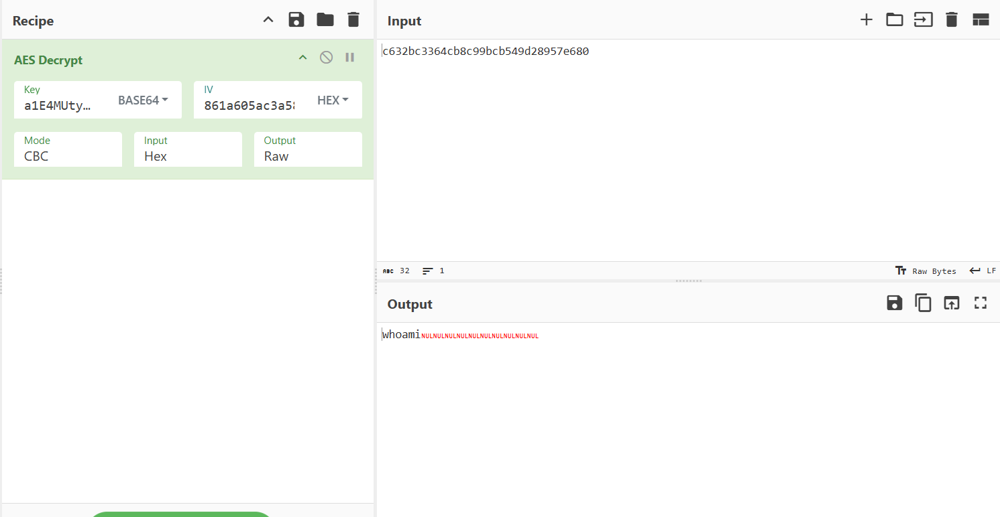

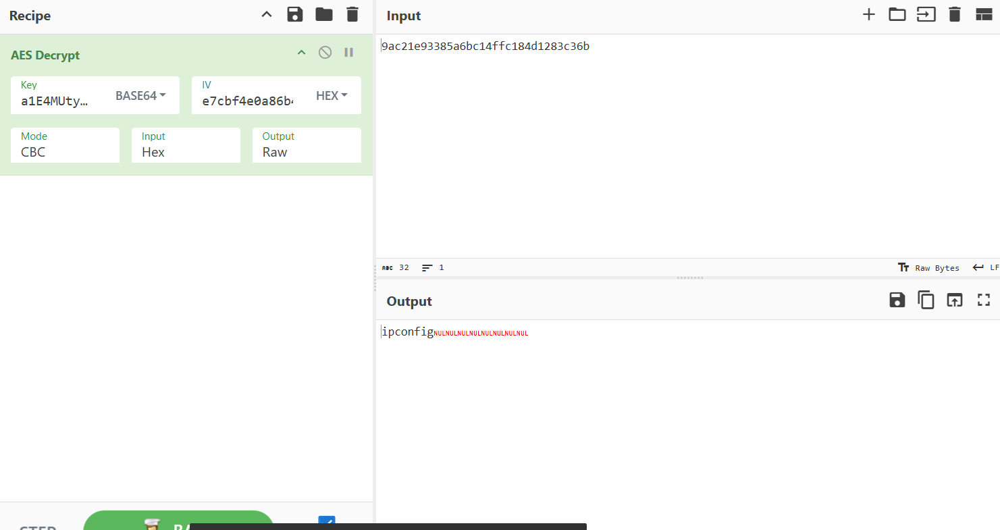

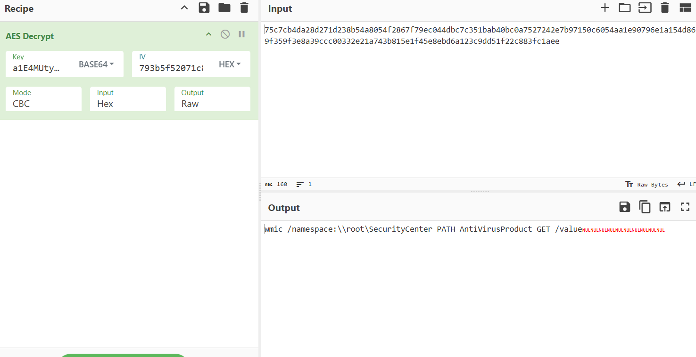

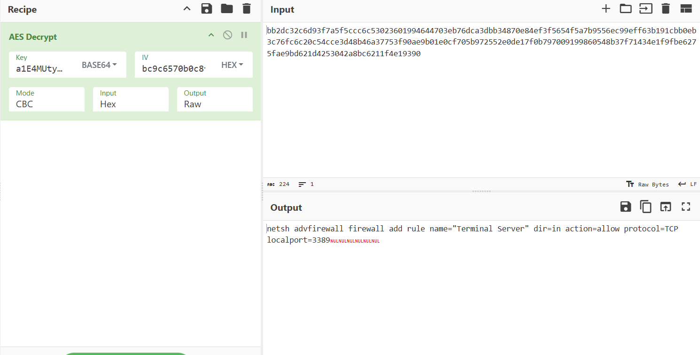

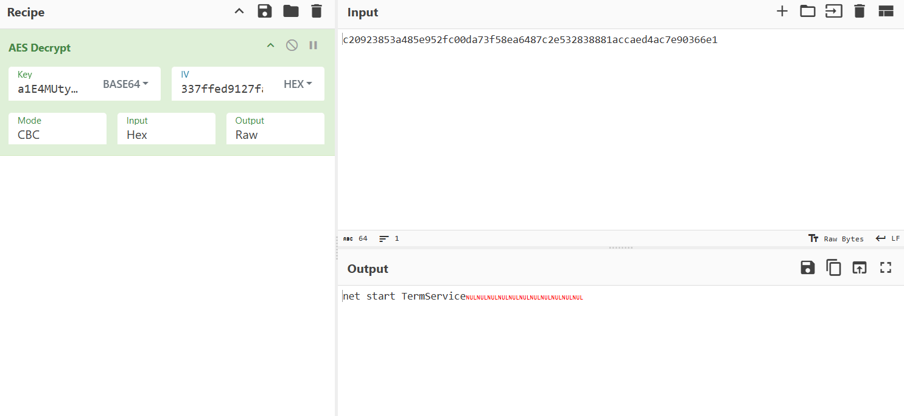

Alright, those commands match the response we found earlier, but somehow the longest base64 string cannot be handled this way, I spend quite long time findint the reason, but honestly give up and re-use the very script fucntion Decrypt-String to recover the command:

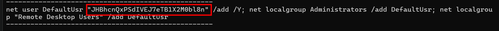

Suspicious base64 string, immediately head for cyberchef:

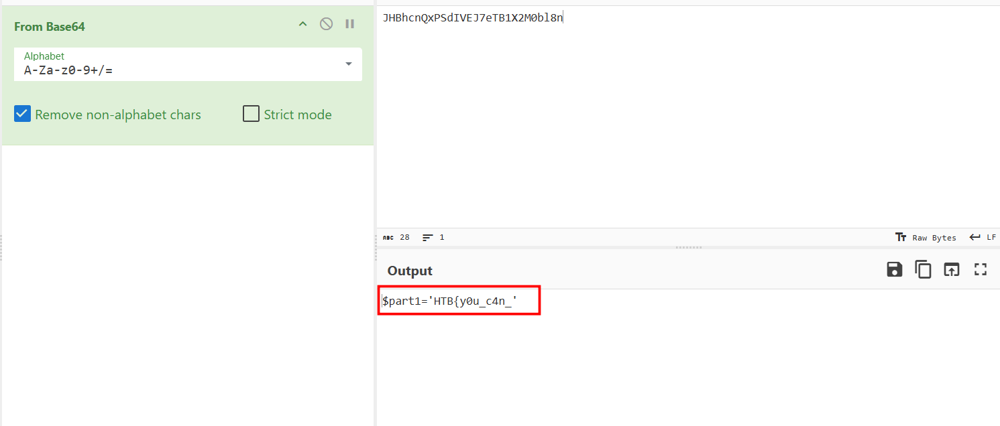

Perfect, we get the flag, but I'm still wondering why the my recipe fails...

`Flag: HTB{y0u_c4n_4utom4t3_but_y0u_c4nt_h1de} `