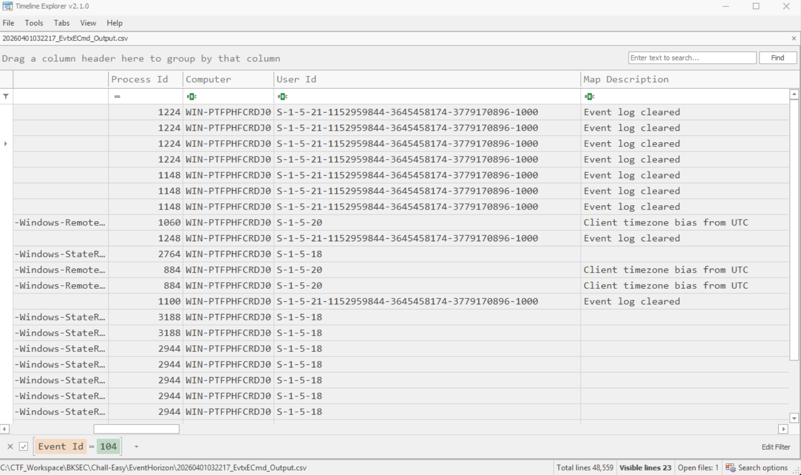
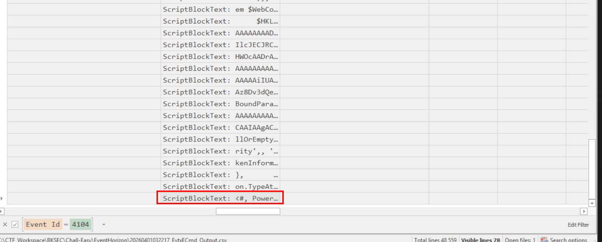
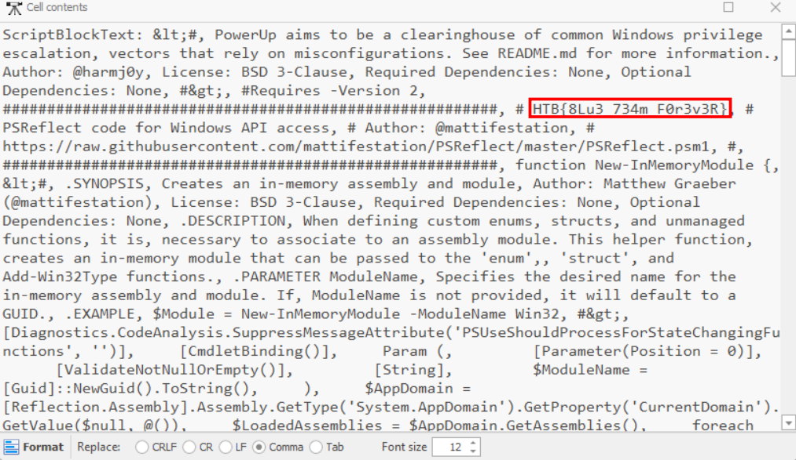
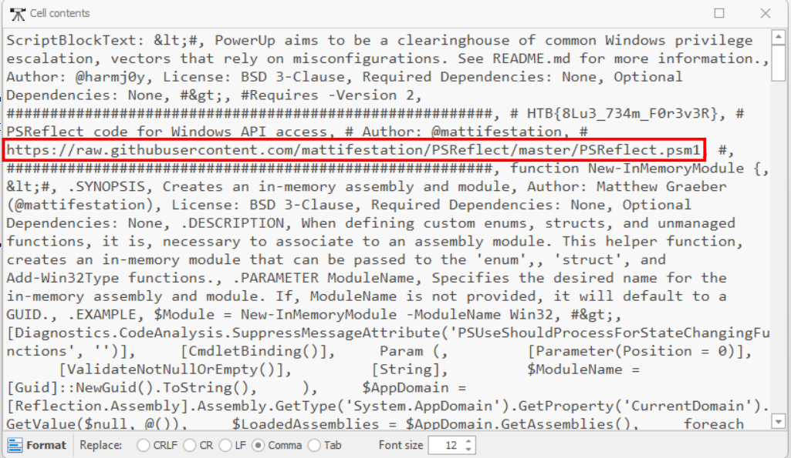
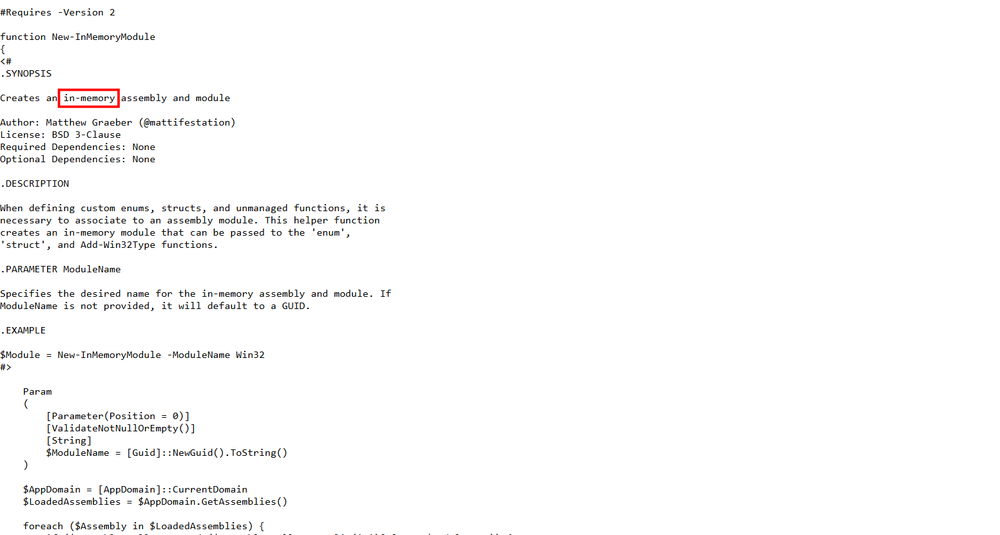

# Event Horizon

## Scenario

Our CEO's computer was compromised in a phishing attack. The attackers took care to clear the PowerShell logs, so we don't know what they executed. Can you help us?

## Given artefacts:

We are given a logs folder containing a lot of Windows logs, and also an empty TraceFormat folder. 

## Solving process

As the problem's name suggests, I try to find something related to Powershell and log clear events. I suspect the latter, so I try to filter for event ID 104 (log file cleared) and event ID 1102 (audit log cleared):

However, they seem to only record that **the log was cleared**, but do not tell anything about **what was cleared**. So I have no choice but to return to Powershell log, filter for event ID 4104 (content of script run) and to my surprise, the smoke gun lies in the first log in chronological order:

Here is it content:

We get the flag, but let's further inspect this link:

Following that url gives us a very complicated script, I currently cannot understand every line of code, but generally it's a set of function to aid the in-memory execution of payload, a.k.a living off the land tactics.

`Flag: HTB{8Lu3_734m_F0r3v3R}`