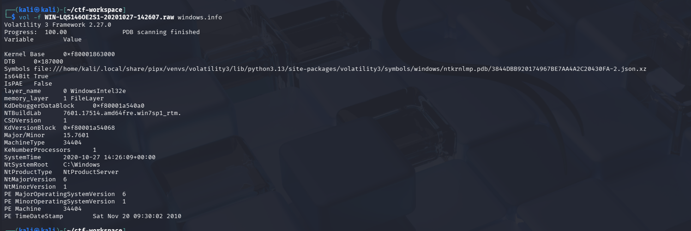
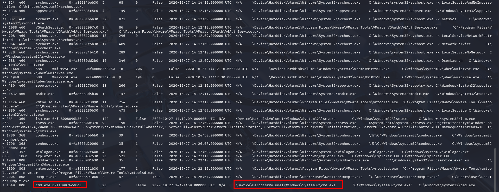
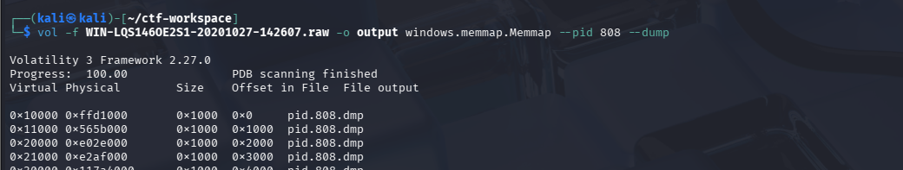
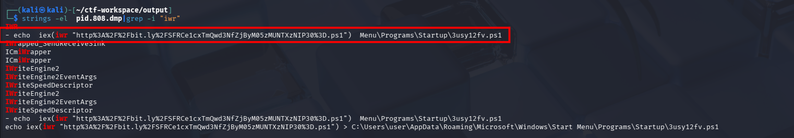
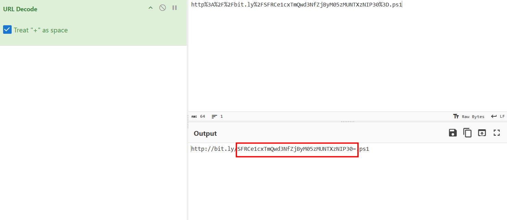
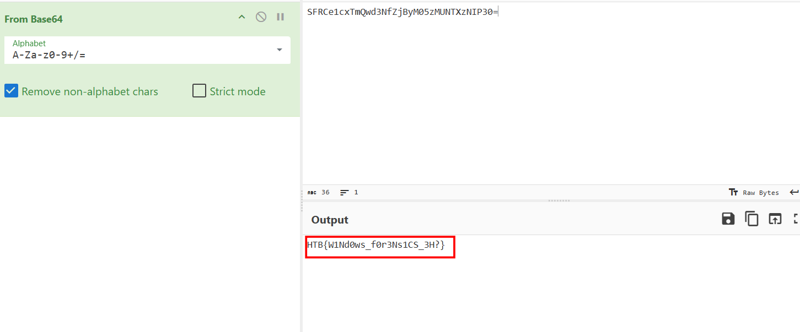

# Export

## Scenario 

**We spotted a suspicious connection to one of our servers, and immediately took a memory dump. Can you figure out what the attackers were up to?**

## Given artefacts

A raw memory dump file

## Solving process

Firstly, I fire volatility on the dump file to get the version info, and it is a Windows 7 machine

After that, I run pstree to see what was happening on the machine:

Other processes are all legitimate, except for the last `cmd.exe`, in other challenge, mere cmd.exe may not be noticeable, but in this scenario it is the only suspicious program.

Initially, I try using `windows.cmdscan` like vol 2, but unfortunately, this version of Windows is not supported, a bit frustrating, but totally understandable for highly [volatile artefact](https://www.crystalrugged.com/knowledge/volatile-memory-vs-non-volatile-memory/) like command history. So I have to find an alternative way to retrieve what was run on cmd.exe at that time

Another way to attain that goal, according to LLM, is to dump its parent process, note the PPID of that cmd process is 808, corresponding to an explorer.exe process. Using this command to dump its memory out:

Now for the generated pid.808.dmp file, we have no other way (to my knowledge) but to directly inspect it, using `strings` and grep for suspicious, popular keyword in malware behaviour. I try iex, but nothing valuable pops out, then I try iwr (Invoke-WebRequest) and luckily, that's what we want:

That command requests for a weird file from the internet, then it seems to be run after downloaded. Let's take that to cyberchef's url decode:

The familiar base64 pattern, I'm sure we get the flag:

Bingo!

`Flag: HTB{W1Nd0ws_f0r3Ns1CS_3H?}`