# Foggy Intrusion

## Scenario

**On a fog-covered Halloween night, a secure site experienced unauthorized access under the veil of darkness. With the world outside wrapped in silence, an intruder bypassed security protocols and manipulated sensitive areas, leaving behind traceable yet perplexing clues in the logs.**

## Given artefacts

Merely a packet capture file, time for wireshark

## Solving process

This file consists of all HTTP traffics, the intruder repeatedly sends GET request for non-existent content. After that, they begin to seen malicious POST request to exploit the vulnerable server:

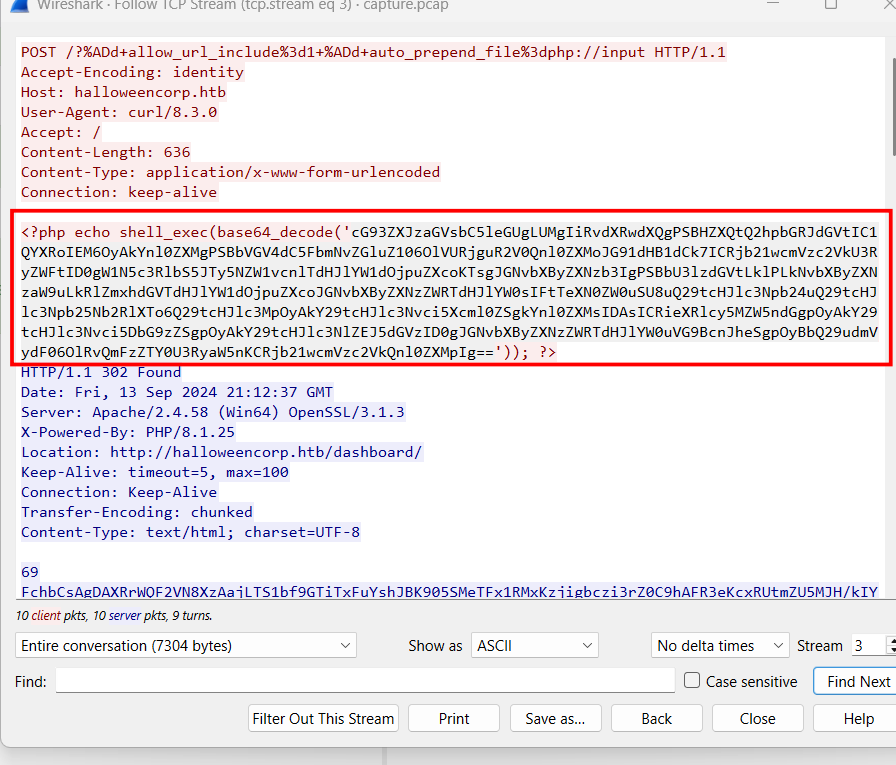

The payload in POST request decodes to `allow_url_include=1` and `auto_prepend_file=php://input`, it enables remote file inclusion and forces PHP to treat the request body as php code. Note that the request body has been base64-encoded.

The first command decode to:

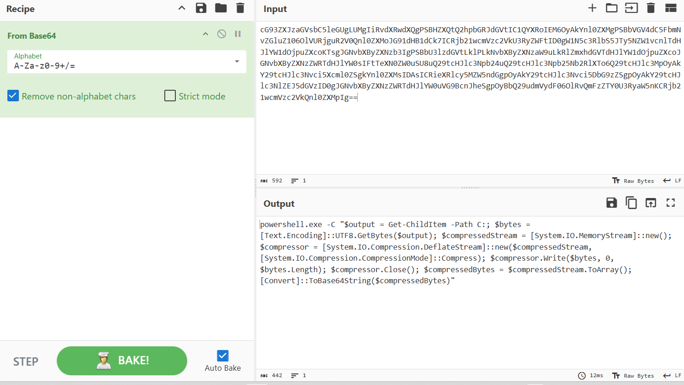

It lists file in drive C, converts the result to raw UTF-8 bytes, compresses it with Deflate, and finally base64-encodes the compressed data.

To recover it, simply reverse the formula on cyberchef:

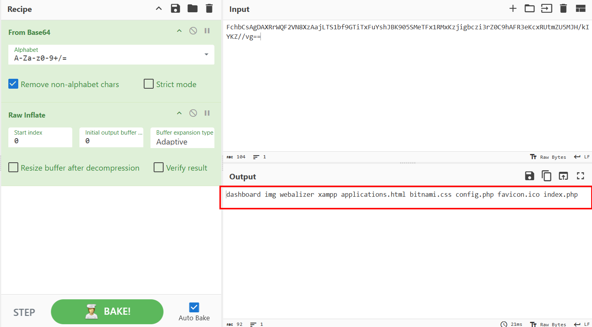

Here are the following commands and their corresponding results:

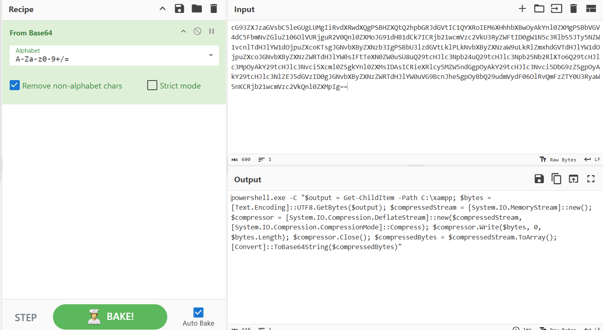

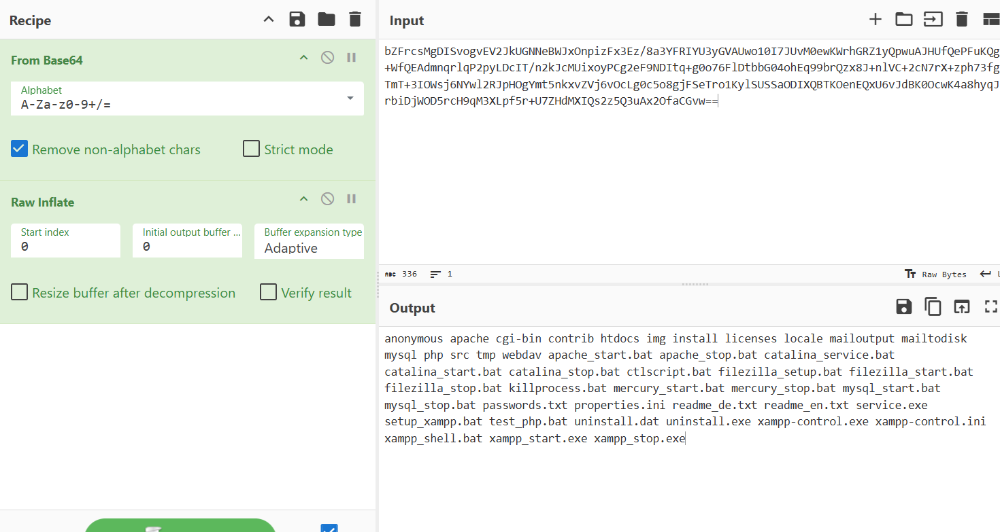

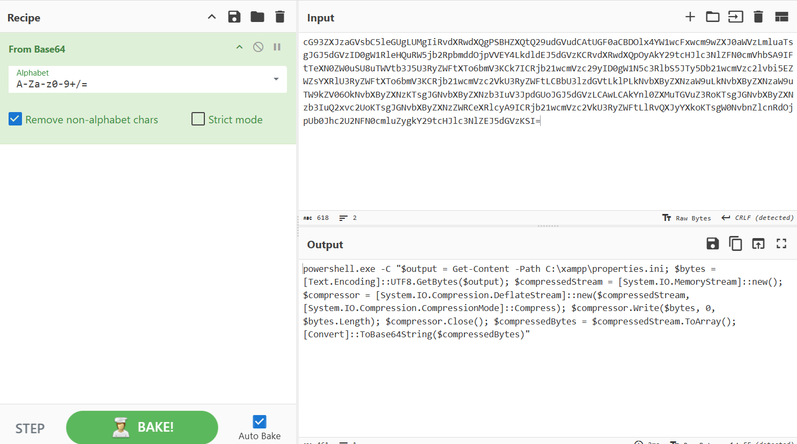

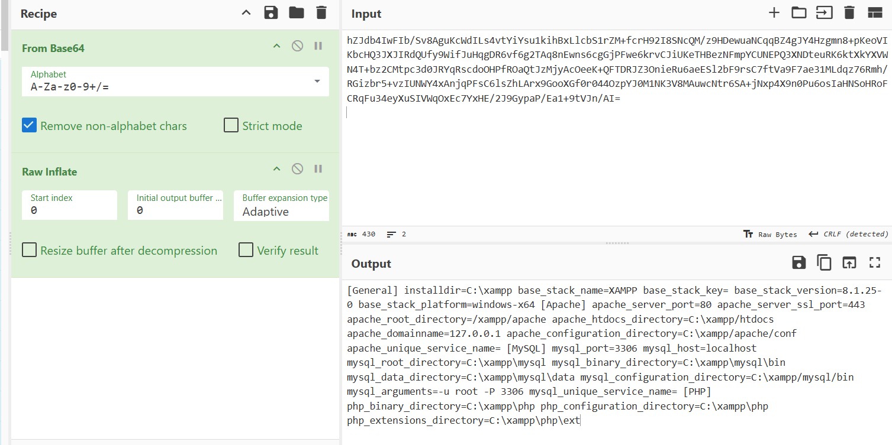

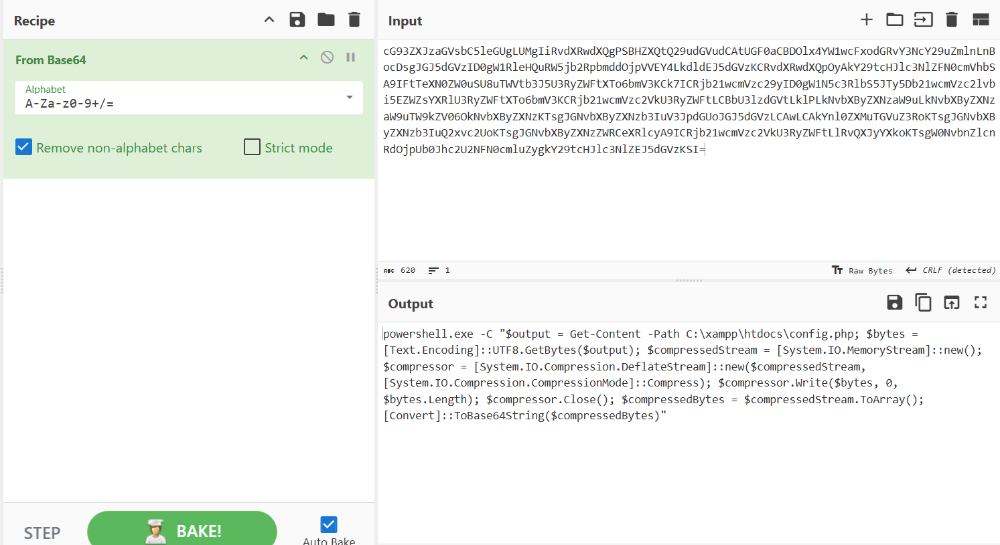

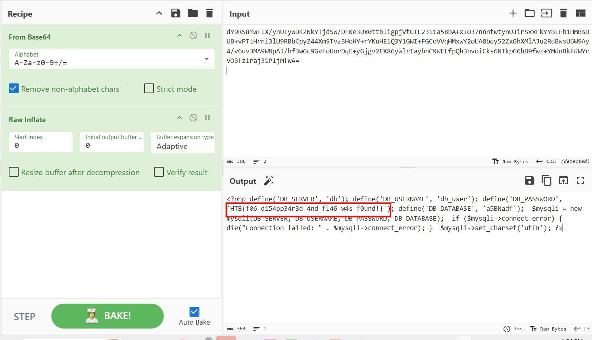

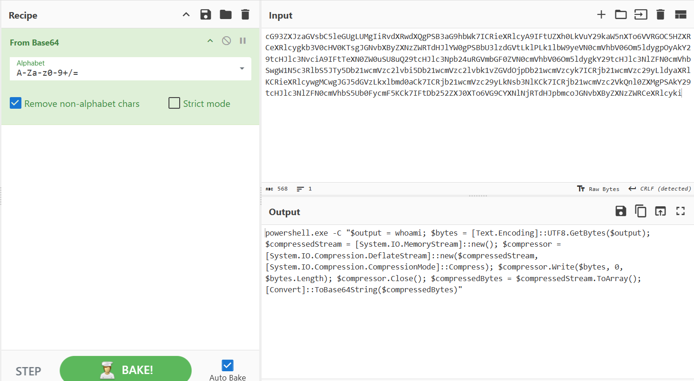

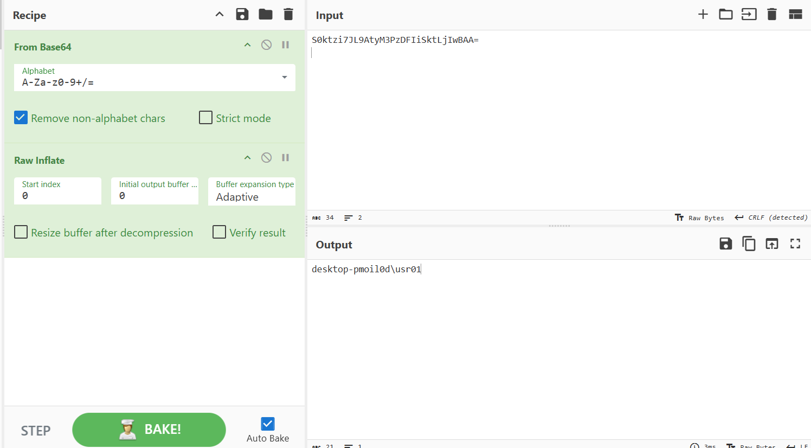

`Flag: HTB{f06_d154pp34r3d_4nd_fl46_w4s_f0und!}`