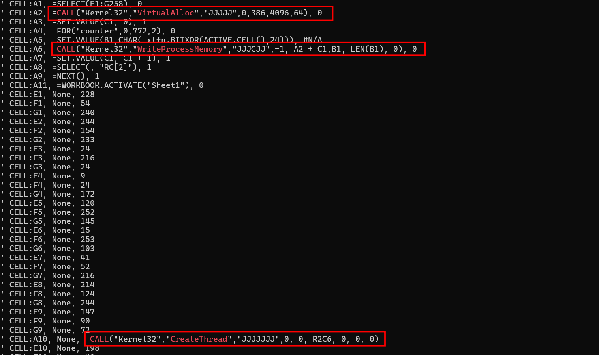
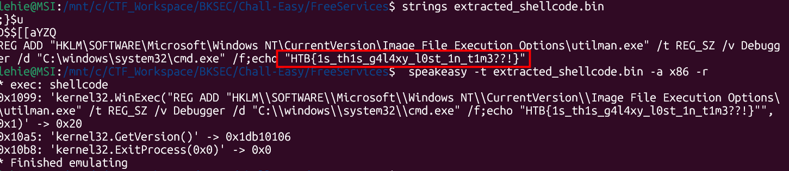

# Free Services

## Scenario

**Intergalactic Federation stated that it managed to prevent a large-scale phishing campaign that targeted all space personnel across the galaxy. The enemy&#039;s goal was to add as many spaceships to their space-botnet as possible so they can conduct distributed destruction of intergalactic services (DDOIS) using their fleet. Since such a campaign can be easily detected and prevented, malicious actors have changed their tactics. As stated by officials, a new spear phishing campaign is underway aiming high value targets. Now Klaus asks your opinion about a mail it received from &quot;sales@unlockyourmind.gal&quot;, claiming that in their galaxy it is possible to recover it&#039;s memory back by following the steps contained in the attached file.**

## Given artefacts

A Microsoft Exel macro-enable worksheet is handed to us

## Solving process

At first, I cannot run olevba on the file, it says no macro found, which makes me very confused. However, after I open the xlsm file for inspecting (definitely not enable content), olevba does work, perhaps that is the forgiving feature of Exel, the malware author intentionally break the file somewhere, but Exel can silently fix those and make the file work perfectly.



- At cell A1, it selects a block spanning 3 rows and 258 columns, starting from E1 to G258.
- At cell A2, the macro calls the Windows API VirtualAlloc to allocate memory for the shellcode, 4096 represents MEM_COMMIT, 64 (0x40) represents PAGE_EXECUTE_READWRITE (RWX). This means whatever is written here can be run as code.
- At cell A3, it initializes a counter at cell C1 to keep track of the memory offset (where to write the next byte).
- At cell A4, it starts a loop that will run 386 times, as 0 to 772 and each step is 2.
- At cell A5, it takes the value of the currently selected cell (which starts at E1), XORs it with the key 24, turns it into a character, and stores it in B1.
- It takes the decrypted byte from B1 and writes it into the RWX memory we allocated in A2, note that A2 holds the starting address of that memory block, and C2 is the offset, starting from 0
- At cell A7, it increments the offset C1.
- Cell A8: this is the attacker's anti-analysis trick. In R1C1 notation, RC[2] means "Stay on the current row (R), but move 2 columns to the right (C[2])".
Because A1 created a strict bounding box of E1:G258, moving 2 columns right forces Excel to wrap around the boundary.


- Cell A10: once the loop finishes decrypting and writing the payload, it creates a new thread pointing to the allocated memory, executing the shellcode.

Now we will try to recover the payload with a python script (with the help of LLM).

```python
import openpyxl

wb = openpyxl.load_workbook('free_decryption.xlsm', data_only=True)

sheet = wb['Macro1'] 

cells_1d = []
for row in range(1, 259):
    for col in range(5, 8): 
        cell_val = sheet.cell(row=row, column=col).value
       
        cells_1d.append(int(cell_val) if cell_val is not None else 0)

shellcode = bytearray()
xor_key = 24
loop_iterations = 386

for i in range(0, loop_iterations * 2, 2):
    encrypted_byte = cells_1d[i]
    decrypted_byte = encrypted_byte ^ xor_key
    shellcode.append(decrypted_byte)

output_file = 'extracted_shellcode.bin'
with open(output_file, 'wb') as f:
    f.write(shellcode)

print(f"Success! Extracted {len(shellcode)} bytes of shellcode.")
print(f"Saved to {output_file}.")
```

Then we may use `strings` on that file to hunt for low-hanging fruit, and the flag is immediately visible:



`Flag: HTB{1s_th1s_g4l4xy_l0st_1n_t1m3??!}`

## Key takeaways:

From this challenge, I know about another kind of macro, up to now I have only analyzed Word document's macro, and it is much more straigh-forward than this. Analyzing Exel's macro forces us to read from cell to cell, and I also learn basic usage of openpyxl library to assist extracing the payload from the malicious Exel file.