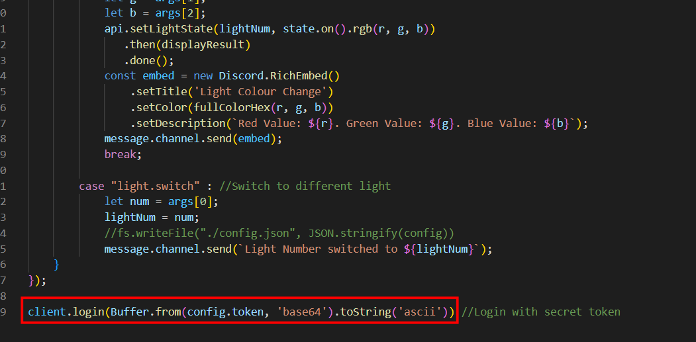
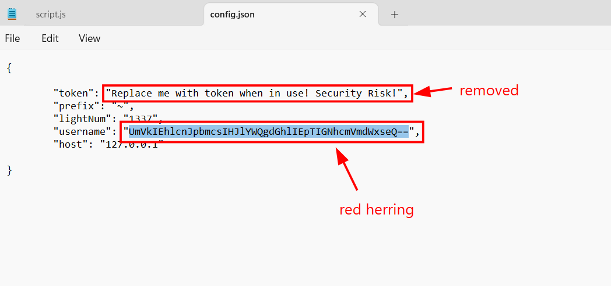
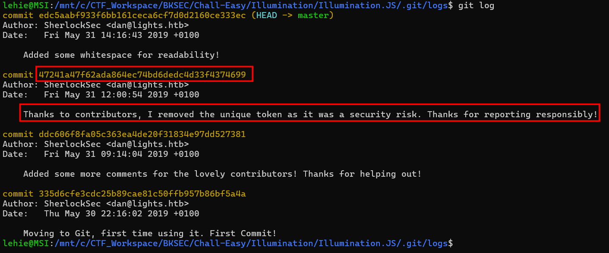
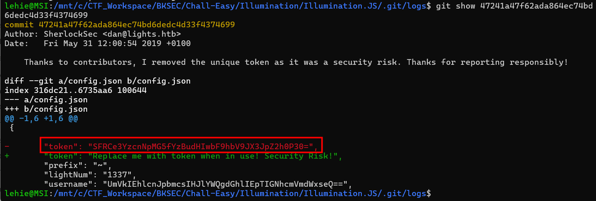
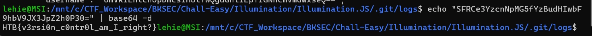

# Illumination

## Scenario

A Junior Developer just switched to a new source control platform. Can you find the secret token?

## Given artefacts

A git repository containing JS source code for a program that perform some modification on Discord interface.

## Solving process:

Upon inspecting the JavaScript code, nothing seems to be vulnerable until the last line, it logins with hard-coded token from a config file!

So I immediately give the config file a check, however, the token has been removed, perhaps by a kind contributor through git:

I also get trolled by that base64 string, forget it, now we head for the .git directory to check for commit history

The kind-hearted contributor is here! He removed the hard-coded token, but we can still see what he removed, given the commit hash id:

That base64 string rings a bell...

`Flag: HTB{v3rsi0n_c0ntr0l_am_I_right?}`