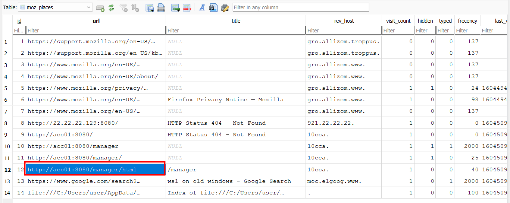
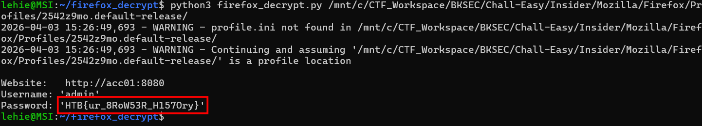

# Insider

## Scenario

A potential insider threat has been reported, and we need to find out what they accessed. Can you help?

## Given artefacts

The whole Mozilla Firebox browser profile is provided, we must use it to uncover the insider threat, and the resources that he has accessed.

## Solving process

Initially, I try to manually investigate the whole directory, as I have no prior knowledge of browser profile, I soon get lost in that labyrinth. Then I perform the recursive grep trick on the whole folder, but the challenge is not that easy. So I have to ask LLM about where to focus on when given a browser profile, and it tells me to:

- Navigated through the provided Mozilla directory to locate the active user profile folder (Mozilla/Firefox/Profiles/<random_string>.default-release/).

- Ignored cache and media folders, focusing instead on the core SQLite databases that store high-value forensic artifacts.

In those files: 

- places.sqlite is the hony grail for Firefox history, it stores URLs, page titles, visit counts and timestamps.

- logins.json & key4.db is the duo responsible for password storage. logins.json contains the encrypted usernames and passwords, while key4.db manages the master key needed to decrypt them. If a Master Password isn't set (which is common), anyone with file-system access can decrypt the vault.

- formhistory.sqlite: is useful for seeing exactly what a user typed into search bars or login forms.

Back to the problem, opening places.sqlite with DB Browser, we can notice suspicious access to some local portals:

That address is for the Apache Tomcat Web Application Manager, I don't know exactly what it is, but it sounds important, and any access to this from normal user needs inspection. After that, they access the Mozilla Firefox browser profile, were they going to access the logins.json and key4.db file to get the passwords that have been saved using built-in Firefox's password manager ?

A hypothesis is that the user stores passwords that way, and now it is abused, we will use an open-source script `firefox_decrypt`, leveraging the two aforementioned file to dump plain-text credentials, if possible.

That's it, the password is our flag, this challenge highlights a major real-world enterprise security risk. Relying on browser-based password managers without setting a strong Master Password leaves all credentials vulnerable to any attacker (or insider) who gains read access to the local disk, that this the lesson, as well as the new tool `firefox_decrypt.py`

`Flag: HTB{ur_8RoW53R_H157Ory}`