# Marshal In The Middle

## Scenario

**The security team was alerted to suspicous network activity from a production web server.&lt;br&gt;Can you determine if any data was stolen and what it was?**

## Given artefacts 

We are armed with a packet capture file, a log from zeek/bro after scanning the pcap file, a secrets.log file , and a PEM file. To make it crystal clear,  a PEM (Privacy Enhanced Mail) file is one of the most common file formats used in cryptography to store and share keys, certificates, and other secure data. Despite the name, it is rarely used for email today. Instead, it has become the universal standard for web server security (TLS/SSL), SSH connections, and digital signatures.

## Initial inspection with wireshark

Initial analysis of the PCAP revealed that the target HTTPS traffic could not be decrypted using the server's RSA private key (bundle.pem). By inspecting the Server Hello packet, it was confirmed that the negotiated cipher suite was `TLS_ECDHE_RSA_WITH_AES_128_GCM_SHA256`.

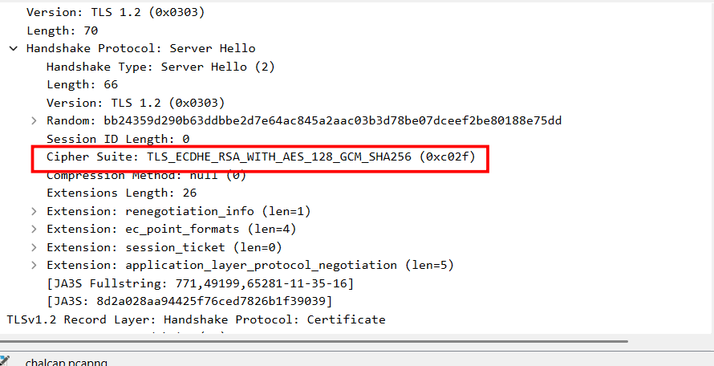

I don't truly understand the full mechanism of this, but I realize that in this setup, the server's private RSA key is only used to sign the handshake and authenticate server. The actual encryption of the payload is handled by temporary, symmetric session keys negotiated mathematically on the fly. Because these ephemeral keys are never transmitted across the wire and are destroyed after the session ends, holding the asymmetric RSA private key is useless for decryption.

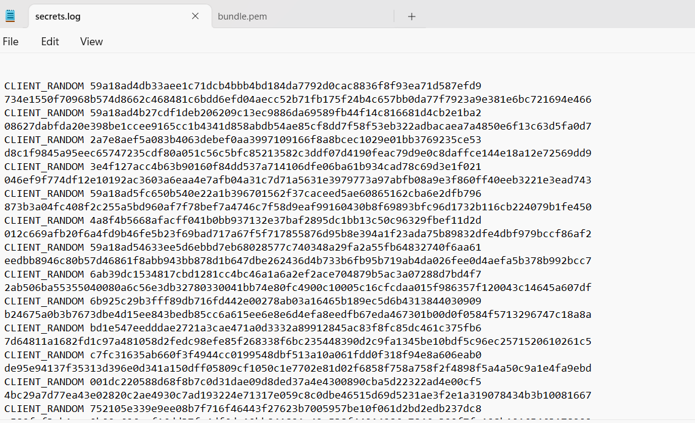

Luckily, another file is given which seems to contain those session keys, I try using it as (Pre)-Master-Secret log file to decrypt the traffic, and it does work:

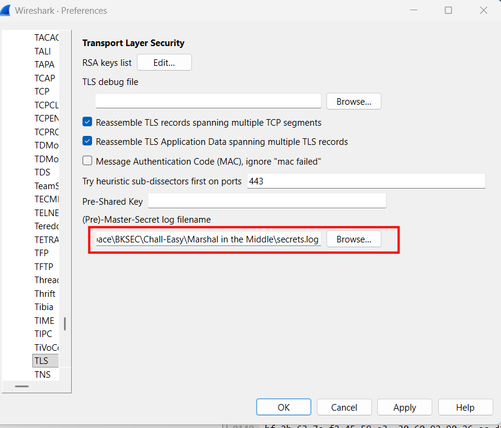

The presence of DNS is a bit higher than normal, but I'm not sure whether something malicious is implied here or not:

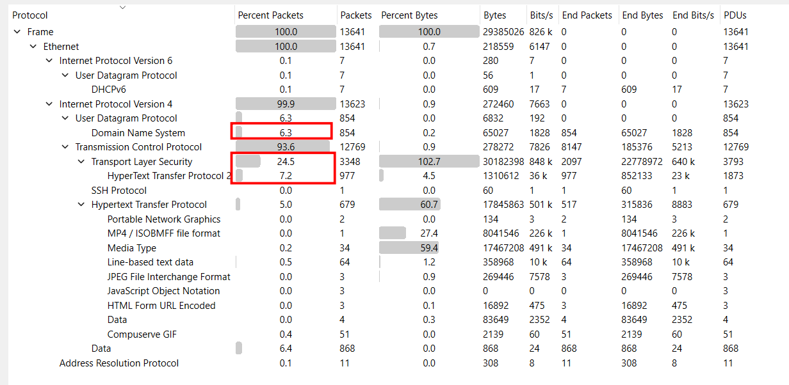

Up to now, I still get lost in this capture, maybe the zeek log would help us narrow down the search space.

## Utilizing zeek logs:

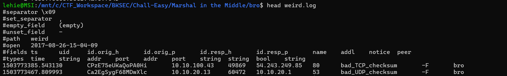

I try inspecting two entries in weird.log, but the bad checksum is perhaps due to some error in transmitting, not malicious indicator.

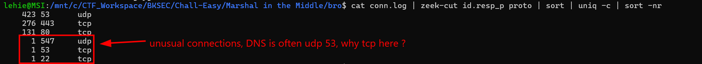

These connections stand out from the remaining. Let's return to wireshark and filter for it

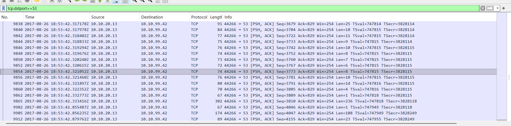

This suspicious stream contains only two host, let's follow this TCP stream:

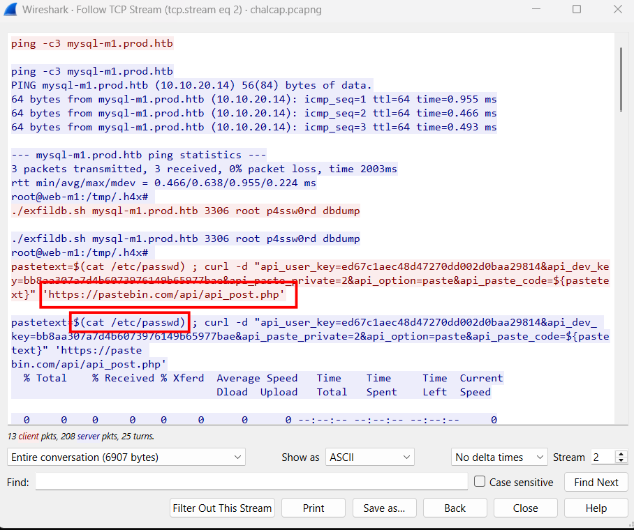

It's clear now, the attacker already gets into the private network, he checks for the sql server using ping, then launches the exfiltration shell script to dump data into a file named dumpdb

After that, he also reads some sensitive file like etc/passwd, etc/shadow and that dumbdb file, then makes a POST request to pastebin, a famous platform for developers to share their snippet of code. This is a legitimate site, thus firewall, IDS/IPS will likely let it go without triggering any alert

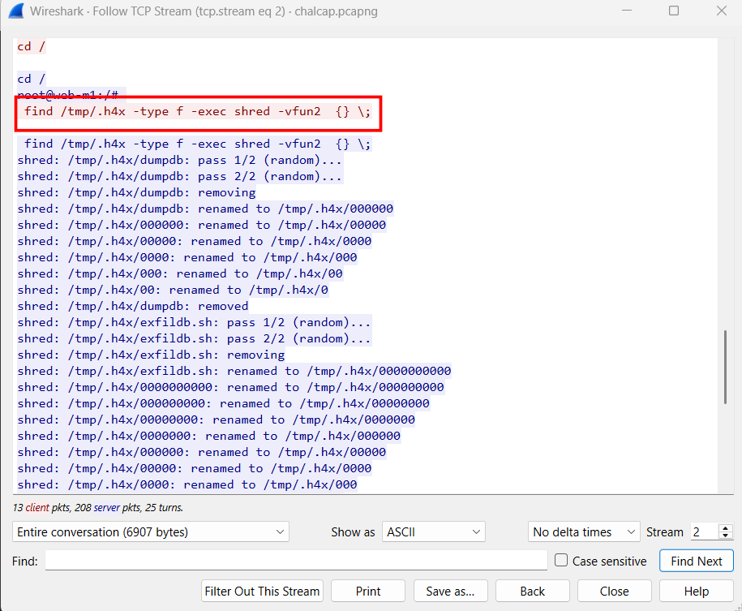

When work is done, he clear the battlefield by finding all files in that temp directory (another sensible detail, he names his temp directory with a leading dot, making it invisible in normal ls command) and shred it to evade forensics inspector. Why he needs to shred it instead of just `rm` ? If he simply run remove file, Linux only delete the pointer to the file, data on the hard disk may not be overwritten immediately , it will lie there until overriden accidnetally by new data. What's more, the paranoid attacker is so careful that he rename the file with 0000 multiple times, as the file name may still be in the inode table, he does this so secutiry engineer cannot even know that file ever exists.

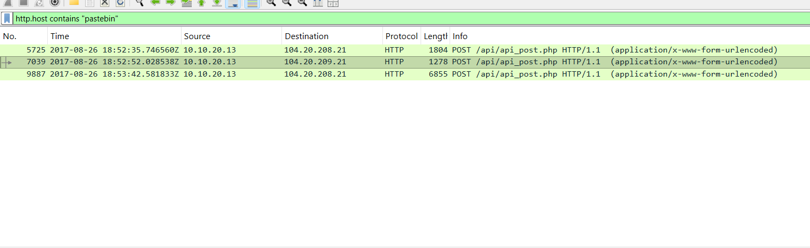

Filtering for HTTP request to pastebin, there are 3 packets corresponding to 3 exfiltration commands from the attacker

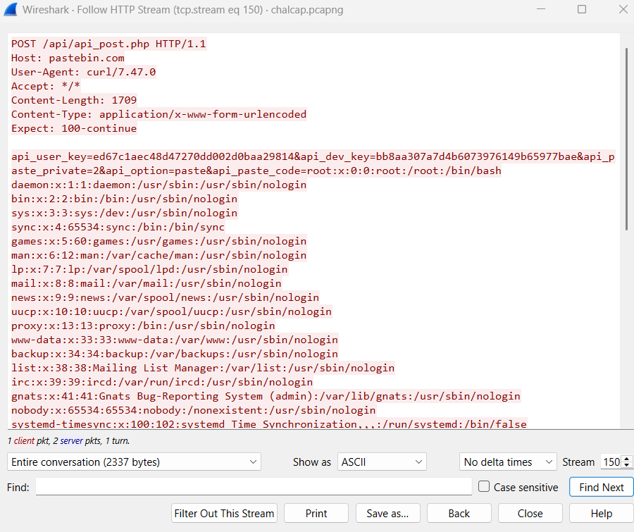

This is etc/passwd

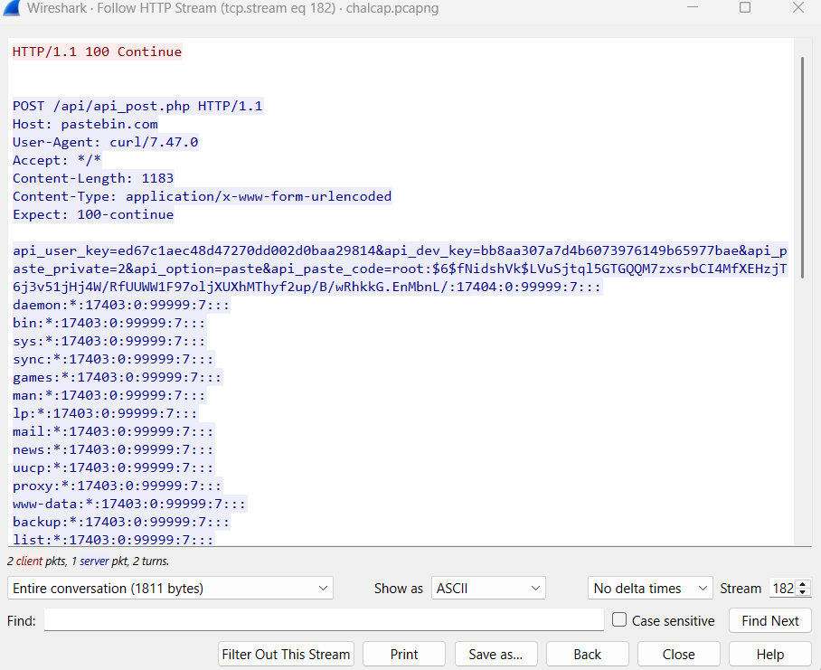

This is etc/shadow

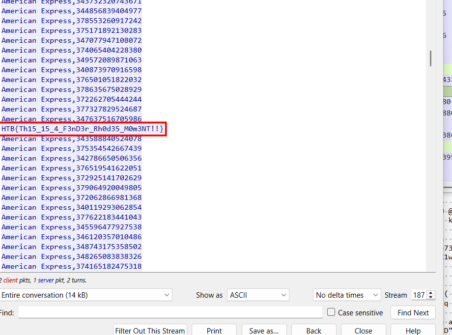

This is the database, and the flag we need

`Flag: HTB{Th15_15_4_F3nD3r_Rh0d35_M0m3NT!!}`