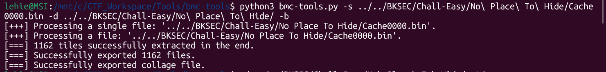
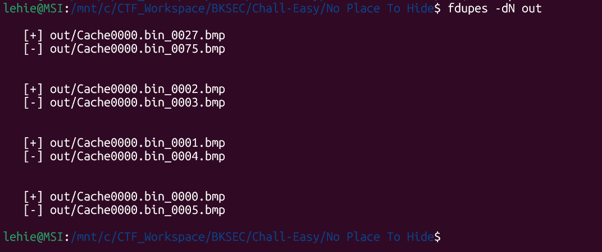
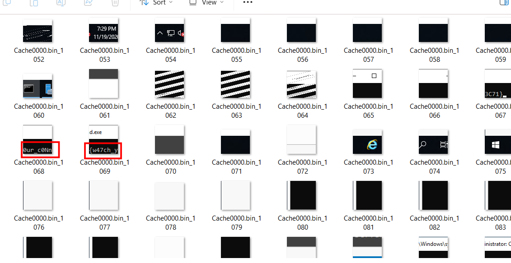
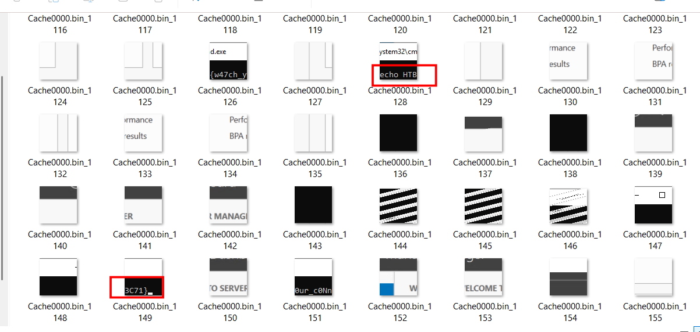

# No Place To Hide

## Scenario:

**We found evidence of a password spray attack against the Domain Controller, and identified a suspicious RDP session. We'll provide you with our RDP logs and other files. Can you see what they were up to?**

## Given artefacts

We are given a .bin file and a .bmc file (0 bytes), at first I don't even know what kind of find is this, after some searches, I get that this is [RDP Bitmap Cache](https://hejelylab.github.io/blog/IRC/RDP-Bitmap-Cache)

RDP is used to remote desktop with graphical view, if it simply transmit screen view through the network, it will be evry slow and costly in terms of bandwidth. So Windows comes up with an idea, it will cut static images on the screen like the start button, app icon, and even the text that is being read,... into several small, square images, and save these into hard disk of the machine that is performing remote access, so the next time it need to display the start button, for example, it will just pull it from the cache, no need to transmit over internet.

## Tool

For this type of artefact, we need to employ a dedicated tool called `bmc-tools`, created by ANSSI

## Solving process

 

Run the tool on the destination .bin file

The output folder look scary with a lot of images, I use `fdupes` to remove duplicate images, if exist:

But we still have no other way but to inspect these images manually. Luckily, flag fragments lies closely to each other:

`Flag: HTB{w47ch_y0ur_c0Nn3C71}`