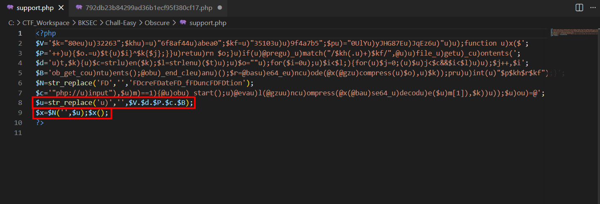
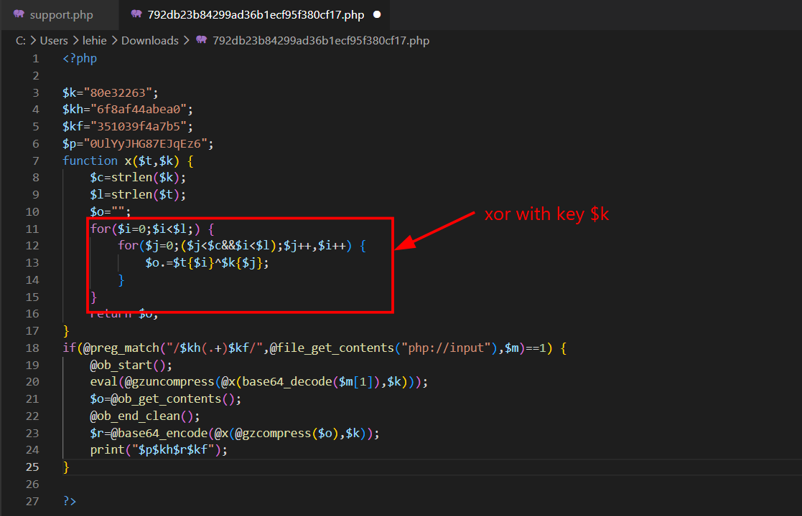
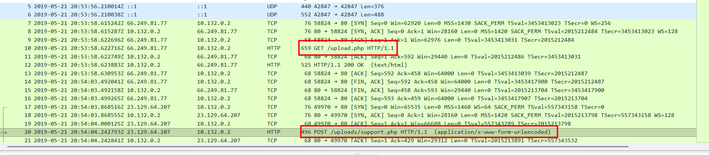
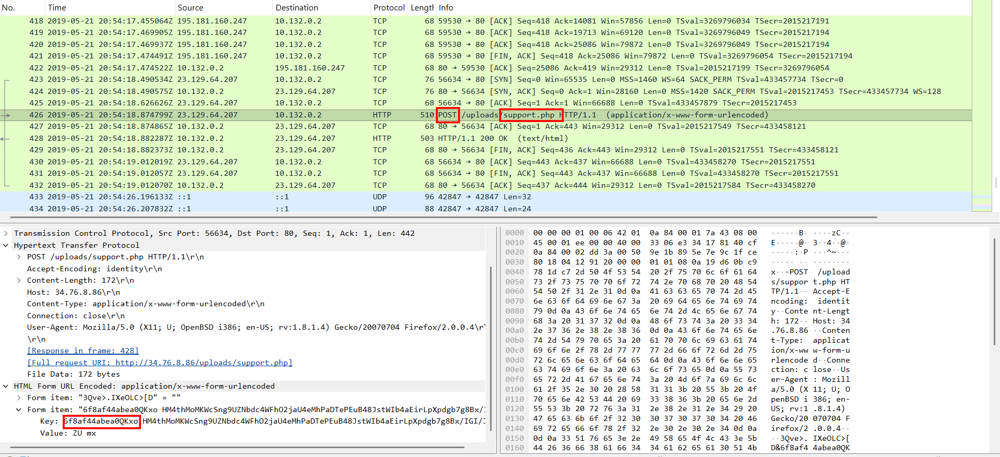
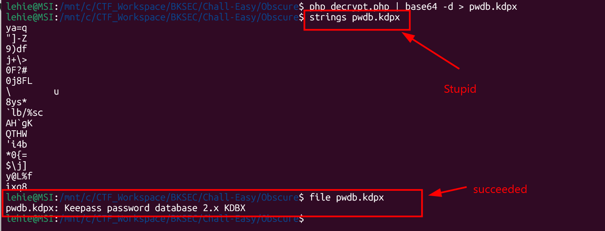
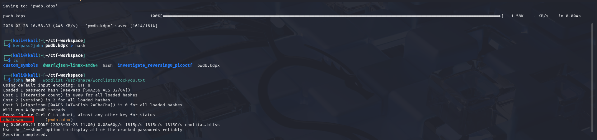
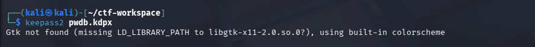
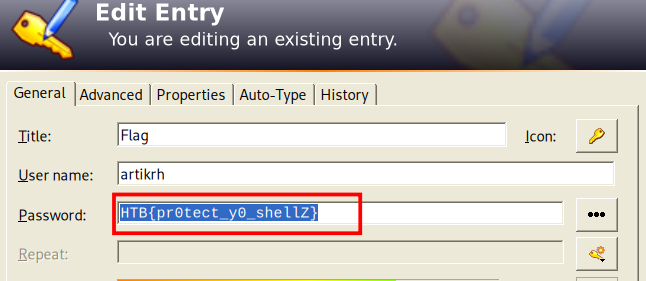

# Obscure

## Scenario:

**An attacker has found a vulnerability in our web server that allows arbitrary PHP file upload in our Apache server. Suchlike, the hacker has uploaded a what seems to be like an obfuscated shell (support.php). We monitor our network 24/7 and generate logs from tcpdump (we provided the log file for the period of two minutes before we terminated the HTTP service for investigation), however, we need your help in analyzing and identifying commands the attacker wrote to understand what was compromised.**

## Given artefacts:

With two files, a pcap and a obfuscated php code, I choose to inspect the php code first, as before we dive in to traffic, we had better know what to focus on first.

## Start with PHP code



The code is obfuscated, but the mechanism is simple, it just adds junk `u)` pattern then remove it at the end, and also join characters to form `createFunction()` to execute the payload, we can add before the executing line to get the actual payload:

```php
print_r($u);
die();
```

However, I choose to use an online deobfuscate tool instead, the result is as follow:



### This must be a webshell !, let's break it down to see what is it purpose:
- Four variables are declared, they the the key and the 'mark' that the webshell relies on to know which is command from attacker.
- The function x() perform XOR between data `$t` and key `$k`, key will be repeated if the data is longer.
- Then it uses `file-get-content()` to get the raw body of http post request directly from the incoming request, avoid being logged
- After that, it performs regex to check whether the data is sandwiched between two declared patterns, if not, it plays dead and look like a normal webpage. Otherwise, the actual payload will be saved in `$m`.
- Then it open output buffer `ob_start()`, base64-decode, xor with key k and gzip decompresses the data, and `eval()` the deadly function will treat the text as php code, executes it directly on the server.
- Then the data in the output buffer is save in `$o` veriable, the buffer is cleared, and data in `$o` is processed in reverse to the above procedure: base64-encode, xor, and compress it before sending back to the attacker, therefore, for IDS/IPS, it just looks like a gibberish packet.

## Return to Wireshark

Now that we know how it works, let's inspect the pcap file to see what has been done:



This is where the attacker uploads the malicious php code, which then becomes a webshell.



The attacker begins to send command here, note the header of data matches the pattern in the php code. Now I will construct a php script to get the original command, leveraging their malicious code:

```php
<?php
$k = "80e32263";
$payload = "";
function x($t, $k) {
    $c = strlen($k);
    $l = strlen($t);
    $o = "";
    for ($i = 0; $i < $l;) {
        for ($j = 0; ($j < $c && $i < $l); $j++, $i++) {
            $o .= $t[$i] ^ $k[$j];
        }
    }
    return $o;
}

$decoded = gzuncompress(x(base64_decode($payload), $k));

echo "[*] Decoded Output:\n\n";
echo $decoded . "\n";
?>
```

`chdir('/var/www/html/uploads');@error_reporting(0);@system('id 2>&1');`

This is the first command, it changes directory to /uploads, suppress error, and gather user's information

`chdir('/var/www/html/uploads');@error_reporting(0);@system('ls -lah /home/* 2>&1');`

Then list all content in home directory

`chdir('/var/www/html/uploads');@error_reporting(0);@chdir('/home/developer')&&print(@getcwd());`

Nagivate to developer home and confirm access

`chdir('/home/developer');@error_reporting(0);@system('base64 -w 0 pwdb.kdbx 2>&1');`

Then the exfiltration phase begins, the attacker exfil the KeePass password database and b64 encode it, ensuring the binary content is not corrupted during transimission, KeePass is a famous password-managing platform.

First we decode the repsponse exactly the same as the command, but b64-decode it another time, then save to a file named `pwdb.kdbx`



I will change to Kali VM to use john the ripper more conveniently



After cracking, we get the password for keepass here, now open it:





`Flag: HTB{pr0tect_y0_shellZ}`
