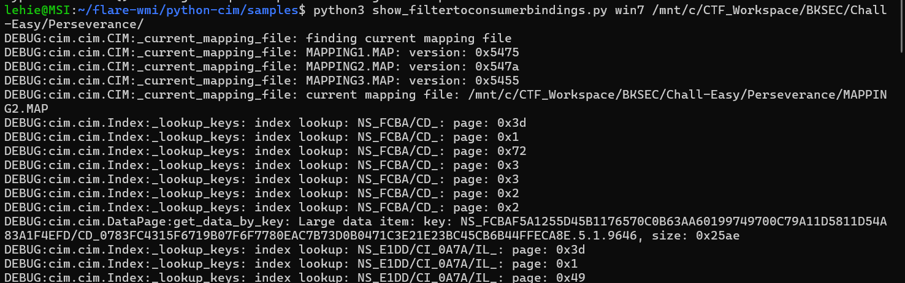
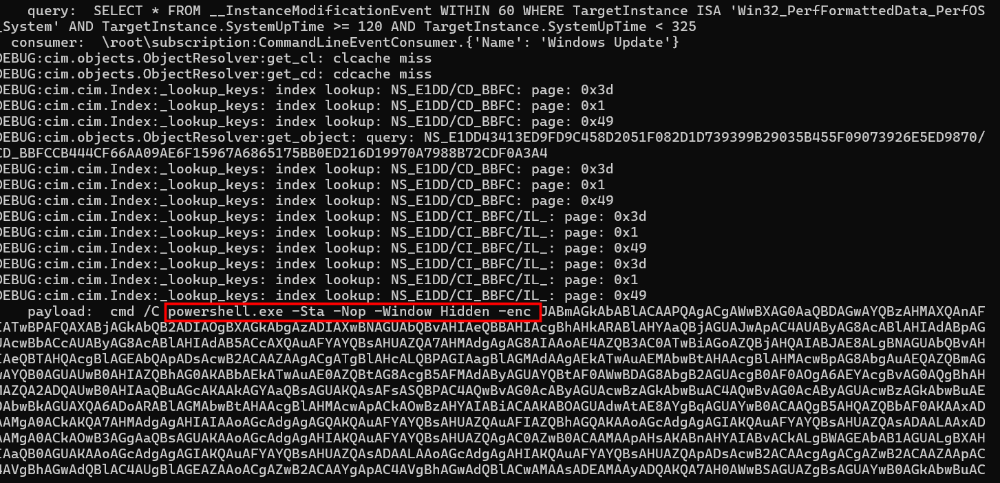
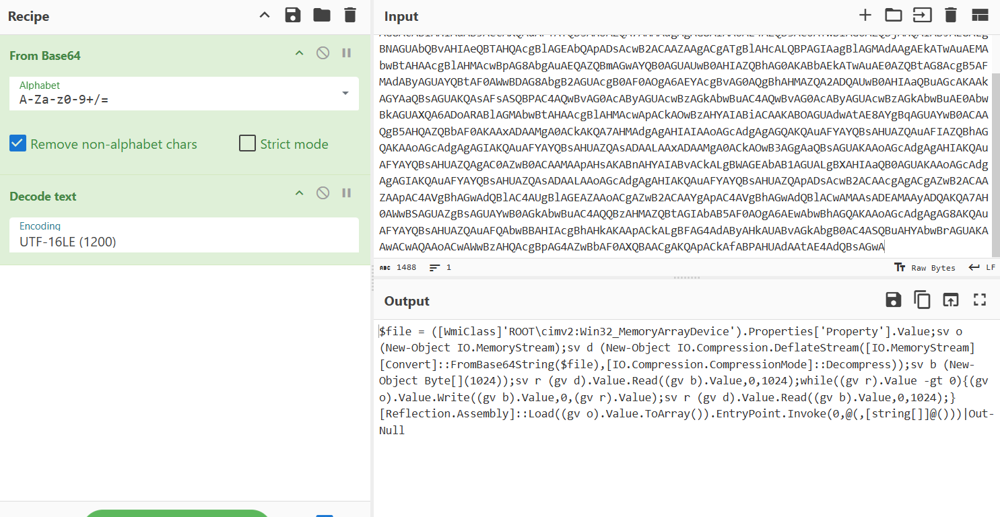
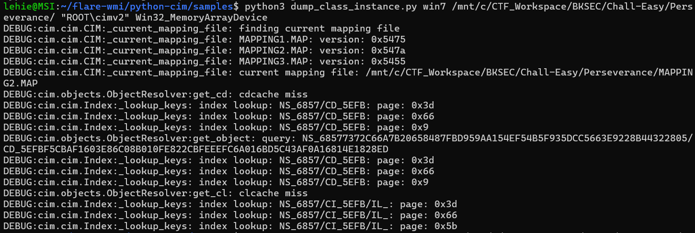
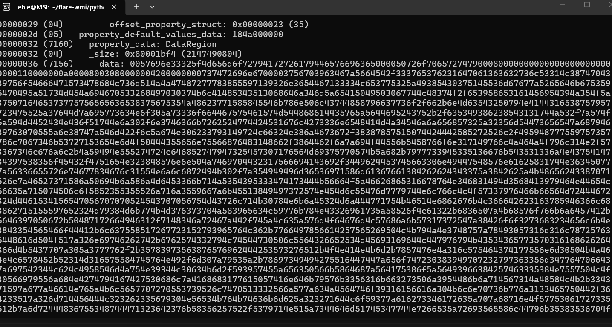
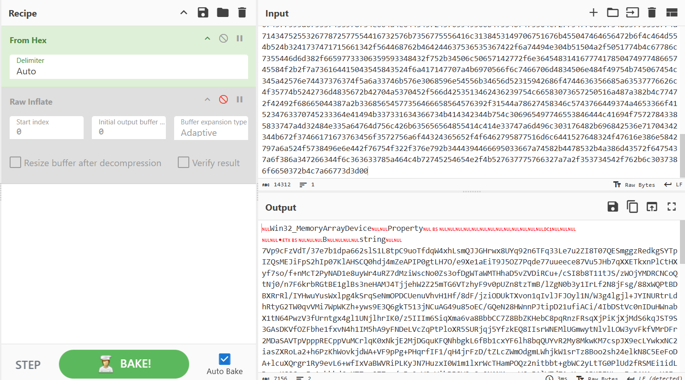
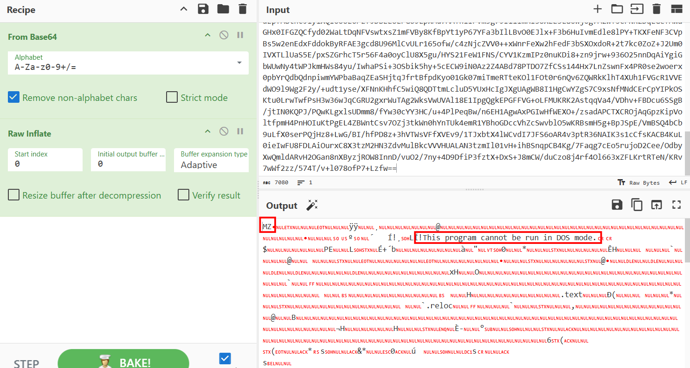
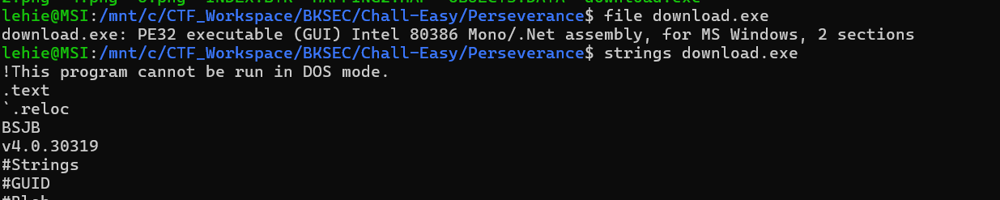
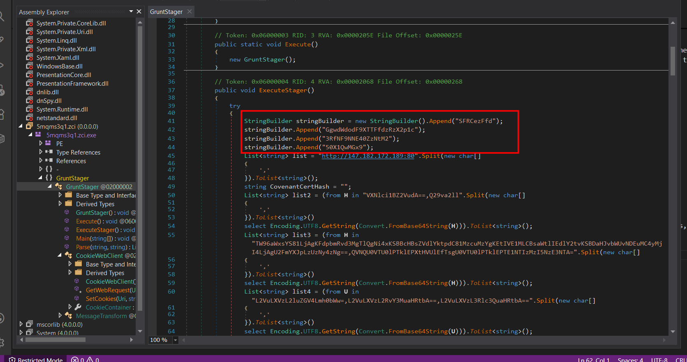
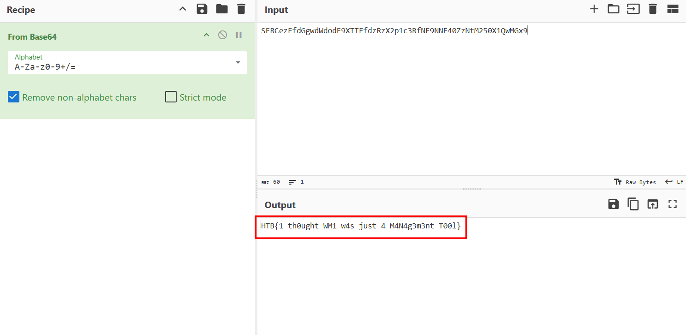

# Perseverance

## Scenario

During a recent security assessment of a well-known consulting company, the competent team found some employees' credentials in publicly available breach databases. Thus, they called us to trace down the actions performed by these users. During the investigation, it turned out that one of them had been compromised. Although their security engineers took the necessary steps to remediate and secure the user and the internal infrastructure, the user was getting compromised repeatedly. Narrowing down our investigation to find possible persistence mechanisms, we are confident that the malicious actors use WMI to establish persistence. You are given the WMI repository of the user's workstation. Can you analyze and expose their technique?

## Given artefacts

As the problem suggests, they give us WMI repository of the user's workstation, however, this thing is rather strange to me, so I have to search some references on the Internet, and [this page](https://netsecninja.github.io/dfir-notes/wmi-forensics/) is very helpful.

## Summary of must-know terms and files

- Event Filter - A monitored condition which triggers an Event Consumer
- Event Consumer - A script or executable to run when a filter is triggered
- Binding - Ties the Filter and Consumer together
- CIM Repository - A database that stores WMI class instances, definitions, and namespaces
- MOF - Managed Object Format file, used to define WMI classes to be inserted into the repository

**C:\Windows\System32\wbem\Repository - Stores the CIM database files**
- OBJECTS.DATA - Objects managed by WMI
- INDEX.BTR - Index of files imported into OBJECTS.DATA
- MAPPING[1-3].MAP - correlates data in OBJECTS.DATA and INDEX.BTR
**C:\Windows\System32\wbem\AutoRecover - MOF files with #PRAGMA AUTORECOVER in first line will be saved here in case the repo needs to be built again, establishing persistence.**
- Review file timestamps

## Solving process

First, I grab the tools suggested by the aforementioned article, python-cim, by cloning into that repo and install the dependencies with pip (add --brraking-system-packages as I do this in WSL). Then run this script:

At the end of the result, we can see a highly suspicious payload

Decode it with cyberchef, the original intention is as follow:

The attacker does not put the final payload inside Event Comsumer, they hijack an entirely different WMI class (Win32_MemoryArrayDevice in the ROOT\cimv2 namespace) and stuffed their massive compressed executable inside a custom property they named Property. Then this script loads its content, base64-decodes it and decompresses it with Inflate. So we will try to get the payload hidden in that properties and decode it:

Initially, I try using this script to look for an instance of that class, but nothing is suspicious, no massive base64 string, so there must be a problem with the approach. After some re-consideration, also with the help of LLM, I realize that the attacker does not create a new instance of that class, instead, he modifies the blueprint (or the class definition) and hard-codes the payload inside the default properties themselves. So I switch to `dump_class_definition.py`:

We get a massive block, but not base64, it seems more like hex, so I try hex-decode it with cyberchef first:

Great, the base64 block is here, now decode it with base64 and decompress with inflate:

That's it, a Windows executable, I struggle quite long with Defender to download it, finally I have no choice but to temporarily disable it.

This indicates the payload is a .NET Windows executable (32-bit), specifically a Mono/.NET assembly, which makes sense for malware targeting Windows environments, the most powerful tool for .NET executable is dnSpy (I try ghidra first, but it does not work as expected):

It's quite straight-forward as there is only 1 huge main function, that base64 string rings a bell - the prefix HTB{..}, so I'm quite sure we get the flag now:

I intend to thoroughly analyze it, but then realize it is rather complex, perhaps a real C2 set-up script, so I will return to it later when I have time

`Flag: HTB{1_th0ught_WM1_w4s_just_4_M4N4g3m3nt_T00l}`