# Pursue the tracks

## Scenario

**Luxx, leader of The Phreaks, immerses himself in the depths of his computer, tirelessly pursuing the secrets of a file he obtained accessing an opposing faction member's workstation. With unwavering determination, he scours through data, putting together fragments of information trying to take some advantage on other factions. To get the flag, you need to answer the questions from the docker instance.**

We are given a `.mft` file, mft stands for Master File Table in NTFS file system, the core database in every NTFS volume. It stores one record for every file and directory, including metadata like names, timestamps, permissions, where the file data lives in disk...

## Some properties of `.mft` file

- Every NTFS volume has exactly one MFT, stored as a system file named .
- Each file/directory has a 1024‑byte MFT entry.
- The MFT grows as new files are created and does not shrink when files are deleted.
- It is essential for the filesystem — damaging it can make the entire volume unreadable.

## Tool to use

At first I don't know how to inspect this file, LLM returns a list of result but they are somehow troublesome to install. After referring to online sources, I know that Eric Zimmerman (the one who creates EvtxECmd tool for parsing logs) also has a tool crafted specifically for this type of file, named MFTECmd for CLI and MFTExplorer (GUI). I install the GUI version and load the `.mft` file to it interface.

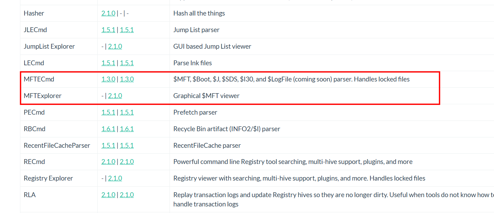

## Answering questions

*1. Files are related to two years, which are those ?*

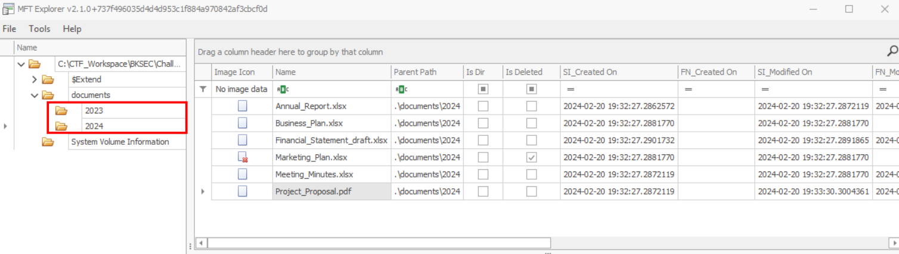

**Answer: 2023,2024**

*2. There are some documents, which is the name of the first file written ?*

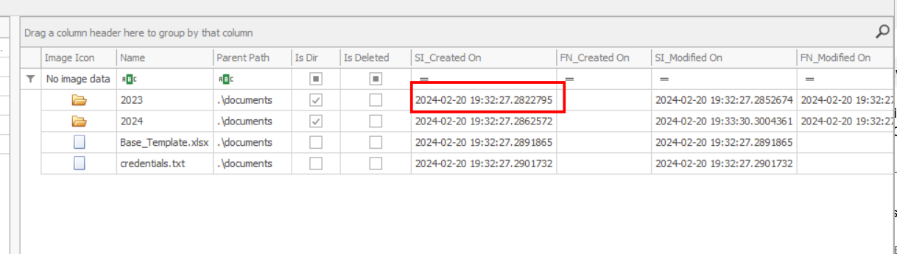

The timestamp only differ by fraction of a second, but we will dig into this folder

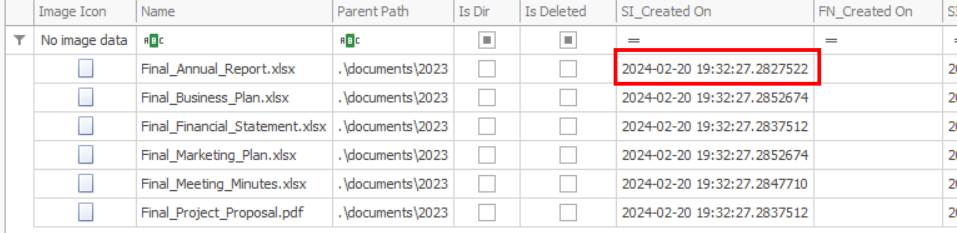

This is the first file written

**Answer: Final_Annual_Report.xlsx**

*3. Which file was deleted?*

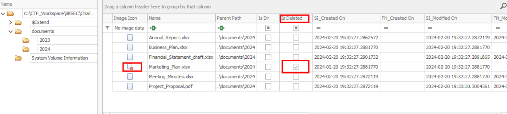

As I have noted, MFT file grows as new files are added, but **does not shrink** as files are deleted, and records are kept here.

**Answer: Marketing_Plan.xlsx**

*4. How many of them have been set in hidden mode?*

Asking LLM for indicator of hidden file in mft file:

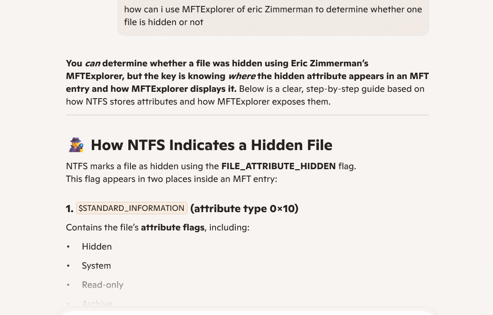

Only this file has that flag:

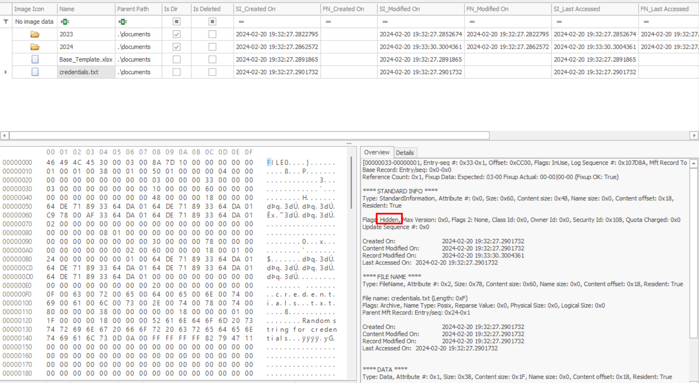

**Answer: 1**

*5. What is the filename of the important TXT file that was created ?*

It is the hidden file we mentioned

**Answer: credentials.txt**

*7. A file was also copied, what is the new filename ?*

At first I was quite confused with the 'is copied' cell in MFTExplorer, so I ask LLM to understand its true meaning:

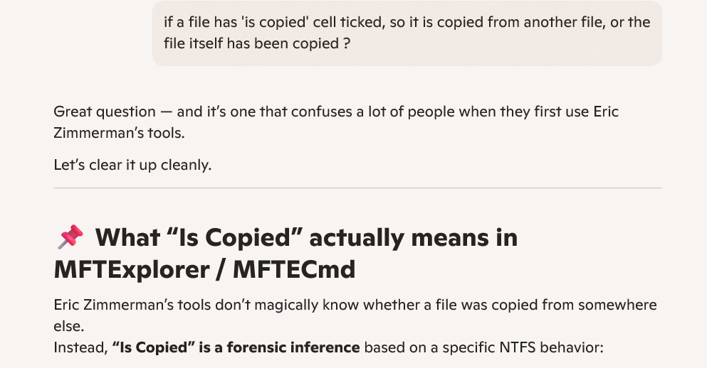

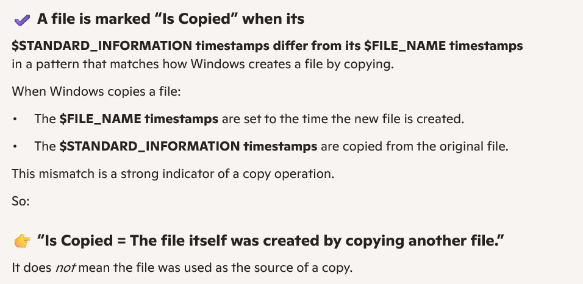

So this file is a copy of another file:

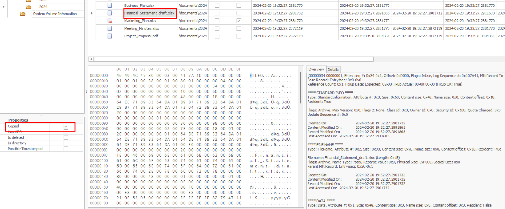

**Answer: Financial_Statement_Draft.xlsx**

*8. Which file was modified after creation ?*

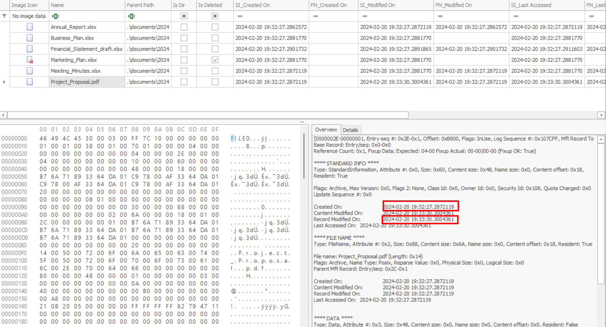

Other files may also have some discrepancy between Created time and modified time, but only in miliseconds and should be the system latency, not actual modification.

**Answer: Projetc_Proposal.pdf**

*9. What is the name of the file located at the record number 45 ?*

45 in DEC corresponds to 0x2D in HEX:

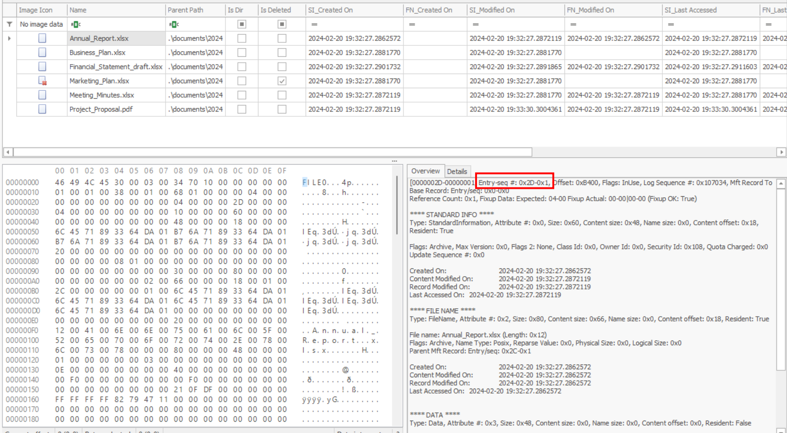

Note that the second number is `sequence number`, it records how many times that record entry has been used, if the file is deleted and then another file fills that slot, the sequence number will increment by 1.

**Answer: Annual_Report.xlsx**

*10. What is the size of the file located at the record number 40 ?*

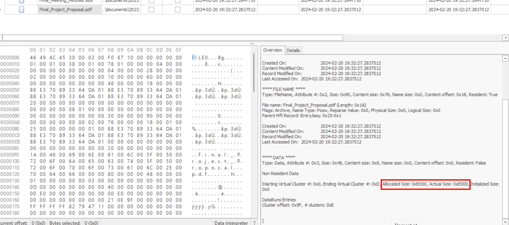

Just convert to decimal, trivial if you already got an A for Computer Architecture 

**Answer: 57344**

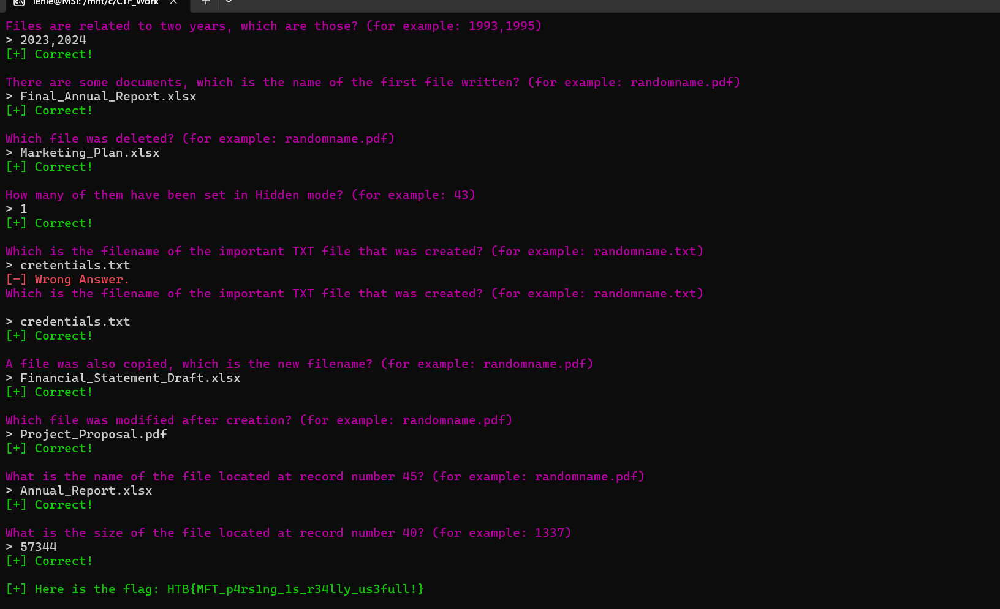

`Flag: HTB{MFT_p4rs1ng_1s_r34lly_us3full!}`