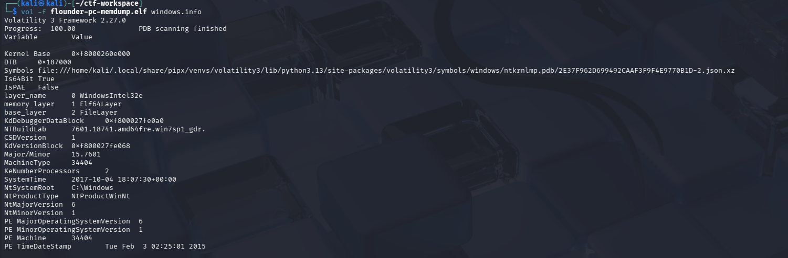
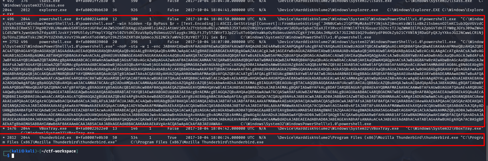
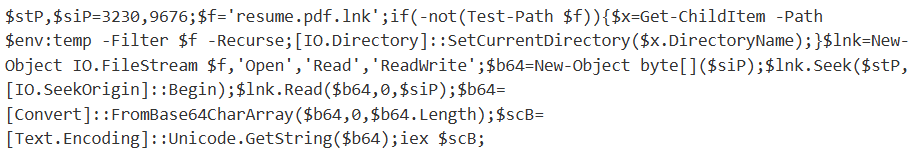
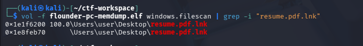
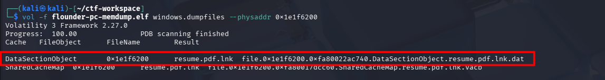
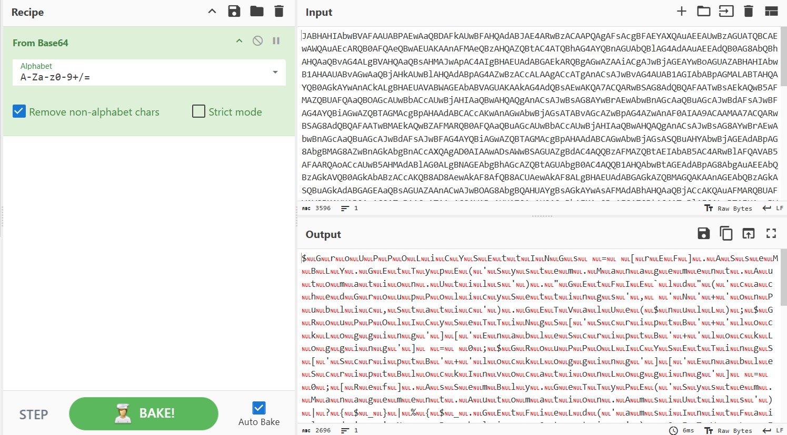
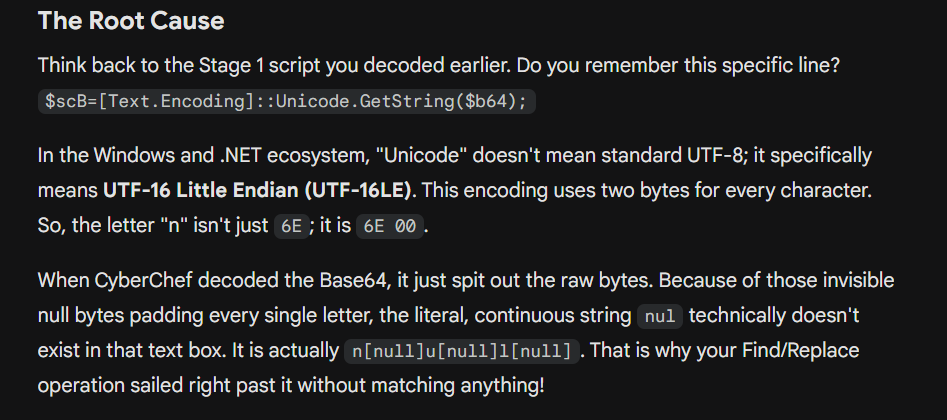
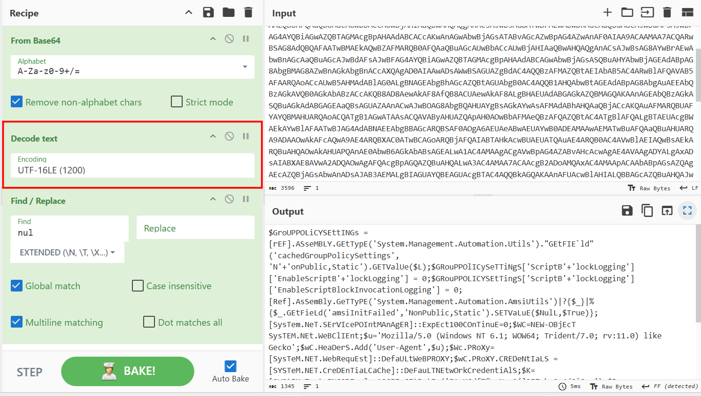
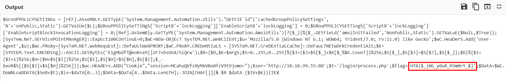

# Reminiscent

## Scenario:

**Suspicious traffic was detected from a recruiter&#039;s virtual PC. A memory dump of the offending VM was captured before it was removed from the network for imaging and analysis. Our recruiter mentioned he received an email from someone regarding their resume. A copy of the email was recovered and is provided for reference. Find and decode the source of the malware to find the flag.**

## Initial thought

From the given artefacts and scenario, my instinct tells me that we should start with the email first, as that phishing attempt might have been the entry point that compromised the recruiter's machine. But when trying to access the attachment in the email, I cannot get it, so my mind shift to investigating the memory dump.

## Volatility3 revisited

First I inspect windows.info by convention:

Then move to the pstree:

Nothing more to say, the recruiter open the mail in thunderbird mail and download the malware, then weird powershell commands are ignited

Decode the first powershell script from base64, I get this:

### Let's break it down:

- First it defines $stP (start position) as the offset, and $siP (size position) as length. Then it checks if it is in the same directory as the malicious file (as if user presses the zip file inside an email, Windows often decompressed it in a temporary directory before executing), if not, it finds in the %TEMP% directory and moves to it. Note that the malicious lnk file is pretending to be a pdf.
- Then it opens `resume.pdf.lnk` as raw binary file stream (`IO.FileStream`) and creates an empty bucket `$b64` designed to hold exactly 9676 bytes. After that, it moves the reading cursor exactly 3230 bytes deep into the lnk file, efficiently skip the file header and read the next 9676 bytes to the `$b64` bucket. 
- Then the payload inside the `$b64` is decoded to `$scB` and executed directly in the memory with Invoke-Expression.

Now I will run filescan to see if we can get the .lnk file to extract payload:

Note that we get 2 addresses here, but on hard drive there is only 1 file, volatility reads RAM, not disk, it read the File-Object that corresponds to each time it is opened, perhaps it was opened by `explorer.exe` to get the shortcut image, and `powershell.exe` as the malicious file read its data

Then I dump the file out and choose the complete file, the content is as follow:

The first chunk of base64 is the script we have discussed, and part of the second large chunk (only 9676 bytes) is taken and decoded as the second payload, but we don't need to mannually extract it, just look at the pstree, it is the second powershell.exe that is spawned as child process of the first one:

At first I don't know how to remove the annoying 'nul', I try find/replace but it still does not work as expected, so I have to ask LLM for help:

So the correct recipe should be: 

The flag is already in the final payload, but I will try to understand the allegedly C2 set-up payload:

- First it uses reflection to reach into powershell's internal memory and disable script logging, so that the command executed will not be logged into powershell log in EventViewer (ID 4104). Then it also disable AMSI (anti-malware scan interface), which scan powershell script in memory before allowing it to execute. 
- Then it tries to blend into normal traffic by setting up a web client, spoofing user-agent to look like IE running on a Windows 7 machine. What's more, many enterprise networks force all traffic through a corporate proxy. By grabbing the `DeFauLTNetwOrkCredentiALs`, the malware steals the logged-in user's session tokens to seamlessly authenticate through the corporate proxy without triggering any alerts.
- The next part is the cryptography background used to encrypt/decrypt traffic data, I'm unable to understand its mechanism, just search and know that it is RC4.
- Finally, it connects to the attacker's server, adding a specific cookies (this is to ensure that the actual compromised machine is requesting, not a security researcher), downloading the encrypted data, take first 4 bytes of it as Initialization vector, combined with the hard-coded key and pass them with the rest of data to the cryptography routine above to decrypt the data, then it executes it in memory with IEX.

`Flag: HTB{$_j0G_y0uR_M3m0rY_$}`

