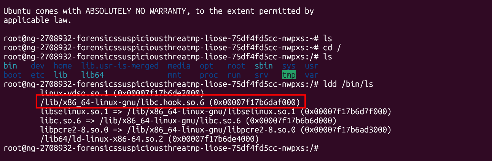
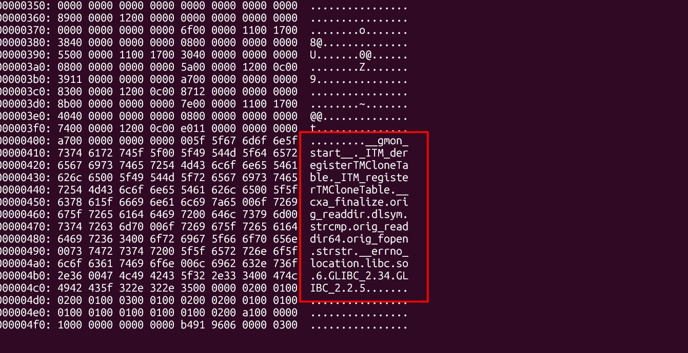
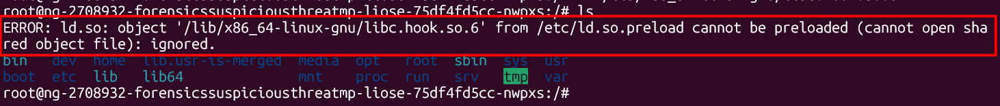
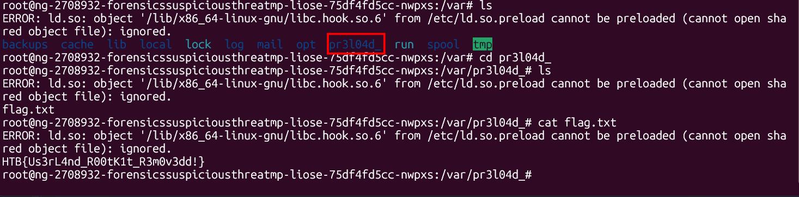

# Suspicious Threat

## Scenario

Our SSH server is showing strange library linking errors, and critical folders seem to be missing despite their confirmed existence. Investigate the anomalies in the library loading process and filesystem. Look for hidden manipulations that could indicate a userland rootkit.

Creds: root:hackthebox

## Given artifact

Not a real artifact, but we will spawn a SSH server, connect to it and begin inspecting

## Foundational knowledge

- To be honest, I just use Linux commands without understanding its system thoroughly, so then concept of Shared Libraries / Shared Objects seems unfamiliar to me. After externally searching and asking LLM, I know that a Shared Object (`.so` file) has the same meaning as `.dll` file in Windows. Instead of writing the same code over and over (like how to read a file, or how to print text to the screen), developers put that code into shared libraries. When you run a command like ls or cat, the Linux system dynamically loads these `.so` files so the command can function.

- About the `ldd` command, it stands for **list dynamic dependencies**, for example when we run `ldd /bin/ls`, we are asking the system about which `.so` libraries does it need to load to work properly.

- Linux has a special feature (often controlled by a file called /etc/ld.so.preload) that allows an administrator to force the system to load a specific library before anything else, every single time any command is run. In this challenge, the attacker leverages this feature to disable some of the SSH's server command

## Solving process

Let's first check `ldd` for the most basic command: ls

A red flag immediately catches my eyes, a `.so` file in /lib directory, this does not seem true. Perhaps due to its existence, we cannot list files in some important direcotories, it always returns nothing. I want to inspect it, but the SSH server lacks almost everything, no strings, no nm, no objdump. I have no choice but to use xxd:

`orig_readdir` & `orig_readdir64`: This is the most critical find. Standard shared libraries don't normally have functions prefixed with orig_. When a rootkit "hooks" a standard Linux function like `readdir` (which is the system call used by commands like ls and find to list files in a directory), it needs a way to call the real function to get the actual list of files before it filters out the ones it wants to hide. It typically stores a pointer to the real function under a name like `orig_readdir`.

`orig_fopen`: Similar to the above, this shows the rootkit isn't just hiding files from directory listings; it is also intercepting attempts to open files directly. If you tried to use a command to open the flag, this hook would likely intercept and block it.

`strcmp` & `strstr`: These are C functions for string comparison and substring searching. Once the hook gets the true list of files from orig_readdir, it uses these functions to check the filenames. If strstr finds the substring "flag" in a file's name, the rootkit knows to drop that result so it never reaches your terminal screen.

Let's remove it, and now whenever I run a command, this error pops up, it confirms the `.so` is pre-loaded every time we fire a command to intercept and block when some conditions satisfy:

While searching for the flag, I see this weird directory, diving into it, I see the flag

`Flag: HTB{Us3rL4nd_R00tK1t_R3m0v3dd!}`