# Tangled Heist

## Challenge Scenario

**The survivors' group has meticulously planned the mission 'Tangled Heist' for months. In the desolate wasteland, what appears to be an abandoned facility is, in reality, the headquarters of a rebel faction. This faction guards valuable data that could be useful in reaching the vault. Kaila, acting as an undercover agent, successfully infiltrates the facility using a rebel faction member's account and gains access to a critical asset containing invaluable information. This data holds the key to both understanding the rebel faction's organization and advancing the survivors' mission to reach the vault. To get the flag, spawn the docker instance and asnwer the questions!**

## Given artifacts

A packet capture file

## Solving process

The scenario is rather confusing, so I head directly for the given packet capture file. Upon analyzing the hierarchy protocol, I see the dominance of LDAP , a protocol used for query and modify directory services. And in this scenario, Windows AD leverages it.

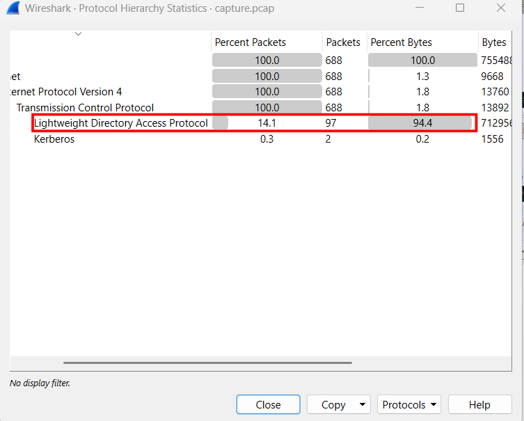

To be honest, this protocol is rather unfamiliar to me when I prepare this write-up. So I have to do some external research, leveraging both Google and AI, and I find [this site](https://www.golinuxcloud.com/analyze-ldap-traffic-with-wireshark/#:~:text=down%20the%20session.-,Simple%20Authentication%20and%20Security%20Layer%20(SASL),%23ldapsecure%2Dtbl%2D5) quite helpful. 

## 1. Which is the username of the compromised user used to conduct the attack? (for example: username)

From the given article, we know that binRequest() is used for authentication. There are three types of authentication: **simple, anonymous and SASL** . SASL leverages multiple authentication mechanisms like NTLM, Keberos,...

Looking at the very first binRequest, we see that NTML is employed for SASL authentication, and the compromised username is given:

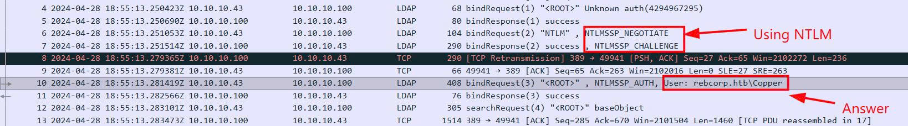

**Answer: Copper**

## 2. What is the Distinguished Name (DN) of the Domain Controller? Don’t put spaces between commas. (for example: CN=…,CN=…,DC=…,DC=…)

The terms in LDAP packet are quite confusing, here Distinguished Name is simply the full path to an object in a LDAP directory tree. DN's components are CN (common name), OU (organization unit) and DC (domain component)

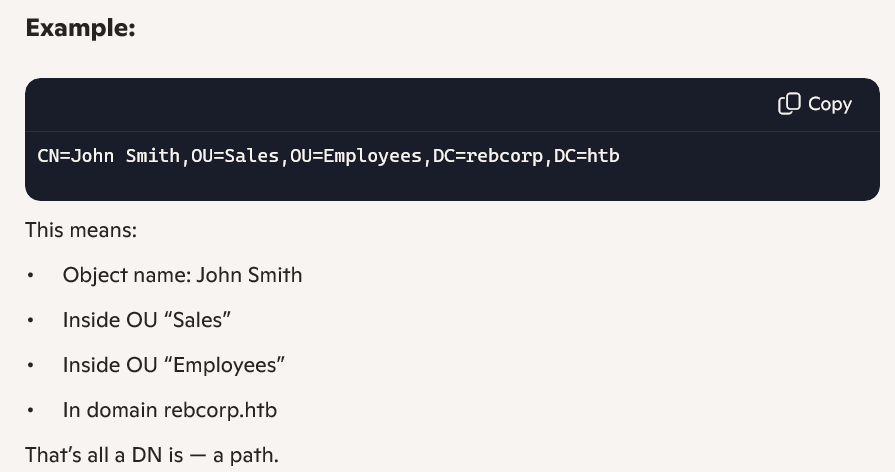

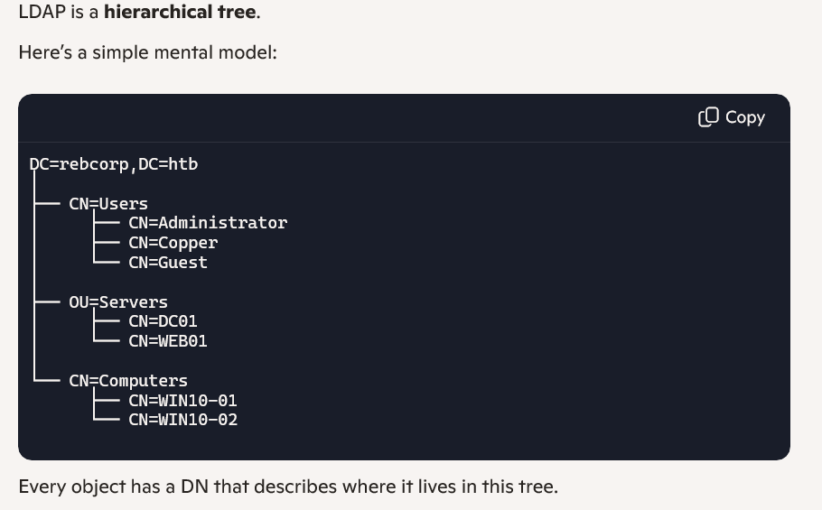

For this problem, I don't use any filter, one reason is that I'm not so familiar with the vast components in the request/response, the other is that I want to manually inspect to further understand the structure. In fact, I don't even know that 'Domain Controller'stands in OU unit, but I manage to find the packet where it is returned:

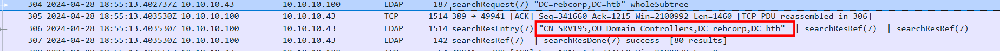

Domain controller is a machine, thus it must have a hostname, in this case it belongs to 'Domain Controller' group (OU), we find it the same as any other machine. In other words, Domain Controller plays server role, but it is also a machine and has an LDAP account.

**Answer: CN=SRV195,OU=Domain Controllers,DC=rebcorp,DC=htb**

## 3. Which is the Domain managed by the Domain Controller? (for example: corp.domain)

I try searching in the previous packet, but nothing about domain name is available. Being desperate, I search for the term 'Domain name' in packets' detail and get the answer, it appears to be in the Auth packet:

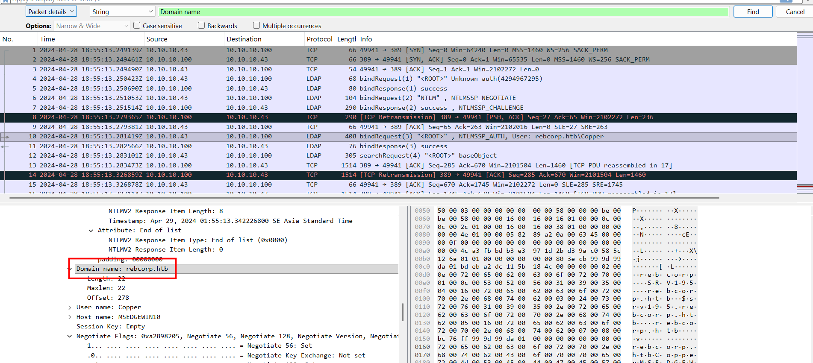

We can also notice that in every command, attacker performs search on baseObject `Dc=rebcorb Dc=htb` , as from right to left it is more specific, we can deduce the domain is rebcorp.htb. 

**Answer: rebcorp.htb**

## 4. How many failed login attempts are recorded on the user account named ‘Ranger’? (for example: 6)

Analyze the response packet for user Ranger, we can get the number of failed login attempt since the last successful one in the badPwdCount field:

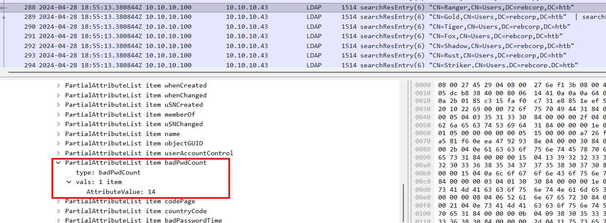

**Answer: 14**

## 5. Which LDAP query was executed to find all groups? (for example: (object=value))

This must lie in one of the searchRequest packets, I try applying as filter for the `protocolOp` field and know that code for searchResponse is 4, and that of searchRequest is 3. Scrolling through the displayed packets and pay attention to the filter field, we will see the answer:

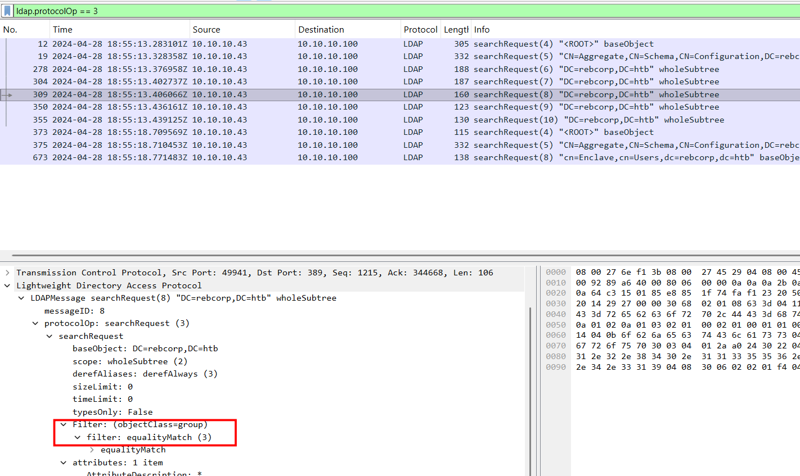

**Answer: objectClass=group**

## 6. How many non-standard groups exist? (for example: 1)

Referring to multiple sources, performing several LLM prompts, I finally find a reliable indicator of a non-standard group:missing isCriticalSystemObject field, or false value. With that in mind, we can determine that the last groups are non-standard:

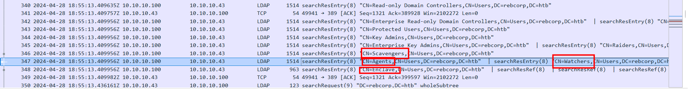

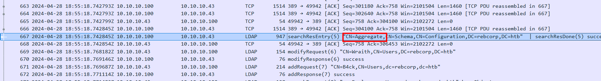

**Answer: 5**

## 7. One of the non-standard users is flagged as ‘disabled’, which is it? (for example: username):

Performing some LLM prompts, I know that an user is disabled if the userAccountControl flag is set to 514:

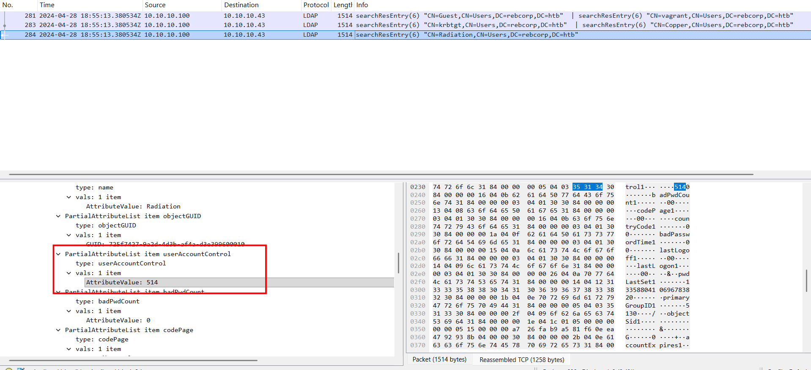

Note that there are some other users with that flag equal to 514, but they are standard users, as their adminCount flag is 1:

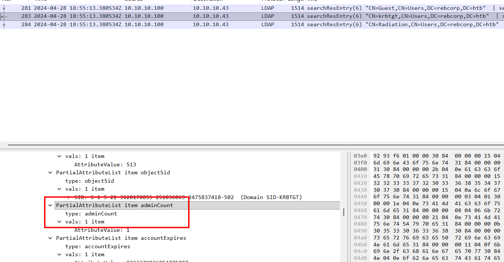

**Answer: Radiation**

## 8. The attacker targeted one user writing some data inside a specific field. What is the field name?

Modification can be made through the modifyRequest() command, with protocolOp set to 6. FIltering according to this, we get two requests, one of them is a replace request:

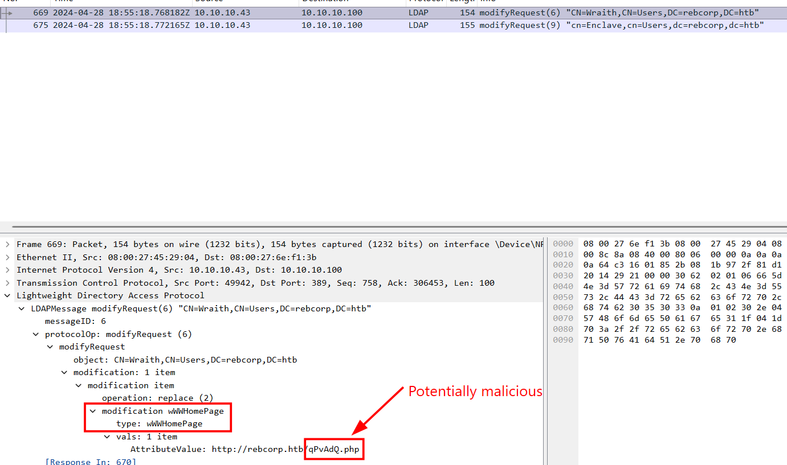

**Answer: wWWHomePage**

## 9. Which is the new value written in it?

The answer lies in the previous image, a potentially malicious php code has been placed inside the path of home page

**Answer: `http://rebcorp.htb/qPvAdQ.php`**

## 10. The attacker created a new user for persistence. What is the username and the assigned group?

We filter for `protocolOp=8` , which corresponds to addRequest() used to add user to the domain. Only 1 entry is returned, inspecting the packet's details yields the answer:

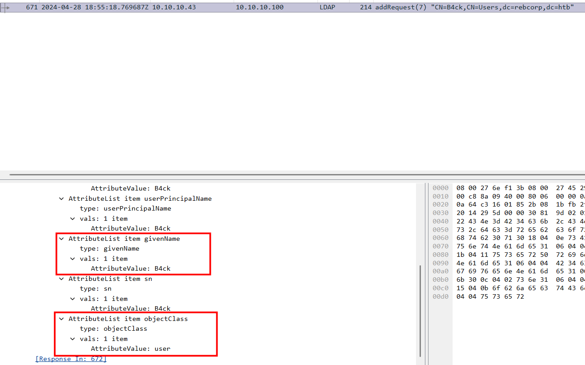

Then they perform a modifyRequest(), that is the other in two modifyRequest entries we discovered, they add this new user to the Enclave group:

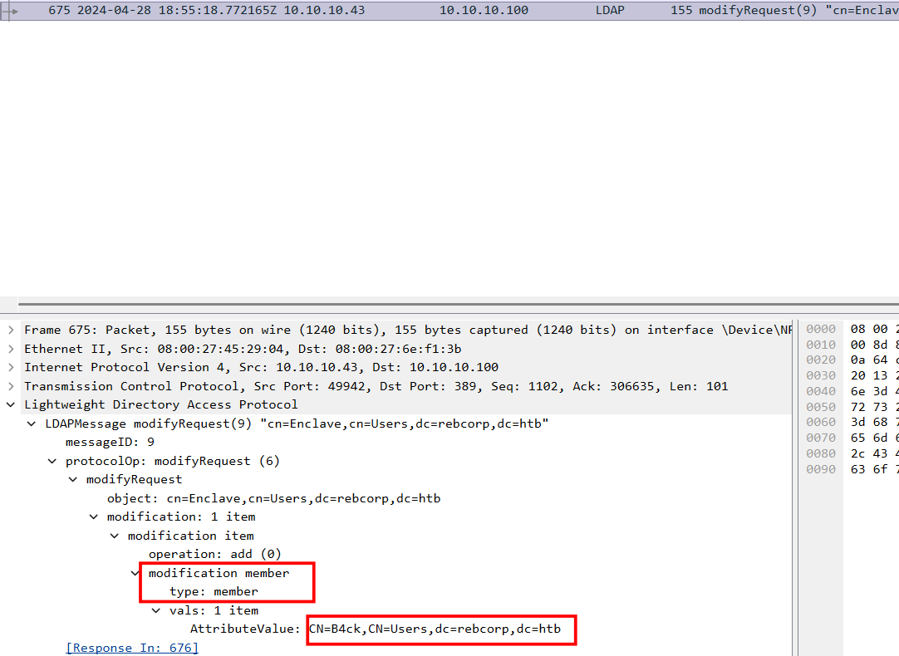

**Answer: B4ck,Enclave**

## 11. The attacker obtained a hash for the user 'Hurricane' that has the UF_DONT_REQUIRE_PREAUTH flag set. Which is the correspondent plaintext for that hash?

### Before diving into the task, let's clarify some important terms

**About the `UF_DONT_REQUIRE_PREAUTH` flag**:

- This is a flag in user account control that allows user to skip Keberos pre-authentication

- In a normal workflow where secure Keberos is applied, if we want a ticket, the server wants us to encrypt current time with our password to prove who we are, after veryfying, it handles us a ticket granting ticket, a.k.a TGT.

- If we send username only, the server will return an error:

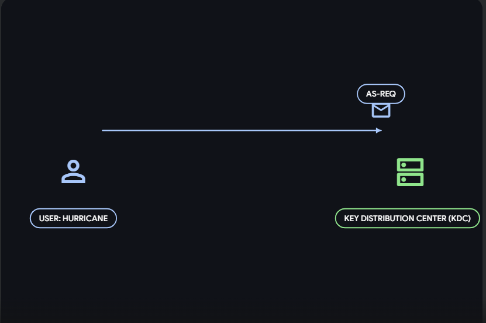

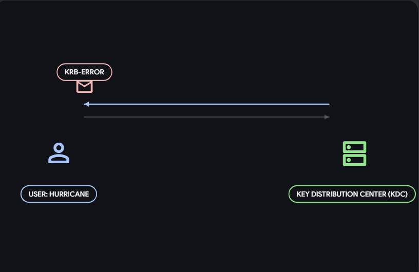

- We must use our password to encrypt time so that the server will trust us and send response:

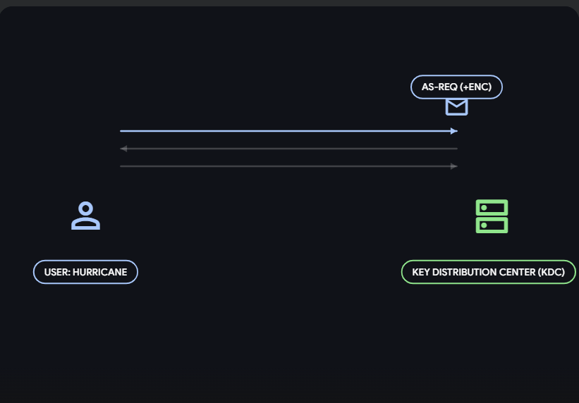

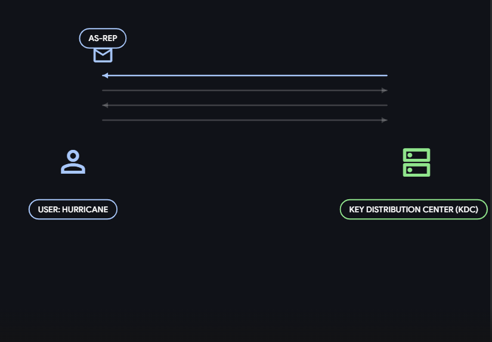

- But, sometimes legacy applications can't handle that initial encryption step. Administrators can disable it by setting the `UF_DONT_REQUIRE_PREAUTH` flag on a user account.

- If that flag is set, an attacker can just ask the server for a TGT for that user, and the server will hand it over immediately without requiring proof of identity .

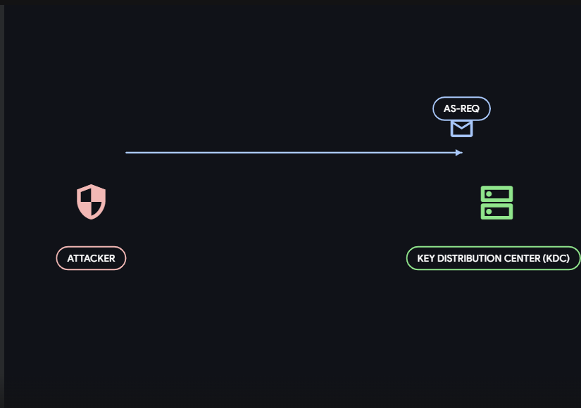

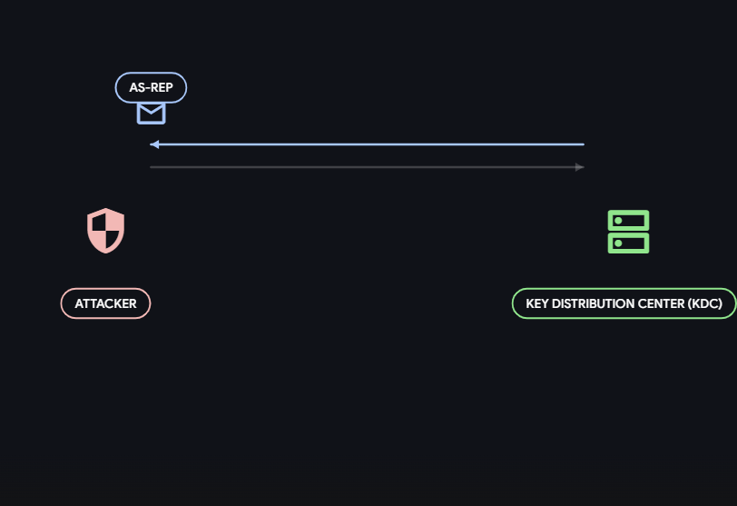

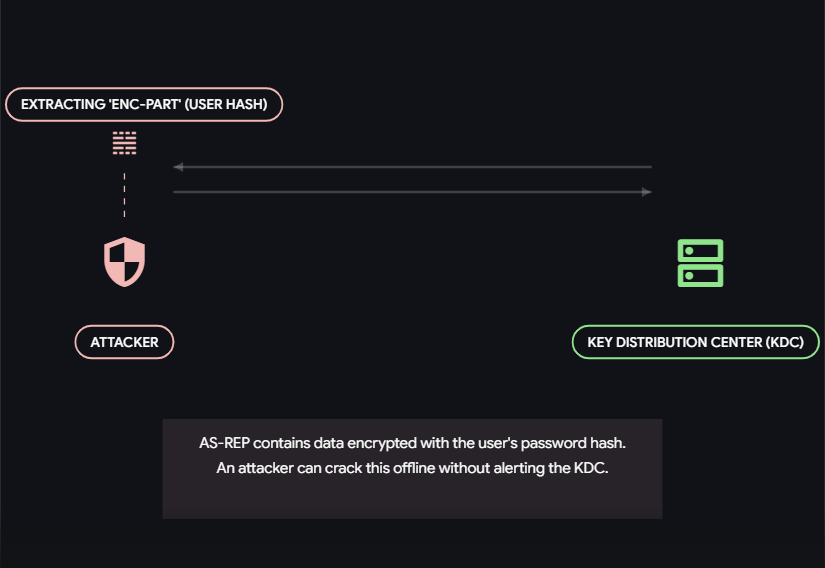

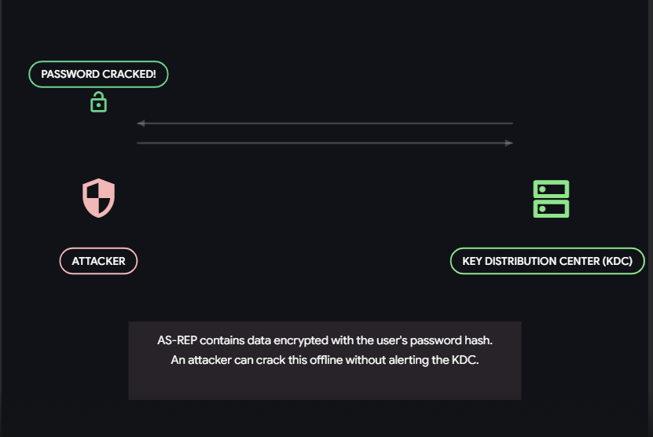

- Inside the AS-REP packet, there are two encrypted parts: the ticket itself is encrypted with the master krbtgt password, we cannot crack this, and the session key (enc-part) is encrypted using the target user's password hash so they can open it

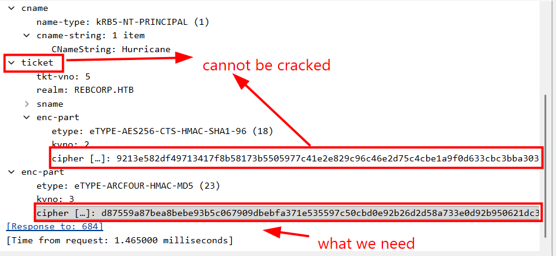

**About pre-processing the pcap file for John the Ripper**

- The pcap file itself is raw, binary data, so if we treat it as text, it will just look like gibberish characters. So for a rather simple parser like john's extraction script, like krb2john.py, it will never be able to convert.

- So we need to leverage tshark to save the pcap file as pdml file. PDML stands for Packet Details Markup Language, it is an XML-based format created specifically by the Wireshark project. If a .pcap is an audio recording of a crowded room, a .pdml file is an incredibly detailed, written transcript of every single word spoken, complete with tags identifying the speaker, the language, and the volume.

**Let's tackle it!**

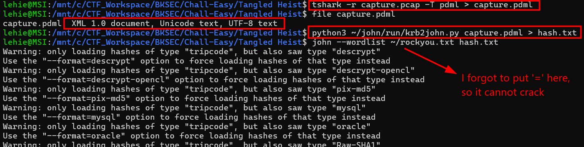

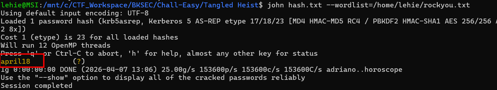

**Answer: april18**

`Flag: HTB{1nf0rm4t10n_g4th3r3d_fr0m_ld4p_4nd_th3_w1r3!}`