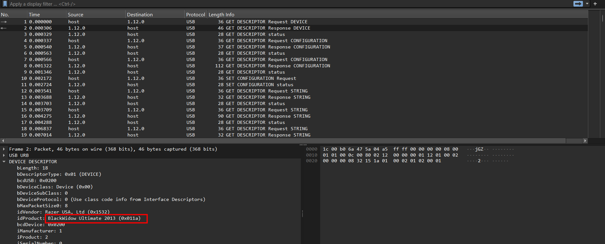
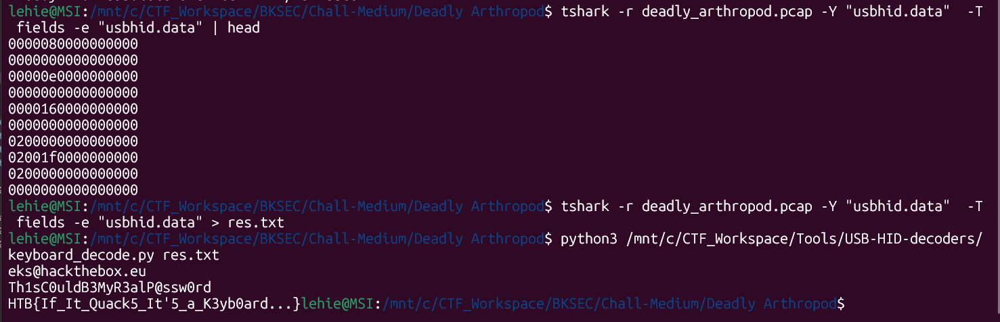

# Deadly Arthropod

## Scenario

Our operatives have intercepted critical information. Origin? Classified.  Objective: Retrieve the flag!

## Given artifact

A packet capture pcap file

## Solving process

Seeing USB protocol, I immediately check for the DEVICE DESCRIPTION packet, it is truly a keyboard:

Nothing more to explain if you have read my previous write-up:

`Flag: HTB{If_It_Quack5_It'5_a_K3yb0ard...}`