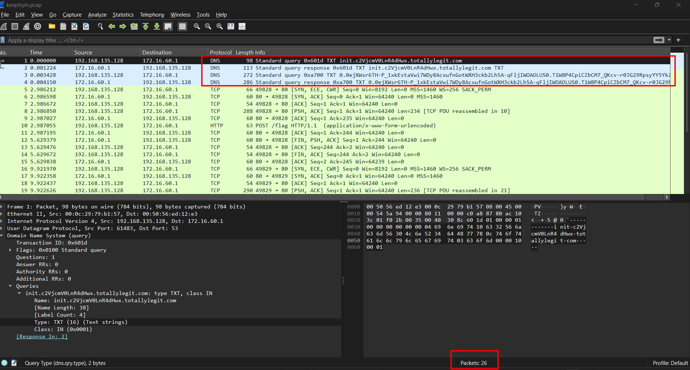
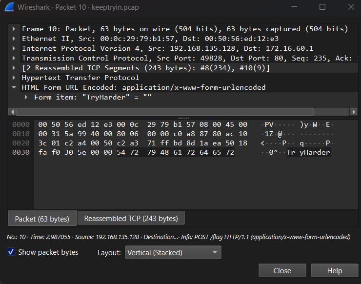
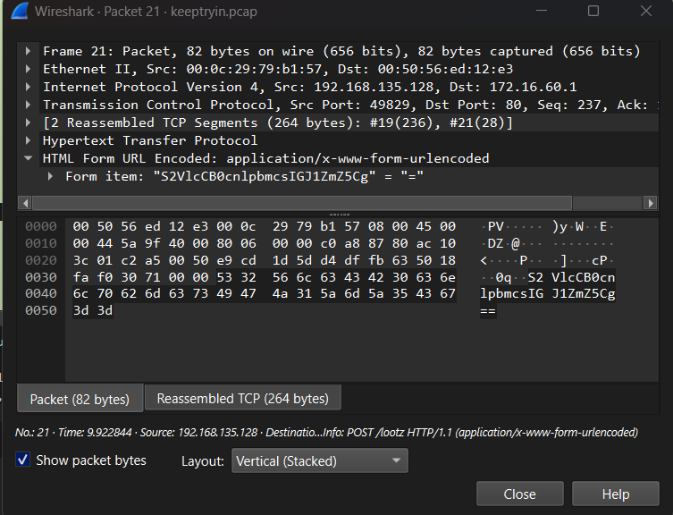
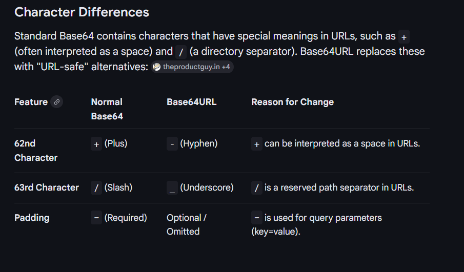
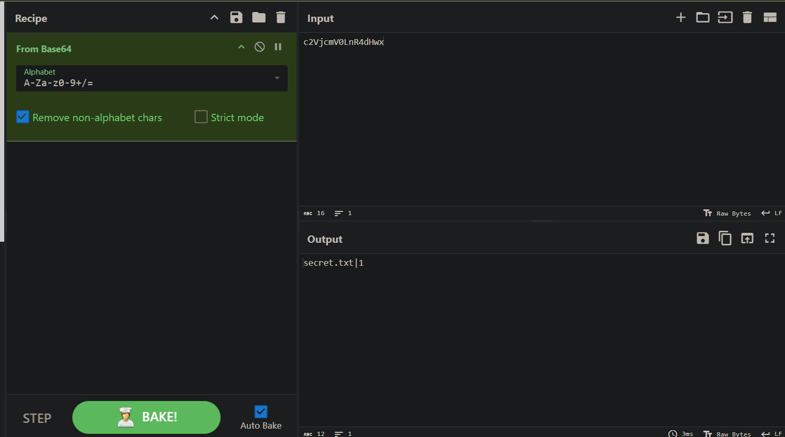
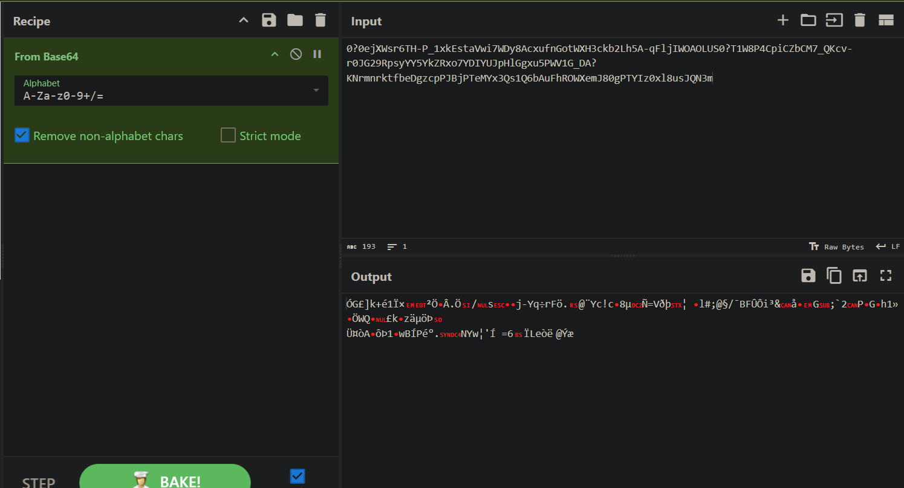
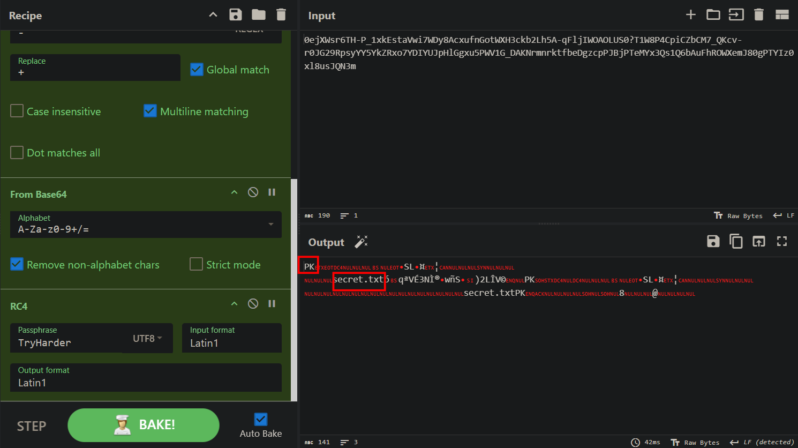
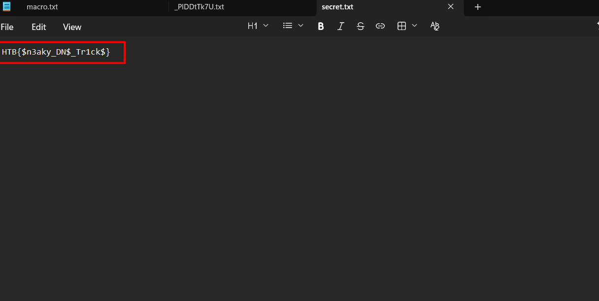

# Keep Tryin'

## Scenario

This packet capture seems to show some suspicious traffic

## Given artifact

A packet capture file

## Solving process

Skimming thorugh the pcap file, it is strange that only 26 packets are visible, anyway, less noise, easier to analyze?

What is more, some DNS packets show weird subdomain. There is also 2 HTTP post requests, initially they look non-sense, but let's see:

That base64 string decodes to `Keep trying, buffly`

Now let's return to the DNS packets. The subdomain seems to be base64, but we should keep in mind the differences between normal base64 and base64url:

For the first chunk, `From base64` recipe in cyberchef is enough:

Hmm, but we still haven't got anything, let's continue, for the second chunk, this time only base64 won't help:

Even after we replace some characters in base64url, it's still gibberish. So it has possibly been encrypted with some algorithm. Recall the `TryHarder` header in the POST requests, it is not decoy! Surprisingly it turns out to be our decryption key. I try by guessing some encryption schema, starting from XOR, but it does not work, another encryption algorithm requiring only password I know is RC4, and luckily it is correct:

Download that file and unzip (or use unzip recipe directly in cyberchef) and we get the flag:

`Flag: HTB{$n3aky_DN$_Tr1ck$}`