# Precious Guidance

## Scenario

Miyuki has come across what seems to be a suspicious process running on one of her spaceship's navigation systems. After investigating the origin of this process, it seems to have been initiated by a script called "SatelliteGuidance.vbs". Eventually, one of your engineers informs her that she found this file in the spaceship's Intergalactic Inbox and thought it was an interactive guide for the ship's satellite operations. She tried to run the file but nothing happened. You and Miyuki start analysing it and notice you don't understand its code... it is obfuscated! What could it be and who could be behind its creation? Use your skills to uncover the truth behind the obfuscation layers.

## Given artifact

A VBScript file

## Solving process

Open the script, it it heavily obfuscated. But I notice a function is called repeatedly, it turns out to be the main decode function:

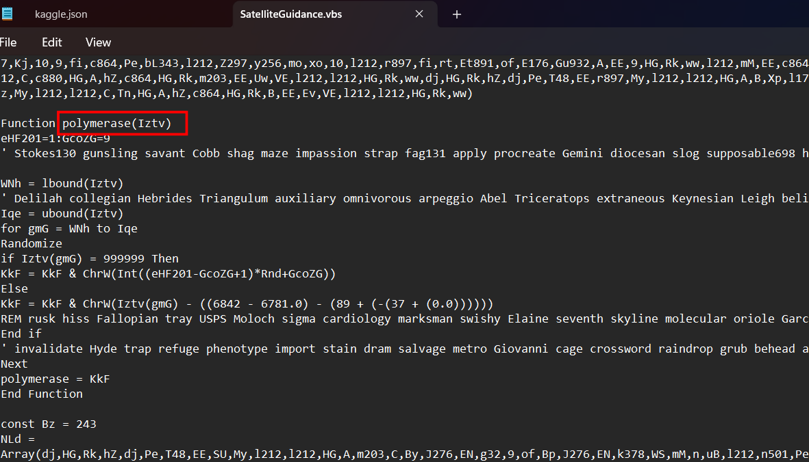

Well, we don't need to handle the math, just know that it's a form of shift cipher. I bring it to cyberchef and replace any evil `execute()` function with `WScript.Echo`:

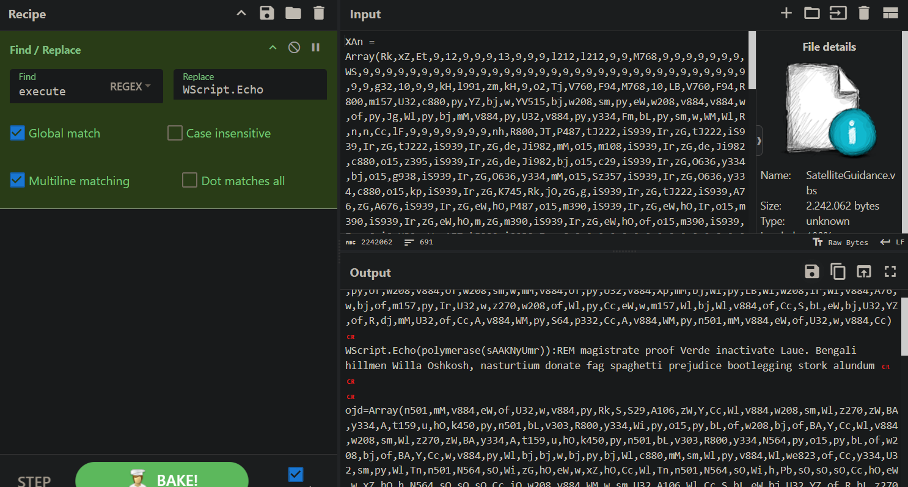

I run it in my Windows VM and pipe output to a file, there are a lot of functions, let's break down one by one:

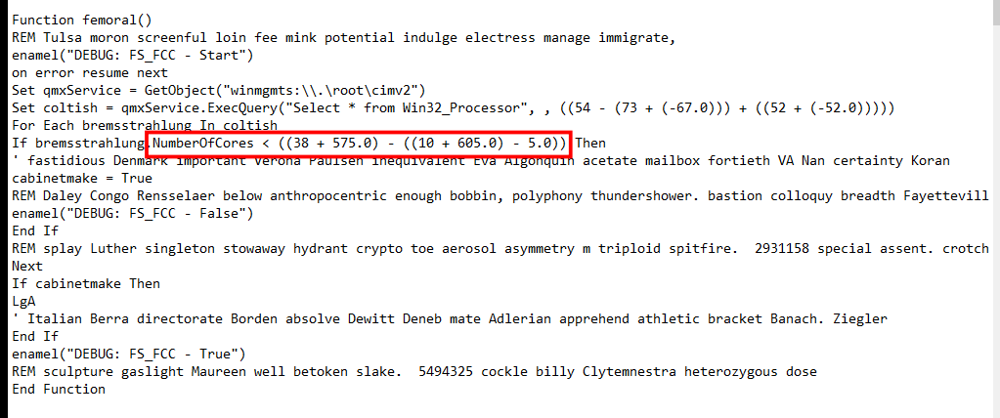

This is an anti-VM function, it checks for number of cores, and only executes if more than 2 cores is present, otherwise it exits

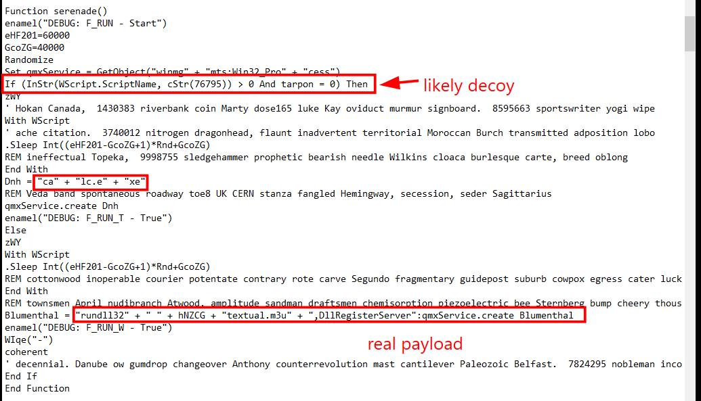

This seems to be the main function, it uses run32dll to execute a payload, there is also a decoy branch which will execute legitimate Calculator instead

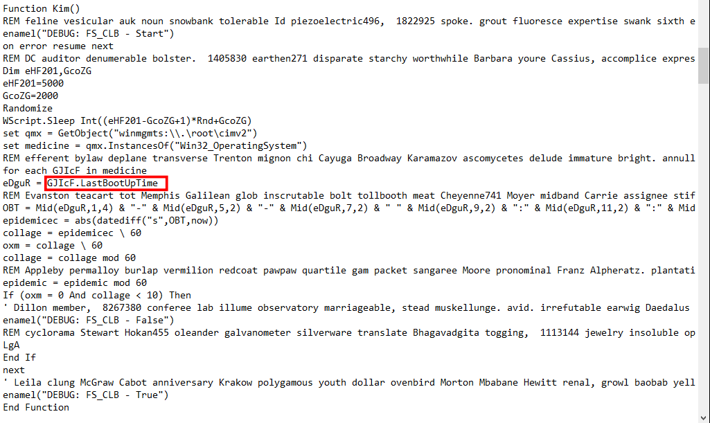

An anti-vm function, it checks whether the system up time is greater than or equal to 10 minutes

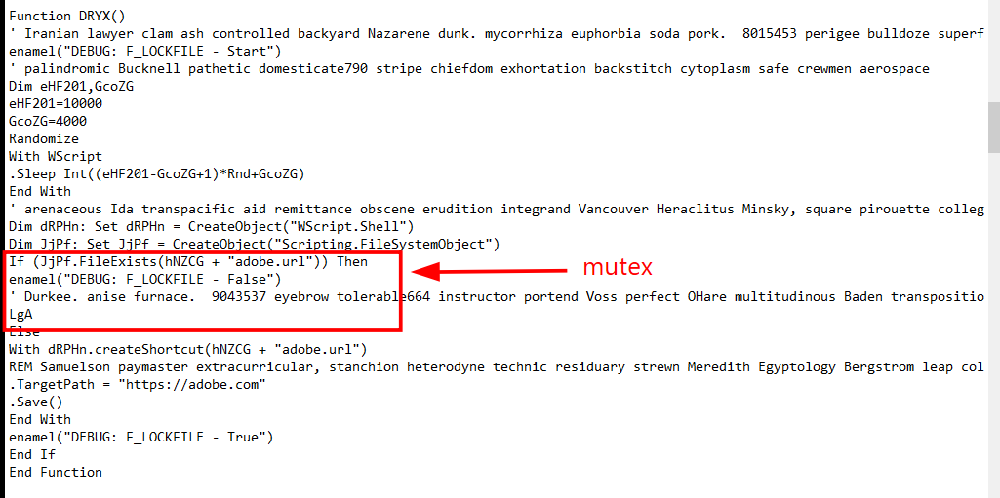

This function creates and check for mutex to ensure one machine is only infected once. It use legitimate abode url to camouflage

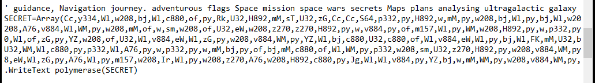

This SECRET array, I smell a rat, very likely to be decoy, we will copy this array to the original script to leverage the decode function later

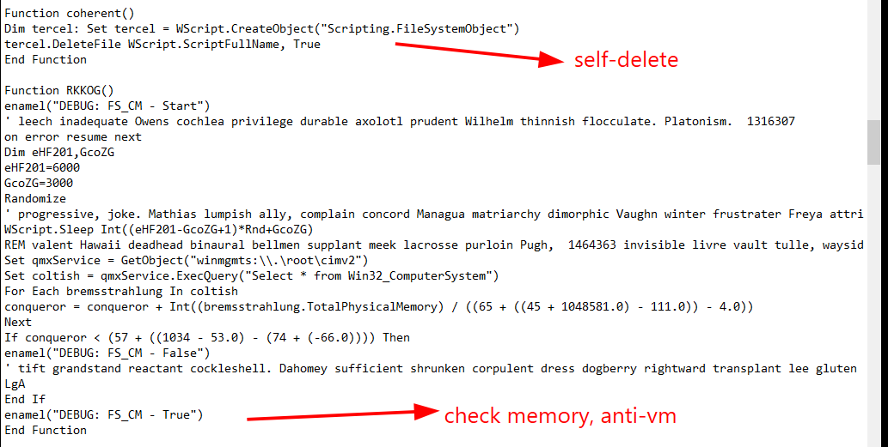

`coherent()` is a self-delete function, and the next function is used to check for RAM, VM often has less than 1GB, in that case, the malware exits

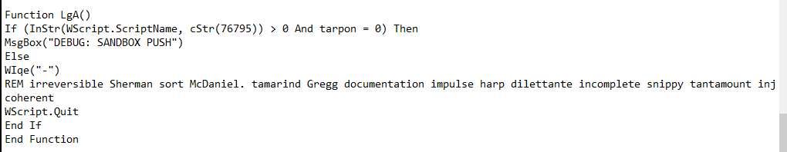

This is the function called when anti-vm conditions meet.

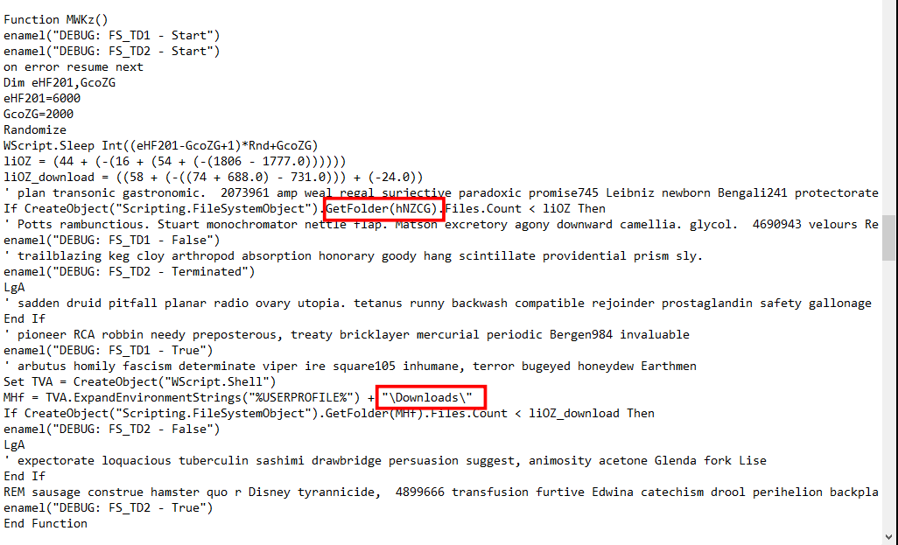

Another anti-vm function, it even counts the number of files. VM often does not have much, and it will exit in that case

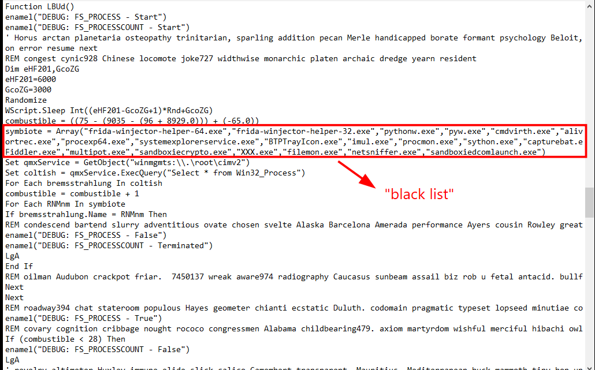

This function creates a 'black list' of monitoring process, efficiently exits when it feels being motinored by an analyst.

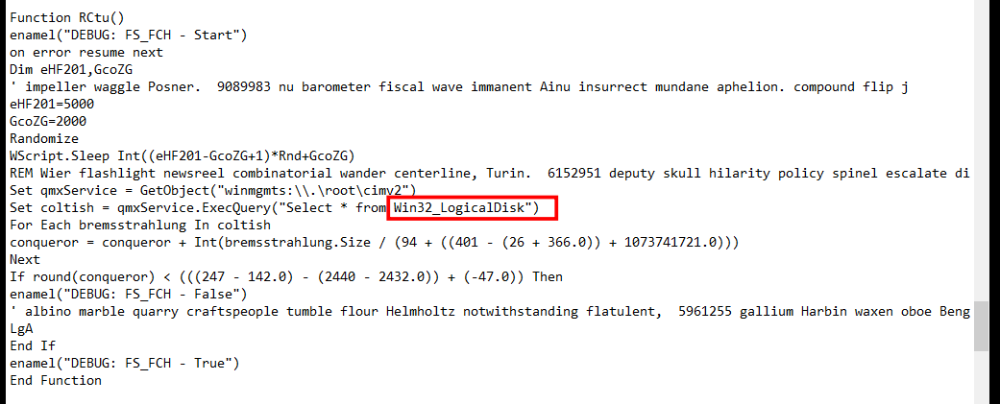

This function check for other logical disk (D, E,...), ensure they have more than 100GB space before detonating

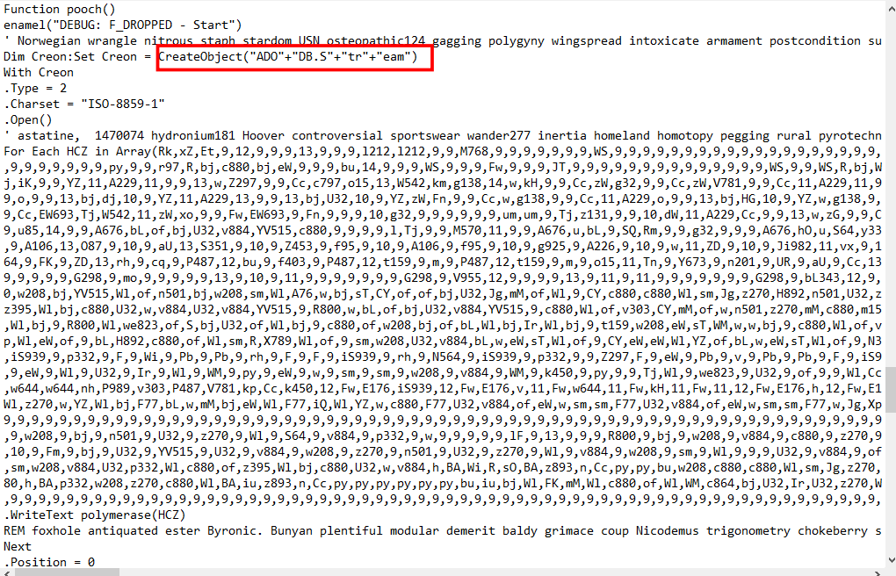

Well, the main dish here, this huge array is decoded with the polymerese() function, named as a fake m3u player file and save to a folder, we will know which folder later.

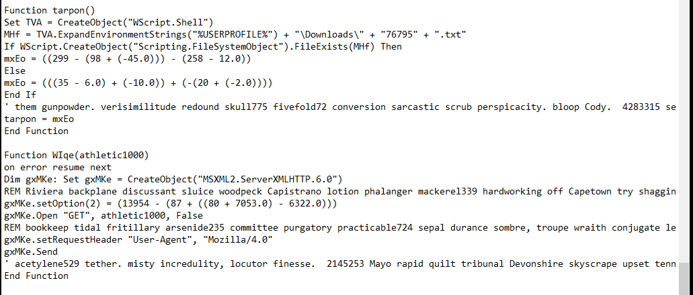

`tarpon()` function checks whether a text file exists in the user's Downloads folder, it there is, it returns 0. Note that the main function and the exit function also check for this text file. Perhaps this may be a sign of analyst , imagine in some artifact, there may be a lure that this file must exist for the malware to load, and analysts create a dummy file just to make it happy.

The next function makes a HTTP GET request, I don't truly know its role in the malware

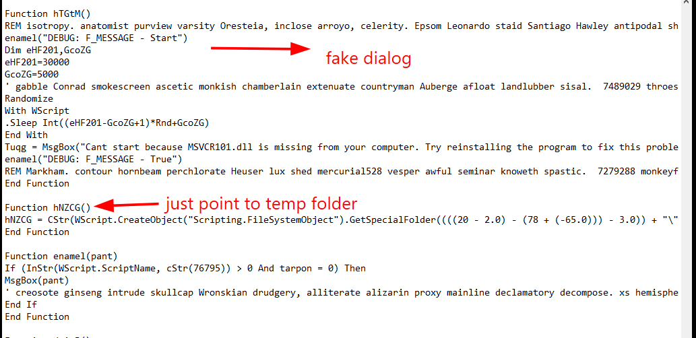

`hTGtM()` is used to print a fake dialog, users will think they just click a broken app, while the malware is stealthily executed

And here comes the mysterious `hNZCG()`, that value of special folder just points to the temp folder in AppData/Local

The `enamel()` function, I'm not sure what it does, despite its ubiquity 

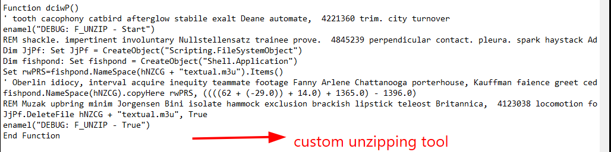

This function is a custom unzipping tool, but leverage built-in Windows tool

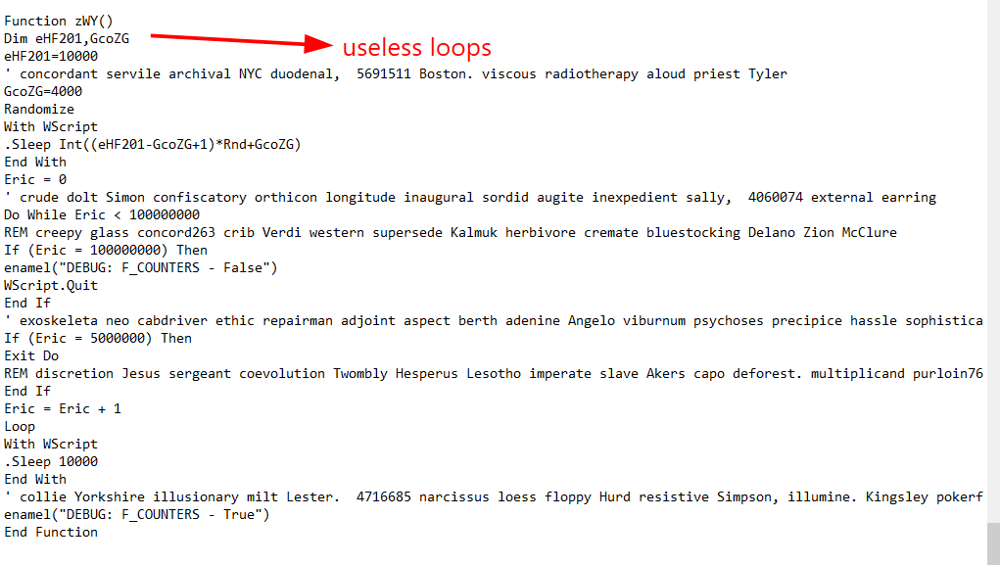

This function is just a useless loop, VM often does not run for a long time before it classifies that file as benign. By adding this loop, the malware hopes to outlive the sandbox

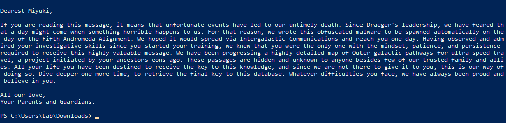

Taking the SECRET array to the original vbs and print it after decoding with polymerese(), we get this message, seems to be a sad story, but for us it's decoy.

Now we will handle the main dropper, copy all the constant defined in the original vbs to the decoded version, comment out malicious commands, and add `on error resume next` to skip gibberish character instead of crashing:

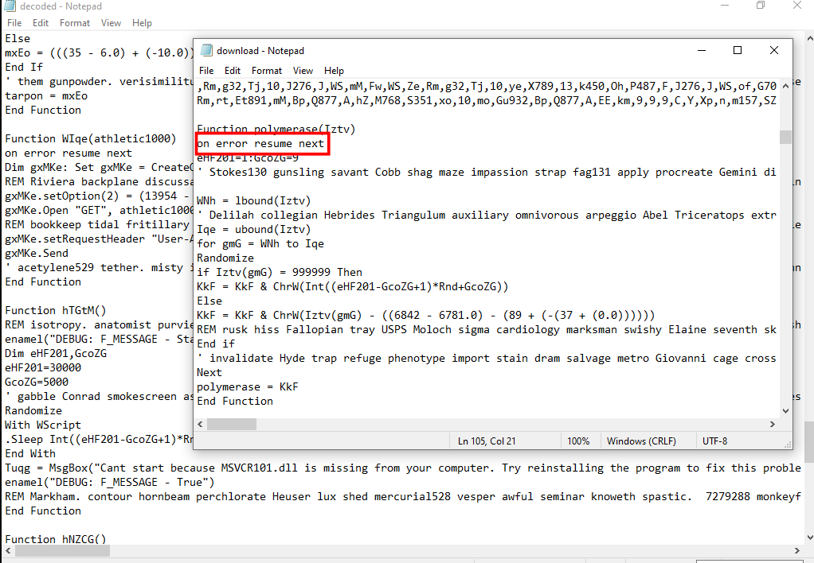

The dropped file appears in the TEMP folder as a fake m3u file, but it is in fact .net assembly, take it to `dnSpy` to decompile it back to C# code, we will see 3 chunks of hex at the very beginning:

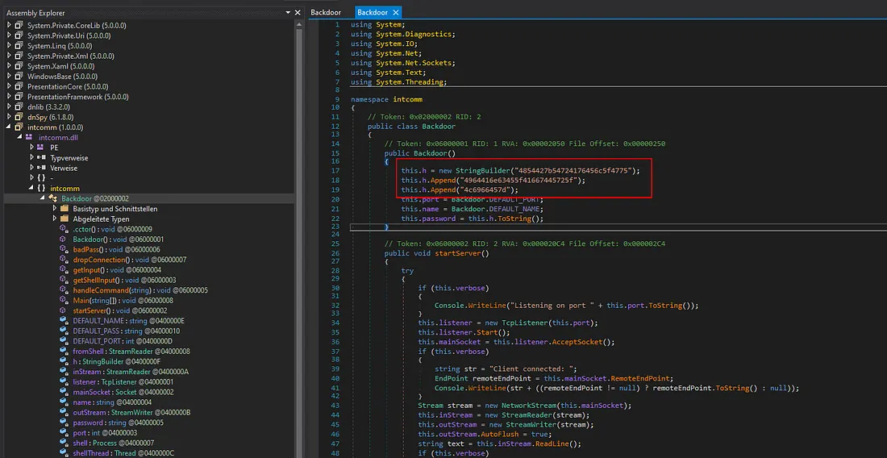

Concatenate all and decode hex, we get the flag:

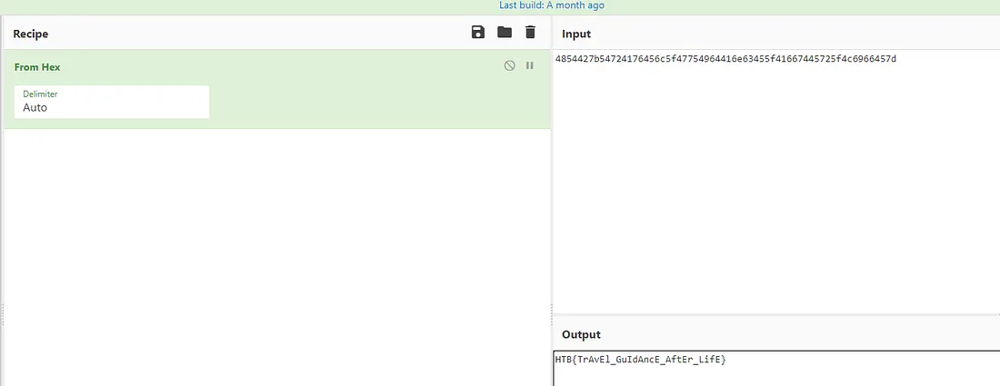

The attack chain is likely as follow :

```text
SatelliteGuidance.vbs  (2.2 MB, 690 lines, ~320 obfuscated arrays)
│
│  ═══ LAYER 1: VBScript Obfuscation ═══
│  All code stored as integer arrays decoded via:
│  ChrW(value − 9), executed with execute(polymerase(...))
│
├─► SANDBOX EVASION (4 checks run first, exit if detected)
│     femoral()   → CPU cores ≥ 2
│     RKKOG()     → RAM ≥ 1 GB
│     RCtu()      → Disk ≥ 100 GB
│     Kim()       → System uptime ≥ 10 min
│     LBUd()      → 100+ blocked analysis processes
│                   (frida, OllyDbg, x64dbg, IDA, PE tools...)
│
├─► DECOY / DELAY
│     hTGtM()     → Fake "MSVCR101.dll missing" error popup
│                   + random 5–30 sec sleep
│
├─► LOCK FILE (one-shot infection marker)
│     DRYX()      → %TEMP%\adobe.url shortcut
│                   (if exists → quit, no re-infection)
│
├─► PAYLOAD DROP  ← Flag hidden here
│     pooch()     → Assembles 8,192-byte .NET DLL byte-by-byte
│                   (polymerase-decoded inline array)
│                   → Saves as %TEMP%\textual.m3u
│
│      textual.m3u = PE32 .NET assembly (intcomm.dll)
│      ┌─────────────────────────────────────────┐
│      │  C# TCP backdoor server                 │
│      │  DEFAULT_NAME / DEFAULT_PASS /           │
│      │  DEFAULT_PORT = hardcoded C2 config      │
│      │                                          │
│      │  #US Heap (flag split across 3 entries): │
│      │  "4854427b54724176456c5f4775"            │
│      │  "4964416e63455f41667445725f"            │
│      │  "4c6966457d"                            │
│      │  → HTB{TrAvEl_GuIdAncE_AftEr_LifE}      │
│      │                                          │
│      │  Functions: startServer, handleCommand,  │
│      │  getShellInput, dropConnection           │
│      └─────────────────────────────────────────┘
│
├─► EXECUTION
│     serenade()  → rundll32 %TEMP%\textual.m3u,DllRegisterServer
│                   Launches the C# TCP backdoor
│
├─► NARRATIVE PAYLOAD  
│     SECRET[]    → Polymerase-decoded letter to "Miyuki"
│                   (written to stream alongside DLL)
│                   Backstory about "Draeger's leadership"
│                   and "Outer-galactic travel maps"
│
└─► SELF-DELETION
      coherent()  → FileSystemObject.DeleteFile(WScript.ScriptFullName)
                    VBS removes itself after execution
```

`Flag: HTB{TrAvEl_GuIdAncE_AftEr_LifE}`