# Reflection

## Scenario

You and Miyuki have succeeded in dis-empowering Draeger's army in every possible way. Stopped their fuel-supply plan, arrested their ransomware gang, prevented massive phishing campaigns and understood their tactics and techniques in depth. Now it is the time for the final blow. The final preparations are completed. Everyone is in their stations waiting for the signal. This mission can only be successful if you use the element of surprise. Thus, the signal must remain a secret until the end of the operation. During some last-minute checks you notice some weird behaviour in Miyuki's PC. You must find out if someone managed to gain access to her PC before it's too late. If so, the signal must change. Time is limited and there is no room for errors.

## Given artifact

A memory dump `.raw` file

## Solving process

`This part will be truly solving process, I will simply list what I did, to be honest I didn't totally understand what I was doing that time, if you want to understand the root cause, look at my afterthought, I will list everything that I feel needed, from the most basic one!`

I first use volatility to inspect the image info, and it turns out to be Windows 7, what a pain, volatility 3 cannot handle those versions very well...:

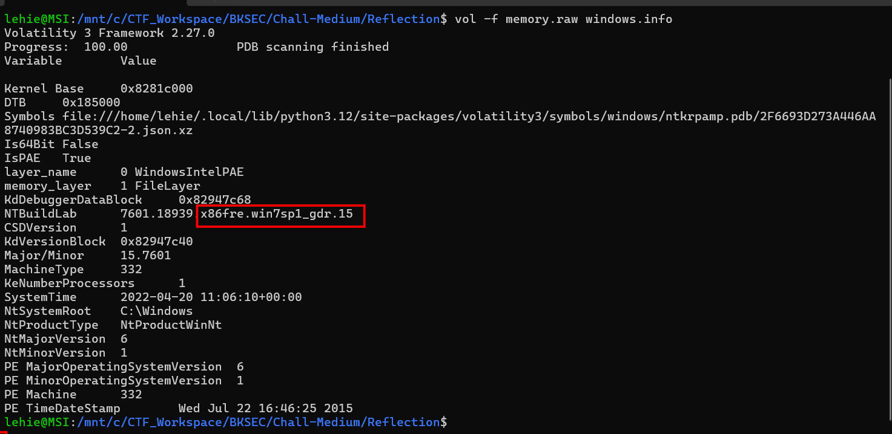

Now look at the process tree, I immediately see two interesting process: powershell and notepad, these two things are often involved in malware's behaviour:

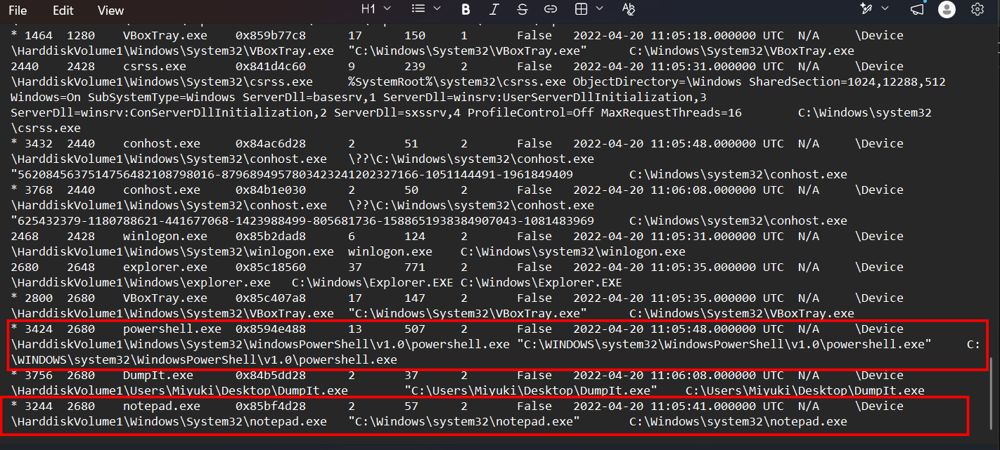

However, `cmdline` cannot retrieve anything, powershell seems to be opened interactively instead of from a script. What's more, `consoles` and `cmdscan` is not supported for this image info with Volatility 3. In that moment, I thought of searching for prefetch files, they can be identified by `filescan` but somehow I cannot dump them, neither by virtual address nor physical address. Perhaps only part of the file remains in RAM when this image is captured:

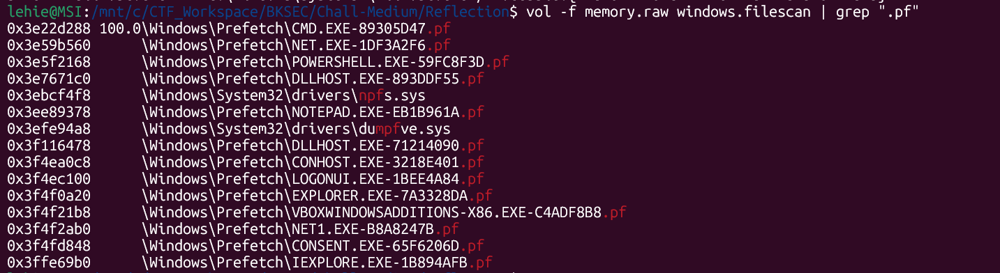

That's enough trauma, I decided to use vol 2 instead, luckily I still keep both versions, vol 2 in windows PS and vol 3 in WSL:

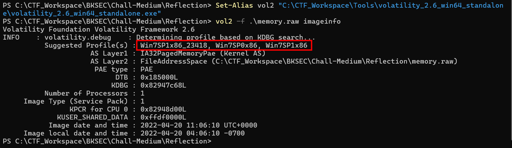

Now that we know the profile, let's use Vol 2's `consoles` plugin to extract everything on the terminal:

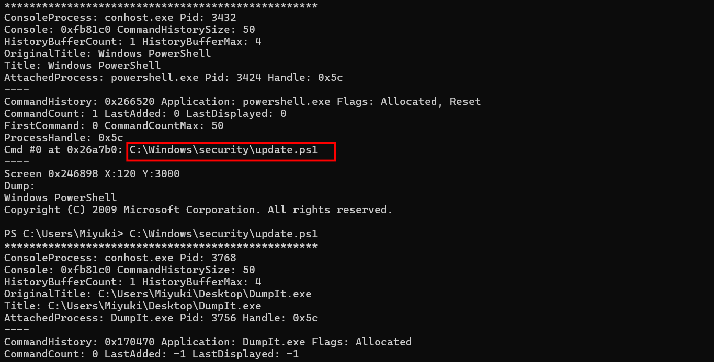

That's it, a suspicious powershell script is found in the memory of conhost.exe (Console Window Host, a legitimate Windows system process responsible for managing and displaying command-line windows like Command Prompt and PowerShell). Now let's locate and dump it with vol 3, easier :

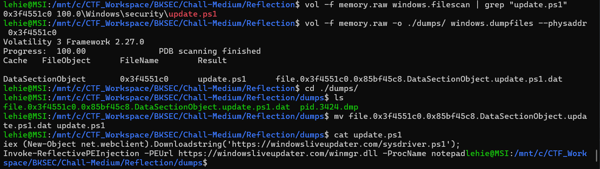

Well so that is just a dropper, logically the two mentioned files cannot be found in the disk for sure, as they are all executed in memory or injected to another process. By dumping the powershell process memory, we may still find scattered pieces of `sysdriver.ps1`:

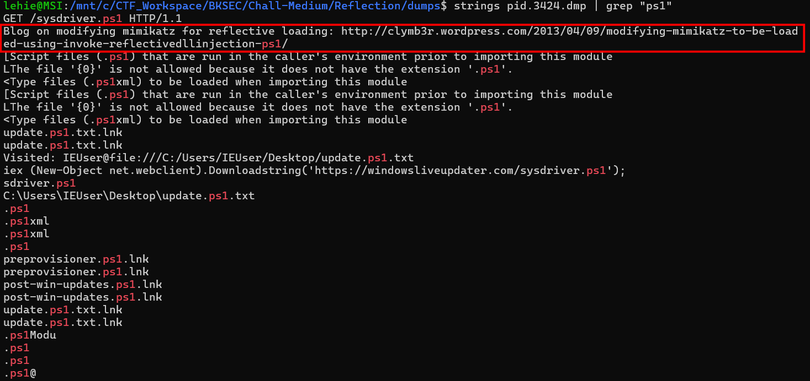

Following that blog's link, I can be quite sure that `sysdriver.ps1` is PowerSploit in disguise. But that's all we can deduce, from the challenge's name, the main payload should be the latter which is loaded reflectively to notepad.exe. Let's use `malfind` plugin to find for suspicious region:

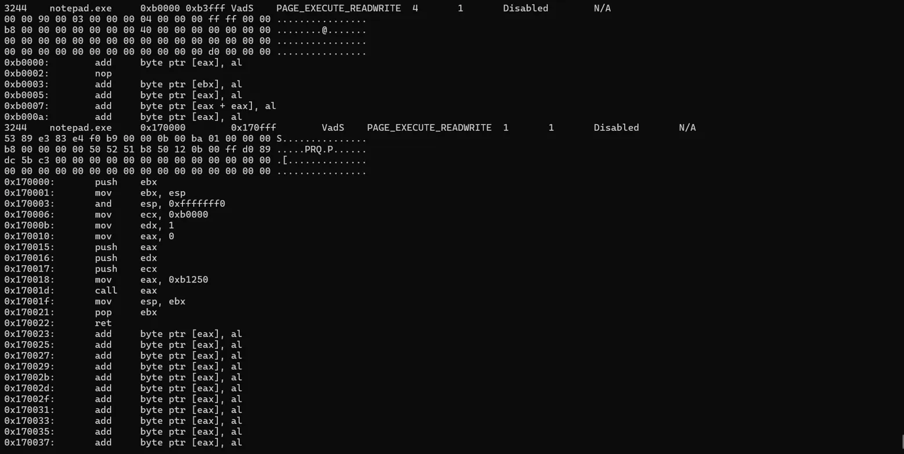

These two `PAGE_EXECUTABLE_READWRITE` regions are highly suspicious (read afterthought to know why). Look at the first region, this is a PE/DLL with the MZ header zeroed. Compare to a normal PE start — it should be 4D 5A ("MZ") followed by the DOS header. Here it's 00 00, but the rest of the structure is intact. This should be `winmgr.dll`

About the second region, what interests me is the line `mov ecx, 0xb0000` which point to the aforementioned Dll, so this is the bootstrap shellcode that `Invoke-ReflectivePEInjection` writes into the target process. It's a tiny stub whose job is to call the injected DLL's DllMain

Let's dump the first region using vol 3's `vadinfo` plugin:

```bash
vol -f memory.raw -o ./dumps windows.vadinfo --pid 3244 --address 0xb0000 --dump
```

Note that the MZ header has been zeroed, we must patch it so that reverse-engineering tool can work:

```bash
printf '\x4d\x5a' | dd of=pid.3244.vad.0x000b0000-0x000b3fff.dmp bs=1 count=2 conv=notrunc
```

At that moment, `file` command correctly identifies it as executable, I thought it's done, but no, the nightmare only started then: it's the mismatch between on-disk and in-memory data (more in my afterthought). One way to tackle this is to use vol 2's `dlldump` module, according to Claude the LLM, however, the header has been zeroed, which may prevent `dlldump` from working, so we have to commenting out that line in vol 2's source code. Now is when real headache comes in, I only have standalone version of vol 2, because it runs on python2 , which is already dead, installing python2 now just to use vol 2 is not worth at all. And Claude suggests me to use `docker` for safety reason:

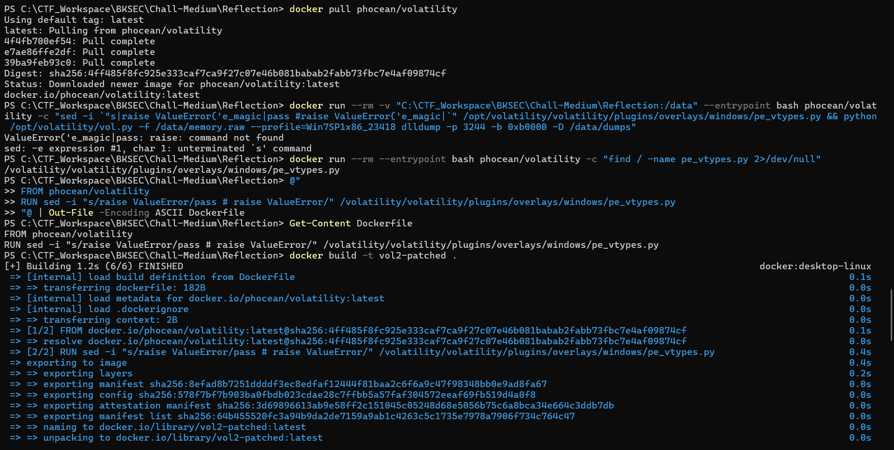

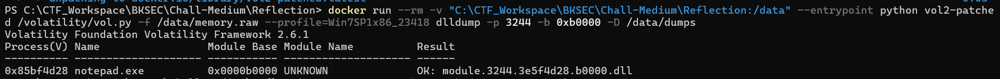

This time it was eventually ok after we patch the MZ header to that file, but later then I found that we have a more straight-forward path, there is a dedicated tool for this scenario: `pe_unmapper`, you can get it on github, it's designed to fix the mismatch between file on-disk and data in-memory:

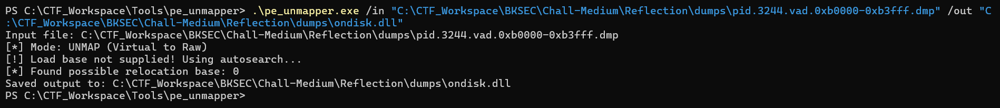

Patch the header and decompile the executable with ghidra, we see an array of hex value in `VoidFunc()`:

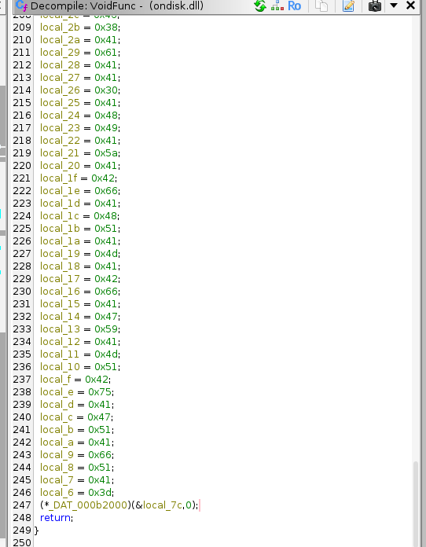

Take all of them to cyberchef, it is simply powershell executing an encoded command:

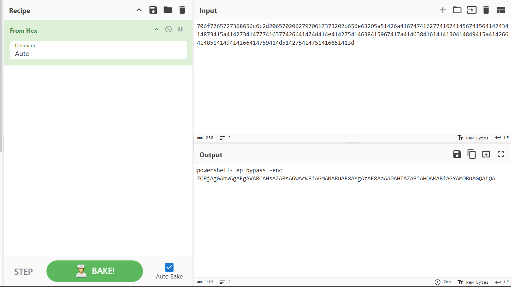

Decode that command, we get the flag:

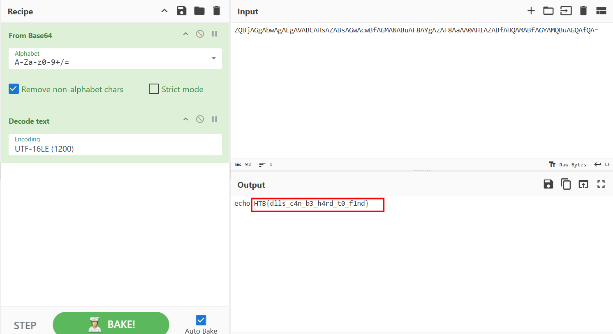

## Afterthought

Skip this if you think you are already familiar with MemFor, up to now I have got basic concepts and known how to use some memory forensics tool, but this problem forces me to rehearse from the most basic knowledge...

### What is REALLY memory forensics ?

When a computer is running, the CPU is shuffling bytes between RAM (volatile, fast, lost when power dies) and disk (persistent, slow). Disk forensics - which has been around since the 1990s - looks at the disk after the machine is off. You can recover deleted files, parse the registry, examine browser history, all of that.

But there's a whole category of evil that never touches disk. Malware loaded directly into memory. Encryption keys held in RAM while a TrueCrypt volume is mounted. Network connections that exist only as kernel structures. Decrypted versions of obfuscated code. Command history of an attacker who's been typing into a shell. None of this is on disk. Power off the machine, it's gone forever.

Memory forensics is the discipline of capturing RAM while a system is running - usually as a single big "memory dump" file - and then later reconstructing what was happening on that system at the moment of capture.

The dump is just a flat binary file. For our challenge, memory.raw is a 1 GB file that is a byte-for-byte snapshot of physical RAM at the moment DumpIt.exe was run on Miyuki's machine. Inside that 1 GB, somewhere, are: every running process's data, every kernel data structure, every loaded DLL, every open network socket, every cached file, the Windows registry, parts of the file system metadata - all jumbled together in raw form.
The hard part is that nothing is labeled. There's no table of contents. RAM doesn't say "process list starts at offset 0x12345678." You have to know how Windows organizes things in memory and walk those structures yourself. That's what Volatility does.

### How Windows organizes memory ?

**Virtual/physical memory**

Every process on Windows thinks it has its own private 4 GB address space (on 32-bit) - its virtual address space. The CPU and OS work together to translate virtual addresses into actual physical RAM addresses through page tables. Multiple processes can have a virtual address 0x400000 and they all map to different physical addresses.

This matters because when you see Volatility command flags like --virtaddr vs --physaddr, you're choosing which address space the offset refers to. It also matters because the same DLL loaded into ten processes might exist in only one place in physical RAM (shared), but appear at ten different virtual addresses.

**EPROCESS - the process structure**

Every running process on Windows is represented by an undocumented kernel structure called _EPROCESS. It contains the process ID, parent PID, image name, the pointer to the directory table base (which the CPU uses to translate that process's virtual addresses), pointers to the process's threads, handles, loaded modules, and so on.

All EPROCESS structures are linked together in a doubly-linked list. If you find one EPROCESS in memory, you can walk the list and find every process. That's how pslist works. There's also psscan which scans memory for EPROCESS-shaped structures even if they've been unlinked from the list (a common rootkit trick).

When MemProcFS told you "Unable to locate EPROCESS #4" - that error was MemProcFS failing to find the System process (which is always PID 4) to start its EPROCESS walk. The whole tool is paralyzed without that anchor.

**VAD tree - Virtual Address Descriptors**

Inside each process, memory regions (allocated heap, mapped DLLs, stack, etc.) are tracked in a tree structure called the VAD tree. Each VAD node says "from virtual address X to virtual address Y, this region exists, with these protection flags (read/write/execute), and it's either backed by some file or it's private allocated memory."

This is what Volatility reads when you run vadinfo. Every "VAD" you see in malfind output is a leaf in that tree.

**PE files in memory vs on disk**

When a .dll or .exe sits on disk, sections are packed tightly using FileAlignment (often 512 bytes / 0x200). When Windows loads it into memory, sections are spread out using SectionAlignment (usually 4096 bytes / 0x1000) so they align to page boundaries. The bytes are the same; the spacing is different.

This single fact causes half of our mystery...

**PDB symbol**

Windows kernel structures (_EPROCESS, _KPROCESS, _HANDLE_TABLE, etc.) are undocumented. Their fields move around between Windows versions. Microsoft publishes "Program Database" (PDB) files for the kernel - debug symbols - that say "in this build of ntoskrnl, the ImageFileName field is at offset 0x16C in _EPROCESS."
Memory forensic tools either bundle these symbols (Vol2 uses hand-crafted "profiles") or fetch them from Microsoft's symbol server at runtime (Vol3, MemProcFS).
This is why MemProcFS also failed for you - it tried to download PDBs for your Win7 SP1 kernel and couldn't, so it had no map of what an _EPROCESS looks like, so it couldn't find the EPROCESS list, so it gave up.

### Volatility 2 and Volatility 3 - the actual story

This isn't just "newer is better." It's a real fork in design philosophy.

**Volatility 2 (released 2007, last update 2.6.1 in 2020)**

Vol2 is Python 2. It uses profiles: hand-written specifications that say "for Windows 7 SP1 32-bit, here are the field offsets for every kernel structure I care about." The Volatility Foundation maintained profiles for every major Windows version from XP through Windows 10.

You run imageinfo to figure out which profile to use, then specify it on every command. It works completely offline - no internet, no symbol server.

The plugin ecosystem is enormous: ~200 plugins covering every imaginable artifact. Tons of community plugins. Battle-tested for over a decade.

The problem: Python 2 is dead. The codebase is fundamentally tied to Py2 (string handling, mostly). Maintaining hand-written profiles for every new Windows build doesn't scale - Win10 has hundreds of feature update builds.

**Volatility 3 (released 2019, current)**

Vol3 is Python 3, complete rewrite. It abandons profiles entirely and uses Microsoft's PDB symbols dynamically. Point it at a memory dump, it figures out the OS version, downloads the matching kernel PDB, parses out struct definitions, and works.

The architecture is cleaner. The dependency on profiles is gone. It scales naturally to new Windows versions.

The problem: many Vol2 plugins haven't been ported. Specifically, on Windows 7, several plugins have no Vol3 equivalent - cmdscan, consoles, cmdline (works partially), shimcache, truecryptsummary, editbox, etc. The Vol3 maintainers prioritized modern Windows. Win7 was already "old" when Vol3 was being designed.

**Why our challenge sat in this gap**

The challenge dump is Win7 SP1 x86 from 2022 (the era when this CTF was made). Win7 was end-of-life'd by Microsoft in January 2020.

- Vol3 supports Win7 for most plugins but specifically lacks the conhost-related ones (cmdscan, consoles)

- These conhost plugins require parsing internal _CONSOLE_INFORMATION and _COMMAND_HISTORY structs, which differ wildly between Windows versions and which Microsoft never documented

- Vol2 hand-coded support for Win7's conhost layout

- Vol3's symbol-server approach can't easily handle these because conhost structs aren't in the kernel PDB — they live in conhost.exe's own PDB which has different versioning

This is exactly why we needed both tools. Vol2 for the conhost plugins (to find update.ps1 and the cradle command via console scrollback), Vol3 for everything else (faster, modern, better output).

### The plugins we actually used, what each one does ?

**windows.info.Info (Vol3) / imageinfo (Vol2)**

Reads constants like KdDebuggerDataBlock and NTBuildLab to determine OS version, architecture, build number, and the system time at capture. It's the first command you run on any dump because everything else depends on knowing what kernel structures to expect.

Vol2 outputs a "suggested profile" string. Vol3 just figures it out internally and continues.

**windows.pstree.PsTree**

Walks the EPROCESS list and prints processes in parent-child tree form. Indentation shows which process spawned which. This is your first triage view. You're looking for:

- Unexpected children of explorer.exe (user-launched stuff)
- PowerShell or cmd.exe under non-developer parents
- Suspicious image paths (Temp, AppData\Roaming, user Desktop)
- Very short-lived processes (they appear with exit times)
- Multiple instances of usually-singleton processes

Our pstree.txt showed PowerShell PID 3424 spawned by explorer.exe, notepad.exe PID 3244 also from explorer, and DumpIt.exe PID 3756 — that was the memory acquisition tool itself, the "now" of the capture. The interesting thing was PowerShell + notepad both being live, with a handful of prefetch artifacts (NET1.EXE, IEXPLORE.EXE, CONSENT.EXE) suggesting brief runs of net.exe, IE, and a UAC prompt.

**windows.pslist and windows.psscan**

pslist walks the doubly-linked active process list. psscan scans physical memory for EPROCESS-shaped patterns. If a rootkit unlinked a process from the list to hide it, psscan will still find it. Comparing the two lists is a classic detection technique.

**windows.cmdline.CmdLine**

Reads each process's PEB (Process Environment Block) to extract the command line that launched it. For PowerShell, this is critical - if the attacker used powershell -EncodedCommand AAAA..., you'd see the base64 right here. In your dump, PID 3424's command line was just "...powershell.exe" with no arguments - meaning PowerShell was launched interactively and commands were typed at the prompt. The actual commands therefore live elsewhere, namely:

`cmdscan` and `consoles` (Vol2 only on Win7)

`cmdscan` walks the conhost.exe _COMMAND_HISTORY structures and extracts the command history buffer - every command typed at every cmd/powershell prompt that was open at capture time. It's like reading shell history from RAM.

`consoles` goes further: it reconstructs the entire screen buffer of conhost - both the typed commands AND their output. So you see what the user typed AND what was printed back, in order.

This is what found update.ps1 for you. Without consoles, you would have eventually grepped through PowerShell process memory and probably found the cradle command - but consoles told you cleanly, in one shot, exactly what was typed. That's why the writeup uses it and that's why you needed Vol2.

**windows.filescan.FileScan**

Scans physical memory for _FILE_OBJECT structures. When Windows opens a file, it creates a FILE_OBJECT in kernel memory representing that open. filescan finds all of them — including FILE_OBJECTs for files that were opened, used, and even closed (until the structure gets reclaimed).

A FILE_OBJECT contains the filename, the device path, and crucially pointers to cached file data if any pages of that file are sitting in the system file cache.

This is how you found update.ps1 at offset 0x3f4551c0. Windows had read the file, kept it in cache, and the FILE_OBJECT pointing to that cached data was still in memory when DumpIt ran.

**windows.dumpfiles.DumpFiles**

Takes a FILE_OBJECT and reconstructs the file by following pointers to cached pages and stitching them back into the original file content. If the cache pages have been reclaimed (RAM pressure evicted them), dumpfiles has nothing to extract — that's why some of your prefetch dumps came back empty earlier.

For update.ps1, the cache pages were still live, and you got a perfect reconstruction.

For winmgr.dll, this approach can't work at all because the DLL was downloaded over HTTPS into PowerShell's heap memory and never went through the file system — there's no FILE_OBJECT to find.

**windows.malfind.Malfind**

This one is special. Malfind hunts for process injection by looking for memory regions that match suspicious patterns:

- Marked PAGE_EXECUTE_READWRITE (RWX) - extremely rare in legitimate code; almost everything is either RX (executable code) or RW (data), not both

- Private allocations (not backed by a file on disk)

- That contain code or PE-like content

Reflectively injected DLLs scream at malfind because they're allocated as RWX (the loader needs to write the DLL bytes and then execute them) and they're private (Windows doesn't know they came from a file).

This is what found 0xb0000 in notepad - your "smoking gun." Malfind also showed 0x170000 which was the bootstrap shellcode that calls into the DLL.

**windows.vadinfo.VadInfo**

Lists all VAD entries for a process - every memory region with its address range, protection flags, type (private vs file-backed), and what file backs it (if any). With --dump, it can extract a specific region to a file.
You used it as --address 0xb0000 --dump to surgically extract just the injected DLL region.

**windows.memmap.MemMap**

Dumps the entire usable memory of a process - every committed page concatenated into one big file. Useful when you want to grep/strings across everything but don't know exactly where the interesting data is.

You used it for PID 3424 (PowerShell) to grep for the update.ps1 cradle command and the clymb3r reference.

**dlldump (Vol2)**

Specifically for extracting loaded DLLs from process memory, with awareness of PE structure. It tries to reconstruct the on-disk file format (with file alignment) from the in-memory layout (with section alignment). When it works, you get a cleanly Ghidra-loadable file. When it doesn't (anti-forensics, scrubbed headers), it bails.

This is the one you patched in Docker. The bypass was just commenting out the "this doesn't have an MZ header so I refuse to dump it" check.

**Vol3 has no direct dlldump**

Vol3 has windows.pedump and windows.dlllist --dump, both of which work for normally loaded DLLs (ones in the PEB's loaded module list). For reflectively injected DLLs that aren't in any module list, these don't work - which is why we ended up using vadinfo --address --dump instead, which is one rung lower (just dumps a region of memory, no PE awareness).

### The reflective injection technique itself

Now the actual attack. Understanding this in detail will make the whole investigation make sense.

**Why injection?**

Normal malware: write a .exe to disk, run it. AV scans the file, flags it, you're caught.

Smart malware: never write the executable to disk. Live entirely in memory. Run inside a legitimate process so it doesn't show up as its own process in Task Manager.

This is the goal of "process injection" generally - get malicious code running inside the address space of a benign process (notepad, explorer, svchost, whatever).

**Classical DLL injection**

The Windows API provides functions like LoadLibrary that take a file path and load a DLL into the calling process. So one classical injection trick is:

1. OpenProcess to get a handle to the victim
2. VirtualAllocEx to allocate memory in victim
3. WriteProcessMemory to write the DLL's path string
4. CreateRemoteThread with LoadLibraryA as the start address and the path as the parameter
5. The victim process now has the DLL loaded as if it had loaded it itself

This works but the DLL has to exist on disk for LoadLibrary to find it. Defeated by file-based AV.

**Reflective DLL injection (Stephen Fewer's 2008 technique)**

The breakthrough idea: write a DLL that loads itself. The DLL contains its own custom loader as one of its exports. The injection process becomes:

1. Read the DLL bytes (from network, from a base64 string in script, anywhere - never disk)
2. VirtualAllocEx in the victim to make space
3. WriteProcessMemory to copy the entire DLL bytes verbatim into that space
4. CreateRemoteThread pointing at the DLL's reflective loader export
5. The reflective loader (running inside the victim) parses its own PE headers, performs section copies, fixes up imports, applies relocations, and finally calls its own DllMain - all inside the victim process

The Windows loader is never involved. LoadLibrary is never called. The DLL never appears in the PEB's module list.

**clymb3r's PowerShell port**

In 2013, Joe Bialek (clymb3r) wrote Invoke-ReflectivePEInjection.ps1 - a pure PowerShell implementation of reflective injection. PowerShell can call any Win32 API via Add-Type reflection, so you can do VirtualAllocEx, WriteProcessMemory, CreateRemoteThread from a PowerShell script. This script became part of PowerSploit and was widely used by red teams and APT actors.

This is exactly what sysdriver.ps1 is. It's the unmodified clymb3r/PowerSploit script.

**The header scrubbing anti-forensics**

After the DLL is fully loaded into memory (sections copied, imports fixed, relocations applied), the loader has no further use for the PE header. Some loaders zero out the first 2 bytes (the MZ signature) specifically to defeat naive memory scanners that grep for MZ to find loaded executables.

This is why our xxd of the dump showed 00 00 instead of 4D 5A. The body of the DLL is intact; only the signature was zapped.

This is also why `dlldump` fails by default - Vol2's PE parser checks for MZ and refuses to proceed without it. Patching the check lets it dump anyway.

**On-disk vs in-memory layout — the real reason Ghidra struggled**

When the DLL was on the attacker's web server, it was in on-disk format:

- FileAlignment 0x200
- Sections packed tight: .text at file offset 0x400, .rdata at 0x600, etc.
- Total file size ~3 KB

When the reflective loader copied it into notepad's memory, it expanded to in-memory format:

- SectionAlignment 0x1000
- Sections page-aligned: .text at offset 0x1000, .rdata at 0x2000, .reloc at 0x3000
- Total memory footprint ~16 KB (mostly zero padding between sections)

Both are valid PE forms. Both contain the same code and data. But the export directory's RVA — 0x2030 in our dump — is interpreted differently:

- In on-disk format, RVA 0x2030 means file offset 0x230 (after applying the FileAlignment-based section table)
- In in-memory format, RVA 0x2030 means file offset 0x2030 directly (since section alignment matches in-memory page layout)

Pefile assumed on-disk layout, looked at file offset 0x230, found garbage, gave up parsing the export directory.

When dlldump succeeded, it had reconstructed the on-disk layout — sections collapsed back to FileAlignment 0x200, all RVAs translated. That's why the dlldump output was 3 KB while your VAD dump was 16 KB. Same DLL, different physical layout in the file we're handing to Ghidra.

This is the single most important technical point in the whole exercise. Mapped vs unmapped PE format. If you remember nothing else, remember that distinction.


`Flag: HTB{dlls_c4n_b3_h4rd_t0_f1nd}`