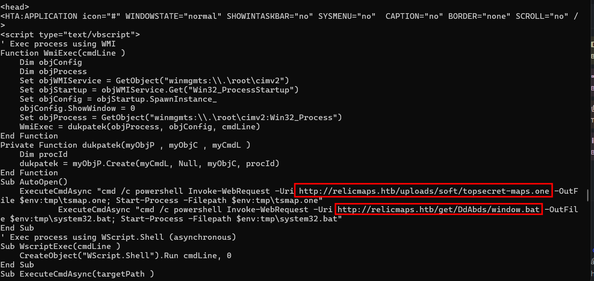
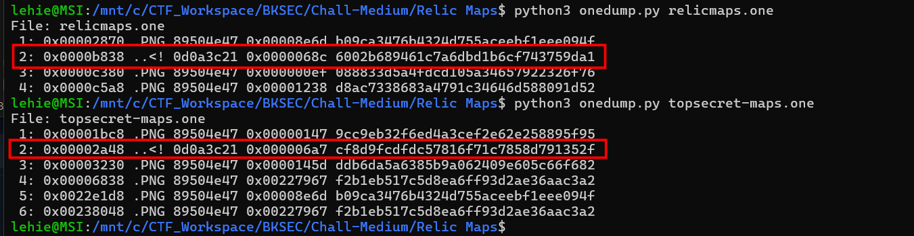
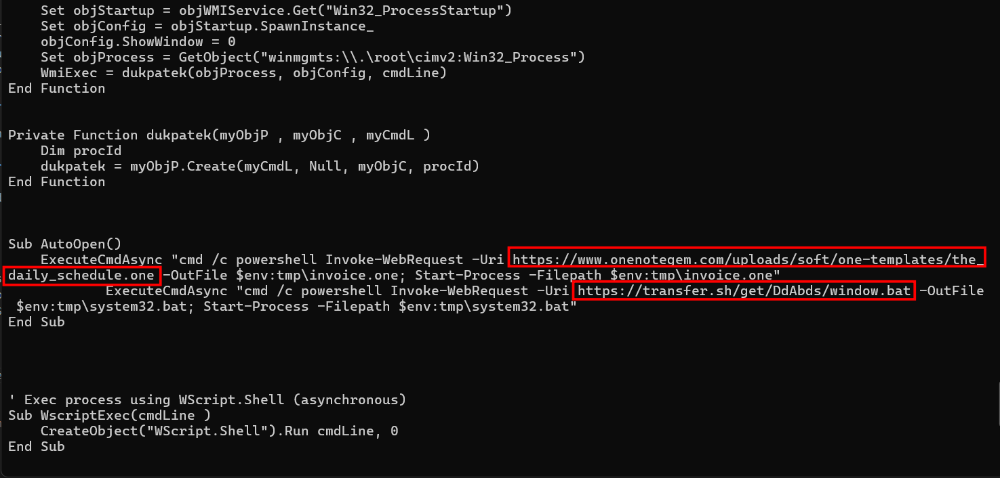
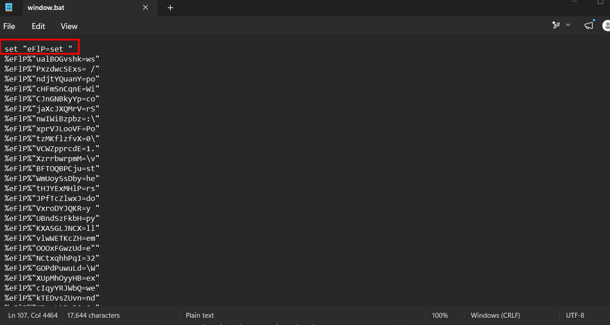
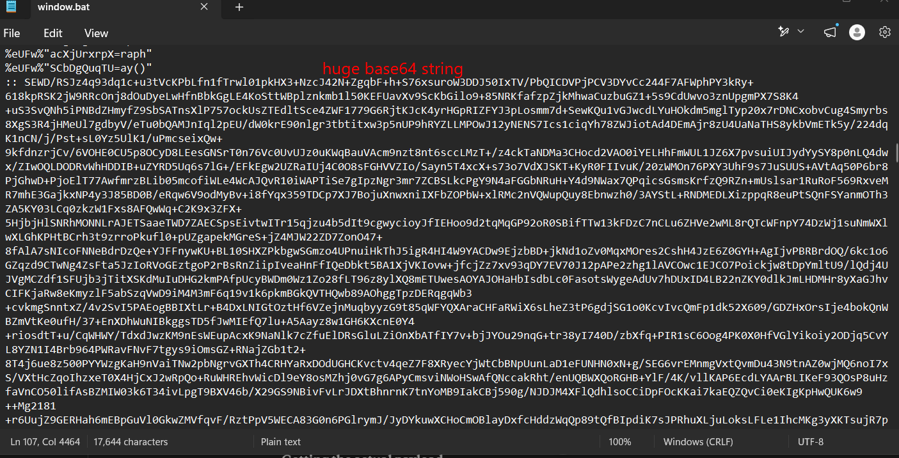
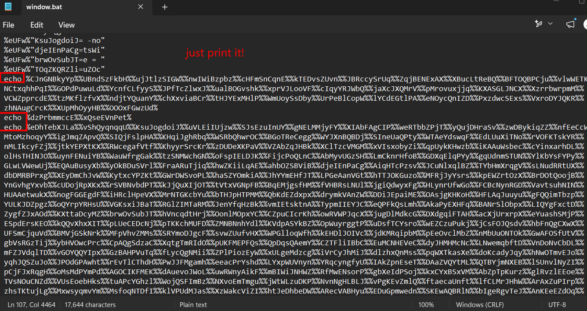
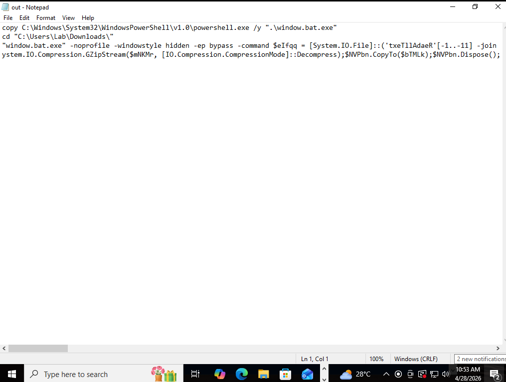
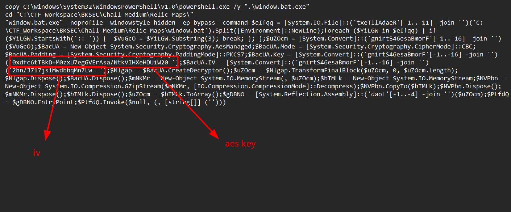
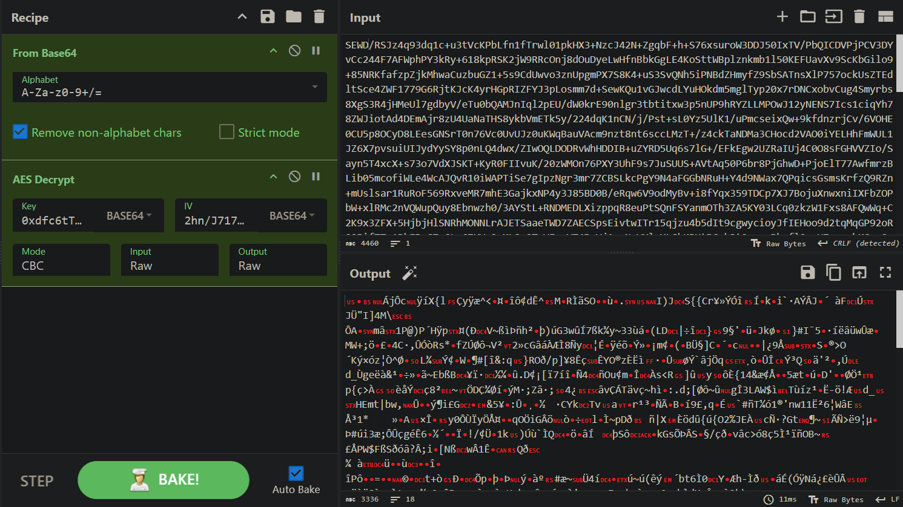
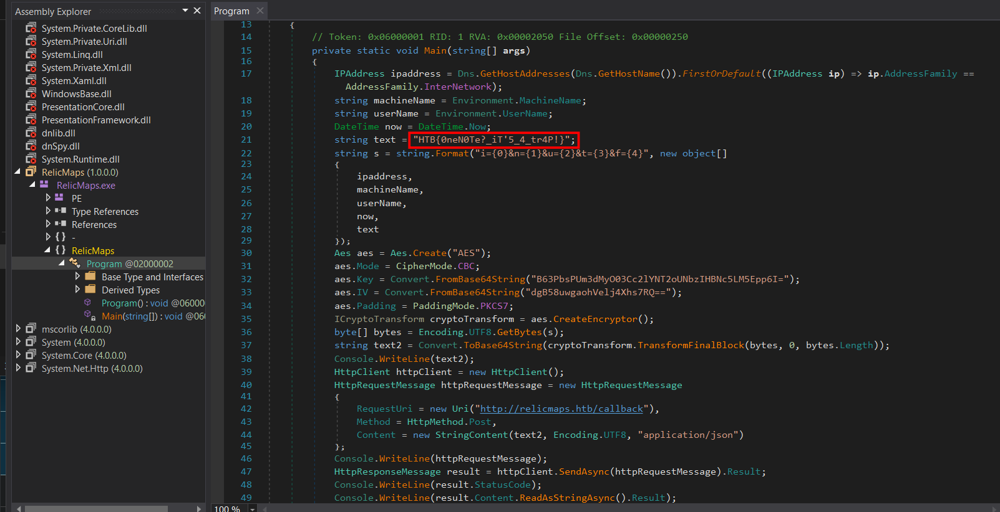

# Relic Maps

## Scenario

Pandora received an email with a link claiming to have information about the location of the relic and attached ancient city maps, but something seems off about it. Could it be rivals trying to send her off on a distraction? Or worse, could they be trying to hack her systems to get what she knows?Investigate the given attachment and figure out what's going on and get the flag. The link is to http://relicmaps.htb:<instance port>/relicmaps.one. The document is still live (relicmaps.htb should resolve to your docker instance).

## Given artifact

Connect to the instance and get a Microsoft OneNote file

## Solving process

Initially I don't know how to correctly investigate the OneNote file, so I just run `strings` against it, and luckily this embedded HTA is detected, as the result is quite short:



A vbscript is embedded in this HTA, and is executed when the file is opened, downloads and executes other 2 files. I connect to the instance and get them both. Now it's impossible to use `strings` on the second OneNote file, it's too long. So I have to search and download a dedicated tool for parsing this kind of file: `onedump.py` from Didier Stevens



These two are the embedded script, we can run `python3 onedump.py -s <index> -d <filename>` to dump object number `index` from file `filename`

When investigating the script from the second OneNote file, I notice other two URLs, however, this time they are inaccessible, perhaps we will need to inspect the `.bat` file instead:



Opening the bat file, a lot of gibberish characters come to sight, but after spending some minutes skimming through the file, I notice it is not so heavily obfuscated, it just use alias to replace `set` command, efficiently initialize a lot of variable with their values:



We also encounter a huge base64 string, you will know its meaning later:



Then the defined variables are concatenated at the bottom of the script to form the payload, I neutralize it by appending `echo` command so it print to stdout instead of executing:



Before running it in VM, I realize that I should not have remove the `@echo off`. I thought it would disable the `echo` command, but it only disable printing the command executed to the terminal, preventing our powershell window from being flooded with gibberish character. Therefore, I bring it back, and run:

```powershell
cmd.exe /c .\window.bat > out.txt 2>&1
```



It makes a copy of `powershell.exe` and names it `window.bat.exe`, then go to Downloads folder for the `window.bat` find. After that, it run the copied powershell, take the huge base64 string from it to decode before decrypting it with AES and executing the malware right in the memory. The key and IV are also hard-coded, so we can easily simulate the process with cyberchef:





Get a gunzip compressed file, after decompressed, it turns out to be .net assembly, so I use `dnSpy` for investigating:



This is a sample of info-stealer malware, information about the infected machine is encrypted before sent back to the attacker's site. Note that we also got the flag!

`Flag: HTB{0neN0Te?_iT'5_4_tr4P!}`