# Wrong Spooky Season
**Challenge Scenario:**

**I told them it was too soon and in the wrong season to deploy such a website, but they assured me that theming it properly would be enough to stop the ghosts from haunting us. I was wrong. Now there is an internal breach in the Spooky Network and you need to find out what happened. Analyze the the network traffic and find how the scary ghosts got in and what they did.**

A bit superstitious description, anyway we are given a pcap file. The protocol hierarchy tells us that JPEG image may be the main character (but then it turns out not to be):

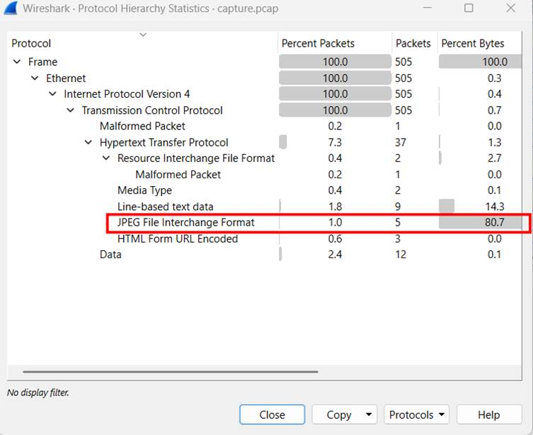

Skimming through the pcap ( just 505 packets, enough to manually check ), in the first half I see a sequence of http get request for the images, followed by some POST request, and then somehow the server seems to be compromised, the last get requests contains attacker’s commands, the the servers responses with the result.

I tried to inspect the images by exporting it, but nothing valuable is found.  
Then looking at the POST requests, I see where the nightmare start:

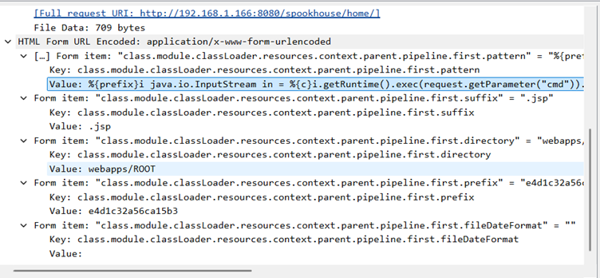

The attacker uploaded a webshell in form of a .jsp file, perhaps this website has file upload vulnerability and he had abused it.

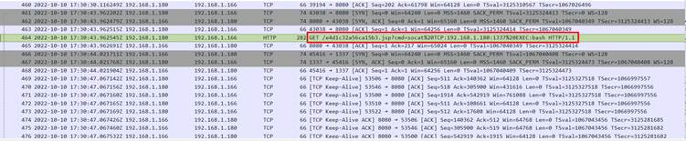

Then he use that temporary shell to install socat, using it to set up a reverse shell back to his IP address at port 1337.

Following the next tcp stream where the server initiate a connection to the reverse shell port 1337, we can see all commands that he executed on the server, first he read the sensitive /etc/passwd file, then look for SUID binaries owned by root ( don’t know why he did it, as he already has root privilege ?)

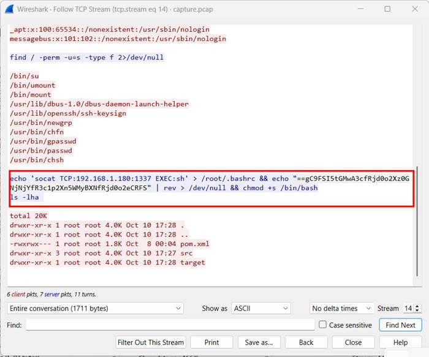

After that, he add the socat command to .bashrc to gain persistence as every command in bashrc will be executed when the user open a shell.

And the base64 encoded flag is reversed, printed then discarded to dev/null, that is the flag we need, using cyberchef to decode it.

- Flag: HTB{j4v4_5pr1ng_just_b3c4m3_j4v4_sp00ky!!}

# Urgent

**Challenge Scenario:**

**In the midst of Cybercity's "Fray," a phishing attack targets its factions, sparking chaos. As they decode the email, cyber sleuths race to trace its source, under a tight deadline. Their mission: unmask the attacker and restore order to the city. In the neon-lit streets, the battle for cyber justice unfolds, determining the factions' destiny.**

Given an email, I used Outlook (classic) to open, the content is not worth paying attention to (but I still spent 2 minutes reading it ). The content of the attached html file is the main dish. I struggled quite long with the AntiVirus, but anyway I managed to defeat it 

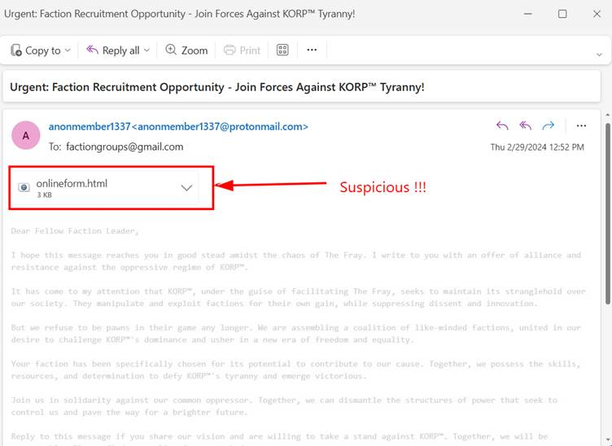

Saving it to the AV-excluded folder, I use notepad to read it for safety purposes, here is it content:

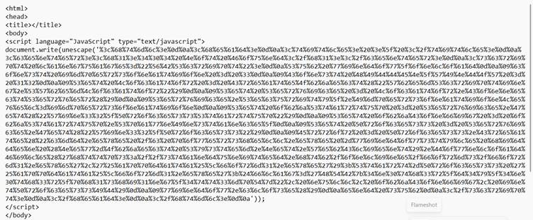

Initially, I did not recognize the encoding, so I took it to cyberchef with magic recipe to know that it is url-encoded, after decoding, the content is shown below

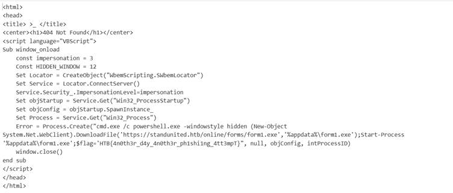

The flag is in plain sight , but it is trivial, not the thing we need to focus on. At first I was wondering : why can a javascript function in a browser can even spawn powershell to download malware ?

- After some external searches, I found that this malicious html is not meant to be opened in a modern browser. It only activates when users double-click or preview them inside Outlook, old versions of Internet Explorer … , which use a legacy html rendering machine that does allow execution of VBScript. This environment also has permission to create COM object and spawn processes.

- Let’s break down the malicious script:

“Sub window_onload” : this runs automatically when the html page loads.

“const impersonation = 3”: this set [impersonation](https://learn.microsoft.com/en-us/windows/win32/com/impersonation-levels) level to 3, meaning that the script can act as the logged-in user. 

I don’t truly understand all the remaining lines, but generally it spawn cmd.exe, which stealthy launch powershell to download form1.exe (definitely a malware) then execute it.

So the whole attack chain is as follow: user opens html attachment in outlook app, not outlook web --> javascript runs, decode the vbscript ( the deprecated [unescaped()](https://www.w3schools.com/jsref/jsref_unescape.asp) function simply performs url-decode) --> vbscript executes and download and execute malware.

When the html is opened in browser, it is completely harmless, nothing is trigger, vbscript cannot escape from the browser’s sandbox

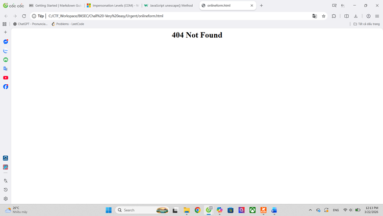

Flag : HTB{4n0th3r_d4y_4n0th3r_ph1shi1ng_4tt3mpT}

# Sp00ky theme

**Challenge Scenario**

**I downloaded a very nice haloween global theme for my Plasma installation and a couple of widgets! It was supposed to keep the bad spirits away while I was improving my ricing skills... Howerver, now strange things are happening and I can't figure out why...**

A classic context when users download a strange desktop theme and a few widgets from the internet just to look ‘cool’ and then their device begins to act oddly, then it stands a good chance of having been compromised.

In this context, themes and widgets are packets that change the desktop appearance, and add small apps to the interface. They contain icon, image, Javascript and QML code, QML is new to me at the time I write this , it’s a styling script that defines visual interface, but it’s much more powerful than CSS, it’s more like html+js as it can execute content. As themes contain scripts that run in the user’s machine, a malicious script can easily be embedded by hacker to exploit the device to run commands.

While wandering inside the theme package, I encounter a js file containing the reversed and base64-encoded flag

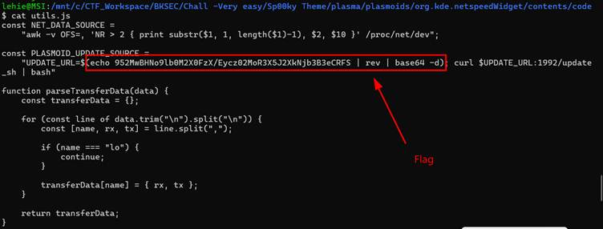

Again, it’s trivial here, but what will happen if the flag is replaced by the hacker’s site that host a malware ? Simply, the curl command afterwards will download that malware and pass it right into the bash, nothing is write to the hard disk, AV is bypassed, living off the land !

- Flag : HTB{pwn3d_by_th3m3s!?_1t_c4n_h4pp3n}

# Red miners

**Challenge Scenario**

**In the race for Vitalium on Mars, the villainous Board of Arodor resorted to desperate measures, needing funds for their mining attempts. They devised a botnet specifically crafted to mine cryptocurrency covertly. We stumbled upon a sample of Arodor's miner's installer on our server. Recognizing the gravity of the situation, we launched a thorough investigation. With you as its leader, you need to unravel the inner workings of the installation mechanism. The discovery served as a turning point, revealing the extent of Arodor's desperation. However, the battle for Vitalium continued, urging us to remain vigilant and adapt our cyber defenses to counter future threats**

As the description suggests, the shell script relates to crypto mining, it does something like find and kill processes relating to crypto mining, and then clear some logs. I tried in vain to understand the script, but anyway I’m not a reverse-engineering man.

So I just shift my focus to find the flag lying in weird base64 strings:

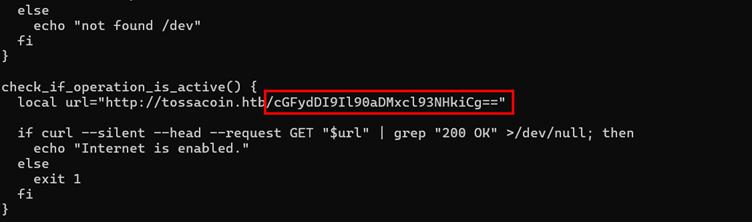

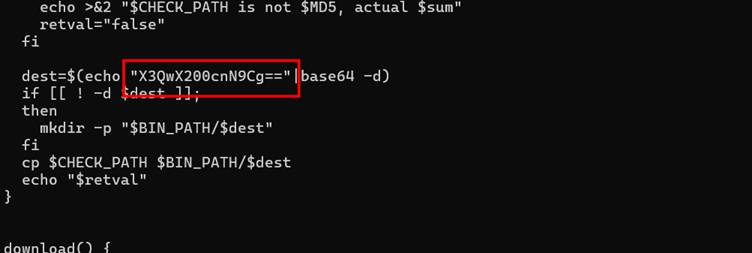

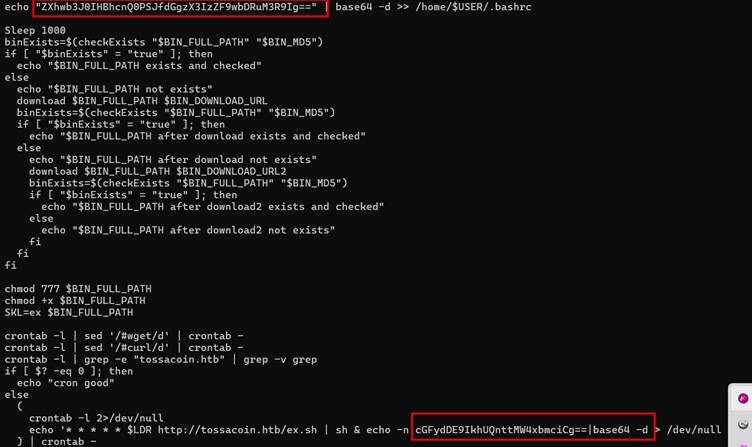

Then I use cyberchef to decode all:

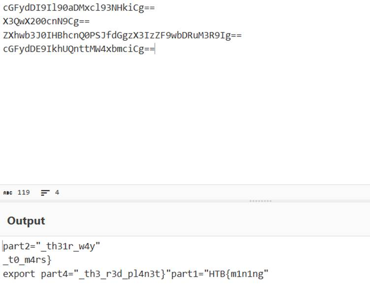

- Flag: HTB{m1n1ng_th31r_w4y_t0_m4rs}

# Extraterrestrial Persistence

**Challenge Scenario**

**There is a rumor that aliens have developed a persistence mechanism that is impossible to detect. After investigating her recently compromised Linux server, Pandora found a possible sample of this mechanism. Can you analyze it and find out how they install their persistence?**

The file given for this challenge is a shell script, at first glance, it performs several check before landing the actual payload. It only triggers if the username is pandora and hostname is linux_HQ, ensuring the malware only attacks intended targets.

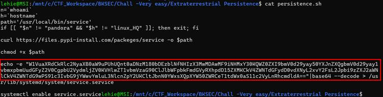

After checking, it downloads a file from remote url and save it to the intended path, then makes it executable with chmod +x. Then a [systemd](https://docs.redhat.com/en/documentation/red_hat_enterprise_linux/7/html/system_administrators_guide/chap-managing_services_with_systemd)  service is created , the decoded base64 string is loaded to it.

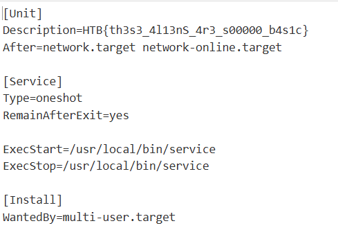

This is the file after decoding, generally, it includes the flag as the description, the After ensures it starts after the network is online, configures the service as a one-shot execution that remains active after exit. Both ExecStart and ExecStop point to the downloaded /usr/local/bin/service binary, meaning this file is executed whenever the service starts or stops. The Install section ensures the service is enabled in the system’s multiuser target, making it persist across reboots.

- Flag : HTB{th3s3_4l13nS_4r3_s00000_b4s1c}

# An unusual sighting

**Challenge Scenario**

**As the preparations come to an end, and The Fray draws near each day, our newly established team has started work on refactoring the new CMS application for the competition. However, after some time we noticed that a lot of our work mysteriously has been disappearing! We managed to extract the SSH Logs and the Bash History from our dev server in question. The faction that manages to uncover the perpetrator will have a massive bonus come the competition! Note: Operating Hours of Korp: 0900 – 1900**

Given sshd.log and the bash history, furthermore, we also know operating hours of the legitimate user. It’s clear that the only thing we need to focus on is the sneaky connection and commands at this strange time

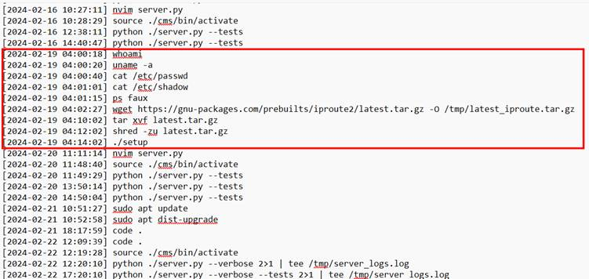

And from the sshd.log:

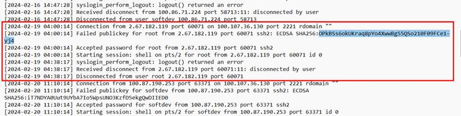

Answer for question 1 can be found on all connection initiation log, as it logs both the remote IP/port and the local ssh server ip/host.

Answer for question 2 can easily be found on the top of the sshd log:

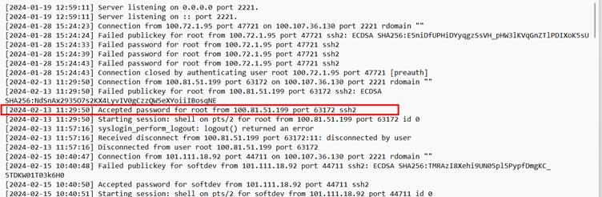

For the remaining questions, we just refer to the unusual time that I framed in the first two images.

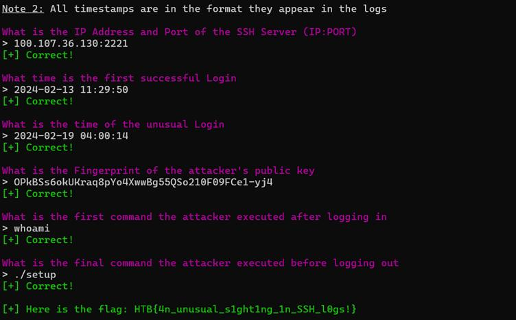

- Flag:  HTB{4n_unusual_s1ght1ng_1n_SSH_l0gs!}

# Alien Cradle

**Challenge Scenario**

**In an attempt for the aliens to find more information about the relic, they launched an attack targeting Pandora's close friends and partners that may know any secret information about it. During a recent incident believed to be operated by them, Pandora located a weird PowerShell script from the event logs, otherwise called PowerShell cradle. These scripts are usually used to download and execute the next stage of the attack. However, it seems obfuscated, and Pandora cannot understand it. Can you help her deobfuscate it?**

The given powershell script contains the flag right inside it, but I will try to understand what it does:

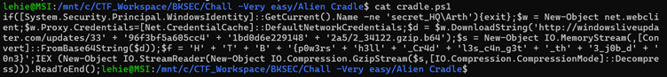

First, it check the current Windows username, if it’s not secret_HQ\Arth then exit immediately. Then it creates a web client to download a base64-encoded gzip payload and decode it into a memory stream. Finally, it decompresses the payload in that memory stream and execute it in memory  using Invoke-Expression.

- Flag: HTB{p0w3rsh3ll_Cr4dl3s_c4n_g3t_th3_j0b_d0n3}